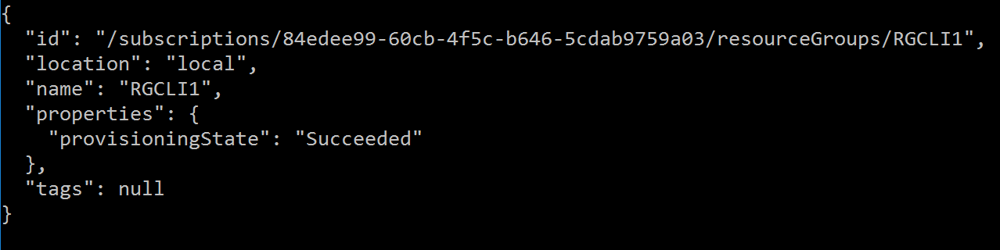

# Use API version profiles with Azure CLI in Azure Stack

You can follow the steps in this article to set up the Azure Command-Line Interface (CLI) to manage Azure Stack Development Kit resources from Linux, Mac, and Windows client platforms.

## Install CLI

Sign in to your development workstation and install CLI. Azure Stack requires version 2.0 or later of Azure CLI. You can install that by using the steps described in the [Install the Azure CLI](https://docs.microsoft.com/cli/azure/install-azure-cli) article. To verify if the installation was successful, open a terminal or a command prompt window and run the following command:

```azurecli
az --version
```

You should see the version of Azure CLI and other dependent libraries that are installed on your computer.

## Trust the Azure Stack CA root certificate

1. Get the Azure Stack CA root certificate from [your Azure Stack operator](..\azure-stack-cli-admin.md#export-the-azure-stack-ca-root-certificate) and trust it. To trust the Azure Stack CA root certificate, append it to the existing Python certificate.

1. Find the certificate location on your machine. The location may vary depending on where you have installed Python. You will need to have [pip](https://pip.pypa.io) and the [certifi](https://pypi.org/project/certifi/) module installed. You can use the following Python command from the bash prompt:

  ```bash  
    python -c "import certifi; print(certifi.where())"
  ```

  Make a note of the certificate location. For example, `~/lib/python3.5/site-packages/certifi/cacert.pem`. Your particular path will depend on your OS and the version of Python that you have installed.

### Set the path for a development machine inside the cloud

If you are running CLI from a Linux machine that is created within the Azure Stack environment, run the following bash command with the path to your certificate.

```bash
sudo cat /var/lib/waagent/Certificates.pem >> ~/<yourpath>/cacert.pem
```

### Set the path for a development machine outside the cloud

If you are running CLI from a machine **outside** the Azure Stack environment:  

1. You must set up [VPN connectivity to Azure Stack](azure-stack-connect-azure-stack.md).

1. Copy the PEM certificate that you got from Azure Stack operator, and make a note of the location of the file (PATH_TO_PEM_FILE).

1. Run the following commands, depending ending on your development workstation's OS.

#### Linux

```bash
sudo cat PATH_TO_PEM_FILE >> ~/<yourpath>/cacert.pem
```

#### macOS

```bash
sudo cat PATH_TO_PEM_FILE >> ~/<yourpath>/cacert.pem
```

#### Windows

```powershell
$pemFile = "<Fully qualified path to the PEM certificate Ex: C:\Users\user1\Downloads\root.pem>"

$root = New-Object System.Security.Cryptography.X509Certificates.X509Certificate2
$root.Import($pemFile)

Write-Host "Extracting needed information from the cert file"
$md5Hash    = (Get-FileHash -Path $pemFile -Algorithm MD5).Hash.ToLower()
$sha1Hash   = (Get-FileHash -Path $pemFile -Algorithm SHA1).Hash.ToLower()
$sha256Hash = (Get-FileHash -Path $pemFile -Algorithm SHA256).Hash.ToLower()

$issuerEntry  = [string]::Format("# Issuer: {0}", $root.Issuer)
$subjectEntry = [string]::Format("# Subject: {0}", $root.Subject)
$labelEntry   = [string]::Format("# Label: {0}", $root.Subject.Split('=')[-1])
$serialEntry  = [string]::Format("# Serial: {0}", $root.GetSerialNumberString().ToLower())
$md5Entry     = [string]::Format("# MD5 Fingerprint: {0}", $md5Hash)
$sha1Entry    = [string]::Format("# SHA1 Fingerprint: {0}", $sha1Hash)
$sha256Entry  = [string]::Format("# SHA256 Fingerprint: {0}", $sha256Hash)
$certText = (Get-Content -Path $pemFile -Raw).ToString().Replace("`r`n","`n")

$rootCertEntry = "`n" + $issuerEntry + "`n" + $subjectEntry + "`n" + $labelEntry + "`n" + `
$serialEntry + "`n" + $md5Entry + "`n" + $sha1Entry + "`n" + $sha256Entry + "`n" + $certText

Write-Host "Adding the certificate content to Python Cert store"
Add-Content "${env:ProgramFiles(x86)}\Microsoft SDKs\Azure\CLI2\Lib\site-packages\certifi\cacert.pem" $rootCertEntry

Write-Host "Python Cert store was updated for allowing the azure stack CA root certificate"
```

## Get the virtual machine aliases endpoint

Before users can create virtual machines by using CLI, they must contact the Azure Stack operator and get the virtual machine aliases endpoint URI. For example, Azure uses the following URI: 
https://raw.githubusercontent.com/Azure/azure-rest-api-specs/master/arm-compute/quickstart-templates/aliases.json. The cloud administrator should set up a similar endpoint for Azure Stack with the images that are available in the Azure Stack marketplace. Users need pass the endpoint URI to the `endpoint-vm-image-alias-doc` parameter to the `az cloud register` command as shown in the next section. 
   

## Connect to Azure Stack

Use the following steps to connect to Azure Stack:

1. Register your Azure Stack environment by running the `az cloud register` command.
   
   a. To register the *cloud administrative* environment, use:

      ```azurecli
      az cloud register \ 
        -n AzureStackAdmin \ 
        --endpoint-resource-manager "https://adminmanagement.local.azurestack.external" \ 
        --suffix-storage-endpoint "local.azurestack.external" \ 
        --suffix-keyvault-dns ".adminvault.local.azurestack.external" \ 
        --endpoint-vm-image-alias-doc <URI of the document which contains virtual machine image aliases>
      ```

   b. To register the *user* environment, use:

      ```azurecli
      az cloud register \ 
        -n AzureStackUser \ 
        --endpoint-resource-manager "https://management.local.azurestack.external" \ 
        --suffix-storage-endpoint "local.azurestack.external" \ 
        --suffix-keyvault-dns ".vault.local.azurestack.external" \ 
        --endpoint-vm-image-alias-doc <URI of the document which contains virtual machine image aliases>
      ```

1. Set the active environment by using the following commands.

   a. For the *cloud administrative* environment, use:

      ```azurecli
      az cloud set \
        -n AzureStackAdmin
      ```

   b. For the *user* environment, use:

      ```azurecli
      az cloud set \
        -n AzureStackUser
      ```

1. Update your environment configuration to use the Azure Stack specific API version profile. To update the configuration, run the following command:

   ```azurecli
   az cloud update \
     --profile 2018-03-01-hybrid
   ```

    >[!NOTE]  
    >If you are running a version of the Azure Stack before the 1808 build, you will to have to use the API version profile **2017-03-09-profile** rather than the API version profile **2018-03-01-hybrid**.

1. Sign in to your Azure Stack environment by using the `az login` command. You can sign in to the Azure Stack environment either as a user or as a [service principal](https://docs.microsoft.com/azure/active-directory/develop/active-directory-application-objects). 

    * AAD Environments
      * Sign in as a *user*: You can either specify the username and password directly within the `az login` command or authenticate by using a browser. You have to do the latter if your account has multi-factor authentication enabled.

      ```azurecli
      az login \
        -u <Active directory global administrator or user account. For example: username@<aadtenant>.onmicrosoft.com> \
        --tenant <Azure Active Directory Tenant name. For example: myazurestack.onmicrosoft.com>
      ```

      > [!NOTE]
      > If your user account has multi-factor authentication enabled, you can use the `az login command` without providing the `-u` parameter. Running the command gives you a URL and a code that you must use to authenticate.
   
      * Sign in as a *service principal*: Before you sign in, [create a service principal through the Azure portal](azure-stack-create-service-principals.md) or CLI and assign it a role. Now, sign in by using the following command:

      ```azurecli
      az login \
        --tenant <Azure Active Directory Tenant name. For example: myazurestack.onmicrosoft.com> \
        --service-principal \
        -u <Application Id of the Service Principal> \
        -p <Key generated for the Service Principal>
      ```
    * AD FS Environments

        * Sign in as a *service principal*: 
          1.	Prepare the .pem file to be used for service principal login.
                * On the client machine where the principal was created, export the service principal certificate as a pfx with the private key (located at cert:\CurrentUser\My; the cert name has the same name as the principal).

                *	Convert the pfx to pem (Use OpenSSL Utility).

          1.	Login to the CLI. :
                ```azurecli
                az login --service-principal \
                 -u <Client ID from the Service Principal details> \
                 -p <Certificate's fully qualified name. Eg. C:\certs\spn.pem>
                 --tenant <Tenant ID> \
                 --debug 
                ```

## Test the connectivity

Now that we've got everything setup, let's use CLI to create resources within Azure Stack. For example, you can create a resource group for an application and add a virtual machine. Use the following command to create a resource group named "MyResourceGroup":

```azurecli
az group create \
  -n MyResourceGroup -l local
```

If the resource group is created successfully, the previous command outputs the following properties of the newly created resource:



## Known issues
There are some known issues that you must be aware of when using CLI in Azure Stack:

 - The CLI interactive mode i.e the `az interactive` command is not yet supported in Azure Stack.
 - To get the list of virtual machine images available in Azure Stack, use the `az vm images list --all` command instead of the `az vm image list` command. Specifying the `--all` option makes sure that response returns only the images that are available in your Azure Stack environment.
 - Virtual machine image aliases that are available in Azure may not be applicable to Azure Stack. When using virtual machine images, you must use the entire URN parameter (Canonical:UbuntuServer:14.04.3-LTS:1.0.0) instead of the image alias. This URN must match the image specifications as derived from the `az vm images list` command.

## Next steps

[Deploy templates with Azure CLI](azure-stack-deploy-template-command-line.md)

[Enable Azure CLI for Azure Stack users (Operator)](..\azure-stack-cli-admin.md)

[Manage user permissions](azure-stack-manage-permissions.md)
