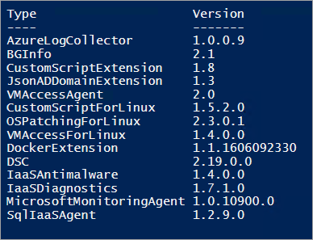
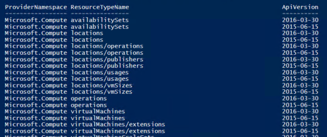

# Considerations for Virtual Machines in Azure Stack

Virtual machines are an on-demand, scalable computing resources offered by Azure Stack. When you use Virtual Machines, you must understand that there are differences between the features that are available in Azure and Azure Stack. This article provides an overview of the unique considerations for Virtual Machines and its features in Azure Stack. To learn about high-level differences between Azure Stack and Azure, see the [Key considerations](azure-stack-considerations.md) topic.

## Cheat sheet: Virtual machine differences

| Feature | Azure (global) | Azure Stack |
| --- | --- | --- |
| Virtual machine images | The Azure Marketplace contains images that you can use to create a virtual machine. See the [Azure Marketplace](https://azuremarketplace.microsoft.com/en-us/marketplace/apps/category/compute?subcategories=virtual-machine-images&page=1) page to view the list of images that are available in the Azure Marketplace. | By default, there aren’t any images available in the Azure Stack marketplace. The Azure Stack cloud administrator should publish or download images to the Azure Stack marketplace before users can use them. |
| Virtual machine sizes | Azure supports a wide variety of sizes for virtual machines. To learn about the available sizes and options, refer to the [Windows virtual machines sizes](../../virtual-machines/virtual-machines-windows-sizes.md) and [Linux virtual machine sizes](../../virtual-machines/linux/sizes.md) topics. | Azure Stack supports a subset of Virtual Machine sizes that are available in Azure. To view the list of supported sizes, refer to the [virtual machine sizes](#virtual-machine-sizes) section of this article. |
| Virtual machine quotas | [Quota limits](../../azure-subscription-service-limits.md#service-specific-limits) are set by Microsoft | The Azure Stack cloud administrator must assign quotas before they offer virtual machines to their users. |
| Virtual machine extensions |Azure supports a wide variety of virtual machine extensions. To learn about the available extensions, refer to the [virtual machine extensions and features](../../virtual-machines/windows/extensions-features.md) topic.| Azure Stack supports a subset of extensions that are available in Azure and each of the extension have specific versions. The Azure Stack cloud administrator can choose which extensions to be made available to for their users. To view the list of supported extensions, refer to the [virtual machine extensions](#virtual-machine-extensions) section of this article. |
| Virtual machine network | Public IP addresses assigned to tenant virtual machine are accessible over the Internet.<br><br><br>Azure Virtual Machines has a fixed DNS name | Public IP addresses assigned to a tenant virtual machine are accessible within the Azure Stack Development Kit environment only. A user must have access to the Azure Stack Development Kit via [RDP](azure-stack-connect-azure-stack.md#connect-to-azure-stack-with-remote-desktop) or [VPN](azure-stack-connect-azure-stack.md#connect-to-azure-stack-with-vpn) to connect to a virtual machine that is created in Azure Stack.<br><br>Virtual machines created within a specific Azure Stack instance have a DNS name based on the value that is configured by the cloud administrator. |
| Virtual machine storage | Supports [managed disks.](../../virtual-machines/windows/managed-disks-overview.md) | Managed disks are not yet supported in Azure Stack. |
| API versions | Azure always has the latest API versions for all the virtual machine features. | Azure Stack supports specific Azure services and specific API versions for these services. To view the list of supported API versions, refer to the [API versions](#api-versions) section of this article. |
|Virtual machine availability sets|Multiple fault domains (2 or 3 per region)<br>Multiple update domains<br>Managed disk support|Single fault domain<br>Single update domain<br>No managed disk support|
|Virtual machine scale sets|Auto-scale supported|Auto-scale not supported.<br>Add more instances to a scale set using the portal, Resource Manager templates, or PowerShell.

## Virtual machine sizes 

The Azure Stack Development Kit supports the following sizes: 

| Type | Size | Range of supported sizes |
| --- | --- | --- |
|General purpose |Basic A|A0-A4|
|General purpose |Standard A|A0-A7|
|General purpose |Standard D|D1-D4|
|General purpose |Standard Dv2|D1v2-D5v2|
|Memory optimized|D-series|D11-D14|
|Memory optimized |Dv2-series|D11v2-D14v2|

Virtual Machine sizes and their associated resource quantities are consistent between Azure Stack and Azure. For example, this includes the amount of memory, number of cores, and number/size of data disks that can be created. However, performance of the same VM size in Azure Stack depends on the underlying characteristics of a particular Azure Stack environment.

## Virtual machine extensions 

 The Azure Stack Development Kit supports the following virtual machine extension versions:



Use the following PowerShell script to get the list of virtual machine extensions that are available in your Azure Stack environment:

```powershell 
Get-AzureRmVmImagePublisher -Location local | `
  Get-AzureRmVMExtensionImageType | `
  Get-AzureRmVMExtensionImage | `
  Select Type, Version | `
  Format-Table -Property * -AutoSize 
```

## API versions 

Virtual machine features in Azure Stack Development Kit support the following API versions:



You can use the following PowerShell script to get the API versions for the virtual machine features that are available in your Azure Stack environment:

```powershell 
Get-AzureRmResourceProvider | `
  Select ProviderNamespace -Expand ResourceTypes | `
  Select * -Expand ApiVersions | `
  Select ProviderNamespace, ResourceTypeName, @{Name="ApiVersion"; Expression={$_}} | `
  where-Object {$_.ProviderNamespace -like “Microsoft.compute”}
```
The list of supported resource types and API versions may vary if the cloud operator updates your Azure Stack environment to a newer version.

## Next steps

[Create a Windows virtual machine with PowerShell in Azure Stack](azure-stack-quick-create-vm-windows-powershell.md)
