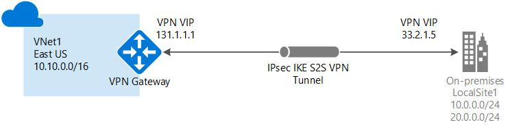

# About VPN gateway for Azure Stack

*Applies to: Azure Stack integrated systems and Azure Stack Development Kit*

Before you can send network traffic between your Azure virtual network and your on-premises site, you must create a virtual network gateway for your virtual network.

A VPN gateway is a type of virtual network gateway that sends encrypted traffic across a public connection. You can use VPN gateways to send traffic securely between a virtual network in Azure Stack and a virtual network in Azure. You can also send traffic securely between a virtual network and another network that is connected to a VPN device.

When you create a virtual network gateway, you specify the gateway type that you want to create. Azure Stack supports one type of virtual network gateway: the **Vpn** type.

Each virtual network can have two virtual network gateways, but only one of each type. Depending on the settings that you choose, you can create multiple connections to a single VPN gateway. An example is a multi-site connection configuration.

Before you create and configure VPN Gateways for Azure Stack, review the [considerations for Azure Stack networking](azure-stack-network-differences.md) to learn how configurations for Azure Stack differ from Azure.

>[!NOTE]
>In Azure, the bandwidth throughput for the VPN gateway SKU you choose must be divided across all connections that are connected to the gateway. In Azure Stack however, the bandwidth value for the VPN gateway SKU is applied to each connection resource that is connected to the gateway.
>
> For example:
> * In Azure, the basic VPN gateway SKU can accommodate approximately 100 Mbps of aggregate throughput. If you create two connections to that VPN gateway, and one connection is using 50 Mbps of bandwidth, then 50 Mbps is available to the other connection.
> * In Azure Stack, *each* connection to the basic VPN gateway SKU gets allocated 100 Mbps of throughput.

## Configuring a VPN gateway

A VPN gateway connection relies on several resources that are configured with specific settings. Most of these resources can be configured separately, but in some cases they must be configured in a specific order.

### Settings

The settings that you choose for each resource are critical for creating a successful connection.

For information about individual resources and settings for a VPN gateway, see [About VPN gateway settings for Azure Stack](azure-stack-vpn-gateway-settings.md). This article will help you understand:

* Gateway types, VPN types, and connection types.
* Gateway subnets, local network gateways, and other resource settings that you might want to consider.

### Deployment tools

You can create and configure resources using one configuration tool, such as the Azure portal. Later you might switch to another tool such as PowerShell to configure additional resources or modify existing resources when applicable. Currently, you cannot configure every resource and resource setting in the Azure portal. The instructions in the articles for each connection topology specify when a specific configuration tool is needed.

## Connection topology diagrams

There are different configurations available for VPN gateway connections. Determine which configuration best fits your needs. In the following sections, you can view information and topology diagrams about the following VPN gateway connections:

* Available deployment model
* Available configuration tools
* Links that take you directly to an article, if available

The diagrams and descriptions in the following sections can help you select a connection topology to match your requirements. The diagrams show the main baseline topologies, but it's possible to build more complex configurations using the diagrams as a guide.

## Site-to-site and multi-site (IPsec/IKE VPN tunnel)

### Site-to-site

A *site-to-site* (S2S) VPN gateway connection is a connection over IPsec/IKE (IKEv2) VPN tunnel. This type of connection requires a VPN device that is located on-premises and is assigned a public IP address. This device cannot be located behind a NAT. S2S connections can be used for cross-premises and hybrid configurations.

### Multi-site

A *multi-site* connection is a variation of the site-to-site connection. You create more than one VPN connection from your virtual network gateway, typically connecting to multiple on-premises sites. When working with multiple connections, you must use a route-based VPN type (known as a dynamic gateway when working with classic VNets). Because each virtual network can only have one VPN gateway, all connections through the gateway share the available bandwidth.

## Gateway SKUs

When you create a virtual network gateway for Azure Stack, you specify the gateway SKU that you want to use. The following VPN gateway SKUs are supported:

* Basic
* Standard
* High Performance

When you select a higher gateway SKU, such as Standard over Basic, or High Performance over Standard or Basic, more CPUs and network bandwidth are allocated to the gateway. As a result, the gateway can support higher network throughput to the virtual network.

Azure Stack does not support the Ultra Performance gateway SKU, which is used exclusively with Express Route.

Consider the following when you select the SKU:

* Azure Stack does not support policy-based gateways.
* Border Gateway Protocol (BGP) is not supported on the Basic SKU.
* ExpressRoute-VPN gateway coexisting configurations are not supported in Azure Stack.
* Active-active S2S VPN gateway connections can be configured on the High Performance SKU only.

## Estimated aggregate throughput by SKU

The following table shows the gateway types and the estimated aggregate throughput by gateway SKU:

|	| VPN Gateway throughput *(1)* | VPN Gateway max IPsec tunnels *(2)* |
|-------|-------|-------|
|**Basic SKU** ***(3)*** 	| 100 Mbps	| 20	|
|**Standard SKU** 		| 100 Mbps 	| 20	|
|**High Performance SKU** | 200 Mbps	| 10	|

**Table notes:**

*Note (1)* - VPN throughput is not a guaranteed throughput for cross-premises connections across the Internet. It is the maximum possible throughput measurement.  
*Note (2)* - Max tunnels is the total per Azure Stack deployment for all subscriptions.  
*Note (3)* - BGP routing is not supported for the Basic SKU.

>[!NOTE]
>Only one site-to-site VPN connection can be created between two Azure Stack deployments. This is due to a limitation in the platform that only allows a single VPN connection to the same IP address. Because Azure Stack leverages the multi-tenant gateway, which uses a single public IP for all VPN gateways in the Azure Stack system, there can be only one VPN connection between two Azure Stack systems. This limitation also applies to connecting more than one site-to-site VPN connection to any VPN gateway that uses a single IP address. Azure Stack does not allow more than one local network gateway resource to be created using the same IP address.

## Next steps

[VPN gateway configuration settings for Azure Stack](azure-stack-vpn-gateway-settings.md)
