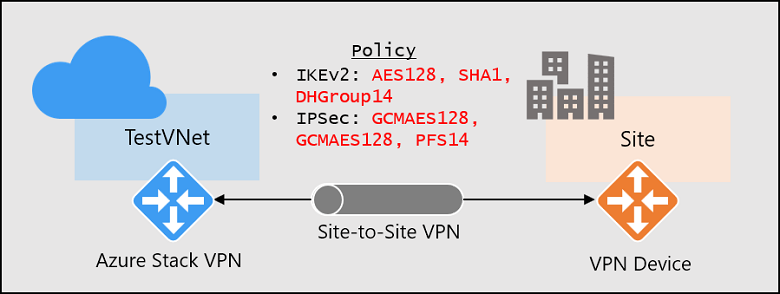

# Configure IPsec/IKE policy for site-to-site VPN connections

This article walks through the steps to configure an IPsec/IKE policy for site-to-site (S2S) VPN connections in Azure Stack.

>[!NOTE]
> You must be running Azure Stack build **1809** or later in order to use this feature.  If you are currently running a build prior to 1809, please update your Azure Stack system to the latest build before attempting to use this feature or follow the steps in this article.

## IPsec and IKE policy parameters for VPN gateways

The IPsec and IKE protocol standard supports a wide range of cryptographic algorithms in various combinations. To see which parameters are supported in Azure Stack, see [IPsec/IKE parameters](azure-stack-vpn-gateway-settings.md#ipsecike-parameters), which can help satisfy
your compliance or security requirements.

This article provides instructions on how to create and configure an IPsec/IKE
policy and apply to a new or existing connection.

## Considerations

Note the following important considerations when using these policies:

- The IPsec/IKE policy only works on the *Standard* and *HighPerformance* (route-based) gateway SKUs.

- You can only specify **one** policy combination for a given connection.

- You must specify all algorithms and parameters for both IKE (Main Mode) and IPsec (Quick Mode). Partial policy specification is not allowed.

- Consult with your VPN device vendor specifications to ensure the policy is supported on your on-premises VPN devices. Site-to-site connections cannot be established if the policies are incompatible.

## Part 1 - Workflow to create and set IPsec/IKE policy

This section outlines the workflow required to create and update the IPsec/IKE policy
on a site-to-site VPN connection:

1. Create a virtual network and a VPN gateway.

2. Create a local network gateway for cross-premises connection.

3. Create an IPsec/IKE policy with selected algorithms and parameters.

4. Create an IPSec connection with the IPsec/IKE policy.

5. Add/update/remove an IPsec/IKE policy for an existing connection.

The instructions in this article help you set up and configure IPsec/IKE policies, as shown in the following figure:



## Part 2 - Supported cryptographic algorithms and key strengths

The following table lists the supported cryptographic algorithms and key strengths configurable by Azure Stack customers:

| IPsec/IKEv2                                          | Options                                                                  |
|------------------------------------------------------|--------------------------------------------------------------------------|
| IKEv2 Encryption                                     | AES256, AES192, AES128, DES3, DES                                        |
| IKEv2 Integrity                                      | SHA384, SHA256, SHA1, MD5                                                |
| DH Group                                             | ECP384, ECP256, DHGroup14, DHGroup2048, DHGroup2, DHGroup1, None         |
| IPsec Encryption                                     | GCMAES256, GCMAES192, GCMAES128, AES256, AES192, AES128, DES3, DES, None |
| IPsec Integrity                                      | GCMASE256, GCMAES192, GCMAES128, SHA256, SHA1, MD5                       |
| PFS Group                                            | PFS24, ECP384, ECP256, PFS2048, PFS2, PFS1, None                         |
| QM SA Lifetime                                       | (Optional: default values are used if not specified)<br />                         Seconds (integer; min. 300/default 27000 seconds)<br />                         KBytes (integer; min. 1024/default 102400000 KBytes) |
| Traffic Selector                                     | Policy Based Traffic Selectors are not supported in Azure Stack.         |

- Your on-premises VPN device configuration must match or contain the following algorithms and parameters that you specify on the Azure IPsec/IKE policy:

  - IKE encryption algorithm (Main Mode / Phase 1)
  - IKE integrity algorithm (Main Mode / Phase 1)
  - DH Group (Main Mode / Phase 1)
  - IPsec encryption algorithm (Quick Mode / Phase 2)
  - IPsec integrity algorithm (Quick Mode / Phase 2)
  - PFS Group (Quick Mode / Phase 2)
  - The SA lifetimes are local specifications only, do not need to match.

- If GCMAES is used as for IPsec Encryption algorithm, you must select the same GCMAES algorithm and key length for IPsec integrity; for example, using GCMAES128 for both.

- In the preceding table:

  - IKEv2 corresponds to Main Mode or Phase 1
  - IPsec corresponds to Quick Mode or Phase 2
  - DH Group specifies the Diffie-Hellmen Group used in Main Mode or Phase 1
  - PFS Group specified the Diffie-Hellmen Group used in Quick Mode or Phase 2

- IKEv2 Main Mode SA lifetime is fixed at 28,800 seconds on the Azure Stack VPN gateways.

The following table lists the corresponding Diffie-Hellman Groups supported by the custom policy:

| Diffie-Hellman Group | DHGroup   | PFSGroup      | Key length    |
|----------------------|-----------|---------------|---------------|
| 1                    | DHGroup1  | PFS1          | 768-bit MODP  |
| 2                    | DHGroup2  | PFS2          | 1024-bit MODP |
| 14                   | DHGroup14<br/>DHGroup2048 | PFS2048       | 2048-bit MODP |
| 19                   | ECP256    | ECP256        | 256-bit ECP   |
| 20                   | ECP384    | ECP384        | 384-bit ECP   |
| 24                   | DHGroup24 | PFS24         | 2048-bit MODP |

For more information, see [RFC3526](https://tools.ietf.org/html/rfc3526) and [RFC5114](https://tools.ietf.org/html/rfc5114).

## Part 3 - Create a new site-to-site VPN connection with IPsec/IKE policy

This section walks you through the steps to create a site-to-site VPN connection with an IPsec/IKE policy. The following steps create the connection, as shown in the following figure:


For more detailed step-by-step instructions for creating a site-to-site VPN
connection, see [Create a site-to-site VPN connection](../../vpn-gateway/vpn-gateway-create-site-to-site-rm-powershell.md).

### Prerequisites

Before you begin, ensure that you have the following prerequisites:

- An Azure subscription. If you don't already have an Azure subscription, you can activate your [MSDN subscriber benefits](https://azure.microsoft.com/pricing/member-offers/msdn-benefits-details/), or sign up for a [free account](https://azure.microsoft.com/pricing/free-trial/).

- The Azure Resource Manager PowerShell cmdlets. See [Install PowerShell for Azure Stack](../azure-stack-powershell-install.md) for more information about installing the PowerShell cmdlets.

### Step 1 - Create the virtual network, VPN gateway, and local network gateway

#### 1. Declare variables

For this exercise, start by declaring the following variables. Be sure to replace the placeholders with your own values when configuring for production:

```powershell
$Sub1 = "<YourSubscriptionName>"
$RG1 = "TestPolicyRG1"
$Location1 = "East US 2"
$VNetName1 = "TestVNet1"
$FESubName1 = "FrontEnd"
$BESubName1 = "Backend"
$GWSubName1 = "GatewaySubnet"
$VNetPrefix11 = "10.11.0.0/16"
$VNetPrefix12 = "10.12.0.0/16"
$FESubPrefix1 = "10.11.0.0/24"
$BESubPrefix1 = "10.12.0.0/24"
$GWSubPrefix1 = "10.12.255.0/27"
$DNS1 = "8.8.8.8"
$GWName1 = "VNet1GW"
$GW1IPName1 = "VNet1GWIP1"
$GW1IPconf1 = "gw1ipconf1"
$Connection16 = "VNet1toSite6"
$LNGName6 = "Site6"
$LNGPrefix61 = "10.61.0.0/16"
$LNGPrefix62 = "10.62.0.0/16"
$LNGIP6 = "131.107.72.22"
```

#### 2. Connect to your subscription and create a new resource group

Make sure you switch to PowerShell mode to use the Resource Manager cmdlets. For more information, see [Connect to Azure Stack with PowerShell as a user](azure-stack-powershell-configure-user.md).

Open your PowerShell console and connect to your account. Use the following sample to help you connect:

```powershell
Connect-AzureRmAccount
Select-AzureRmSubscription -SubscriptionName $Sub1
New-AzureRmResourceGroup -Name $RG1 -Location $Location1
```

#### 3. Create the virtual network, VPN gateway, and local network gateway

The following example creates the virtual network, **TestVNet1**, with three
subnets, and the VPN gateway. When substituting values, it's important
that you always name your gateway subnet specifically **GatewaySubnet**. If
you name it something else, your gateway creation fails.

```powershell
$fesub1 = New-AzureRmVirtualNetworkSubnetConfig -Name $FESubName1 -AddressPrefix $FESubPrefix1
$besub1 = New-AzureRmVirtualNetworkSubnetConfig -Name $BESubName1 -AddressPrefix $BESubPrefix1
$gwsub1 = New-AzureRmVirtualNetworkSubnetConfig -Name $GWSubName1 -AddressPrefix $GWSubPrefix1

New-AzureRmVirtualNetwork -Name $VNetName1 -ResourceGroupName $RG1 -Location $Location1 -AddressPrefix $VNetPrefix11,$VNetPrefix12 -Subnet $fesub1,$besub1,$gwsub1

$gw1pip1 = New-AzureRmPublicIpAddress -Name $GW1IPName1 -ResourceGroupName $RG1 -Location $Location1 -AllocationMethod Dynamic

$vnet1 = Get-AzureRmVirtualNetwork -Name $VNetName1 -ResourceGroupName $RG1

$subnet1 = Get-AzureRmVirtualNetworkSubnetConfig -Name "GatewaySubnet" `
-VirtualNetwork $vnet1

$gw1ipconf1 = New-AzureRmVirtualNetworkGatewayIpConfig -Name $GW1IPconf1 `
-Subnet $subnet1 -PublicIpAddress $gw1pip1

New-AzureRmVirtualNetworkGateway -Name $GWName1 -ResourceGroupName $RG1 `
-Location $Location1 -IpConfigurations $gw1ipconf1 -GatewayType Vpn `
-VpnType RouteBased -GatewaySku VpnGw1

New-AzureRmLocalNetworkGateway -Name $LNGName6 -ResourceGroupName $RG1 `
-Location $Location1 -GatewayIpAddress $LNGIP6 -AddressPrefix `
$LNGPrefix61,$LNGPrefix62
```

### Step 2 - Create a site-to-site VPN connection with an IPsec/IKE policy

#### 1. Create an IPsec/IKE policy

This sample script creates an IPsec/IKE policy with the following algorithms and parameters:

- IKEv2: AES128, SHA1, DHGroup14
- IPsec: AES256, SHA256, none, SA Lifetime 14400 seconds, and 102400000KB

```powershell
$ipsecpolicy6 = New-AzureRmIpsecPolicy -IkeEncryption AES128 -IkeIntegrity SHA1 -DhGroup DHGroup14 -IpsecEncryption AES256 -IpsecIntegrity SHA256 -PfsGroup none -SALifeTimeSeconds 14400 -SADataSizeKilobytes 102400000
```

If you use GCMAES for IPsec, you must use the same GCMAES algorithm and key length for both IPsec encryption and integrity.

#### 2. Create the site-to-site VPN connection with the IPsec/IKE policy

Create an site-to-site VPN connection and apply the IPsec/IKE policy you created previously.

```powershell
$vnet1gw = Get-AzureRmVirtualNetworkGateway -Name $GWName1 -ResourceGroupName $RG1
$lng6 = Get-AzureRmLocalNetworkGateway -Name $LNGName6 -ResourceGroupName $RG1

New-AzureRmVirtualNetworkGatewayConnection -Name $Connection16 -ResourceGroupName $RG1 -VirtualNetworkGateway1 $vnet1gw -LocalNetworkGateway2 $lng6 -Location $Location1 -ConnectionType IPsec -IpsecPolicies $ipsecpolicy6 -SharedKey 'Azs123'
```

> [!IMPORTANT]
> Once an IPsec/IKE policy is specified on a connection, the Azure VPN gateway will only send or accept the IPsec/IKE proposal with specified cryptographic algorithms and key strengths on that particular connection. Make sure your on-premises VPN device for the connection uses or accepts the exact policy combination, otherwise the site-to-site VPN tunnel will not be established.

## Part 4 - Update IPsec/IKE policy for a connection

The previous section showed how to manage IPsec/IKE policy for an existing site-to-site connection. The following section walks through the following operations on a connection:

1. Show the IPsec/IKE policy of a connection
2. Add or update the IPsec/IKE policy to a connection
3. Remove the IPsec/IKE policy from a connection

> [!NOTE]
> IPsec/IKE policy is supported on *Standard* and *HighPerformance* route-based VPN gateways only. It does not work on the *Basic* gateway SKU.

### 1. Show the IPsec/IKE policy of a connection

The following example shows how to get the IPsec/IKE policy configured on a connection. The scripts also continue from the previous exercises:

```powershell
$RG1 = "TestPolicyRG1"
$Connection16 = "VNet1toSite6"
$connection6 = Get-AzureRmVirtualNetworkGatewayConnection -Name $Connection16 -ResourceGroupName $RG1
$connection6.IpsecPolicies
```

The last command lists the current IPsec/IKE policy configured on the connection, if any. The following example is a sample output for the connection:

```shell
SALifeTimeSeconds : 14400
SADataSizeKilobytes : 102400000
IpsecEncryption : AES256
IpsecIntegrity : SHA256
IkeEncryption : AES128
IkeIntegrity : SHA1
DhGroup : DHGroup14
PfsGroup : None
```

If there is no IPsec/IKE policy configured, the command `$connection6.policy` gets an empty return. It does not mean that IPsec/IKE is not configured on the connection; it means there is no custom IPsec/IKE policy. The actual connection uses the default policy negotiated between your on-premises VPN device and the Azure VPN gateway.

### 2. Add or update an IPsec/IKE policy for a connection

The steps to add a new policy or update an existing policy on a connection are the same: create a new policy, then apply the new policy to the connection.

```powershell
$RG1 = "TestPolicyRG1"
$Connection16 = "VNet1toSite6"
$connection6 = Get-AzureRmVirtualNetworkGatewayConnection -Name $Connection16 -ResourceGroupName $RG1

$newpolicy6 = New-AzureRmIpsecPolicy -IkeEncryption AES128 -IkeIntegrity SHA1 -DhGroup DHGroup14 -IpsecEncryption AES256 -IpsecIntegrity SHA256 -PfsGroup None -SALifeTimeSeconds 14400 -SADataSizeKilobytes 102400000

$connection6.SharedKey = "AzS123"

Set-AzureRmVirtualNetworkGatewayConnection -VirtualNetworkGatewayConnection $connection6 -IpsecPolicies $newpolicy6
```

You can get the connection again to check if the policy is updated:

```powershell
$connection6 = Get-AzureRmVirtualNetworkGatewayConnection -Name $Connection16 -ResourceGroupName $RG1
$connection6.IpsecPolicies
```

You should see the output from the last line, as shown in the following example:

```shell
SALifeTimeSeconds : 14400
SADataSizeKilobytes : 102400000
IpsecEncryption : AES256
IpsecIntegrity : SHA256
IkeEncryption : AES128
IkeIntegrity : SHA1
DhGroup : DHGroup14
PfsGroup : None
```

### 3. Remove an IPsec/IKE policy from a connection

Once you remove the custom policy from a connection, the Azure VPN gateway reverts to the [default IPsec/IKE proposal](azure-stack-vpn-gateway-settings.md#ipsecike-parameters), and renegotiates with your on-premises VPN device.

```powershell
$RG1 = "TestPolicyRG1"
$Connection16 = "VNet1toSite6"
$connection6 = Get-AzureRmVirtualNetworkGatewayConnection -Name $Connection16 -ResourceGroupName $RG1
$connection6.SharedKey = “AzS123”
$currentpolicy = $connection6.IpsecPolicies[0]
$connection6.IpsecPolicies.Remove($currentpolicy)

Set-AzureRmVirtualNetworkGatewayConnection -VirtualNetworkGatewayConnection $connection6
```

You can use the same script to check if the policy has been removed from
the connection.

## Next steps

- [VPN gateway configuration settings for Azure Stack](azure-stack-vpn-gateway-settings.md)
