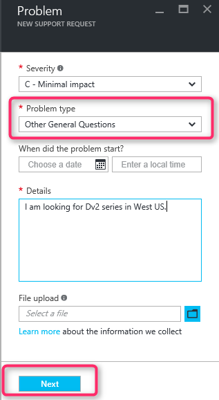
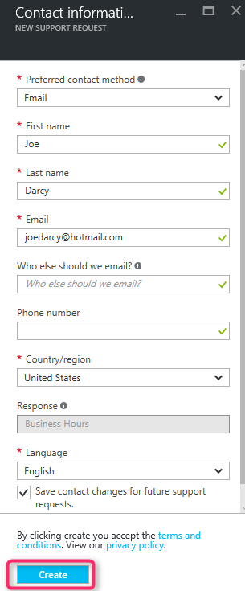

<properties
	 pageTitle="SKU series unavailable | Microsoft Azure"
	 description="Some SKU series are unavailable for the selected subscription for this region."
	 services="Azure Supportability"
	 documentationCenter=""
	 authors="ganganarayanan"
	 manager="scotthit"
	 editor=""/>

<tags
	 ms.service="azure-supportability"
	 ms.workload="na"
	 ms.tgt_pltfrm="na"
	 ms.devlang="na"
	 ms.topic="article"
	 ms.date="08/12/2016"
	 ms.author="gangan"/>

# SKU series unavailable

Message "*Some SKU series are unavailable for the selected subscription for this region*" is displayed when creating a support request to increase compute core quota.

In some regions, certain SKUs are not automatically available on new subscriptions.  This may occur when [more powerful SKUs are introduced in a region](https://azure.microsoft.com/updates/announcing-new-dv2-series-virtual-machine-size/) and the popularity of the legacy SKU declines.

You may review SKU availability on the [Azure services by region](https://azure.microsoft.com/regions/#services) page. 

To request access to a SKU that has been restricted from your subscription create a new support request.

1. Click "New Support request" in the [Azure portal](portal.azure.com).
Select Issue type as "Subscription Management" on the Basics page and click "Next".

2. On the Problem page, select the Problem type as “Other General questions” and enter the exact region and SKU you aren’t seeing.
This helps expedite the support process.

3. On the Contact Information page, enter your contact details and click "Create".

## Feedback
We are always open to feedback and suggestions! Send us your [suggestions](https://feedback.azure.com/forums/266794-support-feedback). Additionally, you can engage with us via [Twitter](https://twitter.com/azuresupport) or the [MSDN forums](https://social.msdn.microsoft.com/Forums/azure).

## Learn more
[Azure Support FAQ](https://azure.microsoft.com/support/faq)
