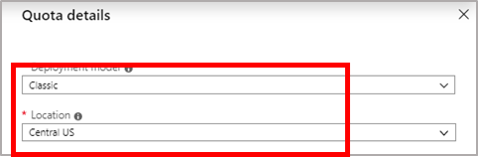
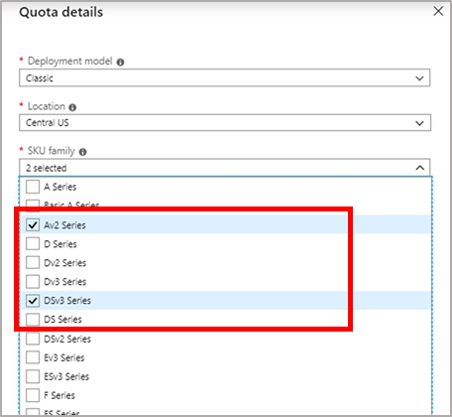
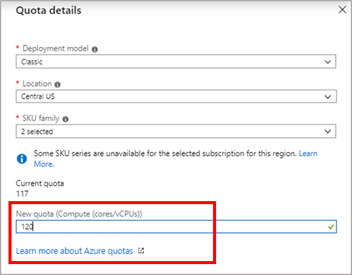

# Classic Deployment Model

Classic deployment model is the older generation Azure deployment mode land enforces a global vCPU quota limit for virtual machines and virtual machine scale sets. Classic deployment model is not recommended anymore and is now superseded by Resource Manager model. To learn more about these two deployment models and advantage of Resource Manager refer to Resource Manager Deployment Model page. 
When a new subscription is created, a default quota of vCPUs is assigned to it. Anytime a new VM is to be deployed using Classic deployment model, the sum of new and existing vCPUs usage across all regions must not exceed the vCPU quota approved for the Classic deployment model. 
Learn more about quotas on [Azure subscription and service limits page](https://aka.ms/quotalimits)

You can request an increase in vCPUs limit for Classic deployment model via Help + Support blade or the Usages + Quota blade in the portal.

## Request per VM Series vCPU quota increase at subscription level using the **Help + Support** blade

Follow the instructions below to create a support request via Azure's 'Help + Support' blade available in the Azure portal. 

1. From https://portal.azure.com, select **Help + Support**.

   
 
2.  Select **New support request**. 

      

3. In the Issue type dropdown, choose **Service and subscription limits (quotas)**.

   

4. Select the subscription that needs an increased quota.

   
   
5. Select **Compute -VM (cores-vCPUs) subscription  limit increases** in **quota type** dropdown. 

   

6. In **Problem Details**, provide additional information to help process your request by clicking **Provide details**.

   

7. In the **Quota details** panel, select Classic and select a location.

   

8. Select the **SKU families** that require an increase. 

   

9. Enter the new limits you would like on the subscription. To remove a line, uncheck the SKU from the SKU family dropdown or click the discard "x" icon. After entering the desired quota for each SKU family, click **Save and Continue** on the Quota details panel to continue with the support request creation.

   

## Request per VM Series vCPU quota increase at subscription level using **Usages + Quota** blade

Follow the instructions below using to create a support request via Azure's 'Usage + quota' blade available in the Azure portal. 

1. From https://portal.azure.com, select **Subscriptions**.

   

2. Select the subscription that needs an increased quota.

   

3. Select **Usage + quotas**

   

4. In the upper right corner, select **Request increase**.

   

5. Select **Compute-VM (cores-vCPUs) subscription limit increases** as the quote type. 

   
   
6. In **Problem Details**, provide additional information to help process your request by clicking **Provide details**.

   

7. In the **Quota details** panel, select Classic and select a location.

   

8. Select the **SKU families** that require an increase. 

   

9. Enter the new limits you would like on the subscription. To remove a line, uncheck the SKU from the SKU family dropdown or click the discard "x" icon. After entering the desired quota for each SKU family, click **Save and Continue** on the Quota details panel to continue with the support request creation.

   

