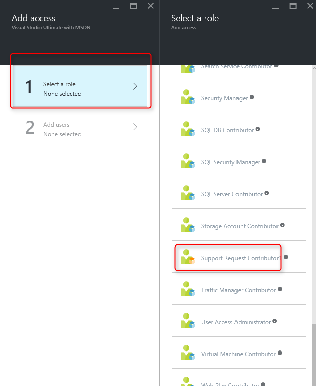
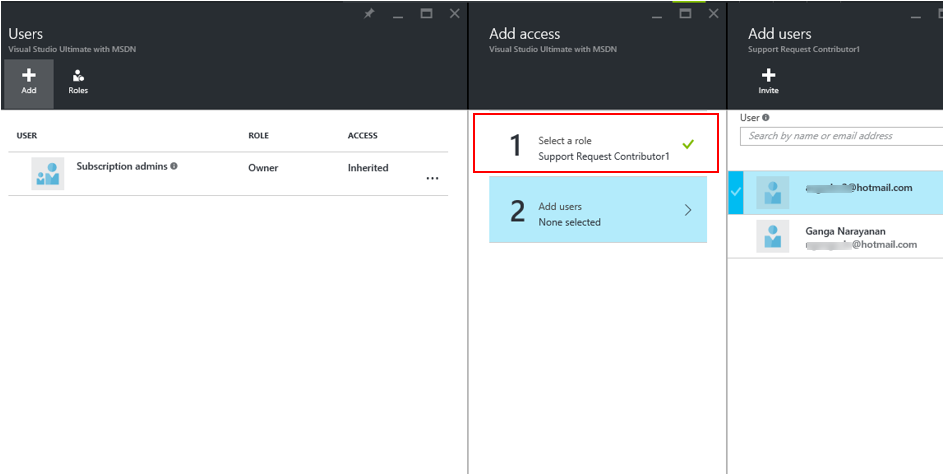
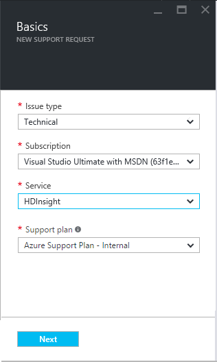
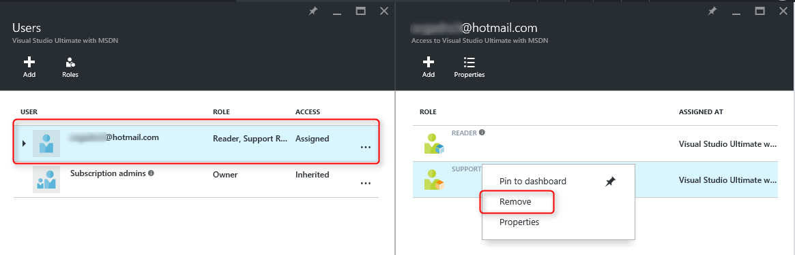

# Azure Role-Based Access Control (RBAC) to control access rights to create and manage support requests

[Role-Based Access Control (RBAC)](https://docs.microsoft.com/azure/role-based-access-control/overview) enables fine-grained access management for Azure.
Support request creation in the Azure portal, [portal.azure.com](https://portal.azure.com), uses Azure’s RBAC model to define who can create and manage support requests.
Access is granted by assigning the appropriate RBAC role to users, groups, and applications at a certain scope, which can be a subscription, resource group or a resource.

Let’s take an example: As a resource group owner with read permissions at the subscription scope, you can manage all the resources under the resource group, like websites, virtual machines, and subnets.
However, when you try to create a support request against the virtual machine resource, you encounter the following error


In support request management, you need write permission or a role that has the Support action Microsoft.Support/* at the Subscription scope to be able to create and manage support requests.

The following article explains how you can use Azure’s custom Role-Based Access Control (RBAC) to create and manage support requests in the Azure portal.

## Getting Started

Using the example above, you would be able to create a support request for your resource if you were assigned a custom RBAC role on the subscription by the subscription owner.
[Custom RBAC roles](https://azure.microsoft.com/documentation/articles/role-based-access-control-custom-roles/) can be created using Azure PowerShell, Azure Command-Line Interface (CLI), and the REST API.

The actions property of a custom role specifies the Azure operations to which the role grants access.
To create a custom role for support request management, the role must have the action Microsoft.Support/*

Here’s an example of a custom role you can use to create and manage support requests.
We’ve named this role “Support Request Contributor” and that’s how we refer to the custom role in this article.

``` Json
{
    "Name":  "Support Request Contributor",
    "Id":  "1f2aad59-39b0-41da-b052-2fb070bd7942",
    "IsCustom":  true,
    "Description":  "Lets you create and manage support tickets.",
    "Actions":  [
                    "Microsoft.Support/*"
                ],
    "NotActions":  [
                   ],
    "AssignableScopes":  [
                             "/"
                         ]
}
```

Follow the steps outlined in [this video](https://www.youtube.com/watch?v=-PaBaDmfwKI) to learn how to create a custom role for your subscription.

## Create and manage support requests in the Azure portal

Let’s take an example – you are the owner of Subscription "Visual Studio MSDN Subscription."
Joe is your peer who is a resource owner to some of the resource groups in this subscription and has read permission to the subscription.
You wish to give access to your peer, Joe, the ability to create and manage support tickets for the resources under this subscription.

1. The first step is to go to the subscription and under "Settings" you see a list of users. Click the user Joe who has reader access on the Subscription and let’s assign a new custom role to him.

    

2. Click "Add" under the "Users" blade. Select the custom role "Support Request Contributor" from the list of roles

    

3. After selecting the role name, click "Add users" and enter the Joe's email credentials. Click "Select"

    

4. Click "Ok" to proceed

    

5. Now you see the user with the newly added custom role "Support Request Contributor" under the Subscription for which you are the owner

    

    When Joe logs in the portal, he sees the subscription to which he was added.

7. Joe clicks "New Support request" from the "Help and Support" blade and can create support requests for "Visual Studio Ultimate with MSDN"

    

8. Clicking "All support requests" Joe can see the list of support requests created for this Subscription
    

## Remove support request access in the Azure portal

Just as it is possible to grant access to a user to create and manage support requests, it's possible to remove access for the user as well.
To remove the ability to create and manage support requests, go to the Subscription, click "Settings" and click the user (in this case, Joe).
Right-click the role name, "Support Request Contributor" and click "Remove"



When Joe logs in to the portal and tries to create a support request, he encounters the following error


Joe cannot see any support requests when he clicks "All support requests"


