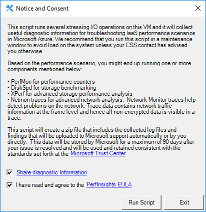
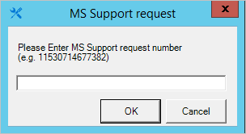
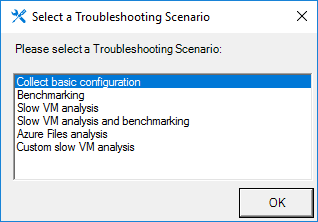
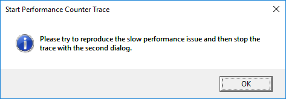
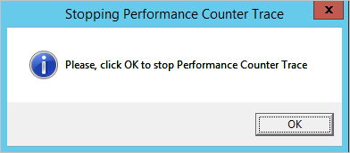
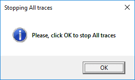
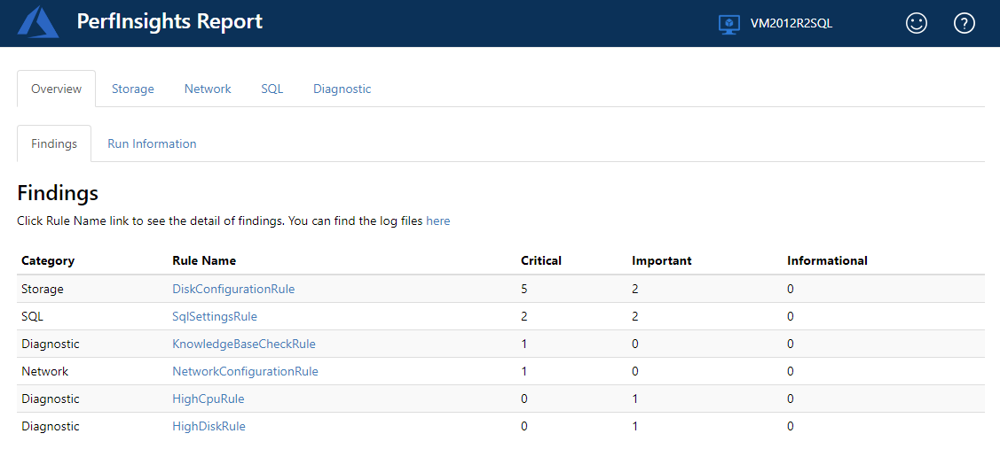
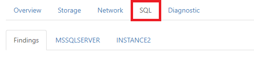

# How to use PerfInsights 3.2

## Overview

PerfInsights is an automated script that collects useful diagnostic
information, runs I/O stress loads, and provides an analysis report to
help troubleshoot Windows IaaS performance scenarios in Microsoft Azure.

We recommend that you run this script before you open a Support ticket
with Microsoft for IaaS performance issues.

## Supported troubleshooting scenarios

PerfInsights offers several different kinds of information that it can
collect and analyze. The different kinds of information are grouped into
unique scenarios.

### Collect Disk Configuration 

This scenario collects the disk configuration together with other
important information, including the following items:

-   System event logs

-   Network status for all incoming and outgoing connections

-   Network and firewall configuration settings

-   Task list for all applications currently running on the system

-   Information file for the virtual machine (VM) as created by msinfo32

-   SQL Server database configuration settings (if the VM is identified
    as a server that is running SQL Server)

-   Storage reliability counters

-   Important Windows hotfixes

-   Installed filter drivers

This is a passive collection of information. It shouldn't have any
effect on the system. **This scenario will automatically be included as
part of all the following scenarios. **

### Benchmark/Storage Performance Test

This scenario runs the [diskspd](https://github.com/Microsoft/diskspd)
benchmark test (IOPS and MBPS) for all drives that are attached to the
VM. 

> [!Note]
> This scenario can affect the system and shouldn’t be run on a live
production system. If necessary, run this scenario in a dedicated
maintenance window to avoid any problems. (An increased workload that is
caused by a trace or benchmark test could adversely affect the
performance of your VM.)
>

### General VM Slow analysis 

This scenario runs a [performance
counter](https://msdn.microsoft.com/en-us/library/windows/desktop/aa373083(v=vs.85).aspx)
trace by using the counters that are specified in the
Generalcounters.txt file. If the VM is identified as a server that is
running SQL Server, it runs a performance counter trace by using the
counters that are found in the Sqlcounters.txt file. It also includes
Performance Diagnostics data.

### VM Slow analysis and benchmark

This scenario runs a [performance
counter](https://msdn.microsoft.com/en-us/library/windows/desktop/aa373083(v=vs.85).aspx)
trace that is followed by a
[diskspd](https://github.com/Microsoft/diskspd) benchmark test. 

Note: This scenario can affect the system and shouldn’t be run on a live
production system. If necessary, run this scenario in a dedicated
maintenance window to avoid any problems. (An increased workload that is
caused by a trace or benchmark test could adversely affect the
performance of your VM.)

### Azure Files analysis 

This scenario runs a special performance counter capture together with a
network trace. The capture includes all the SMB Client Shares(\*)\\\*
counters. Here are some key SMB client share performance counters that
are part of the capture:

| **Type**     | **SMB client shares counter** |
|--------------|-------------------------------|
| IOPS         | Data Requests/sec             |
|              | Read Requests/sec             |
|              | Write Requests/sec            |
| Latency      | Avg. sec/Data Request         |
|              | Avg. sec/Read                 |
|              | Avg. sec/Write                |
| IO Size      | Avg. Bytes/Data Request       |
|              | Avg. Bytes/Read               |
|              | Avg. Bytes/Write              |
| Throughput   | Data Bytes/sec                |
|              | Read Bytes/sec                |
|              | Write Bytes/sec               |
| Queue Length | Avg. Read Queue Length        |
|              | Avg. Write Queue Length       |
|              | Avg. Data Queue Length        |

### Custom configuration 

When you run a custom configuration, you are running all traces
(performance diagnostics, performance counter, xperf, network, storport)
in parallel, depending how many different traces are selected. After
tracing is completed, the tool runs the diskspd benchmark, if it is
selected. 

Note: This scenario can affect the system and shouldn’t be run on a live
production system. If necessary, run this scenario in a dedicated
maintenance window to avoid any problems. (An increased workload that is
caused by a trace or benchmark test could adversely affect the
performance of your VM.)

## Information collected by the script?

Information about the Windows VM, disks or storage pools configuration,
and performance logs is collected. The following details describe this
process:

### (For Windows Server 2012 or later versions) Storage Pool Configuration (For Windows Server 2012 or later versions)

> Commands Get-StorageSubsystem, Get-disk and fltmc.exe

### (For Windows Server 2008 R2 or later versions) RAID – Striped Volumes

> Details from DISKPART

### Diskspd test 

> [Diskspd](https://gallery.technet.microsoft.com/DiskSpd-a-robust-storage-6cd2f223)
> IO workload tests (OS Disk (write) and pool drives (read/write))

### Xperf logs

> Collection of
> [Xperf](http://blogs.technet.com/b/robertsmith/archive/2012/02/07/analyzing-storage-performance-using-the-windows-performance-toolkit.aspx)
> traces

### Performance Counters

Collection of the following Performance Counters:

- \\Process(\*)\\\*, \\Processor(\*)\\\*, \\Memory(\*)\\\*,
\\PhysicalDisk(\*)\\\*, \\LogicalDisk(\*)\\\*

- \\Cache\\Dirty Pages, \\Cache\\Lazy Write Flushes/sec, \\Server\\Pool
Nonpaged, Failures, \\Server\\Pool Paged Failures

**For SQL Server instances**


- \\SQL Server:Buffer Manager\\\*, \\SQLServer:Resource Pool
Stats(\*)\\\*, \\SQLServer:SQL Statistics\\\*,
- \\SQLServer:Locks(\*)\\\*, \\SQLServer:General, Statistics\\\*,
- \\SQLServer:Access Methods\\\*

**For Azure Files**

\\SMB Client Shares(\*)\\\*

**Network trace**

Collection of network traces

**Storport Trace**

Collection of Storport Traces

**Performance Diagnostics**

Runs a rule based engine in the background to diagnose ongoing
performance issues. The following rules are currently supported:

-   *HighCpuUsage rule:* Detects high CPU usage periods and shows the
    top CPU usage consumers during those periods.

-   *HighDiskUsage rule:* Detects high disk usage periods on physical
    disks and shows the top disk usage consumers during those periods.

-   *HighResolutionDiskMetric rule:* Shows IOPS, throughput and IO
    latency metrics per 50 milliseconds for each physical disk. It helps
    to quickly identify disk throttling periods.

-   *HighMemoryUsage rule:* Detects high memory usage periods and shows
    the top memory usage consumers during those periods.

**Note**: Currently, Windows versions with .net framework 3.5 or higher
are supported.

## Run the PerfInsights on your VM

### What do I have to know before I run the script? 

**This script has the following requirements**

1.  This script must be executed on the VM that has the performance
    issue. 

2.  The following OSes are supported: Windows Server 2008 R2, 2012, 2012
    R2, 2016; Windows 8.1 and Windows 10.

**Possible issues when you rung the script on production VMs:**

1.  When used together with the ”Benchmark” or ”Custom” scenario that is
    configured by using XPerf or DiskSpd, the script might adversely
    affect the performance of the VM. Be careful when you run
    the script in a production environment.

2.  When you use the script together with the ”Benchmark” or ”Custom”
    scenario that is configured by using DiskSpd, make sure that no
    other background activity interferes with the I/O workload on the
    tested disks.

3.  By default, the script uses the temporary storage drive to
    collect data. If tracing stays enabled for a longer time, the amount
    of data that is collected might be relevant. This can reduce the
    availability of space on the temporary disk, therefore affecting any
    application that relies on this drive.

### How do I run PerfInsights? 

To run the script, follow these steps:

1.  Expand the compressed .zip file into your temporary drive (by
    default, usually the D drive). The compressed file should contain
    the following files and folders:

    

2.  Open Windows PowerShell as an administrator, and then run the
    PerfInsights.ps1 script.

    ```
    cd <the path of PerfInsights folder >
    Powershell.exe -ExecutionPolicy UnRestricted -NoProfile -File .\\PerfInsights.ps1
    ```

    You might have to enter “y” to if you are asked to confirm that you want
    to change the execution policy.

    In the following dialog box, you must confirm the consensus for sharing
    diagnostic information with Microsoft Support, if you want to do this.
    To use this option, select the **Share diagnostic Information** check
    box, and then click **Run Script** after you read the disclaimer.

    

3.  Submit the case number, if it is available, when you run the script
    (for our statistics).  
    Then, click **OK**.
    
    

4.  Select your temporary storage drive. The Script can auto-detect the
    drive letter of the drive. If any problems occur in this stage, you
    might be prompted to select the drive (the default drive is D).
    Generated logs are stored here in the log\_collection folder. After
    you enter or accept the drive letter, click **OK**.

    

5.  Select a troubleshooting scenarios from the provided list.

       


6.  You can also run PerfInsights without UI.

    The command line below will run “General VM slow analysis”
    troubleshooting scenario without UI prompt and capture data for
    30 seconds. It still asks for your consent for disclaimer and EULA
    which are the same as the Disclaimer dialog in the beginning of
    this section.

        powershell.exe -ExecutionPolicy UnRestricted -NoProfile -Command “.\\PerfInsights.ps1 -NoGui -Scenario vmslow -TracingDuration 30”

    If you want PerfInsights to run in silent mode, use
    **-AcceptDisclaimerAndShareDiagnostics** parameter. E.g.

        powershell.exe -ExecutionPolicy UnRestricted -NoProfile -Command “.\\PerfInsights.ps1 -NoGui -Scenario vmslow -TracingDuration 30 -AcceptDisclaimerAndShareDiagnostics”

### How do I troubleshoot issues while running the script?

If an abnormal termination of the script occurs, you can clean up an
inconsistent state by running the script together with the **-Cleanup**
switch:

    powershell.exe -ExecutionPolicy UnRestricted -NoProfile -Command ".\\PerfInsights.ps1 -Cleanup"

If any problems occur during the automatic detection of the temporary
drive, you might be prompted to select the drive (the default drive is
D).


The script uninstalls the utility tools and removes temporary folders.

### Troubleshooting other script issues 

If any problems occur when you run the script, press Ctrl+C to interrupt
the script execution. To remove temporary objects, see the "Clean up
after abnormal termination" section.

If you continue to experience script failure even after several
attempts, we recommend that you run the script in "debug mode" by using
the "-Debug" parameter option on startup.

After the failure occurs, copy the full output of the PowerShell
console, and send it to the Microsoft Support agent who is assisting you
to help troubleshoot the problem.

### How do I run the script in custom configuration mode?

By choosing the **Custom** configuration, you can enable several traces
in parallel (use Shift to multi-select):


When you select Performance Diagnostics, Performance Counter Trace,
XPerf Trace, Network Trace, or Storport Trace scenarios, follow the
instructions in the dialog boxes, and try to reproduce the slow
performance issue after you start the traces.

The following dialog box lets you start a trace:



To stop the traces, you have to confirm the command in a second dialog
box.




When the traces or operations are completed, a new file is generated in
D:\\log\_collection (or the temporary drive) that is named
**CollectedData\_yyyy-MM-dd\_hh\_mm\_ss.zip.** You can send this file to
the Support agent for analysis.

## Review the diagnostics report created by PerfInsights

Within the **CollectedData\_yyyy-MM-dd\_hh\_mm\_ss.zip file,** which is
generated by PerfInsights, you can find an HTML report that details the
findings of PerfInsights. To review the report, expand the
**CollectedData\_yyyy-MM-dd\_hh\_mm\_ss.zip** file, and then open the
**PerfInsights Report.html** file.

Select to the **Findings** tab.



**Notes**

-   Messages in red are known configuration issues that may cause
    performance issues.

-   Messages in yellow are warnings that represent non-optimal
    configurations that do not necessarily cause performance issues.

-   Messages in blue are informative statements only.

Please review the HTTP links for all error messages in red to get more
detailed information about the findings and how they can affect the
performance or best practices for performance-optimized configurations.

### Disk Configuration Tab

The **Overview** section displays different views on the storage
configuration, including information from Diskpart and Storage Spaces

The **DiskMap** and **VolumeMap** describe how Logical Volumes and
PhysicalDisks are related to each other, on a dual perspective.

From the PhysicalDisk perspective (*DiskMap*) the table shows all
logical volumes running on it. In the sample below, PhysicalDrive2 runs
2 Logical Volumes created on multiple partitions (J: and H: ):


From the Volume perspective (*VolumeMap*) the tables shows all the
physical disks under each logical volume. Note that for RAID/Dynamic
disks, you might run a logical volume upon multiple physical disks. In
the sample below *C:\\mount* is a mountpoint configured as *SpannedDisk*
upon PhysicalDisks \#2 and \#3:


### SQL Server Tab

In case the target VM hosts one or multiple SQL Server Instances, you
will see an additional tab in the report, named **SQL Server**:



This section contains an “Overview” and additional sub tabs for each of
the SQL Server instances hosted on the VM.

The Overview section contains a helpful table summarizing all the
physical disks (OS and Data disks) running with a mixture of data files
and transaction log files.

In the sample below, the *PhysicalDrive0* (running the C: drive) is
displayed because both files *modeldev* and *modellog* are located on C
drive, and they are of different types such as Data File and Transaction
Log, respectively:


The SQL Server instance-specific tabs contain a general section displaying basic
information on the selected instance and additional sections for
advanced information including Settings, Configurations and User
Options.

## References to the external tools used

### Diskspd

DISKSPD is a storage load generator and performance test tool from the
Windows and Windows Server and Cloud Server Infrastructure engineering
teams.

For more information, see [Diskspd](https://github.com/Microsoft/diskspd).

### XPerf

Xperf is a command line tool to capture traces from the Windows
Performance Tools Kit.

For more information, see [Windows Performance Toolkit – Xperf](https://blogs.msdn.microsoft.com/ntdebugging/2008/04/03/windows-performance-toolkit-xperf/).

## Next Steps

### Upload diagnostics logs and reports to Microsoft Support for further review

When you work with the Microsoft Support staff, you may be requested to
transmit the output that is generated by PerfInsights to assist the
troubleshooting process.

The Support agent will create a DTM workspace for you, and you will
receive an email message that includes a link to the [DTM
portal](https://filetransfer.support.microsoft.com/EFTClient/Account/Login.htm)
and a unique user ID and password.

This message will be sent from **CTS Automated Diagnostics Services**
(ctsadiag@microsoft.com).


For additional security, you will be required to change your password on
first use.

After you log in to DTM, you will find a dialog box to upload the
**CollectedData\_yyyy-MM-dd\_hh\_mm\_ss.zip** file that was collected by
PerfInsights.