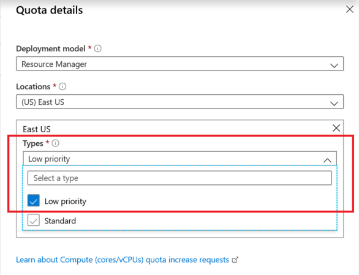

# Spot quota: Increase limits for all VM series

Spot virtual machines (VMs) provide a different model of Azure usage. They let you assume lower costs in exchange for letting Azure remove VMs as needed for pay-as-you-go or reserved VM instance deployments. For more information about spot VMs, see [Azure spot VMs for virtual machine scale sets](https://docs.microsoft.com/azure/virtual-machine-scale-sets/use-spot).

Azure Resource Manager supports two types of vCPU quotas for virtual machines:
* *Pay-as-you-go VMs* and *reserved VM instances* are subject to a *standard vCPU quota*.
* *Spot VMs* are subject to a *spot vCPU quota*. 

For the *spot vCPU quota* type, Resource Manager vCPU quotas are enforced across all available VM series as a single regional limit.

Whenever you deploy a new spot VM, the total new and existing vCPU usage for all spot VM instances must not exceed the approved spot vCPU quota limit. If the spot quota is exceeded, the spot VM deployment isn't allowed. 

This article discusses how to request an increase in the spot vCPU quota limit by using the Azure portal. 

To learn more about standard vCPU quotas, see [Virtual machine vCPU quotas](https://docs.microsoft.com/azure/virtual-machines/windows/quotas) and [Azure subscription and service limits](https://aka.ms/quotalimits). 

To learn about increasing the vCPU limit by region, see [Standard quota: Regional vCPU limit increase](https://docs.microsoft.com/azure/azure-supportability/regional-quota-requests).

## Request a quota limit increase from the "Help + support" pane 

To request a spot quota limit increase for all VM series from the **Help + support** pane, do the following:

> [!NOTE]
> You can also request a quota limit increase for multiple regions through a single support case. For details, see step 8. 

1. In the left pane of the [Azure portal](https://portal.azure.com), select **Help + support**.

   
 
1. In the **Help + support** pane, select **New support request**. 

    

1. In the **Issue type** drop-down list, select **Service and subscription limits (quotas)**.

   

1. In the **Subscription** drop-down list, select the subscription whose quota you want to increase.

   
   
1. In the **Quota type** drop-down list, select **Compute-VM (cores-vCPUs) subscription  limit increases**. 

   

1. Select the **Details** tab and then, under **Problem Details**, select **Provide details**, and enter additional information to help process your request.

   
   
1. In the **Quota details** pane at the top right, do the following:

   

   a. In the **Deployment model** drop-down list, select the appropriate model.

   b. In the **Locations** drop-down list, select a location. For the selected location, under **Types**, in the **Select a type** box, enter **Spot**. 
   
   

    Under **Types**, you can request both Standard and spot quota types from a single support case through multi-selection support. 
    
    For more information, see [Standard quota: Per-VM series vCPU limit increase](https://docs.microsoft.com/azure/azure-supportability/per-vm-quota-requests).

   c. Enter the new quota limit that you want for this subscription. 
 
   

1. To request a quota increase for more than one location, select an additional location in the drop-down list, and then select an appropriate VM type. You can then enter a limit that applies to the additional location.

   

1. Select **Save and continue** to continue creating the support request.

## Request a quota limit increase from the "Subscriptions" pane

To request a spot quota limit increase for all VM series from the **Subscriptions** pane, do the following:

> [!NOTE]
> You can also request a quota limit increase for multiple regions through a single support case. For details, see step 7. 

1. In the left pane of the [Azure portal](https://portal.azure.com), select **Subscriptions**.

   

1. Select the subscription whose quota you want to increase.

   

1. In the left pane of your **\<Subscription name>** page, select **Usage + quotas**.

   

1. At the top right, select **Request increase**.

   

1. In the **Quota type** drop-down list, select **Compute-VM (cores-vCPUs) subscription limit increases**.

   

1. In the **Quota details** pane at the top right, do the following:

   
 
   a. In the **Deployment model** drop-down list, select the appropriate model.

   b. In the **Locations** drop-down list, select a location. 
   
   c. For the selected location, under **Types**, in the **Select a type** box, enter **Spot**.

   

   For more information, see [Standard quota: Per-VM series vCPU limit increase](https://docs.microsoft.com/azure/azure-supportability/per-vm-quota-requests).

   d. Enter the new quota limit that you want for this subscription.

   
 
1. To request a quota increase for more than one location, select an additional location in the drop-down list, and then select an appropriate VM type. You can then enter a limit that applies to the additional location.

   
 
1. Select **Save and continue** to continue creating the support request.

