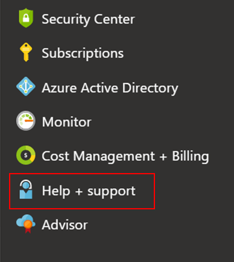
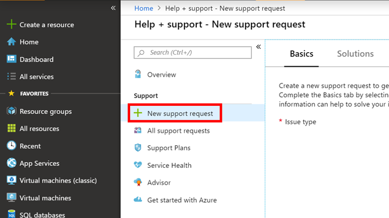
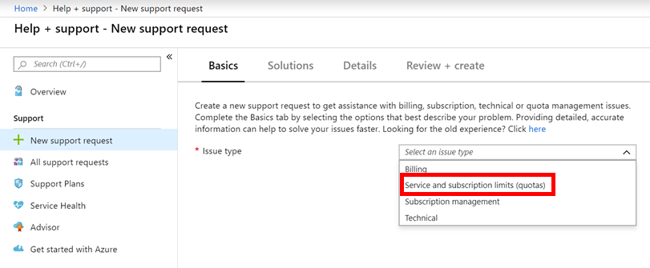
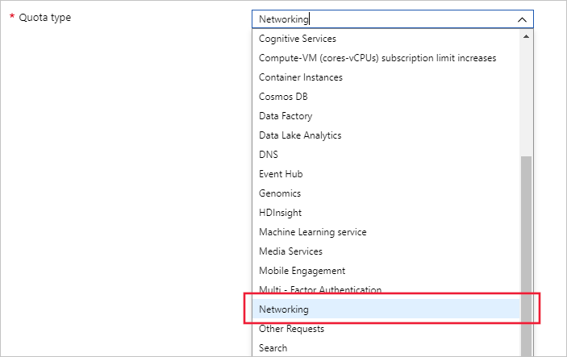
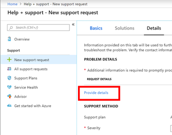
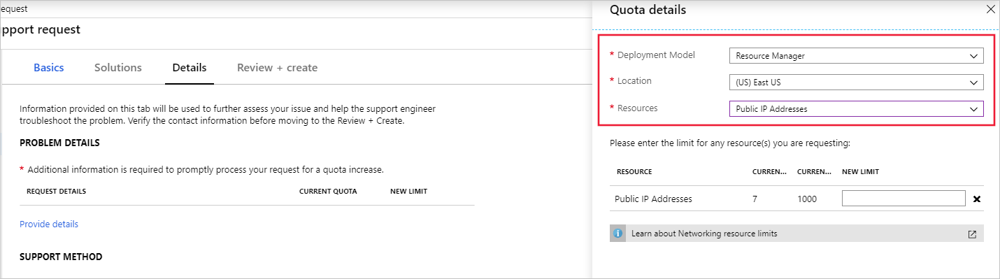
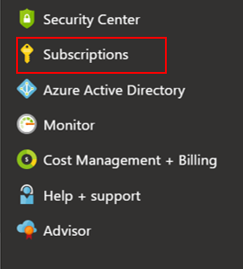
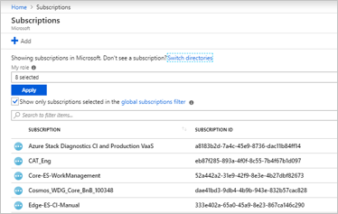
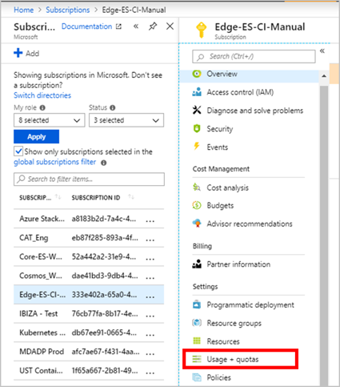
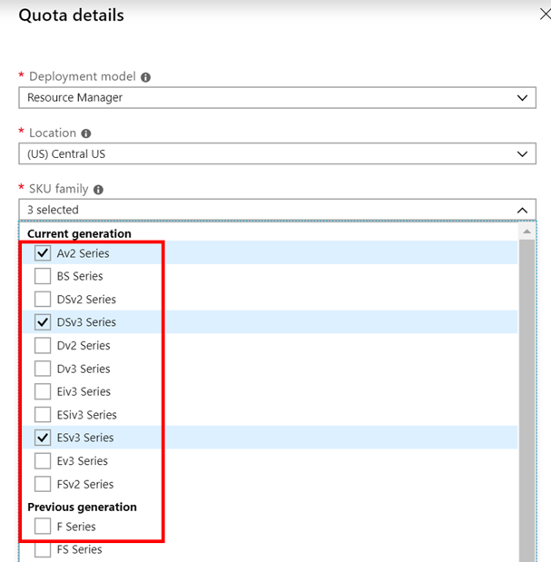

# Networking limit increase

To view your current Networking usage and quota, you can visit the **Usages + Quota** blade in the Azure portal. You can also use usage [CLI](https://docs.microsoft.com//cli/azure/network?view=azure-cli-latest#az-network-list-usages), [PowerShell](https://docs.microsoft.com/powershell/module/azurerm.network/get-azurermnetworkusage?view=azurermps-6.13.0) or the [network usage API](https://docs.microsoft.com/rest/api/virtualnetwork/virtualnetworks/listusage) to view your network usage and limits.

You can request an increase via **Help + Support** blade or the **Usages + Quota** blade in the portal.

## Request Networking quota increase at subscription level using the **Help + Support** blade

Follow the instructions below to create a support request via Azure's 'Help + Support' blade available in the Azure portal. 

1. From https://portal.azure.com, select **Help + Support**.

    
 
2.  Select **New support request**. 

    

3. In the Issue type dropdown, choose **Service and subscription limits (quotas)**.

    

4. Select the subscription that needs an increased quota.

    
   
5. Select **Networking** in **quota type** dropdown. 

    

6. In **Problem Details**, provide additional information to help process your request by clicking **Provide details**.

    

7. In the **Quota details** panel, select Deployment model, a location and the Resources that you want to request an increase for.

    

8.  Enter the new limits you would like on the subscription. To remove a line, uncheck the Resource from the Resource dropdown or click the discard "x" icon. After entering the desired quota for each Resource, click **Save and Continue** on the Quota details panel to continue with the support request creation.

    

## Request Networking quota increase at subscription level using **Usages + Quota** blade

Follow the instructions below using to create a support request via Azure's 'Usage + quota' blade available in the Azure portal. 

1. From https://portal.azure.com, select **Subscriptions**.

    

2. Select the subscription that needs an increased quota.

    

3. Select **Usage + quotas**

    

4. In the upper right corner, select **Request increase**.

    

5. Follow the steps starting with step # 3 from the *Request Networking quota increase at subscription level* section using the **Help + Support** blade section

## About Networking limits

To learn more about Networking limits, see the [Networking section](../azure-subscription-service-limits.md#networking-limits) of the limits page or our Network Limits FAQ