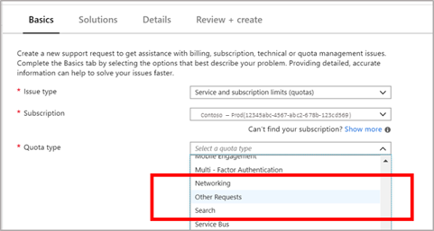
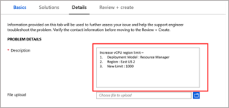

# Total regional vCPU limit increase 

You can now request an increase via **Help + Support** blade or the **Usages + Quota** blade in the portal. 

## Request Total Regional vCPUs quota increase at subscription level using the **Help + Support** blade

Follow the instructions below to create a support request via Azure's 'Help + Support' blade available in the Azure portal. 

1. From https://portal.azure.com, select **Help + Support**.

 
2.  Select **New support request**. 

3. In the Issue type dropdown, choose **Service and subscription limits (quotas)**.

4. Select the subscription that needs an increased quota.

   
5. Select **Other Requests** in **quota type** dropdown.

6. In **Details** pane, provide additional information as per the example below, to help process your request and continue with the case creation. 
    1.	**Deployment model** – Specify ‘Resource Manager’
    2.	**Requested region** – Specify your required region e.g. East US 2
    3.	**New limit Value** – Specify new region limit. This should not exceed the sum of approved quota for individual SKU families for          this subscription

## Request Total Regional vCPUs quota increase at subscription level using the **Usages + Quota** blade

Follow the instructions below using to create a support request via Azure's 'Usage + quota' blade available in the Azure portal. 

1. From https://portal.azure.com, select **Subscriptions**.

2. Select the subscription that needs an increased quota.

3. Select **Usage + quotas**

4. In the upper right corner, select **Request increase**.

5. Select **Other Requests** in **quota type** dropdown.

6. In **Details** pane, provide additional information as per the example below, to help process your request and continue with the case creation. 
    1.	**Deployment model** – Specify ‘Resource Manager’
    2.	**Requested region** – Specify your required region e.g. East US 2
    3.	**New limit Value** – Specify new region limit. This should not exceed the sum of approved quota for individual SKU families for          this subscription

