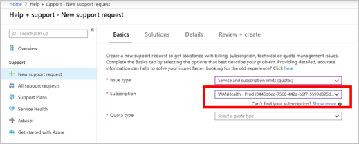
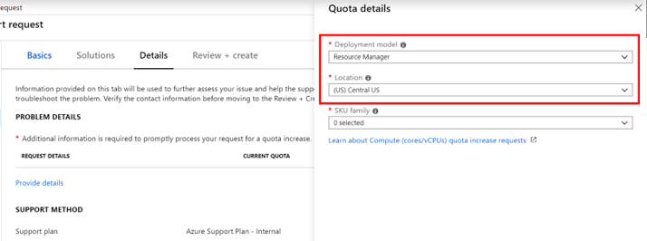
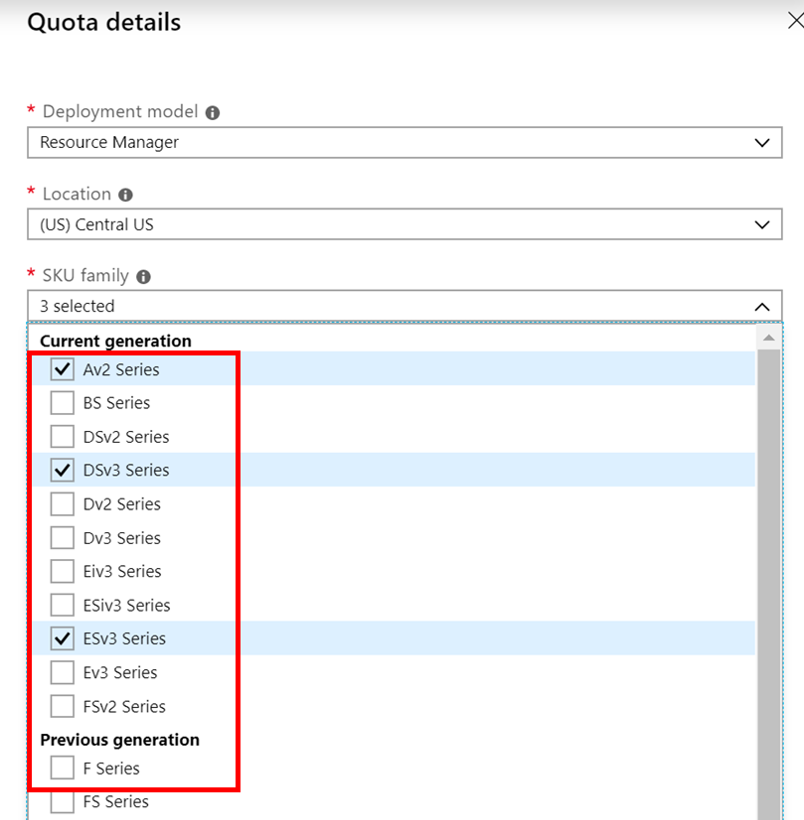
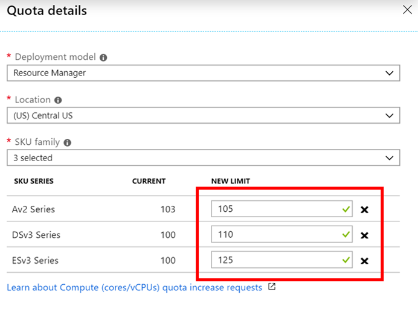

# Resource Manager vCPU quota increase requests

Resource Manager vCPU quotas are enforced at the region level and SKU family level.
Learn more about how quotas are enforced on the [Azure subscription and service limits](https://aka.ms/quotalimits) page.
To learn more about SKU Families, you may compare cost and performance on the [Virtual Machines Pricing](https://aka.ms/pricingcompute) page.

You can now request an increase via **Help + Support** blade or the **Usages + Quota** blade in the portal. 

## Quota increase using the **Help + Support** blade

Follow the instructions below to create a support request via Azure's 'Help + Support' blade available in the Azure Portal. 

1. From https://portal.azure.com, select **Help + Support**.

 
 
2.  Select **New support request**. 

3. In the Issue type dropdown, choose **Service and subscription limits (quotas)**.

4. Select the subscription that needs an increased quota.

   
5. Select **Compute -VM (cores-vCPUs) subscription  limit increases** in **quota type** dropdown. 

6. In **Problem Details**, provide additional information to help process your request by clicking **Provide details**.

7. In the **Quota details** panel, select Deployment model as "Resource Manager" and select a location.

8. Select the **SKU families** that require an increase. 

9. Enter the new limits you would like on the subscription

To remove a line, uncheck the SKU from the SKU family dropdown or click the discard "x" icon. After entering the desired quota for each SKU family, click **Save and Continue** on the Quota details panel to continue with the support request creation.

## Quota increase at subscription level using Usages + Quota

Follow the instructions below using to create a support request via Azure's 'Usage + quota' blade available in the Azure Portal. 

1. From https://portal.azure.com, select **Subscriptions**.

   

2. Select the subscription that needs an increased quota.

   

3. Select **Usage + quotas**

   

4. In the upper right corner, select **Request increase**.

   

5. Select **Compute-VM (cores-vCPUs) subscription limit increases** as the quote type. 

   
   
6. In the **Quota details** panel, select Deployment model as "Resource Manager" and select a location.

    

7. Select the **SKU Families** that require an increase.

    

8. Enter the new limits you would like on the subscription.

    

- To remove a line, uncheck the SKU from the SKU family dropdown or click the discard "x" icon.
After entering the desired quota for each SKU family, click "Save and Continue" on the Problem step page to continue with the support request creation.
