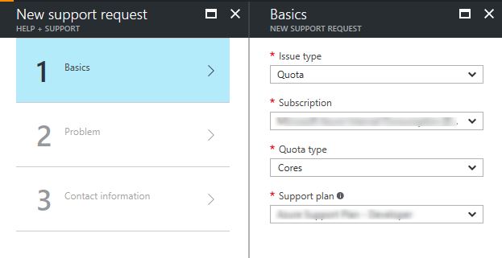

<properties
	 pageTitle="Resource Manager core quota increase requests | Microsoft Azure"
	 description="Resource Manager core quota increase requests"
	 services="Azure Supportability"
	 documentationCenter=""
	 authors="ganganarayanan"
	 manager="scotthit"
	 editor=""/>

<tags
	 ms.service="azure-supportability"
	 ms.workload="na"
	 ms.tgt_pltfrm="na"
	 ms.devlang="na"
	 ms.topic="article"
	 ms.date="1/18/2017"
	 ms.author="gangan"/>

# Resource Manager core quota increase requests

## Summary
Resource Manager core quotas are enforced at the region level and SKU family level.
Learn more about how quotas are enforced on the [Azure subscription and service limits](http://aka.ms/quotalimits) page.
To learn more about SKU Families, you may compare cost and performance on the [Virtual Machines Pricing](http://aka.ms/pricingcompute) page.

To request an increase, create a Quota support case for Cores in the Azure portal, [https://portal.azure.com](https://portal.azure.com).
>[AZURE.NOTE] Learn how to [create a support request](https://docs.microsoft.com/azure/azure-supportability/how-to-create-azure-support-request) in the Azure portal

- On the new support request page, select Issue type as "Quota" and Quota type as "Cores"

- Select Deployment model as "Resource Manager" and select a location

- Select the SKU Families that require an increase

- Enter the new limits you would like on the subscription

- To remove a line, uncheck the SKU from the SKU family dropdown or click the discard "x" icon.
