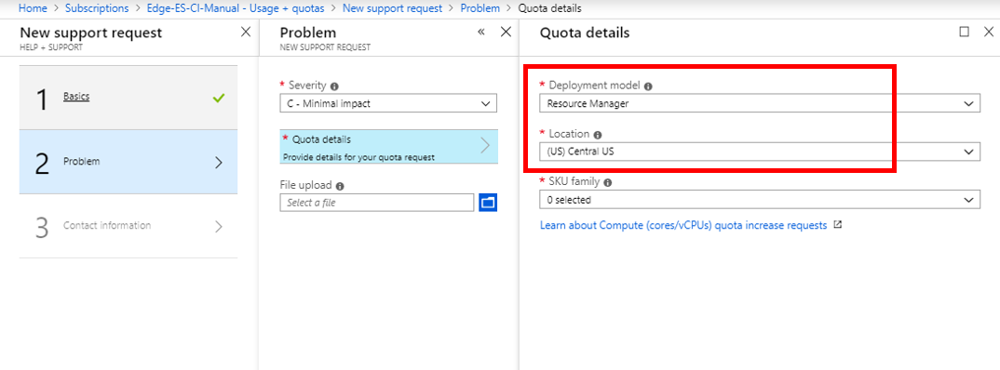
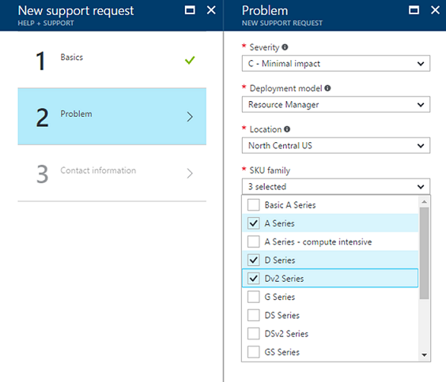
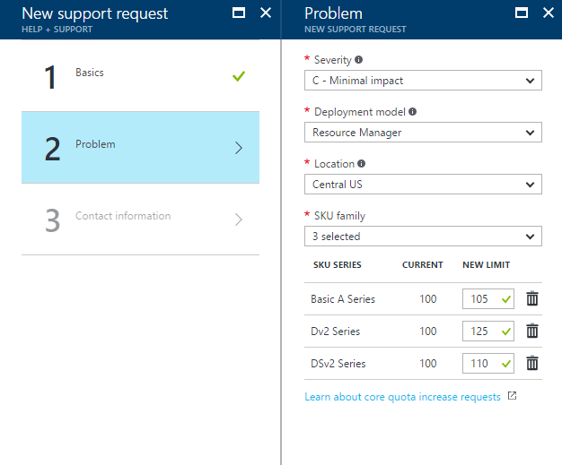

# Resource Manager vCPU quota increase requests

Resource Manager vCPU quotas are enforced at the region level and SKU family level.
Learn more about how quotas are enforced on the [Azure subscription and service limits](http://aka.ms/quotalimits) page.
To learn more about SKU Families, you may compare cost and performance on the [Virtual Machines Pricing](http://aka.ms/pricingcompute) page.

To request an increase, follow the instructions below using to create a support request via Azure's 'Usage + quota' blade available in the Azure Portal. 

## Request quota increase at subscription level

1. From https://portal.azure.com, select **Subscriptions**.

   

2. Select the subscription that needs an increased quota.

   

3. Select **Usage + quotas**

   

4. In the upper right corner, select **Request increase**.

   

5. Step:1 - Select **Cores** as the quote type. 

   
   
6. Step:2 - Select Deployment model as "Resource Manager" and select a location.

    

3. Select the SKU Families that require an increase.

    

4. Enter the new limits you would like on the subscription.

    

- To remove a line, uncheck the SKU from the SKU family dropdown or click the discard "x" icon.
After entering the desired quota for each SKU family, click "Next" on the Problem step page to continue with the support request creation.

