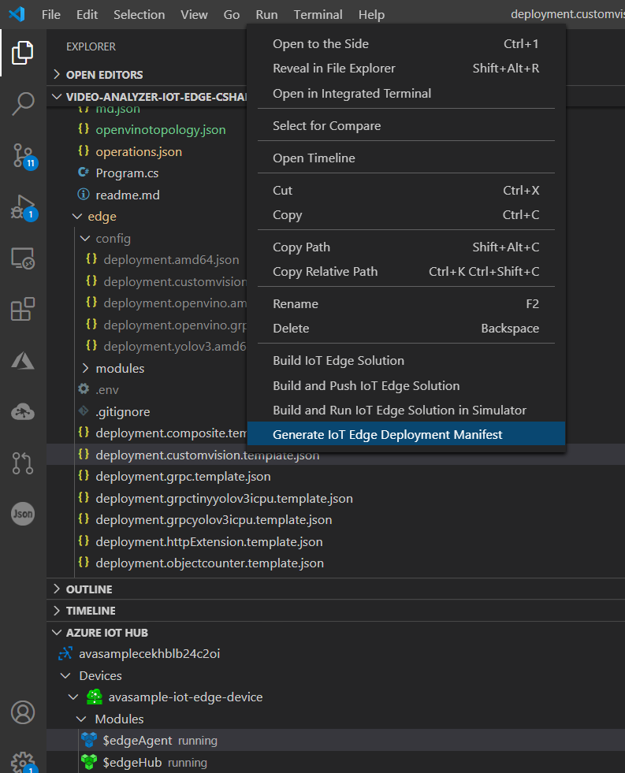
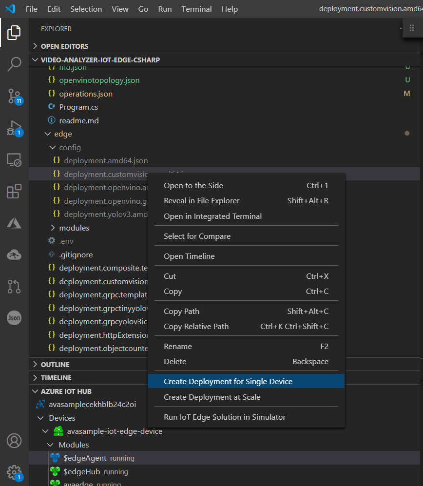

# Tutorial: Analyze live video with Azure Video Analyzer on IoT Edge and Azure Custom Vision

In this tutorial, you'll learn how to use Azure [Custom Vision](https://azure.microsoft.com/services/cognitive-services/custom-vision-service/) to build a containerized model that can detect a toy truck and use the [AI extensibility capability](analyze-live-video-without-recording.md#analyzing-video-using-a-custom-vision-model) of Azure Video Analyzer on Azure IoT Edge to deploy the model on the edge for detecting toy trucks from a live video stream.

We'll show you how to bring together the power of Custom Vision to build and train a computer vision model by uploading and labeling a few images. You don't need any knowledge of data science, machine learning, or AI. You'll also learn about the capabilities of Video Analyzer and how to easily deploy a custom model as a container on the edge and analyze a simulated live video feed.

::: zone pivot="programming-language-csharp"
[!INCLUDE [header](includes/analyze-live-video-custom-vision/csharp/header.md)]
::: zone-end

::: zone pivot="programming-language-python"
[!INCLUDE [header](includes/analyze-live-video-custom-vision/python/header.md)]
::: zone-end

The tutorial shows you how to:

- Set up the relevant resources.
- Build a Custom Vision model in the cloud to detect toy trucks and deploy it on the edge.
- Create and deploy a pipeline with an HTTP extension to a Custom Vision model.
- Run the sample code.
- Examine and interpret the results.

If you don't have an [Azure subscription](../../guides/developer/azure-developer-guide.md#understanding-accounts-subscriptions-and-billing), create a [free account](https://azure.microsoft.com/free/?ref=microsoft.com&utm_source=microsoft.com&utm_medium=docs&utm_campaign=visualstudio) before you begin.

## Suggested pre-reading

Read through the following articles before you begin:

- [Video Analyzer on IoT Edge overview](overview.md)
- [Azure Custom Vision overview](../../cognitive-services/custom-vision-service/overview.md)
- [Video Analyzer on IoT Edge terminology](terminology.md)
- [Pipeline concept](pipeline.md)
- [Video Analyzer without video recording](analyze-live-video-without-recording.md)
- [Tutorial: Developing an IoT Edge module](../../iot-edge/tutorial-develop-for-linux.md)
- [How to edit deployment.*.template.json](https://github.com/microsoft/vscode-azure-iot-edge/wiki/How-to-edit-deployment.*.template.json)

## Prerequisites

* [Install Docker](https://docs.docker.com/desktop/#download-and-install) on your machine.

::: zone pivot="programming-language-csharp"
[!INCLUDE [prerequisites](includes/analyze-live-video-custom-vision/csharp/prerequisites.md)]
::: zone-end

::: zone pivot="programming-language-python"
[!INCLUDE [prerequisites](includes/analyze-live-video-custom-vision/python/prerequisites.md)]
::: zone-end


## Review the sample video

This tutorial uses a [toy car inference video](https://lvamedia.blob.core.windows.net/public/t2.mkv) file to simulate a live stream. You can examine the video via an application such as [VLC media player](https://www.videolan.org/vlc/). Select **Ctrl+N**, and then paste a link to the [toy car inference video](https://lvamedia.blob.core.windows.net/public/t2.mkv) to start playback. As you watch the video, note that at the 36-second marker a toy truck appears in the video. The custom model has been trained to detect this specific toy truck.

> [!VIDEO https://www.microsoft.com/videoplayer/embed/RE4LPwK]

In this tutorial, you'll use Video Analyzer on IoT Edge to detect such toy trucks and publish associated inference events to the IoT Edge hub.

## Overview


This diagram shows how the signals flow in this tutorial. An [edge module](https://github.com/Azure/video-analyzer/tree/main/edge-modules/sources/rtspsim-live555) simulates an IP camera hosting a Real-Time Streaming Protocol (RTSP) server. An [RTSP source](pipeline.md#rtsp-source) node pulls the video feed from this server and sends video frames to the [HTTP extension processor](pipeline.md#http-extension-processor) node.

The HTTP extension node plays the role of a proxy. It samples the incoming video frames set by you using the `samplingOptions` field and also converts the video frames to the specified image type. Then it relays the image to the toy truck detector model built by using Custom Vision. The HTTP extension processor node gathers the detection results and publishes events to the [Azure IoT Hub message sink](pipeline.md#iot-hub-message-sink) node, which sends those events to the [IoT Edge hub](../../iot-fundamentals/iot-glossary.md#iot-edge-hub).

## Build and deploy a Custom Vision toy detection model

As the name Custom Vision suggests, you can use it to build your own custom object detector or classifier in the cloud. It provides a simple, easy-to-use, and intuitive interface to build Custom Vision models that can be deployed in the cloud or on the edge via containers.

To build a toy truck detector, follow the steps in [Quickstart: Build an object detector with the Custom Vision website](../../cognitive-services/custom-vision-service/get-started-build-detector.md).

> [!IMPORTANT]
> This Custom Vision module only supports **Intel x86 and amd64** architectures only. Check the architecture of your edge device before continuing.

Additional notes:

- For this tutorial, don't use the sample images provided in the quickstart article's [Prerequisites section](../../cognitive-services/custom-vision-service/get-started-build-detector.md#prerequisites). Instead, we've used a certain image set to build a toy detector Custom Vision model. Use [these images](https://lvamedia.blob.core.windows.net/public/ToyCarTrainingImages.zip) when you're asked to [choose your training images](../../cognitive-services/custom-vision-service/get-started-build-detector.md#choose-training-images) in the [quickstart](../../cognitive-services/custom-vision-service/get-started-build-detector.md).
- In the tagging image section of the quick start, ensure that you're tagging the toy truck seen in the picture with the tag "delivery truck."
- Ensure to select General(compact) as the option for Domains when creating the Custom Vision project

After you're finished, you can export the model to a Docker container by using the **Export** button on the **Performance** tab. Ensure you choose Linux as the container platform type. This is the platform on which the container will run. The machine you download the container on could be either Windows or Linux. The instructions that follow were based on the container file downloaded onto a Windows machine.


1. You should have a zip file downloaded onto your local machine named `<projectname>.DockerFile.Linux.zip`.
2. Check if you have Docker installed. If not, install [Docker](https://docs.docker.com/get-docker/) for your Windows desktop.
3. Unzip the downloaded file in a location of your choice. Use the command line to go to the unzipped folder directory. You should see the following two files - app\labels.txt and app\model.pb
4. Clone the [Video Analyzer repository](https://github.com/Azure/video-analyzer) and use the command line to go to the edge-modules\extensions\customvision\avaextension folder
5. Copy the labels.txt and model.pb files from Step 3 into the  edge-modules\extensions\customvision\avaextension folder. In the same folder -

   Run the following commands:

   1. `docker build -t cvtruck .`

      This command downloads many packages, builds the Docker image, and tags it as `cvtruck:latest`.

      > [!NOTE]
      > If successful, you should see the following messages: `Successfully built <docker image id>` and `Successfully tagged cvtruck:latest`. If the build command fails, try again. Sometimes dependency packages don't download the first time around.
   2. `docker image ls`

      This command checks if the new image is in your local registry.
   
## Set up your development environment

::: zone pivot="programming-language-csharp"
[!INCLUDE [setup development environment](./includes/set-up-dev-environment/csharp/csharp-set-up-dev-env.md)]
::: zone-end

::: zone pivot="programming-language-python"
[!INCLUDE [setup development environment](./includes/set-up-dev-environment/python/python-set-up-dev-env.md)]
::: zone-end

## Examine the sample files

::: zone pivot="programming-language-csharp"
[!INCLUDE [examine-sample-files](includes/analyze-live-video-custom-vision/csharp/examine-sample-files.md)]
::: zone-end

::: zone pivot="programming-language-python"
[!INCLUDE [examine-sample-files](includes/analyze-live-video-custom-vision/python/examine-sample-files.md)]
::: zone-end

## Generate and deploy the deployment manifest

1. In Visual Studio Code, go to src/cloud-to-device-console-app/operations.json.
2. Under `pipelineTopologySet`, ensure the following is true:<br/>
   `"pipelineTopologyUrl" : "https://raw.githubusercontent.com/Azure/video-analyzer/main/pipelines/live/topologies/httpExtension/topology.json"`
3. Under `livePipelineSet`, ensure:

   1. `"topologyName" : "InferencingWithHttpExtension"`
   2. Add the following to the top of the parameters array: `{"name": "inferencingUrl","value": "http://cv/score"},`
   3. Change the `rtspUrl` parameter value to `"rtsp://rtspsim:554/media/t2.mkv"`.
4. Under `pipelineTopologyDelete`, ensure `"name": "InferencingWithHttpExtension"`.
5. Right-click the src/edge/ deployment.customvision.template.json file, and select **Generate IoT Edge Deployment Manifest**.

   

   This action should create a manifest file in the src/edge/config folder named deployment.customvision.amd64.json.
6. Open the src/edge/ deployment.customvision.template.json file, and find the `registryCredentials` JSON block. In this block, you'll find the address of your Azure container registry along with its username and password.
7. Push the local Custom Vision container into your Azure Container Registry instance by following these steps on the command line:

   1. Sign in to the registry by executing the following command:

      `docker login <address>`

      Enter the username and password when asked for authentication.

      > [!NOTE]
      > The password isn't visible on the command line.
   2. Tag your image by using this command:<br/>
      `docker tag cvtruck <address>/cvtruck`.
   3. Push your image by using this command:<br/>
      `docker push <address>/cvtruck`.

      If successful, you should see `Pushed` on the command line along with the SHA for the image.
   4. You can also confirm by checking your Azure Container Registry instance in the Azure portal. Here you'll see the name of the repository along with the tag.
8. Set the IoT Hub connection string by selecting the **More actions** icon next to the **AZURE IOT HUB** pane in the lower-left corner. You can copy the string from the appsettings.json file. (Here's another recommended approach to ensure you have the proper IoT hub configured within Visual Studio Code via the [Select IoT Hub command](https://github.com/Microsoft/vscode-azure-iot-toolkit/wiki/Select-IoT-Hub).)

   
9. Next, right-click src/edge/config/ deployment.customvision.amd64.json, and select **Create Deployment for Single Device**.

   
10. You'll then be asked to select an IoT Hub device. Select **ava-sample-iot-edge-device** from the drop-down list.
11. In about 30 seconds, refresh the Azure IoT hub in the lower-left section. You should have the edge device with the following modules deployed:

    - The Video Analyzer on IoT Edge module named `avaedge`.
    - A module named `rtspsim`, which simulates an RTSP server that acts as the source of a live video feed.
    - A module named `cv`, which as the name suggests is the Custom Vision toy truck detection model that applies Custom Vision to the images and returns multiple tag types. (Our model was trained on only one tag, delivery truck.)


## Run the sample program

If you open the topology for this tutorial in a browser, you'll see that the value of `inferencingUrl` has been set to `http://cv/score`. This setting means the inference server will return results after detecting toy trucks, if any, in the live video.

1. In Visual Studio Code, open the **Extensions** tab (or select **Ctrl+Shift+X**) and search for Azure IoT Hub.
2. Right-click and select **Extension Settings**.

   
3. Search and enable **Show Verbose Message**.

   
4.  ::: zone pivot="programming-language-csharp"
    [!INCLUDE [header](includes/common-includes/csharp-run-program.md)]
    ::: zone-end

    ::: zone pivot="programming-language-python"
    [!INCLUDE [header](includes/common-includes/python-run-program.md)]
    ::: zone-end  

5. The operations.json code starts off with calls to the direct methods `livePipelineList` and `livePipelineList`. If you cleaned up resources after you completed previous quickstarts, this process will return empty lists and then pause. To continue, select the **Enter** key.

   The **TERMINAL** window shows the next set of direct method calls:

   - A call to `pipelineTopologySet` that uses the preceding `pipelineTopologyUrl`.
   - A call to `livePipelineSet` that uses the following body:

   ```
        {
          "@apiVersion": "2.0",
          "name": "Sample-Pipeline-1",
          "properties": {
            "topologyName": "CustomVisionWithHttpExtension",
            "description": "Sample pipeline description",
            "parameters": [
              { 
                "name": "inferencingUrl",
                "value": "http://cv/score"
              },
              {
                "name": "rtspUrl",
                "value": "rtsp://rtspsim:554/media/t2.mkv"
              },
              {
                "name": "rtspUserName",
                "value": "testuser"
              },
              {
                "name": "rtspPassword",
                "value": "testpassword"
              }
            ]
          }
        }
   ```

   - A call to `livePipelineActivate` that activates the pipeline and the flow of video.
   - A second call to `livePipelineList` that shows that the active pipeline.

6. The output in the **TERMINAL** window pauses at a **Press Enter to continue** prompt. Don't select **Enter** yet. Scroll up to see the JSON response payloads for the direct methods you invoked.
7. Switch to the **OUTPUT** window in Visual Studio Code. You see messages that the Video Analyzer on IoT Edge module is sending to the IoT hub. The following section of this tutorial discusses these messages.
8. The pipeline continues to run and print results. The RTSP simulator keeps looping the source video. To stop the pipeline, return to the **TERMINAL** window and select **Enter**. The next series of calls cleans up resources:

   - A call to `livePipelineDeactivate` deactivates the pipeline.
   - A call to `livePipelineDelete` deletes the pipeline.
   - A call to `pipelineTopologyDelete` deletes the topology.
   - A final call to `pipelineTopologyList` shows that the list is empty.

## Interpret the results

When you run the pipeline, the results from the HTTP extension processor node pass through the IoT Hub message sink node to the IoT hub. The messages you see in the **OUTPUT** window contain a body section and an `applicationProperties` section. For more information, see [Create and read IoT Hub messages](../../iot-hub/iot-hub-devguide-messages-construct.md).

In the following messages, the Video Analyzer module defines the application properties and the content of the body.

### MediaSessionEstablished event

When a pipeline is instantiated, the RTSP source node attempts to connect to the RTSP server that runs on the rtspsim-live555 container. If the connection succeeds, the following event is printed.


```
[IoTHubMonitor] [9:42:18 AM] Message received from [avasample-iot-edge-device/avaedge]:
{
  "body": {
    "sdp": "SDP:\nv=0\r\no=- 1586450538111534 1 IN IP4 XXX.XX.XX.XX\r\ns=Matroska video+audio+(optional)subtitles, streamed by the LIVE555 Media Server\r\ni=media/camera-300s.mkv\r\nt=0 0\r\na=tool:LIVE555 Streaming Media v2020.03.06\r\na=type:broadcast\r\na=control:*\r\na=range:npt=0-300.000\r\na=x-qt-text-nam:Matroska video+audio+(optional)subtitles, streamed by the LIVE555 Media Server\r\na=x-qt-text-inf:media/camera-300s.mkv\r\nm=video 0 RTP/AVP 96\r\nc=IN IP4 0.0.0.0\r\nb=AS:500\r\na=rtpmap:96 H264/90000\r\na=fmtp:96 packetization-mode=1;profile-level-id=4D0029;sprop-parameter-sets=XXXXXXXXXXXXXXXXXXXXXX\r\na=control:track1\r\n"
  },
  "applicationProperties": {
    "dataVersion": "1.0",
    "topic": "/subscriptions/{subscriptionID}/resourceGroups/{name}/providers/microsoft.media/videoanalyzers/{ava-account-name}",
    "subject": "/edgeModules/avaedge/livePipelines/Sample-Pipeline-1/sources/rtspSource",
    "eventType": "Microsoft.VideoAnalyzers.Diagnostics.MediaSessionEstablished",
    "eventTime": "2021-04-09T09:42:18.1280000Z"
  }
}
```

In this message, notice these details:

- The message is a diagnostics event. `MediaSessionEstablished` indicates that the RTSP source node (the subject) connected with the RTSP simulator and has begun to receive a simulated live feed.
- In `properties`, `subject` indicates that the message was generated from the RTSP source node in the pipeline.
- In `properties`, the event type indicates that this event is a diagnostics event.
- The event time indicates the time when the event occurred.
- The body contains data about the diagnostics event. In this case, the data comprises the [Session Description Protocol (SDP)](https://en.wikipedia.org/wiki/Session_Description_Protocol) details.

### Inference event

The HTTP extension processor node receives inference results from the Custom Vision container and emits the results through the IoT Hub message sink node as inference events.


```
{
  "body": {
    "timestamp": 145892470449324,
    "inferences": [
      {
        "type": "entity",
        "entity": {
          "tag": {
            "value": "delivery truck",
            "confidence": 0.20541823
          },
          "box": {
            "l": 0.6826309,
            "t": -0.01415127,
            "w": 0.3135161,
            "h": 0.94683206
          }
        }
      },
      {
        "type": "entity",
        "entity": {
          "tag": {
            "value": "delivery truck",
            "confidence": 0.14967085
          },
          "box": {
            "l": 0.33310884,
            "t": 0.03174839,
            "w": 0.13532706,
            "h": 0.54967254
          }
        }
      },
      {
        "type": "entity",
        "entity": {
          "tag": {
            "value": "delivery truck",
            "confidence": 0.1352181
          },
          "box": {
            "l": 0.48884687,
            "t": 0.44746214,
            "w": 0.025887,
            "h": 0.05414263
          }
        }
      }
    ]
  },
  "properties": {
    "topic": "/subscriptions/...",
    "subject": "/edgeModules/avaedge/livePipelines/Sample-Pipeline-1/processors/httpExtension",
    "eventType": "Microsoft.VideoAnalyzer.Analytics.Inference",
    "eventTime": "2021-05-14T21:24:09.436Z",
    "dataVersion": "1.0"
  },
  "systemProperties": {
    "iothub-connection-device-id": "avasample-iot-edge-device",
    "iothub-connection-module-id": "avaedge",
    "iothub-connection-auth-method": "{\"scope\":\"module\",\"type\":\"sas\",\"issuer\":\"iothub\",\"acceptingIpFilterRule\":null}",
    "iothub-connection-auth-generation-id": "637563926153483223",
    "iothub-enqueuedtime": 1621027452077,
    "iothub-message-source": "Telemetry",
    "messageId": "96f7f0b5-728d-4e3e-a7bb-4e3198c58726",
    "contentType": "application/json",
    "contentEncoding": "utf-8"
  }
```

Note the following information in the preceding messages:

- The subject in `properties` references the node in the pipeline from which the message was generated. In this case, the message originates from the HTTP extension processor.
- The event type in `properties` indicates that this is an analytics inference event.
- The event time indicates the time when the event occurred.
- The body contains data about the analytics event. In this case, the event is an inference event, so the body contains an array of inferences called predictions.
- The inferences section contains a list of predictions where a toy delivery truck (tag is "delivery truck") is found in the frame. As you recall, "delivery truck" is the custom tag that you provided to your custom trained model for the toy truck. The model inferences and identifies the toy truck in the input video with different probability confidence scores.

## Clean up resources

If you intend to try the other tutorials or quickstarts, hold on to the resources you created. Otherwise, go to the Azure portal, browse to your resource groups, select the resource group under which you ran this tutorial, and delete all the resources.

## Next steps

Review additional challenges for advanced users:

- Use an [IP camera](https://en.wikipedia.org/wiki/IP_camera) that has support for RTSP instead of using the RTSP simulator. You can search for IP cameras that support RTSP on the [ONVIF conformant](https://www.onvif.org/conformant-products/) products page. Look for devices that conform with profiles G, S, or T.
- Use an AMD64 or x64 Linux device instead of an Azure Linux VM. This device must be in the same network as the IP camera. You can follow the instructions in [Install Azure IoT Edge runtime on Linux](../../iot-edge/how-to-install-iot-edge.md).

Then register the device with Azure IoT Hub by following instructions in [Deploy your first IoT Edge module to a virtual Linux device](../../iot-edge/quickstart-linux.md).  

