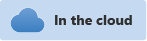

# Troubleshoot Azure Video Analyzer service

  
Alternatively, check out [troubleshoot on the edge](../edge/troubleshoot.md).

---

[!INCLUDE [deprecation notice](../includes/deprecation-notice.md)]

This article covers troubleshooting steps for common error scenarios you might see while using the service.

## Enable diagnostics

[Monitoring and logging](./monitor-log-cloud.md) should help in understanding the Video Analyzer service events taxonomy and how to generate logs that will help with debugging issues.
- On Azure portal, navigate to **Monitoring** section of your Video Analyzer account and select **Diagnostic settings**. 
- Click on **Add diagnostic setting** to enable the logs of desired event types: `Diagnostics`, `Audit`, `Operational`. For more details, refer [here](./monitor-log-cloud.md)


## View diagnostics

Once you have enabled diagnostics, you can access the logs as follows:

> [!TIP]
> Recommend that at least one live pipeline be activated to emit events. 

- In the portal, locate the storage account to which logs were written to
- Open the management blade for that storage account
- Navigate to storage explorer -> then expand your storage account and you will see a Blob container "insights-logs-category". This blob will have logs in JSON file format. You can download these logs to investigate the issue

## View metrics 

Video analyzer also emits metrics for ingestion & pipelines, which can help in identifying issues as follows.
- IngressBytes - The total number of bytes received by a pipeline. A steadily increasing value indicates the pipeline is healthy, and is receiving video data from the RTSP camera
- Pipelines - Helps with checking pipeline status and counts.

## View activity logs

An **activity log** is generated automatically and can be accessed by navigating to 'Activity log' section of Video Analyzer account management blade on Azure portal. You can see the history of ARM API calls made to your account, and relevant details.

## Common error scenarios

Some of the common errors that you'll encounter with the Video Analyzer service are described below.

### Unable to play video after activating live pipeline

- If you are using the Video Analyzer widget to play the video, try using the Azure portal if you have access to it. If the video plays in the Azure portal, but not in the widget, then you should proceed to check the widget section [below](#playback-error-with-the-widget)

- If the video is not playing back in the Azure portal, check if the Video Analyzer service is receiving video data from the RTSP camera. Select the "Ingress Bytes" metric by navigating to Monitoring->Metrics section of the portal. If the aggregation is increasing, then the connection between the RTSP camera and the service is healthy, Ingress Bytes sum would be available below the graph. 

- If the service is not receiving video data from the RTSP camera, the next step is to [view the relevant diagnostic logs](#view-diagnostics). You are likely to see an error such as a [ProtocolError](#diagnostic-logs-have-a-protocolerror-with-code-401), and you can troubleshoot further as discussed below.

### Diagnostic logs have a ProtocolError with code 401

- If you see Microsoft.VideoAnalyzer.Diagnostics.ProtocolError in diagnostics logs, with a code set to 401 as follows, then the first step is to recheck the RTSP credentials. Sample event you would find is as below:

   ```
   {
       "time": "2021-10-15T02:56:18.7890000Z",
       "resourceId": "/SUBSCRIPTIONS/{GUID}/RESOURCEGROUPS/8AVA/PROVIDERS/MICROSOFT.MEDIA/VIDEOANALYZERS/AVASAMPLEZ2OHI3VBIRQPC",
       "region": "westcentralus",
       "category": "Diagnostics",
       "operationName": "Microsoft.VideoAnalyzer.Diagnostics.ProtocolError",
       "operationVersion": "1.0",
       "level": "Error",
       "traceContext": "{\n  \"traceId\": \"f728d155-b4fd-4aec-8307-bbe2a324f4c3\"\n}",
       "properties": {
           "subject": "/livePipelines/your-pipeline/sources/rtspSource",
           "body": {
               "code": "401",
               "target": "rtsp://127.0.0.1:33643/some-path",
               "protocol": "rtsp"
           }
       }
   }

   ```

- If you are using a live pipeline to connect to a camera that is accessible over the internet, then check RTSP URL, username and password that were used when creating the live pipeline. You can call GET on the live pipeline to view the URL and username, but the password will not be echoed back. You should check the code that was used to create the live pipeline.

- If you are using a [remote device adapter](./use-remote-device-adapter.md), then try the following steps.

   - Verify that your [IoT hub is attached to your Video Analyzer account](../create-video-analyzer-account.md#post-deployment-steps). It is required for using a remote device adapter.
   - Run `remoteDeviceAdapterList` direct method on the edge module and verify IP address. Sample request and response are shown [here](../edge/direct-methods.md)
   - Examine the response for the remote device adapter that you are using in the live pipeline that is experiencing the issue, and compare with the example in [this article](use-remote-device-adapter.md). Check that the IP address of the camera is correct
   - Go to Azure portal->Video Analyzer account -> Live -> Pipelines -> Edit live pipeline -> reenter the RTSP user name and password. Check that the RTSP URL you provide begins with `rtsp://localhost:554/…`. Here, the use of `localhost` is required.

- If the above steps do not help resolve the issue and video playback still does not work, then log into the Azure portal and open a support ticket. You may need to attach the logs from the Video Analyzer edge module, refer the 'Use support-bundle command' section of [edge troubleshooting doc](../edge/troubleshoot.md#common-error-resolutions)

### Unable to record to a video resource

With Video Analyzer, you should use a distinct video resource when recording from a distinct RTSP camera. You would also need to switch to a new video resource if you change the camera settings (for example its resolution). Some of the sample pipeline topologies have hard-coded names for the video resource in the video sink node properties. If you use these topologies directly with different cameras, you will encounter this issue. Modify the `videoName` property in the video sink node to ensure uniqueness.

### Interrupted recording or playback

When you create a live pipeline, you are required to specify the maximum bitrate (`bitrateKbps`) at which the RTSP camera would send video to the service.
If the camera exceeds that limit, then the Video Analyzer service will disconnect from the camera briefly. It can re-attempt to connect to the camera in case there was a temporary spike in the bitrate. You can identify this situation by looking for  Microsoft.VideoAnalyzer.Diagnostics.RtspIngestionSessionEnded event in the diagnostic logs, with a `SourceBitrateExceeded` error code.
To resolve this, either reduce the bitrate setting on the camera, or increase the `bitrateKbps` value of the live pipeline to match the camera setting.

### Playback error with the widget

If you get an 'Access Forbidden' error in the Video Analyzer widget, then you should see a warning event in the Audit log.

- Make sure you have generated the Client API JWT Token and corresponding access policy, refer to the documentation for [creating-a-token](../access-policies.md) and [creating-an-access-policy](../access-policies.md#creating-an-access-policy). The player will not work if the access policy has not been set up correctly, and the JWT token does not match with the policy. 
- If issue is not resolved, gather the widget logs, and file a support ticket using Azure portal
- Gathering widget logs:
    - Hit F12 to enable Browser Developer tools, go to the Console TAB, enable "All levels" logging.   
    - From the Settings Icon , select Preferences --> Console --> Show timestamps. Save the logs.

## Collect logs for submitting a support ticket
   
When self-guided troubleshooting steps doesnt resolve your problem and there are more issues that you may need help with, please open a support ticket using the Azure portal with the relevant details about the issue & attach the [diagnostic](#view-diagnostics) JSON log files downloaded from your storage account. You can also reach out to us by sending an email at videoanalyzerhelp@microsoft.com.
   
> [!WARNING]
> The logs may contain personally identifiable information (PII) such as your IP address. All local copies of the logs will be deleted as soon as we complete examining them and close the support ticket.
   
## Next steps

[FAQ](./faq.yml)
