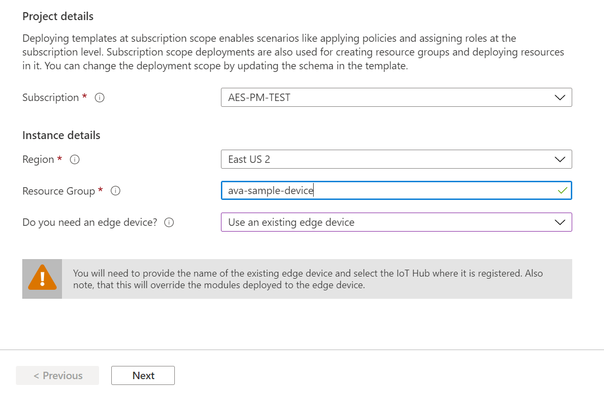

# Deploy Azure Video Analyzer on an IoT Edge device

This article lists the steps that will help you deploy Azure Video Analyzer on your IoT Edge device. You would do this, for example, if you have access to a local Linux machine.

> [!NOTE]
> Support for ARM64 devices is available in Azure Video Analyzer builds `1.0.0` and newer.
> Support for running Azure IoT Edge runtime on ARM64 devices is in [public preview](https://azure.microsoft.com/support/legal/preview-supplemental-terms/).

## Prerequisites

* An x86-64 or an ARM64 device running one of the [supported Linux operating systems](../../iot-edge/support.md#operating-systems)
* Azure subscription to which you have [owner privileges](../../role-based-access-control/built-in-roles.md#owner)
* [Create and setup IoT Hub](../../iot-hub/iot-hub-create-through-portal.md)
* [Register IoT Edge device](../../iot-edge/how-to-register-device.md)
* [Install the Azure IoT Edge runtime on Debian-based Linux systems](../../iot-edge/how-to-install-iot-edge.md)
* [Create an Azure Video Analyzer account](create-video-analyzer-account.md)


    * It is recommended that you use General-purpose v2 (GPv2) Storage accounts

## Configuring Azure resources and deploying edge modules for Azure Video Analyzer

Click the **Deploy to Azure** button

[](https://aka.ms/ava/click-to-deploy/form)

1. Select your **subscription**
2. Select your preferred **region**
3. Select the **resource group** that your edge device is in 
4. **Do you need an edge device?**, select ***Use an existing edge device*** from the drop-down menu
5. Click **Next**


1. Select the **Existing IoT Hub Name** that your edge device is connected to
1. Click **Next**


1. On the final page, click **Create**

It may take a few moments for the Azure resources to be created and the edge modules to be deployed.

## Create and use local user account for deployment
To run the Video Analyzer on IoT Edge module create a local user account with as few privileges as possible. As an example, run the following commands on your Linux machine:

```
sudo groupadd -g 1010 localedgegroup
sudo useradd --home-dir /home/localedgeuser --uid 1010 --gid 1010 localedgeuser
```

## Granting permissions to device storage

Now that you have created a local user account, 

* You will need a local folder to store the application configuration data. Create a folder and grant permissions to the localuser account write to that folder using the following commands:

```
sudo mkdir -p /var/lib/videoAnalyzer 
sudo chown -R localedgeuser:localedgegroup /var/lib/videoAnalyzer/
```

* You will also need a folder to [record videos to a local file](event-based-video-recording-concept.md#video-recording-based-on-events-from-other-sources). Use the following commands to create a local folder for the same:

```
sudo mkdir -p /var/media
sudo chown -R localedgeuser:localedgegroup /var/media/
```

### create folders to be used by the rtspsim module
```
sudo mkdir -p /home/localedgeuser/samples
sudo mkdir -p /home/localedgeuser/samples/input
```

The following commands will copy over the sample videos if you plan to follow our Quickstarts and tutorials. This is optional.

```
sudo curl https://lvamedia.blob.core.windows.net/public/camera-300s.mkv --output /home/localedgeuser/samples/input/camera-300s.mkv
sudo curl https://lvamedia.blob.core.windows.net/public/lots_284.mkv --output /home/localedgeuser/samples/input/lots_284.mkv
sudo curl https://lvamedia.blob.core.windows.net/public/lots_015.mkv --output /home/localedgeuser/samples/input/lots_015.mkv
sudo curl https://lvamedia.blob.core.windows.net/public/t2.mkv --output /home/localedgeuser/samples/input/t2.mkv
```

### Verify your deployment

After creating the deployment, return to the IoT Edge page of your IoT hub.

1. Select the IoT Edge device that you targeted with the deployment to open its details.
2. In the device details, verify that the modules are listed as both **Specified in deployment and Reported by device**.

It may take a few moments for the modules to be started on the device and then reported back to IoT Hub. Refresh the page to see an updated status.
Status code: 200 –OK means that [the IoT Edge runtime](../../iot-edge/iot-edge-runtime.md) is healthy and is operating fine.


#### Invoke a direct method

Next, lets test the sample by invoking a direct method. Read [direct methods for Azure Video Analyzer ](direct-methods.md) to understand all the direct methods provided by our avaEdge module.

1. Clicking on the edge module you created, will take you to its configuration page.  

    
1. Click on the Direct Method menu option.

    > [!NOTE] 
    > You will need to add a value in the Connection string sections as you can see on the current page. You do not need to hide or change anything in the **Setting name** section. It is ok to let it be public.

    
1. Next, Enter "pipelineTopologyList" in the Method Name box.
1. Next, copy and paste the below JSON payload in the payload box.
    
   ```
   {
       "@apiVersion": "1.0"
   }
   ```
1. Click on “Invoke Method” option on top of the page

    
1. You should see a status 200 message in the Result box

     

## Next steps

Try [Quickstart: Get started - Azure Video Analyzer](get-started-detect-motion-emit-events.md)

> [!TIP]
> If you proceed with the above quickstart, when invoking the direct methods using Visual Studio Code, you will use the device that was added to the IoT Hub via this article, instead of the default `avasample-iot-edge-device`.
