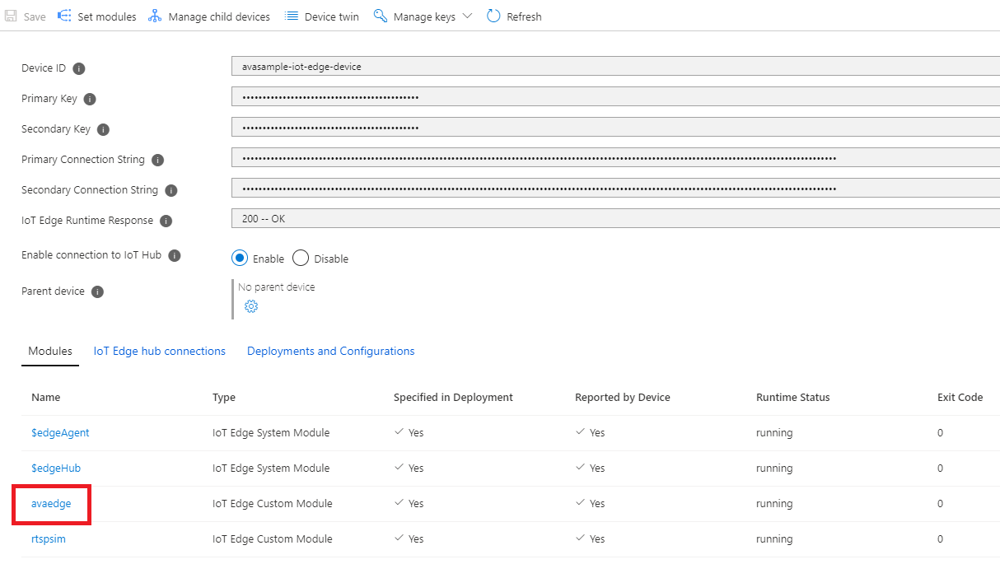
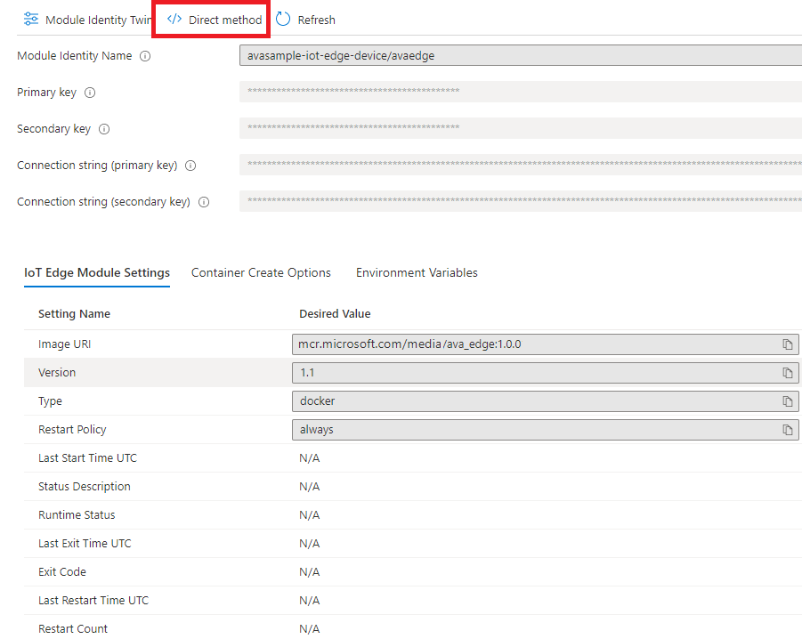

# Deploy Azure Video Analyzer on an IoT Edge device

This article lists the steps that will help you deploy Azure Video Analyzer on your IoT Edge device. You would do this, for example, if you have access to a local Linux machine.

> [!NOTE]
> Support for ARM64 devices is available in Azure Video Analyzer builds `1.0.0` and newer.
> Support for running Azure IoT Edge runtime on ARM64 devices is in [public preview](https://azure.microsoft.com/support/legal/preview-supplemental-terms/).

## Prerequisites

* An x86-64 or an ARM64 device running one of the [supported Linux operating systems](../../iot-edge/support.md#operating-systems)
* Azure subscription to which you have [owner privileges](../../role-based-access-control/built-in-roles.md#owner)
* [Create and setup IoT Hub](../../iot-hub/iot-hub-create-through-portal.md)
* [Register IoT Edge device](../../iot-edge/how-to-register-device.md)
* [Install the Azure IoT Edge runtime on Debian-based Linux systems](../../iot-edge/how-to-install-iot-edge.md)

    * Use one of these regions: East US 2, East US, Central US, North Central US, Japan East, West US, West US 2, West Central US, Canada East, UK South, France Central, France South, Switzerland North, Switzerland West, and Japan West.
    * It is recommended that you use General-purpose v2 (GPv2) Storage accounts

## Configuring Azure resources for using Azure Video Analyzer and deploying Azure Video Analyzer edge modules

[](https://aka.ms/ava/click-to-deploy/form)

#### Review deployment

The review section shows you the JSON deployment manifest that was created based on your selections in the previous two sections. There are also two modules declared that you didn't add: $edgeAgent and $edgeHub. These two modules make up the IoT Edge runtime and are required defaults in every deployment.

Review your deployment information, then select Create.

### Verify your deployment

After you create the deployment, you return to the IoT Edge page of your IoT hub.

1. Select the IoT Edge device that you targeted with the deployment to open its details.
2. In the device details, verify that the blob storage module is listed as both **Specified in deployment and Reported by device**.

It may take a few moments for the module to be started on the device and then reported back to IoT Hub. Refresh the page to see an updated status.
Status code: 200 –OK means that [the IoT Edge runtime](../../iot-edge/iot-edge-runtime.md) is healthy and is operating fine.


#### Invoke a direct method

Next, lets test the sample by invoking a direct method. Read [direct methods for Azure Video Analyzer ](direct-methods.md) to understand all the direct methods provided by our avaEdge module.

1. Clicking on the edge module you created, will take you to its configuration page.  

    
1. Click on the Direct Method menu option.

    > [!NOTE] 
    > You will need to add a value in the Connection string sections as you can see on the current page. You do not need to hide or change anything in the **Setting name** section. It is ok to let it be public.

    
1. Next, Enter "pipelineTopologyList" in the Method Name box.
1. Next, copy and paste the below JSON payload in the payload box.
    
```
{
     "@apiVersion": "1.0"
}
```
1. Click on “Invoke Method” option on top of the page

    
1. You should see a status 200 message in the Result box

     

## Next steps

Try [Quickstart: Get started - Azure Video Analyzer]()

> [!TIP]
> If you proceed with the above quickstart, when invoking the direct methods using Visual Studio Code, you will use the device that was added to the IoT Hub via this article, instead of the default `avasample-iot-edge-device`.
