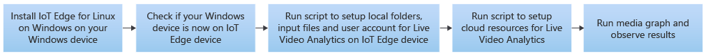
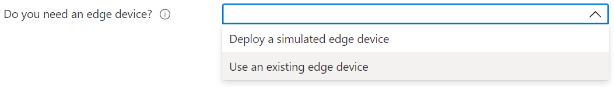
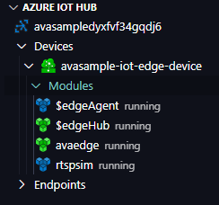

# Deploy to an IoT Edge for Linux on Windows (EFLOW) device

In this article, you'll learn how to deploy Azure Video Analyzer on an edge device that has [IoT Edge for Linux on Windows (EFLOW)](../../iot-edge/iot-edge-for-linux-on-windows.md). Once you have finished following the steps in this document, you will be able to run a [pipeline](pipeline.md) that detects motion in a video and emits such events to the IoT hub in the cloud. You can then switch out the pipeline for advanced scenarios and bring the power of Azure Video Analyzer to your Windows-based IoT Edge device.

## Prerequisites 

* An Azure account that has an active subscription. [Create an account for free](https://azure.microsoft.com/free/?WT.mc_id=A261C142F) if you don't already have one.

* [Visual Studio Code](https://code.visualstudio.com/) on your development machine. Make sure you have the [Azure IoT Tools extension](https://marketplace.visualstudio.com/items?itemName=vsciot-vscode.azure-iot-tools).
* Read [What is EFLOW](../../iot-edge/iot-edge-for-linux-on-windows.md).

## Deployment steps

The following depicts the overall flow of the document and in 5 simple steps you should be all set up to run Azure Video Analyzer on a Windows device  that has EFLOW:

1. [Install EFLOW](../../iot-edge/how-to-install-iot-edge-on-windows.md) on your Windows device. 

    1. If you are using your Windows PC, then on the [Windows Admin Center](/windows-server/manage/windows-admin-center/overview) start page, under the list of connections, you will see a local host connection representing the PC where you running Windows Admin Center. 
    1. Any additional servers, PCs, or clusters that you manage will also show up here.
    1. You can use Windows Admin Center to install and manage Azure EFLOW on either your local device or remote managed devices. In this guide, the local host connection served as the target device for the deployment of Azure IoT Edge for Linux on Windows. Hence you see the localhost also listed as an IoT Edge device.

     
1. Click on the IoT Edge device to connect to it and you should see an Overview and Command Shell tab. The command shell tab is where you can issue commands to your edge device.

    
1. Go to the command shell and type in the following command:

    `bash -c "$(curl -sL https://aka.ms/ava-edge/prep_device)"`

    Azure Video Analyzer module runs on the edge device with non-privileged local user accounts. Additionally, it needs certain local folders for storing application configuration data. Finally, for this how-to guide we are leveraging a [RTSP simulator](https://github.com/Azure/video-analyzer/tree/main/edge-modules/sources/rtspsim-live555) that relays a video feed in real time to AVA module for analysis. This simulator takes as input pre-recorded video files from an input directory. 

    The prep-device script used above automates these tasks away, so you can run one command and have all relevant input and configuration folders, video input files, and user accounts with privileges created seamlessly. Once the command finishes successfully, you should see the following folders created on your edge device. 

    * `/home/localedgeuser/samples`
    * `/home/localedgeuser/samples/input`
    * `/var/lib/videoanalyzer`
    * `/var/media`

    Note the video files (*.mkv) in the /home/localedgeuser/samples/input folder, which serve as input files to be analyzed. 
1. Now that you have the edge device set up, registered to the hub and running successfully with the correct folder structures created, the next step is to set up the following additional Azure resources and deploy the AVA module. 

    * Storage account
    * Azure Media Services account

    

    In the template, when asked if you need an edge device, choose the "Use and existing edge device" option since you created both the device and the IoT Hub earlier. You will also be prompted for your IoT Hub name and IoT Edge device ID in the subsequent steps.  
    
     

    Once finished, you can log back onto the IoT Edge device command shell and run the following command.

    **`sudo iotedge list`**

    You should see the following four modules deployed and running on your edge device. Please note that the resource creation script deploys the AVA module along with IoT Edge modules (edgeAgent and edgeHub) and an RTSP simulator module to provide the simulated RTSP video feed.
    
    
1. With the modules deployed and set up, you are ready to run your first AVA pipeline on EFLOW. You can run a simple motion detection pipeline as below and visualize the results by executing the following steps:

    

    1. [Configure](get-started-detect-motion-emit-events.md#prepare-to-monitor-the-modules) the Azure IoT Tools extension.
    1. Set the pipelineTopology, instantiate a livePipeline and activate it via these [direct method calls](get-started-detect-motion-emit-events.md#use-direct-method-calls).
    1. [Observe the results](get-started-detect-motion-emit-events.md#observe-results) on the Hub.
    1. Invoke [clean up methods](get-started-detect-motion-emit-events.md#deactivate-the-live-pipeline).
    1. Delete your resources if not needed further.

        > [!IMPORTANT]
        > Undeleted resources can still be active and incur Azure costs. Please ensure that you delete the resources you do not intend to use.
        
## Next steps

* Try motion detection along with recording relevant videos in the cloud. Follow the steps from the [detect motion and record video clips](detect-motion-record-video-edge-devices.md) quickstart.
* Run [AI on Live Video](analyze-live-video-use-your-model-http.md#overview) (you can skip the prerequisite setup as it has already been done above)
* Use our [VS Code extension](https://marketplace.visualstudio.com/items?itemName=ms-azuretools.live-video-analytics-edge) to view additional pipelines.
* Use an [IP camera](https://en.wikipedia.org/wiki/IP_camera)  that supports RTSP instead of using the RTSP simulator. You can find IP cameras that support RTSP on the [ONVIF conformant products](https://www.onvif.org/conformant-products/) page. Look for devices that conform with profiles G, S, or T.
