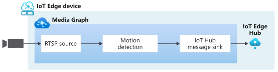

# Quickstart: Detect motion and emit events

This quickstart walks you through the steps to get started with Azure Video Analyzer on IoT Edge. It uses an Azure VM as an IoT Edge device and a simulated live video stream. After completing the setup steps, you'll be able to run a simulated live video stream through a video pipeline that detects and reports any motion in that stream. The following diagram shows a graphical representation of that pipeline.

 

::: zone pivot="programming-language-csharp"
[!INCLUDE [header](includes/detect-motion-emit-events-quickstart/csharp/header.md)]
::: zone-end

::: zone pivot="programming-language-python"
[!INCLUDE [header](includes/detect-motion-emit-events-quickstart/python/header.md)]
::: zone-end

## Prerequisites

::: zone pivot="programming-language-csharp"
[!INCLUDE [prerequisites](includes/detect-motion-emit-events-quickstart/csharp/prerequisites.md)]
::: zone-end

::: zone pivot="programming-language-python"
[!INCLUDE [prerequisites](includes/detect-motion-emit-events-quickstart/python/prerequisites.md)]
::: zone-end

## Review the sample video

::: zone pivot="programming-language-csharp"
[!INCLUDE [review-sample-video](includes/detect-motion-emit-events-quickstart/csharp/review-sample-video.md)]
::: zone-end

::: zone pivot="programming-language-python"
[!INCLUDE [review-sample-video](includes/detect-motion-emit-events-quickstart/python/review-sample-video.md)]
::: zone-end

## Set up Azure resources

::: zone pivot="programming-language-csharp"
[!INCLUDE [setup-azure-resources](includes/detect-motion-emit-events-quickstart/csharp/setup-azure-resources.md)]
::: zone-end

::: zone pivot="programming-language-python"
[!INCLUDE [setup-azure-resources](includes/detect-motion-emit-events-quickstart/python/setup-azure-resources.md)]
::: zone-end

## Set up your development environment

::: zone pivot="programming-language-csharp"
[!INCLUDE [setup-development-environment](includes/detect-motion-emit-events-quickstart/csharp/setup-development-environment.md)]
::: zone-end

::: zone pivot="programming-language-python"
[!INCLUDE [setup-development-environment](includes/detect-motion-emit-events-quickstart/python/setup-development-environment.md)]
::: zone-end

## Examine the sample files

::: zone pivot="programming-language-csharp"
[!INCLUDE [examine-sample-files](includes/detect-motion-emit-events-quickstart/csharp/examine-sample-files.md)]
::: zone-end

::: zone pivot="programming-language-python"
[!INCLUDE [examine-sample-files](includes/detect-motion-emit-events-quickstart/python/examine-sample-files.md)]
::: zone-end

## Generate and deploy the deployment manifest

::: zone pivot="programming-language-csharp"
[!INCLUDE [generate-deploy-deployment-manifest](includes/detect-motion-emit-events-quickstart/csharp/generate-deploy-deployment-manifest.md)]
::: zone-end

::: zone pivot="programming-language-python"
[!INCLUDE [generate-deploy-deployment-manifest](includes/detect-motion-emit-events-quickstart/python/generate-deploy-deployment-manifest.md)]
::: zone-end

## Prepare to monitor events

::: zone pivot="programming-language-csharp"
[!INCLUDE [prepare-monitor-events](includes/detect-motion-emit-events-quickstart/csharp/prepare-monitor-events.md)]
::: zone-end

::: zone pivot="programming-language-python"
[!INCLUDE [prepare-monitor-events](includes/detect-motion-emit-events-quickstart/python/prepare-monitor-events.md)]
::: zone-end

## Run the sample program

::: zone pivot="programming-language-csharp"
[!INCLUDE [run-sample-program](includes/detect-motion-emit-events-quickstart/csharp/run-sample-program.md)]
::: zone-end

::: zone pivot="programming-language-python"
[!INCLUDE [run-sample-program](includes/detect-motion-emit-events-quickstart/python/run-sample-program.md)]
::: zone-end

## Interpret results

::: zone pivot="programming-language-csharp"
[!INCLUDE [interpret-results](includes/detect-motion-emit-events-quickstart/csharp/interpret-results.md)]
::: zone-end

::: zone pivot="programming-language-python"
[!INCLUDE [interpret-results](includes/detect-motion-emit-events-quickstart/python/interpret-results.md)]
::: zone-end

## Clean up resources

If you intend to try the other quickstarts, then you should keep the resources you created. Otherwise, in the Azure portal, go to your resource groups, select the resource group where you ran this quickstart, and then delete all of the resources.

## Next steps

Run the other quickstarts, such as detecting an object in a live video feed.

<!-- TODO -->      

