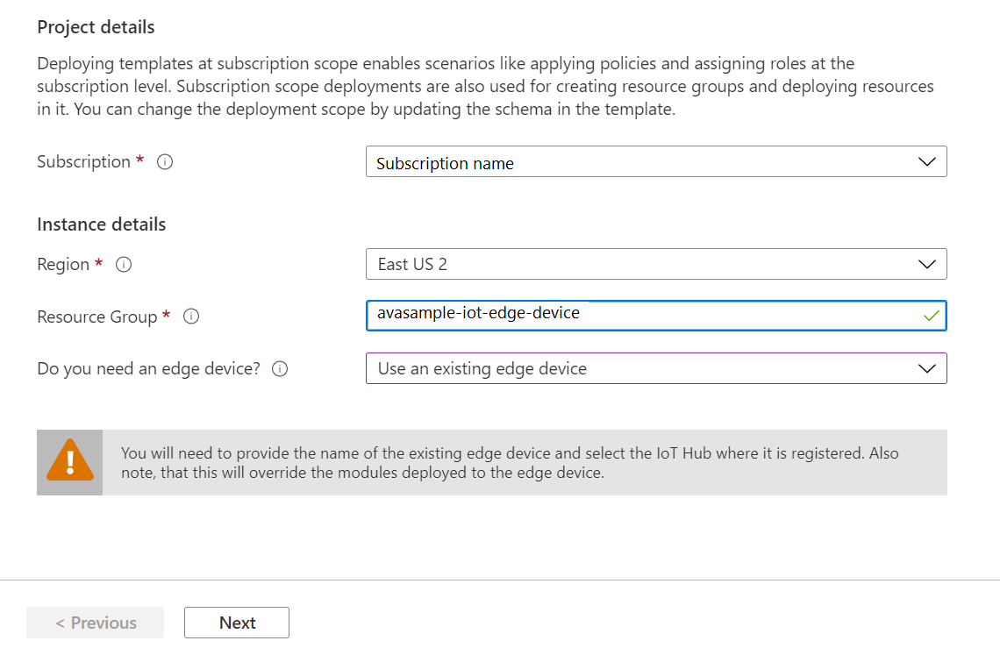
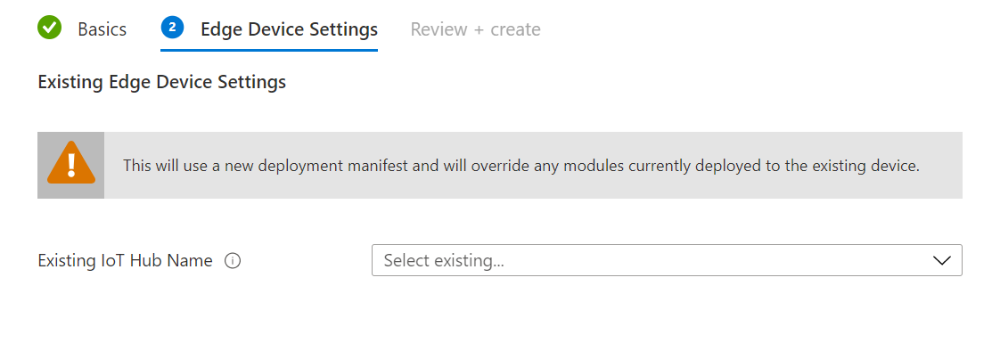
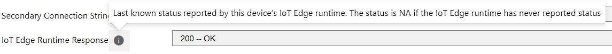
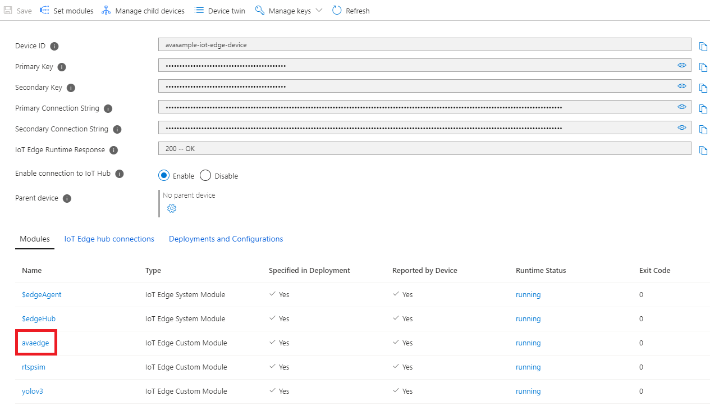
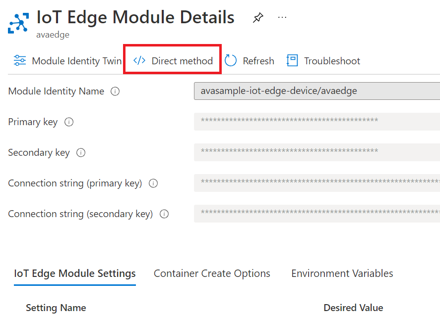
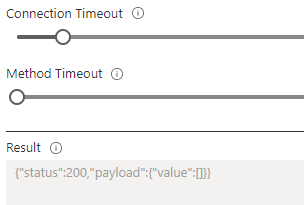

# Deploy Azure Video Analyzer to an IoT Edge device

[!INCLUDE [header](includes/edge-env.md)]

[!INCLUDE [deprecation notice](../includes/deprecation-notice.md)]

This article describes how you can deploy the Azure Video Analyzer edge module on an IoT Edge device which has no other modules previously installed. When you finish the steps in this article you will have a Video Analyzer account created and the Video Analyzer module deployed to your IoT Edge device, along with a module that simulates an RTSP-capable IP camera. The process is intended for use with the quickstarts and tutorials for Video Analyzer. You should review the [production readiness and best practices](production-readiness.md) article if you intend to deploy the Video Analyzer module for use in production.

> [!NOTE]
> The process outlined in this article will uninstall edge modules, if any, that are installed on your IoT Edge device.

## Prerequisites

* An x86-64 or an ARM64 device running one of the [supported Linux operating systems](../../../iot-edge/support.md#operating-systems)
* An Azure account that has an active subscription
* [Create and setup IoT Hub](../../../iot-hub/iot-hub-create-through-portal.md)
* [Register IoT Edge device](../../../iot-edge/how-to-register-device.md)
* [Install the Azure IoT Edge runtime on Debian-based Linux systems](../../../iot-edge/how-to-install-iot-edge.md)


## Create resources on IoT Edge device

Azure Video Analyzer module should be configured to run on the IoT Edge device with a non-privileged local user account. The module needs certain local folders for storing application configuration data. For this how-to guide we are leveraging a [RTSP simulator](https://github.com/Azure/video-analyzer/tree/main/edge-modules/sources/rtspsim-live555) that relays a video feed in real time to AVA module for analysis. This simulator takes as input pre-recorded video files from an input directory. The following script will prepare your device to be able to be used with our quickstarts and tutorials.

https://aka.ms/ava/prepare-device

`bash -c "$(curl -sL https://aka.ms/ava-edge/prep_device)"`

The prep-device script used above automates the task of creating input and configuration folders, downloading video input files, and creating user accounts with correct privileges. Once the command finishes successfully, you should see the following folders created on your edge device. 

* `/home/localedgeuser/samples`
* `/home/localedgeuser/samples/input`
* `/var/lib/videoanalyzer`
* `/var/media`

    Note the video files ("*.mkv") in the /home/localedgeuser/samples/input folder, which are used to simulate live video. 

## Creating Azure resources and deploying edge modules
The next step is to create the required Azure resources (Video Analyzer account, storage account, user-assigned managed identity), registering a Video Analyzer edge module with the Video Analyzer account, and deploying the Video Analyzer edge module and the RTSP simulator module to the IoT Edge device.

Click the **Deploy to Azure** button

> [!WARNING]
> Do not use this with IoT Edge devices that already have edge modules installed, such as a Percept DK. Also not supported with Azure Stack Edge.

[](https://aka.ms/ava/click-to-deploy/form)

1. Select your **subscription**
2. Select your preferred **region**
3. Select the **resource group** to which your IoT Hub and IoT Edge device belong
4. In the dropdown menu for **Do you need an edge device?**, select the ***Use an existing edge device*** option
5. Click **Next**


1. Select the **Existing IoT Hub Name** that your IoT Edge device is connected to
1. Click **Next**


1. On the final page, click **Create**

It may take a few moments for the Azure resources to be created and the edge modules to be deployed.

### Verify your deployment

After creating the deployment, in the Azure portal navigate to the IoT Edge device page of your IoT hub.

1. Select the IoT Edge device that you targeted with the deployment to open its details.
2. In the device details, verify that the modules are listed as both **Specified in deployment and Reported by device**.

It may take a few moments for the modules to be started on the device and then reported back to IoT Hub. Refresh the page to see an updated status.
Status code: 200 –OK means that [the IoT Edge runtime](../../../iot-edge/iot-edge-runtime.md) is healthy and is operating fine.



#### Invoke a direct method

Next, lets test the sample by invoking a direct method. Read [direct methods for Azure Video Analyzer ](direct-methods.md) to understand all the direct methods provided by our avaEdge module.

1. Clicking on the edge module you created, will take you to its configuration page.  

    
1. Click on the **Direct Method** menu option.

    > [!NOTE] 
    > You will need to add a value in the Connection string sections as you can see on the current page. You do not need to hide or change anything in the **Setting name** section. It is ok to let it be public.

    
1. Next, Enter "pipelineTopologyList" in the `Method Name` box.
1. Next, copy and paste the below JSON payload in the payload box.
    
   ```
   {
       "@apiVersion": "1.1"
   }
   ```
1. Click on **Invoke Method** option on top of the page
1. You should see a status 200 message in the `Result` box

     

## Next steps

Try [Quickstart: Get started - Azure Video Analyzer](get-started-detect-motion-emit-events.md)

> [!TIP]
> If you proceed with the above quickstart, when invoking the direct methods using Visual Studio Code, you will use the device that was added to the IoT Hub via this article, instead of the default `avasample-iot-edge-device`.
