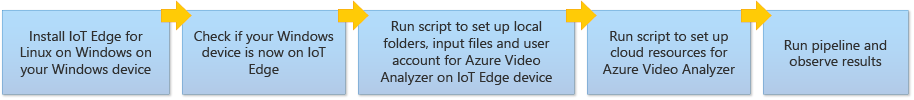
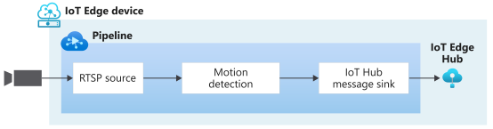

# Deploy Azure Video Analyzer to a Windows device using EFLOW

[!INCLUDE [header](includes/edge-env.md)]

[!INCLUDE [deprecation notice](../includes/deprecation-notice.md)]

In this article, you'll learn how to deploy Azure Video Analyzer on an edge device that has [IoT Edge for Linux on Windows (EFLOW)](../../../iot-edge/iot-edge-for-linux-on-windows.md). Once you have finished following the steps in this document, you will be able to run a [pipeline](../pipeline.md) that detects motion in a video and emits such events to the IoT Hub. You can then switch out the pipeline for advanced scenarios and bring the power of Azure Video Analyzer to your Windows-based IoT Edge device.

## Prerequisites 

* An Azure account that has an active subscription. [Create an account for free](https://azure.microsoft.com/free/?WT.mc_id=A261C142F) if you don't already have one.

* [Visual Studio Code](https://code.visualstudio.com/) on your development machine. Make sure you have the [Azure IoT Tools extension](https://marketplace.visualstudio.com/items?itemName=vsciot-vscode.azure-iot-tools).
* Read [What is EFLOW](../../../iot-edge/iot-edge-for-linux-on-windows.md).

## Deployment steps

The following depicts the overall flow of the document and in 5 simple steps you should be all set up to run Azure Video Analyzer on a Windows device  that has EFLOW:

1. [Install EFLOW](../../../iot-edge/how-to-install-iot-edge-on-windows.md) on your Windows device using PowerShell.

    > [!NOTE]
    > There are two ways to deploy EFLOW (PowerShell and Windows Admin Center) and two ways to provision the virtual machine (manual provisioning using the connection string and manual provisioning using X.509 certificates). Please follow the [PowerShell deployment](../../../iot-edge/how-to-install-iot-edge-on-windows.md#create-a-new-deployment) and [provision the machine using the connection string from the IoT Hub](../../../iot-edge/how-to-install-iot-edge-on-windows.md#manual-provisioning-using-the-connection-string).

1. Once EFLOW is set up, type the command `Connect-EflowVm` into PowerShell (with administrative privilege) to connect. This will bring up a bash terminal within PowerShell to control the EFLOW VM, where you can run Linux commands including utilities like Top and Nano. 

    > [!TIP] 
    > To exit the EFLOW VM, type `exit` within the terminal.

1. Log into the EFLOW VM via PowerShell and type in the following commands:

    `bash -c "$(curl -sL https://aka.ms/ava-edge/prep_device)"`
    
    `sudo iptables -I INPUT -p udp -j ACCEPT`

    Video Analyzer needs certain local folders for storing application configuration data. For this how-to guide we are leveraging a [RTSP simulator](https://github.com/Azure/video-analyzer/tree/main/edge-modules/sources/rtspsim-live555) that relays a video feed in real time to the Video Analyzer module for analysis. This simulator takes as input pre-recorded video files from an input directory. 

    The prep-device script used above automates these tasks away, so you can run one command and have all relevant input and configuration folders, video input files, and user accounts with privileges created seamlessly. Once the command finishes successfully, you should see the following folders created on your edge device. 

    * `/home/localedgeuser/samples`
    * `/home/localedgeuser/samples/input`
    * `/var/lib/videoanalyzer`
    * `/var/media`

    Note the video files (*.mkv) in the /home/localedgeuser/samples/input folder, which serve as input files to be analyzed. 
    
1. Now that you have the edge device set up, registered to the hub, and running successfully with the correct folder structures created, the next step is to set up the following additional Azure resources and deploy the Video Analyzer module. The following deployment template will take care of the resource creation:

    
    
    The deployment process will take about 20 minutes. Upon completion, you will have certain Azure resources deployed in the Azure subscription, including:

    * Video Analyzer account - This cloud service is used to register the Video Analyzer edge module, and for playing back recorded video and video analytics.
    * Storage account - For storing recorded video and video analytics.
    * Managed Identity - This is the user assigned managed identity used to manage access to the above storage account.
    * IoT Hub - This acts as a central message hub for bi-directional communication between your IoT application, IoT Edge modules and the devices it manages.

    In the template, when asked if you need an edge device, choose the "Use and existing edge device" option since you created both the device and the IoT Hub earlier. You will also be prompted for your IoT Hub name and IoT Edge device ID in the subsequent steps.  
    
     

    Once finished, you can log back onto the EFLOW VM and run the following command.

    **`sudo iotedge list`**

    You should see the following four modules deployed and running on your edge device. Please note that the resource creation script deploys the AVA module along with IoT Edge modules (edgeAgent and edgeHub) and an RTSP simulator module to provide the simulated RTSP video feed.
    
    
    
1. With the modules deployed and set up, you are ready to run your first AVA pipeline on EFLOW. You can run a simple motion detection pipeline as below and visualize the results by executing the following steps:

    

    1. [Configure](get-started-detect-motion-emit-events.md#prepare-to-monitor-the-modules) the Azure IoT Tools extension.
    1. Set the pipelineTopology, instantiate a livePipeline and activate it via these [direct method calls](get-started-detect-motion-emit-events.md#use-direct-method-calls).
    1. [Observe the results](get-started-detect-motion-emit-events.md#observe-results) on the Hub.
    1. Invoke [clean up methods](get-started-detect-motion-emit-events.md#deactivate-the-live-pipeline).
    1. Delete your resources if not needed further.

        > [!IMPORTANT]
        > Undeleted resources can still be active and incur Azure costs. Please ensure that you delete the resources you do not intend to use.
   
## Next steps

* Try motion detection along with recording relevant videos in the Cloud. Follow the steps from the [detect motion and record video clips](detect-motion-record-video-edge-devices.md) quickstart.
* Use our [VS Code extension](https://marketplace.visualstudio.com/vscode) to view additional pipelines.
* Use an [IP camera](https://en.wikipedia.org/wiki/IP_camera)  that supports RTSP instead of using the RTSP simulator. You can find IP cameras that support RTSP on the [ONVIF conformant products](https://www.onvif.org/conformant-products/) page. Look for devices that conform with profiles G, S, or T.
* Run [AI on Live Video](analyze-live-video-use-your-model-http.md#overview) (you can skip the prerequisite setup as it has already been done above).

    > [!WARNING] 
    > For advanced users who wish to run memory-intensive AI models like YOLO, you may have to increase the resources allotted to the EFLOW VM. First, exit the EFLOW VM and return to the Windows PowerShell terminal by typing `exit`. Then, run the command `Set-EflowVM` on PowerShell with elevated privilege. After running the command, input your desired [parameters](../../../iot-edge/reference-iot-edge-for-linux-on-windows-functions.md#set-eflowvm) by following the prompts in PowerShell, for example `cpuCount: 2`, `memoryInMB: 2048`. After a few minutes, redeploy the Edge module(s) and reactivate the live pipeline to view inferences. If you are encountering connection issues (e.g., error 137 or 255 listed on IoT Hub), you may have to rerun this step. 
