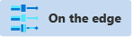
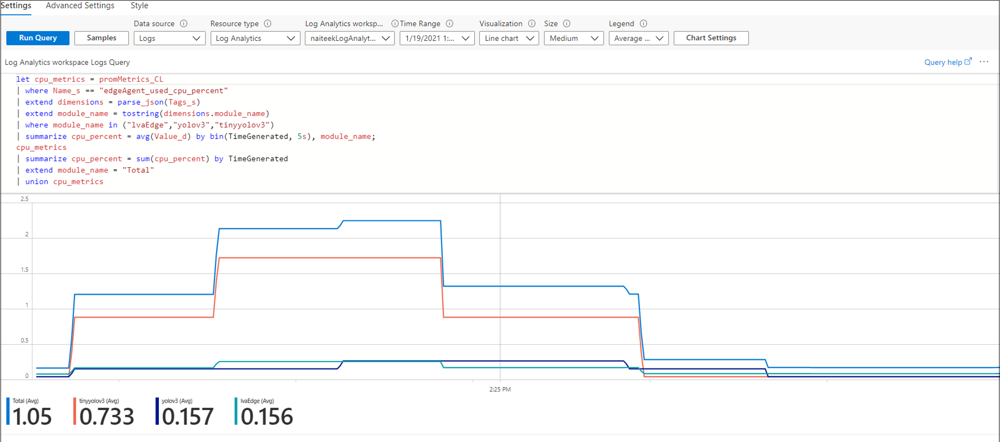
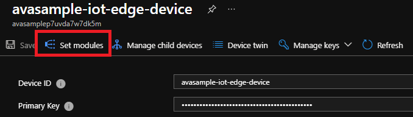

# Monitor and log on IoT Edge

  
Alternatively, check out [monitor and log in the service](../cloud/monitor-log-cloud.md).

---

[!INCLUDE [deprecation notice](../includes/deprecation-notice.md)]

In this article, you'll learn how to receive events for remote monitoring from the Azure Video Analyzer IoT Edge module. 

You'll also learn how to control the logs that the module generates.

## Taxonomy of events

Video Analyzer built on top of IoT Edge emits events, or telemetry data, according to the following taxonomy:

> [!div class="mx-imgBorder"]
> :::image type="content" source="./media/telemetry-schema/taxonomy.png" alt-text="Diagram that shows the taxonomy of events.":::

* Operational: Events generated by the actions of a user or during the execution of a [pipeline](../pipeline.md)
  
   * Volume: Expected to be low (a few times a minute, or even less)
   * Examples:

      - Live pipeline activated
      
      - Live pipeline deactivated
      
      *Sample operational event*
      
      ```json
      {
         "body": {
             "outputType": "filePath",
             "outputLocation": "/var/media/Sample-1-fileSink/sampleFilesFromEVR-motion-fileSinkOutput-20210426T181911Z.mp4"
           },
           "properties": {
             "topic": "/subscriptions/XXXXXXXX-XXXX-XXXX-XXXX-XXXXXXXXXXXX/resourceGroups/<my-resource-group>/providers/Microsoft.Media/videoAnalyzers/<account-name>",
             "subject": "/edgeModules/avaedge/livePipelines/Sample-Pipeline-1/sinks/fileSink",
             "eventType": "Microsoft.VideoAnalyzer.Operational.RecordingStarted",
             "eventTime": "2021-04-26T18:19:13.298Z",
             "dataVersion": "1.0"
          },
      }
      ```
* Diagnostics: Events that help to diagnose problems with performance

   * Volume: Can be high (several times a minute)
   * Examples:
   
      - RTSP [SDP](https://en.wikipedia.org/wiki/Session_Description_Protocol) information (shown in the following example)       
      - Errors for when a connection to something like a camera or AI extension fails
      
    *Sample diagnostic event*
  
    ```json
    {
      "body": {
        "sdp": "SDP:\nv=0\r\no=- 1589326384077235 1 IN IP4 XXX.XX.XX.XXX\r\ns=Matroska video+audio+(optional)subtitles, streamed by the LIVE555 Media Server\r\ni=media/lots_015.mkv\r\nt=0 0\r\na=tool:LIVE555 Streaming Media v2020.04.12\r\na=type:broadcast\r\na=control:*\r\na=range:npt=0-73.000\r\na=x-qt-text-nam:Matroska video+audio+(optional)subtitles, streamed by the LIVE555 Media Server\r\na=x-qt-text-inf:media/lots_015.mkv\r\nm=video 0 RTP/AVP 96\r\nc=IN IP4 0.0.0.0\r\nb=AS:500\r\na=rtpmap:96 H264/90000\r\na=fmtp:96 packetization-mode=1;profile-level-id=640028;sprop-parameter-sets=XXXXXXXXXXXXXXXXXXXXXXXXXXXXXXXXXXX\r\na=control:track1\r\n"
      },
      "applicationProperties": {
        "topic": "/subscriptions/XXXXXXXX-XXXX-XXXX-XXXX-XXXXXXXXXXXX/resourceGroups/<my-resource-group>/providers/Microsoft.Media/videoAnalyzers/<account-name>",
        "subject": "/edgeModules/avaedge/livePipelines/Sample-Pipeline-1/sources/rtspSource",
        "eventType": "Microsoft.VideoAnalyzer.Diagnostics.MediaSessionEstablished",
        "eventTime": "2021-04-26T18:15:13.298Z",
        "dataVersion": "1.0"
      }
    }
    ```
* Analytic:  Events generated as a result of video analysis

   * Volume: Can be high (several times a minute or more)
   * Examples:
     
      - Motion detected (shown in the following example) 
      
      - Inference result
     
      *Sample analytic event*
        
      ```json
      {
        "body": {
          "timestamp": 143039375044290,
          "inferences": [
            {
              "type": "motion",
              "motion": {
                "box": {
                  "l": 0.48954,
                  "t": 0.140741,
                  "w": 0.075,
                  "h": 0.058824
                }
              }
            }
          ]
        },
        "applicationProperties": {
          "topic": "/subscriptions/XXXXXXXX-XXXX-XXXX-XXXX-XXXXXXXXXXXX/resourceGroups/<my-resource-group>/providers/Microsoft.Media/videoAnalyzers/<account-name>",
          "subject": "/edgeModules/avaedge/livePipelines/Sample-Pipeline-1/processors/md",
          "eventType": "Microsoft.VideoAnalyzer.Analytics.Inference",
          "eventTime": "2021-04-26T18:15:13.298Z",
          "dataVersion": "1.0"
        }
      }
      ```
        
The events emitted by the module are sent to the [IoT Edge hub](../../../iot-edge/iot-edge-runtime.md#iot-edge-hub). From there, they can be routed to other destinations. 

### Events and video playback

As indicated above, events generated as part of video analysis have an `eventTime` associated with them. If you [recorded the live video](../video-recording.md) as part of your pipeline topology, these help you locate where in the recorded video the particular event occurred. You can load the video recording in the [Video Analyzer player widget](../player-widget.md), and use its controls to seek to the date and time of interest. If your pipeline involved the use of an AI model to generate inference results, then you should be recording the inference data along with the video. This will enable you to play back the inference metadata along with the video as shown in this [tutorial](record-stream-inference-data-with-video.md).


## Routing events

You can use the following module twin properties to route the operational and diagnostic events published by the Video Analyzer module. These properties are documented in the [module twin JSON schema](module-twin-configuration-schema.md).

- `diagnosticsEventsOutputName`: To get diagnostic events from the module, include this property and provide any value for it. Omit it or leave it empty to stop the module from publishing diagnostic events.
  
- `operationalEventsOutputName`: To get operational events from the module, include this property and provide any value for it. Omit it or leave it empty to stop the module from publishing operational events.

Diagnostic and operational events are automatically emitted by nodes like the motion detection processor or an extension processor. Analytic events must be routed within a pipeline to an IoT hub message sink in order to be sent to the IoT Edge hub. 

You can control the [routing of all the preceding events](../../../iot-edge/module-composition.md#declare-routes) by using the `desired` property of the `$edgeHub` module twin in the deployment manifest:

```json
 "$edgeHub": {
   "properties.desired": {
     "schemaVersion": "1.1",
     "routes": {
       "moduleToHub": "FROM /messages/modules/avaedge/outputs/* INTO $upstream"
     },
     "storeAndForwardConfiguration": {
       "timeToLiveSecs": 7200
     }
   }
 }
```

In the preceding JSON, `avaedge` is the name of the Video Analyzer module. The routing rule follows the schema defined in [Declare routes](../../../iot-edge/module-composition.md#declare-routes).

> [!NOTE]
> To ensure that analytic events reach the IoT Edge hub, you must have an IoT hub message sink node downstream of any motion detection processor node and/or any extension processor node.

## Event schema

Events that originate on the edge device can be consumed at the edge or in the cloud. Events generated by Video Analyzer conform to the [streaming messaging pattern](../../../iot-hub/iot-hub-devguide-messages-construct.md) established by Azure IoT Hub. The pattern consists of system properties, application properties, and a body.

### Summary

Every event, when observed via IoT Hub, has a set of common properties:

| Property      | Property type       | Data type | Description                                                  |
| ------------- | ------------------- | --------- | ------------------------------------------------------------ |
| `message-id`  | system              | guid      | Unique event ID.                                             |
| `topic`       | applicationProperty | string    | Azure Resource Manager path for the Azure Video Analyzer account. |
| `subject`     | applicationProperty | string    | Subpath of the entity emitting the event.                    |
| `eventTime`   | applicationProperty | string    | Time the event was generated.                                |
| `eventType`   | applicationProperty | string    | Event type identifier. (See the following section.)          |
| `body`        | body                | object    | Particular event data.                                       |
| `dataVersion` | applicationProperty | string    | {Major}.{Minor}                                              |

### Properties

#### message-id

A globally unique identifier (GUID) for the event.

#### topic

Represents the Video Analyzer edge module that generated the event. Example:

`/subscriptions/{subId}/resourceGroups/{rgName}/providers/Microsoft.Media/videoAnalyzers/{accountName}`

#### subject

The entity that's emitting the event. Examples:

`/edgeModules/avaedge/livePipelines/{livePipelineName}`<br/>
`/edgeModules/avaedge/livePipelines/{livePipelineName}/sources/{nodeName}`<br/>
`/edgeModules/avaedge/livePipelines/{livePipelineName}/processors/{nodeName}`<br/>
`/edgeModules/avaedge/livePipelines/{livePipelineName}/sinks/{nodeName}`

The `subject` property allows you to map generic events to the node in the live pipeline that emitted the event. For example, for an invalid RTSP user name or password, the generated event would be `Microsoft.VideoAnalyzer.Diagnostics.ProtocolError` from the `/edgeModules/avaedge/livePipelines/Sample-Pipeline-1/sources/rtspSource` node.

#### eventType

Event types are assigned to a namespace according to this schema:

`Microsoft.VideoAnalyzer.{EventClass}.{EventType}`

The event class may be one of the following:

| Class name  | Description                                                  |
| ----------- | ------------------------------------------------------------ |
| Analytics   | Events generated as part of content analysis.                |
| Diagnostics | Events that help with the diagnostics of problems and performance. |
| Operational | Events generated as part of resource operation.              |

Examples:

* `Microsoft.VideoAnalyzer.Analytics.Inference`
* `Microsoft.VideoAnalyzer.Diagnostics.AuthorizationError`
* `Microsoft.VideoAnalyzer.Operational.RecordingStarted`

#### eventTime

Event time is formatted in an ISO 8601 string. It represents the time when the event occurred.

Example:

`2021-04-26T18:15:13.298Z`

## Metrics

These metrics will be reported from the Video Analyzer module through a [Prometheus endpoint](https://prometheus.io/docs/instrumenting/exposition_formats/#text-based-format) running on port 9600 of the module.

| Metric name                           | Type    | Labels                                                                              | Description                                                  |
| ------------------------------------- | ------- | ----------------------------------------------------------------------------------- | ------------------------------------------------------------ |
| va_active_live_pipelines              | Gauge   | iothub, edge_device, module_name, pipeline_topology                                 | Total number of active live pipelines per topology.          |
| va_cumulative_latency_seconds_average | Gauge   | iothub, edge_device, module_name, pipeline_topology, live_pipeline, node            | The average latency from when a video frame has been received by a source to when it leaves the node over the last minute. This is not reported if there were no frames. |
| va_cumulative_latency_seconds_max     | Gauge   | iothub, edge_device, module_name, pipeline_topology, live_pipeline, node            | The maximum latency from when a video frame has been received by a source to when it leaves the node over the last minute. This is not reported if there were no frames. |
| va_data_dropped_total                 | Counter | iothub, edge_device, module_name, pipeline_topology, live_pipeline, node, data_kind | Counter of any dropped data (events, media, and so on).      |
| va_received_bytes_total               | Counter | iothub, edge_device, module_name, pipeline_topology, live_pipeline, node            | Total number of bytes received by a node. Supported only for RTSP sources. |


> [!NOTE]
> If you name your Video Analyzer module `avaedge`, the metrics can be accessed by sending a GET request to `http://avaedge:9600/metrics`. Depending on your deployment, you may need to map this port to the device for it to be reachable.

### Azure Monitor collection via Telegraf 

Follow these steps to enable the collection of metrics from the Video Analyzer module. The metrics will be collected by [Telegraf](https://github.com/influxdata/telegraf), then uploaded to [Azure Monitor](../../../azure-monitor/overview.md) as a [custom metric](../../../azure-monitor/essentials/metrics-custom-overview.md). In Telegraf, the logs are scraped by the [Prometheus](https://github.com/influxdata/telegraf/tree/master/plugins/inputs/prometheus) plugin, and uploaded by the [azure_monitor](https://github.com/influxdata/telegraf/tree/master/plugins/outputs/azure_monitor) plugin.

The agent can be used to collect metrics from any module which exposes a Prometheus endpoint.

1. Create a folder on your development computer, and go to that folder.
1. In the folder, create a `telegraf.toml` file that contains the following configurations:
    ```toml
    [agent]
        interval = "30s"
        omit_hostname = true

    [[inputs.prometheus]]
      metric_version = 2
      urls = ["http://edgeHub:9600/metrics", "http://edgeAgent:9600/metrics", "http://{AVA_EDGE_MODULE_NAME}:9600/metrics"]

    [[outputs.azure_monitor]]
      namespace_prefix = "{AVA_EDGE_MODULE_NAME}"
      region = "westus2"
      resource_id = "/subscriptions/{SUBSCRIPTON_ID}/resourceGroups/{RESOURCE_GROUP}/providers/Microsoft.Devices/IotHubs/{IOT_HUB_NAME}"
    ```
    > [!IMPORTANT]
    > Be sure to replace the variables in the .toml file. The variables are denoted by braces (`{}`). In addition, update the value of `region`.
1. In the same folder, create a Dockerfile that contains the following commands:
    ```docker
    FROM telegraf:1.15.3-alpine
    COPY telegraf.toml /etc/telegraf/telegraf.conf
    ```
1. Use Docker CLI commands to build the Docker file and publish the image to your Azure container registry.
   
   For more information about using the Docker CLI to push to a container registry, see [Push and pull Docker images](../../../container-registry/container-registry-get-started-docker-cli.md). For information about Azure Container Registry, see the [documentation](../../../container-registry/index.yml).

   ```bash
   # Insert your own container image URL
   docker build . -t myregistry.azurecr.io/telegraf_agent
   docker push myregistry.azurecr.io/telegraf_agent
   ```

1. After the push to Azure Container Registry is complete, add the following node to your deployment manifest file:
    ```json
    "telegraf": 
    {
      "settings": 
        {
            "image": "{AZURE_CONTAINER_REGISTRY_URL_OF_YOUR_TELEGRAF_IMAGE}"
        },
        "type": "docker",
        "version": "1.0",
        "status": "running",
        "restartPolicy": "always",
        "env": 
        {
            "AZURE_TENANT_ID": { "value": "{YOUR_TENANT_ID}" },
            "AZURE_CLIENT_ID": { "value": "{YOUR CLIENT_ID}" },
            "AZURE_CLIENT_SECRET": { "value": "{YOUR_CLIENT_SECRET}" }
        }
    }
    ```
    > [!IMPORTANT]
    > Be sure to replace the variables in the manifest file. The variables are denoted by braces (`{}`).


   Azure Monitor can be [authenticated via service principal](https://github.com/influxdata/telegraf/blob/master/plugins/outputs/azure_monitor/README.md#azure-authentication).
        
   The Azure Monitor Telegraf plug-in exposes [several methods of authentication](https://github.com/influxdata/telegraf/blob/master/plugins/outputs/azure_monitor/README.md#azure-authentication). 
  1. To use service principal authentication, set these environment variables:  
     `AZURE_TENANT_ID`: Specifies the tenant to authenticate to.  
     `AZURE_CLIENT_ID`: Specifies the app client ID to use.  
     `AZURE_CLIENT_SECRET`: Specifies the app secret to use.  
     
     >[!TIP]
     >You can give the service principal the **Monitoring Metrics Publisher** role. Follow the steps in **[Create service principal](../../../azure-arc/data/upload-metrics-and-logs-to-azure-monitor.md?pivots=client-operating-system-macos-and-linux#create-service-principal)** to create the service principal and assign the role .
1. After the modules are deployed, metrics will appear in Azure Monitor under a single namespace. Metric names will match the ones emitted by Prometheus. 

   In this case, in the Azure portal, go to the IoT hub and select **Metrics** in the left pane. You should see the metrics there. 

### Log Analytics metrics collection

Using [Prometheus endpoint](https://prometheus.io/docs/practices/naming/) along with [Log Analytics](../../../azure-monitor/logs/log-analytics-tutorial.md), you can generate and [monitor metrics](../../../azure-monitor/essentials/metrics-supported.md) such as used CPUPercent, MemoryUsedPercent, etc.   

> [!NOTE]
> The configuration below does not collect logs, **only metrics**. It is feasible to extend the collector module to also collect and upload logs.

[](./media/telemetry-schema/log-analytics.svg#lightbox)

1. Learn how to [collect metrics](https://github.com/Azure/iotedge/blob/main/test/modules/TestMetricsCollector/Program.cs)
1. Use Docker CLI commands to build the [Docker file](https://github.com/Azure/iotedge/blob/main/edge-hub/docker/linux/amd64/Dockerfile) and publish the image to your Azure container registry.
   
   For more information about using the Docker CLI to push to a container registry, see [Push and pull Docker images](../../../container-registry/container-registry-get-started-docker-cli.md). For other information about Azure Container Registry, see the [documentation](../../../container-registry/index.yml).
1. After the push to Azure Container Registry is complete, the following is inserted into the deployment manifest:
    ```json
    "azmAgent": {
      "settings": {
        "image": "{AZURE_CONTAINER_REGISTRY_URL_OF_YOUR_METRICS_COLLECTOR}"
      },
      "type": "docker",
      "version": "1.0",
      "status": "running",
      "restartPolicy": "always",
      "env": {
        "LogAnalyticsWorkspaceId": { "value": "{YOUR_LOG_ANALYTICS_WORKSPACE_ID}" },
        "LogAnalyticsSharedKey": { "value": "{YOUR_LOG_ANALYTICS_WORKSPACE_SECRET}" },
        "LogAnalyticsLogType": { "value": "IoTEdgeMetrics" },
        "MetricsEndpointsCSV": { "value": "http://edgeHub:9600/metrics,http://edgeAgent:9600/metrics,http://avaedge:9600/metrics" },
        "ScrapeFrequencyInSecs": { "value": "30 " },
        "UploadTarget": { "value": "AzureLogAnalytics" }
      }
    }
    ```
    > [!NOTE]
    > The modules `edgeHub`, `edgeAgent` and `avaedge` are the names of the modules defined in the deployment manifest file. Please make sure that the names of the modules match.   

    You can get your `LogAnalyticsWorkspaceId` and `LogAnalyticsSharedKey` values by following these steps:
    1. Go to the Azure portal
    1. Look for your Log Analytics workspaces
    1. Once you find your Log Analytics workspace, navigate to the `Agents management` option in the left navigation pane.
    1. You will find the Workspace ID and the Secret Keys that you can use.

1. Next, create a workbook by clicking on the `Workbooks` tab in the left navigation pane.
1. Using Kusto query language, you can write queries as below and get CPU percentage used by the IoT Edge modules.
    ```kusto
    let cpu_metrics = IoTEdgeMetrics_CL
    | where Name_s == "edgeAgent_used_cpu_percent"
    | extend dimensions = parse_json(Tags_s)
    | extend module_name = tostring(dimensions.module_name)
    | where module_name in ("avaedge","yolov3","tinyyolov3")
    | summarize cpu_percent = avg(Value_d) by bin(TimeGenerated, 5s), module_name;
    cpu_metrics
    | summarize cpu_percent = sum(cpu_percent) by TimeGenerated
    | extend module_name = "Total"
    | union cpu_metrics
    ```

    [ ](./media/telemetry-schema/metrics.png#lightbox)
## Logging

As with other IoT Edge modules, you can also [examine the container logs](../../../iot-edge/troubleshoot.md#check-container-logs-for-issues) on the edge device. You can configure the information that's written to the logs by using the [following module twin](module-twin-configuration-schema.md) properties:

* `logLevel`

   * Allowed values are `Verbose`, `Information`, `Warning`, `Error`, and `None`.
   * The default value is `Information`. The logs will contain error, warning, and information messages.
   * If you set the value to `Warning`, the logs will contain error and warning messages.
   * If you set the value to `Error`, the logs will contain only error messages.
   * If you set the value to `None`, no logs will be generated. This is not recommended.
   * Use `Verbose` only if you need to share logs with Azure support to diagnose a problem.

* `logCategories`

   * A comma-separated list of one or more of these values: `Application`, `Events`, `MediaPipeline`.
   * The default value is `Application, Events`.
   * `Application`: High-level information from the module, like module startup messages, environment errors, and direct method calls.
   * `Events`: All the events that were described earlier in this article.
   * `MediaPipeline`: Low-level logs that might offer insight when you're troubleshooting problems, like difficulties establishing a connection with an RTSP-capable camera.
   
### Generating debug logs
In certain cases, to help Azure support resolve a problem, you might need to generate more detailed logs than the ones described previously. To generate these logs:  

1. Sign in to the [Azure portal](https://portal.azure.com), and go to your IoT hub.
1. On the left pane, select **IoT Edge**.
1. In the list of devices, select the ID of the target device.
1. At the top of the pane, select **Set Modules**.

   

1. In the **IoT Edge Modules** section, look for and select **avaedge**.
1. Select **Module Identity Twin**. An editable pane opens.
1. Under **desired key**, add the following key/value pair:

   `"DebugLogsDirectory": "/var/lib/videoanalyzer/logs"`

   > [!NOTE]
   > This command binds the logs folders between the Edge device and the container. If you want to collect the logs in a different location on the device:
   >
   > 1. Create a binding for the Debug Log location in the **Binds** section, replacing the **$DEBUG_LOG_LOCATION_ON_EDGE_DEVICE** and **$DEBUG_LOG_LOCATION** with the location you want:
   >    `/var/$DEBUG_LOG_LOCATION_ON_EDGE_DEVICE:/var/$DEBUG_LOG_LOCATION`
   > 2. Use the following command, replacing **$DEBUG_LOG_LOCATION** with the location used in the previous step:
   >    `"DebugLogsDirectory": "/var/$DEBUG_LOG_LOCATION"`

1. Select **Save**

The module will now write debug logs in a binary format to the device storage path `/var/local/videoAnalyzer/debuglogs/`. You can share these logs with Azure support.  

You can stop log collection by setting the value in **Module Identity Twin** to _null_. Go back to the **Module Identity Twin** page and update the following parameter as:

   `"DebugLogsDirectory": ""`

## FAQ

If you have questions, see the [monitoring and metrics FAQ](faq.yml#monitoring-and-metrics).

## Next steps

[Troubleshoot Azure Video Analyzer](troubleshoot.md)
