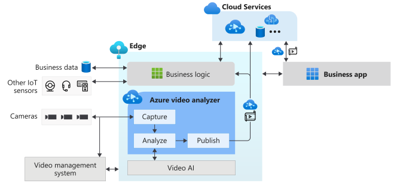

# What is Azure Video Analyzer? (preview)
 
Azure Video Analyzer provides a platform to build intelligent video applications that span the edge and the cloud. The platform consists of an IoT Edge module, and an associated Azure service. It offers the capability to capture, record, and analyze live video along with publishing the results - video and/or video analytics. Video can be published to the edge or the Video Analyzer cloud service, while video analytics can be published to Azure services (in the cloud and/or the edge). The platform can be used to enhance IoT solutions with video analytics. Video Analyzer functionality can be combined with other Azure IoT Edge modules such as Stream Analytics on IoT Edge, Cognitive Services on IoT Edge and Azure services in the cloud such as Event Hub, Cognitive Services, etc. to build powerful hybrid (for example, edge + cloud) applications.

The Video Analyzer edge module is designed to be an extensible platform, enabling you to connect different video analysis edge modules (such as Cognitive services containers, custom edge modules built by you with open-source machine learning models or custom models trained with your own data) to it and use them to analyze live video without worrying about the complexity of building and running a live video pipeline. The Video Analyzer cloud service enables you to play back the video and video analytics from such workflows.

## Accelerate IoT solutions development 

IoT solutions that combine video analytics with signals from other IoT sensors and/or business data can help you automate or semi-automate business decisions, resulting in productivity improvements. Video Analyzer enables you to build such solutions quicker. You can focus on building the video analysis modules and logic that is specific to your business, and letting the platform hide the complexities of managing and running a video pipeline.

With Video Analyzer, you can continue to use your [CCTV cameras](https://en.wikipedia.org/wiki/Closed-circuit_television_camera) with your existing [video management systems (VMS)](https://en.wikipedia.org/wiki/Video_management_system) and build video analytics apps independently. Video Analyzer can be used in conjunction with computer vision SDKs and toolkits to build cutting edge IoT solutions. The diagram below illustrates this.

### Concepts

* [Pipeline](pipeline.md)
* [Video recording](video-recording.md)
* [Continuous video recording](continuous-video-recording.md)
* [Event-based video recording](event-based-video-recording-concept.md)
* [Video Analyzer without video recording](analyze-live-video-without-recording.md)

## Compliance, Privacy and Security

As an important reminder, you must comply with all applicable laws in your use of Video Analyzer, and you may not use Video Analyzer or any Azure service in a manner that violates the rights of others, or that may be harmful to others.

Before processing any videos by Video Analyzer, you must have all the proper rights to use the videos, including, where required by law, all the necessary consents from individuals (if any) in the video/image, for the use, processing, and storage of their data in Video Analyzer and Azure. Some jurisdictions may impose special legal requirements for the collection, online processing, and storage of certain categories of data, such as biometric data. Before using Video Analyzer and Azure for the processing and storage of any data subject to special legal requirements, you must ensure compliance with any such legal requirements that may apply to You.

To learn about compliance, privacy and security in Video Analyzer visit the Microsoft [Trust Center](https://www.microsoft.com/TrustCenter/CloudServices/Azure/default.aspx). For Microsoft's privacy obligations, data handling and retention practices, including how to delete your data, review Microsoft's [Privacy Statement](https://privacy.microsoft.com/PrivacyStatement), the [Online Services Terms](https://www.microsoft.com/licensing/product-licensing/products?rtc=1) ("OST"), and [Data Processing Addendum](https://www.microsoftvolumelicensing.com/DocumentSearch.aspx?Mode=3&DocumentTypeId=67) ("DPA"). By using Video Analyzer, you agree to be bound by the OST, DPA, and the Privacy Statement.

## Next steps

* Follow the [Quickstart: Get started with Azure Video Analyzer](get-started-detect-motion-emit-events.md) article to see how you can run motion detection on a live video feed.
* Review [terminology](terminology.md)
