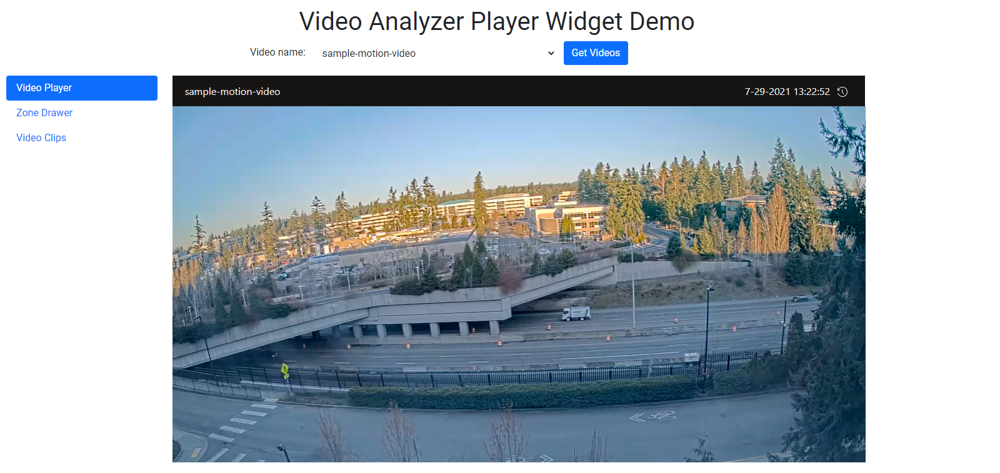
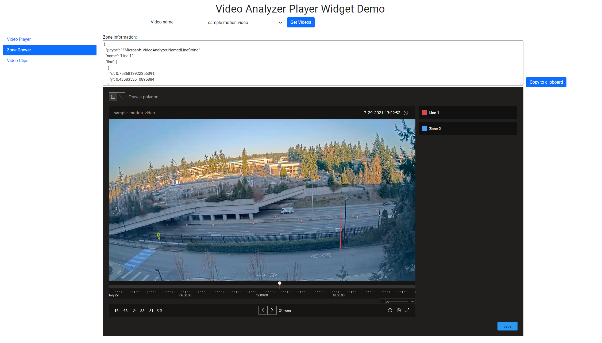
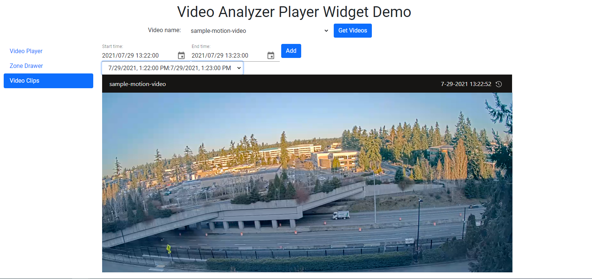

# Azure Video Analyzer player widget sample

[!INCLUDE [deprecation notice](./includes/deprecation-notice.md)]

This sample application shows the integration of Video Analyzer's player widget with video playback, zone drawing and video clip generation features.

* Clone the [AVA C# sample repository](https://github.com/Azure-Samples/video-analyzer-iot-edge-csharp)
* Follow the instructions in the [README in the **src/video-player** folder](https://github.com/Azure-Samples/video-analyzer-iot-edge-csharp/blob/main/src/video-player/README.md)

## Get Started
After following the README instructions and the app is running on http://localhost:3000/
1. Click 'Get Videos'
2. Select a Video from the drop-down list of all of the Videos in your Video Analyzer account

## Video Player
The Video Player page presents the typical player, as seen in the Portal.  


## Zone Drawer
The Zone Drawer allows you to create zones by drawing polygons and drawing lines on your video. You can also save these zones and lines to receive the coordinates of your respective zones and lines.  
  
**Example:**
```json
{
  "@type": "#Microsoft.VideoAnalyzer.NamedLineString",
  "name": "Line 1",
  "line": [
    {
      "x": 0.7536813922356091,
      "y": 0.4358353510895884
    },
    {
      "x": 0.7563587684069611,
      "y": 0.7699757869249395
    }
  ]
}{
  "@type": "#Microsoft.VideoAnalyzer.NamedPolygonString",
  "name": "Zone 2",
  "polygon": [
    {
      "x": 0.11780455153949129,
      "y": 0.7627118644067796
    },
    {
      "x": 0.15261044176706828,
      "y": 0.774818401937046
    },
    {
      "x": 0.0749665327978581,
      "y": 0.8983050847457628
    },
    {
      "x": 0.04551539491298527,
      "y": 0.864406779661017
    }
  ]
}
```
Copying these coordinates can be done using the **Copy to clipboard** button. Zones and lines can be renamed and deleted using the three dots next to each zone and line.  


## Video Clips
Video Clips allows you to select a start date and time along with an end date and time. You can generate the video clip by using the *Add* button.
You can select any of your generated clips from drop-down list, where each clip is titled as the start and end dates and times.
Your video clip can then be viewed in the typical video player format.  


## Next Steps
Try creating your own custom Video Analyzer player widget with these [instructions](./player-widget.md).
