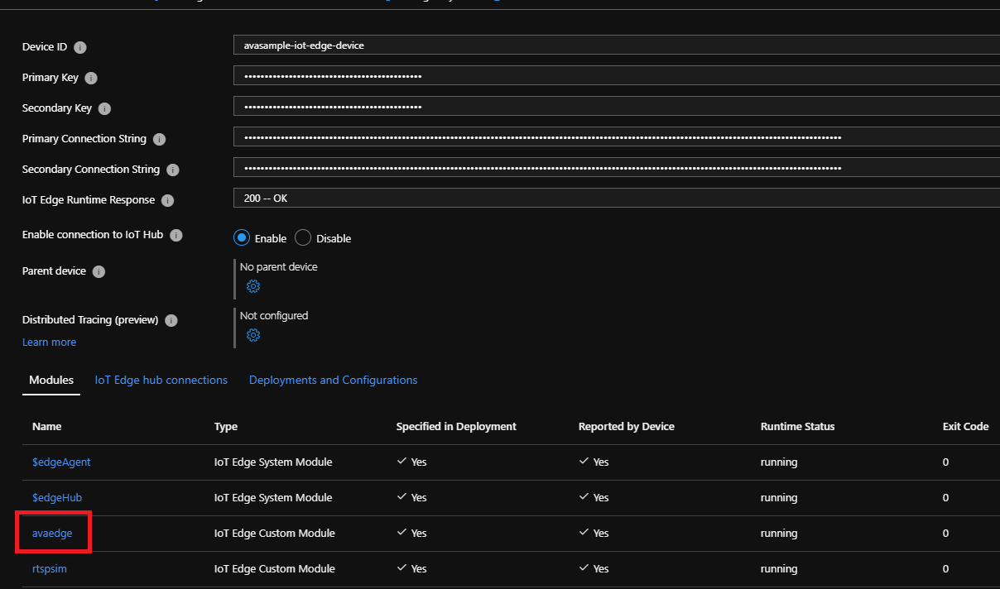
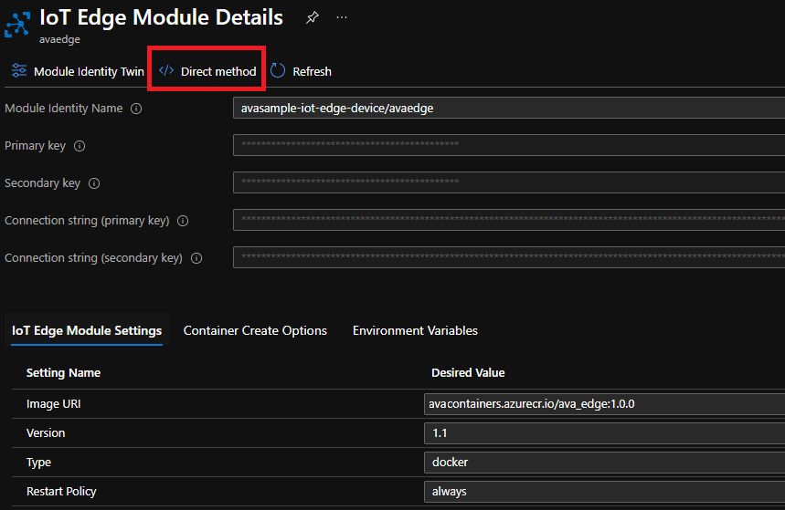

# Use Azure portal to invoke direct methods for Azure Video Analyzer

IoT Hub gives you the ability to invoke [direct methods](../../iot-hub/iot-hub-devguide-direct-methods.md#method-invocation-for-iot-edge-modules) on edge devices from the cloud. The Azure Video Analyzer (Video Analyzer) module exposes several [direct methods](./direct-methods.md) that can be used to define, deploy, and activate different pipelines for analyzing live video.

In this article, you will learn how to invoke direct method calls on Video Analyzer module via the Azure portal.

## Prerequisites

* You have the Video Analyzer module running on your edge device, using either the methods described in [Quickstart: Video Analyzer](get-started-detect-motion-emit-events.md) or using the [portal.](./deploy-iot-edge-device.md)
* You understand [Video Analyzer](overview.md) and [the pipeline concept](pipeline.md).

## Invoking direct methods via Azure portal

Each of the [direct methods](./direct-methods.md) exposed by the Video Analyzer module can be invoked via Azure portal. The steps below provide the details for one direct method. You can invoke other direct methods using similar steps. However, each direct method requires a specific payload.

Use the `livePipelineList` method call to retrieve a list of all the pipeline topologies currently deployed on the Video Analyzer module. Use the following steps to invoke this direct method:

1. Log into Azure portal
1. Find the relevant resource group from your portal homepage to locate your IoT Hub, or if you know you IoT Hub, select it.
    
1. Once on the IoT Hub page, select IoT Edge under Automatic Device Management to list the various device IDs. Select the relevant device ID to list the modules running on the device.
    
1. Select the Video Analyzer module to bring up its configuration page.<br><br>
    
1. Select on the Direct method menu option. <br><br>
    
    > [!NOTE]
    > You might need to add a value in the Connection string sections as you can see on the current page. You do not need to hide or change anything in the Setting name section. It is ok to let it be public.

1. Type *livePipelineList* in the **Method Name** field.
1. Copy and paste the JSON below in the **Payload** field.
    ```json
    {
    "@apiVersion": "1.0"
    }
    ```
1. Select the **Invoke Method** button at the top of the page.<br><br>
    
1. You should see a status 200 message in the **Result** area.<br><br>
    

## Responses

| Condition             | Status Code | Detailed Error Code |
|-----------------------|-------------|---------------------|
| Success               | 200         | N/A                 |
| General user errors   | 400 range   |                     |
| General server errors | 500 range   |                     |

## Next steps

More direct methods can be found on the [direct methods](./direct-methods.md) page.

> [!NOTE]
> A pipeline activates a specific topology, so please ensure you have the right topology set before activating a pipeline.

[Quickstart: Detect motion emit events](detect-motion-emit-events-quickstart.md) is a good reference for understanding the exact sequence of direct method calls to be made.
