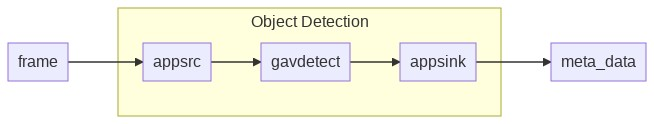

# Tutorial: Analyze live video with Intel OpenVINO™ DL Streamer – Edge AI Extension 

This tutorial shows you how to use the Intel OpenVINO™ DL Streamer – Edge AI Extension from Intel to analyze a live video feed from a (simulated) IP camera. You'll see how this inference server gives you access to different models for detecting objects (a person, a vehicle, or a bike), object classification (vehicle attributions) and a model for object tracking (person, vehicle and bike). The integration with the gRPC module lets you send video frames to the AI inference server. The results are then sent to the IoT Edge Hub. When you run this inference service on the same compute node as Azure Video Analyzer, you can take advantage of sending video data via shared memory. This enables you to run inferencing at the frame rate of the live video feed (i.e. 30 frames/sec). 

This tutorial uses an Azure VM as an simulated IoT Edge device, and it uses a simulated live video stream. It's based on sample code written in C#, and it builds on the [Detect motion and emit events](detect-motion-emit-events-quickstart.md) quickstart.

[!INCLUDE [use-x86-64](./includes/common-includes/use-x86-64.md)]

## Prerequisites

[!INCLUDE [prerequisites](./includes/common-includes/csharp-prerequisites.md)]

## Set up Azure resources

[](https://aka.ms/ava-click-to-deploy)

[!INCLUDE [resources](./includes/common-includes/azure-resources.md)]

## Review the sample video

When you set up the Azure resources, a short video of a parking lot is copied to the Linux VM in Azure that you're using as the IoT Edge device. This tutorial uses the video file to simulate a live stream.

Open an application such as [VLC media player](https://www.videolan.org/vlc/). Select Ctrl+N and then paste a link to [the video](https://lvamedia.blob.core.windows.net/public/lots_015.mkv) to start playback. You see the footage of vehicles in a parking lot, most of them parked, and one moving.

> [!VIDEO https://www.microsoft.com/videoplayer/embed/RE4LUbN]

In this tutorial, you'll use Video Analyzer along with the Intel OpenVINO™ DL Streamer – Edge AI Extension from Intel to detect objects such as vehicles, to classify vehicles them or track vehicles, person or bikes. You'll publish the resulting inference events to IoT Edge Hub.

## Overview

> [!div class="mx-imgBorder"]
> :::image type="content" source="./media/use-intel-openvino-tutorial/grpc-vas-extension-with-vino.png" alt-text="Overview of Azure Video Analyzer pipeline with Intel DL Streamer Edge AI module.":::

This diagram shows how the signals flow in this tutorial. An [edge module](https://github.com/Azure/video-analyzer/tree/main/edge-modules/sources/rtspsim-live555) simulates an IP camera hosting a Real-Time Streaming Protocol (RTSP) server. An [RTSP source](pipeline.md#rtsp-source) node pulls the video feed from this server and sends video frames to the [gRPC extension processor](pipeline.md#grpc-extension-processor) node. 

The gRPC extension processor node takes decoded video frames as the input, and relays such frames to a [gRPC](terminology.md#grpc) endpoint exposed by a gRPC Server. The node supports transferring of data using [shared memory](https://en.wikipedia.org/wiki/Shared_memory) or directly embedding the content into the body of gRPC messages. Additionally, the node has a built-in image formatter for scaling and encoding of video frames before they are relayed to the gRPC endpoint. The scaler has options for the image aspect ratio to be preserved, padded or stretched. The image encoder supports jpeg, png, or bmp formats. Learn more about the processor [here](pipeline.md#grpc-extension-processor).

## About Intel OpenVINO™ DL Streamer – Edge AI Extension Module


The OpenVINO™ DL Streamer - Edge AI Extension module is a microservice based on Intel’s Video Analytics Serving (VA Serving) that serves video analytics pipelines built with OpenVINO™ DL Streamer. Developers can send decoded video frames to the AI extension module which performs detection, classification, or tracking and returns the results. The AI extension module exposes gRPC APIs that are compatible with video analytics platforms like Azure Video Analyzer from Microsoft.

In order to build complex, high-performance video analytics solutions, the Azure Video Analyzer module should be paired with a powerful inference engine that can leverage the scale at the edge. In this tutorial, inference requests are sent to the Intel OpenVINO™ DL Streamer – Edge AI Extension, an Edge module that has been designed to work with Azure Video Analyzer.

In the initial release of this inference server, you have access to the following [models](https://aka.ms/intel-dlstreamer-docs):

- object_detection for person_vehicle_bike_detection


- object_classification for vehicle_attributes_recognition


- object_tracking for person_vehicle_bike_tracking


It uses Pre-loaded Object Detection, Object Classification and Object Tracking pipelines to get started quickly. In addition it comes with pre-loaded [person-vehicle-bike-detection-crossroad-0078](https://github.com/openvinotoolkit/open_model_zoo/blob/master/models/intel/person-vehicle-bike-detection-crossroad-0078/README.md) and [vehicle-attributes-recognition-barrier-0039 models](https://github.com/openvinotoolkit/open_model_zoo/blob/master/models/intel/vehicle-attributes-recognition-barrier-0039/README.md).

> [!NOTE]
> By downloading and using the Edge module: OpenVINO™ DL Streamer – Edge AI Extension from Intel, and the included software, you agree to the terms and conditions under the [License Agreement](https://www.intel.com/content/www/us/en/legal/terms-of-use.html).
> Intel is committed to respecting human rights and avoiding complicity in human rights abuses. See [Intel’s Global Human Rights Principles](https://www.intel.com/content/www/us/en/policy/policy-human-rights.html). Intel’s products and software are intended only to be used in applications that do not cause or contribute to a violation of an internationally recognized human right.

You can use the flexibility of the different pipelines for your specific use case by simply changing the pipeline environment variables in your deployment template. This enables you to quickly change the pipeline model and when combined with Azure Video Analyzer it is a matter of seconds to change the media pipeline and inference model.

In this tutorial, you will:

1. Setup your development environment.
1. Deploy the required edge modules.
1. Create and deploy the live pipeline.
1. Interpret the results.
1. Clean up resources.

## Set up your development environment
[!INCLUDE [setup development environment](./includes/set-up-dev-environment/csharp/csharp-set-up-dev-env.md)]

## Deploy the required modules

1. In Visual Studio Code, right-click the *src/edge/deployment.openvino.grpc.template.json* file and then select **Generate IoT Edge Deployment Manifest**.

    > [!div class="mx-imgBorder"]
    > :::image type="content" source="./media/analyze-live-video-use-your-model-http/generate-deployment-manifest.png" alt-text="Generate an IoT Edge Deployment Manifest":::
1. The *deployment.openvino.grpc.amd64.json* manifest file is created in the *src/edge/config* folder.
1. Right-click *src/edge/config/deployment.openvino.grpc.amd64.json* and select **Create Deployment for Single Device**.

    > [!div class="mx-imgBorder"]
    > :::image type="content" source="./media/analyze-live-video-use-your-model-http/deployment-single-device.png" alt-text= "Create Deployment for a Single Device":::
1. When you're prompted to select an IoT Hub device, select **avasample-iot-edge-device**.
1. After about 30 seconds, in the lower-left corner of the window, refresh Azure IoT Hub. The edge device now shows the following deployed modules:

    * The Video Analyzer edge module, named **avaedge**.
    * The **rtspsim** module, which simulates an RTSP server and acts as the source of a live video feed. 
    * The **avaextension** module, which is the Intel OpenVINO DL Streamer module with object detection, classification and tracking model that applies computer vision to images and returns multiple classes of object types.

        > [!div class="mx-imgBorder"]
        > :::image type="content" source="./media/vscode-common-screenshots/avaextension.png" alt-text= "OpenVINO object detection model":::

> [!NOTE]
> We also included a *deployment.openvino.grpc.xpu.template.json* template that enables CPU, VPU and GPU, support, when available in your device, for the Intel OpenVINO DL Streamer - Edge AI Extension module. These templates point to Intel's Docker hub image.

### Prepare to monitor events

Right-click the Azure Video Analyzer device and select **Start Monitoring Built-in Event Endpoint**. You need this step to monitor the IoT Hub events in the **OUTPUT** window of Visual Studio Code.

 

### Run the sample program to detect vehicles, persons or bike
If you open the [pipeline topology](https://raw.githubusercontent.com/Azure/video-analyzer/main/pipelines/live/topologies/grpcExtensionOpenVINO/topology.json) for this tutorial in a browser, you will see that the value of `grpcExtensionAddress` has been set to `tcp://avaExtension:5001`, compared to the *httpExtensionOpenVINO* tutorial you do not need to change the url to the gRPC Server. Instead you instruct the module to run a specific pipeline by the `extensionConfiguration` in the operations file. When not provided it defaults to "object_detection" for "person_vehicle_bike_detection". You can experiment with other supported pipelines.

1. Edit the *operations.json* file:
    * Change the link to the live pipeline topology:

        `"pipelineTopologyUrl" : "https://raw.githubusercontent.com/Azure/video-analyzer/main/pipelines/live/topologies/grpcExtensionOpenVINO/topology.json"`

    * Under `pipelineTopologySet`, edit the name of the live pipeline topology to match the value in the preceding link:

      `"topologyName" : "InferencingWithOpenVINOgRPC"`

    * Under `pipelineTopologyDelete`, edit the name:

      `"name": "InferencingWithOpenVINOgRPC"`
    
    * Under `rtspUrl`, edit the url to:
      `"value": "rtsp://rtspsim:554/media/lots_015.mkv"`

Add the following extensionConfiguration after the rtsp params:

```
{
    "name": "extensionConfiguration",
    "value": "{\"pipeline\":{\"name\":\"object_detection\",\"version\":\"person_vehicle_bike_detection\"}}"
}
```


Your `operations.json` should look like this:
```
{
  "apiVersion": "1.0",
  "operations": [
      {
          "opName": "pipelineTopologyList",
          "opParams": {}
      },
      {
          "opName": "WaitForInput",
          "opParams": {
              "message": "Press Enter to continue."
          }
      },
      {
          "opName": "livePipelineList",
          "opParams": {}
      },
      {
          "opName": "WaitForInput",
          "opParams": {
              "message": "Press Enter to continue. This is start the activating steps."
          }
      },
      {
          "opName": "pipelineTopologySet",
          "opParams": {
              "pipelineTopologyUrl": "https://raw.githubusercontent.com/Azure/video-analyzer/main/pipelines/live/topologies/grpcExtensionOpenVINO/topology.json"
          }
      },
      {
          "opName": "livePipelineSet",
          "opParams": {
              "name": "Sample-Pipeline-1",
              "properties": {
                  "topologyName": "InferencingWithOpenVINOgRPC",
                  "description": "Sample pipeline description",
                  "parameters": [
                      {
                          "name": "rtspUrl",
                          "value": "rtsp://rtspsim:554/media/lots_015.mkv"
                      },
                      {
                          "name": "rtspUserName",
                          "value": "testuser"
                      },
                      {
                          "name": "rtspPassword",
                          "value": "testpassword"
                      },
                      {
                        "name": "extensionConfiguration",
                        "value": "{\"pipeline\":{\"name\":\"object_detection\",\"version\":\"person_vehicle_bike_detection\"}}"
                      }
                  ]
              }
          }
      },
      {
          "opName": "livePipelineActivate",
          "opParams": {
              "name": "Sample-Pipeline-1"
          }
      },
      {
          "opName": "WaitForInput",
          "opParams": {
              "message": "Press Enter to continue. This is start the deactivating steps."
          }
      },
      {
          "opName": "livePipelineDeactivate",
          "opParams": {
              "name": "Sample-Pipeline-1"
          }
      },
      {
          "opName": "livePipelineDelete",
          "opParams": {
              "name": "Sample-Pipeline-1"
          }
      },
      {
          "opName": "livePipelineList",
          "opParams": {}
      },
      {
          "opName": "pipelineTopologyDelete",
          "opParams": {
              "name": "InferencingWithOpenVINOgRPC"
          }
      },
      {
          "opName": "pipelineTopologyList",
          "opParams": {}
      }
  ]
}
```

By using the `extensionConfiguration` allows you to pass through a string of data to the Intel DL Streamer - Edge AI Module. With the correct data you can instruct the Edge AI module to use a specific model for each pipeline. For instance you can replace the "object_detection" model used above with other supported models like classification or tracking. To do so use below examples:

Classification:
```
{
    "name": "extensionConfiguration",
    "value": "{\"pipeline\":{\"name\":\"object_classification\",\"version\":\"vehicle_attributes_recognition\"}}"
}
```

Tracking:
```
{
    "name": "extensionConfiguration",
    "value": "{\"pipeline\":{\"name\":\"object_tracking\",\"version\":\"person_vehicle_bike_tracking\"}}"
}
```

1. In Visual Studio Code, open the **Extensions** tab (or press Ctrl+Shift+X) and search for Azure IoT Hub.
1. Right click and select **Extension Settings**.

    > [!div class="mx-imgBorder"]
    > :::image type="content" source="./media/run-program/extensions-tab.png" alt-text="Extension Settings":::
1. Search and enable “Show Verbose Message”.

    > [!div class="mx-imgBorder"]
    > :::image type="content" source="./media/run-program/show-verbose-message.png" alt-text="Show Verbose Message":::
1. To start a debugging session, select the F5 key. You see messages printed in the **TERMINAL** window.
1. The *operations.json* code starts off with calls to the direct methods `pipelineTopologyList` and `livePipelineList`. If you cleaned up resources after you completed previous quickstarts/tutorials, then this process will return empty lists and then pause. To continue, select the Enter key.

    The **TERMINAL** window shows the next set of direct method calls:

     * A call to `pipelineTopologySet` that uses the preceding `topologyUrl`
     * A call to `livePipelineSet` that uses the following body:

         ```
         {
           "@apiVersion": "1.0",
           "name": "Sample-Pipeline-1",
           "properties": {
             "topologyName": "InferencingWithGrpcExtension",
             "description": "Sample pipeline description",
             "parameters": [
               {
                 "name": "rtspUrl",
                 "value": "rtsp://rtspsim:554/media/lots_015.mkv"
               },
               {
                 "name": "rtspUserName",
                 "value": "testuser"
               },
               {
                 "name": "rtspPassword",
                 "value": "testpassword"
               },
               {
                 "name": "grpcExtensionAddress",
                 "value": "tcp://avaextension:5001"
               },
               {
                 "name": "extensionConfiguration",
                 "value": "{\"pipeline\":{\"name\":\"object_detection\",\"version\":\"person_vehicle_bike_detection\"}}"
               }
             ]
           }
         }
         ```

     * A call to `livePipelineActivate` that starts the pipeline and the flow of video
1. The output in the **TERMINAL** window pauses at a `Press Enter to continue` prompt. Don't select Enter yet. Scroll up to see the JSON response payloads for the direct methods you invoked.
1. Switch to the **OUTPUT** window in Visual Studio Code. You see messages that the Video Analyzer module is sending to the IoT hub. The following section of this tutorial discusses these messages.
1. The live pipeline continues to run and print results. The RTSP simulator keeps looping the source video. To stop the live pipeline, return to the **TERMINAL** window and select Enter. 

    The next series of calls cleans up resources:
      * A call to `livePipelineDeactivate` deactivates the pipeline.
      * A call to `livePipelineDelete` deletes the pipeline.
      * A call to `pipelineTopologyDelete` deletes the topology.
      * A final call to `pipelineTopologyList` shows that the list is empty.

## Interpret results

When you run the live pipeline the results from the gRPC extension processor node pass through the IoT Hub message sink node to the IoT hub. The messages you see in the **OUTPUT** window contain a `body` section. For more information, see [Create and read IoT Hub messages](../../iot-hub/iot-hub-devguide-messages-construct.md).

In the following messages, the Video Analyzer module defines the the content of the body. 

### MediaSessionEstablished event

When a live pipeline is activated, the RTSP source node attempts to connect to the RTSP server that runs on the rtspsim-live555 container. If the connection succeeds, then the following event is printed.

```
[IoTHubMonitor] [10:51:34 AM] Message received from [avasample-iot-edge-device/avaedge]:
{
  "sdp": "SDP:\nv=0\r\no=- 1620204694595500 1 IN IP4 xxx.xxx.xxx.xxx\r\ns=Matroska video+audio+(optional)subtitles, streamed by the LIVE555 Media Server\r\ni=media/camera-300s.mkv\r\nt=0 0\r\na=tool:LIVE555 Streaming Media v2020.08.19\r\na=type:broadcast\r\na=control:*\r\na=range:npt=0-300.000\r\na=x-qt-text-nam:Matroska video+audio+(optional)subtitles, streamed by the LIVE555 Media Server\r\na=x-qt-text-inf:media/camera-300s.mkv\r\nm=video 0 RTP/AVP 96\r\nc=IN IP4 0.0.0.0\r\nb=AS:500\r\na=rtpmap:96 H264/90000\r\na=fmtp:96 packetization-mode=1;profile-level-id=4D0029;sprop-parameter-sets=Z00AKeKQCgC3YC3AQEBpB4kRUA==,aO48gA==\r\na=control:track1\r\n"
}
```

In the preceding output: 

* The message is a diagnostics event, `MediaSessionEstablished`. It indicates that the RTSP source node (the subject) connected with the RTSP simulator and has begun to receive a (simulated) live feed.
* The `sdp` section contains data about the diagnostics event. In this case, the data comprises the [Session Description Protocol (SDP)](https://en.wikipedia.org/wiki/Session_Description_Protocol) details.

### Inference event

The gRPC extension processor node receives inference results from the Intel OpenVINO™ DL Streamer – Edge AI Extension. It then emits the results through the IoT Hub message sink node as inference events. 

In these events, the type is set to `entity` to indicate it's an entity, such as a car or truck. 

In the following example, a vehicle was detected, with a confidence values above 0.9.

```
[IoTHubMonitor] [3:10:23 PM] Message received from [avasample-iot-edge-device/avaedge]:
{
  "timestamp": 145819820073974,
  "inferences": [
    {
      "type": "entity",
      "subtype": "vehicleDetection",
      "entity": {
        "tag": {
          "value": "vehicle",
          "confidence": 0.9147264
        },
        "box": {
          "l": 0.6853116,
          "t": 0.5035262,
          "w": 0.04322505,
          "h": 0.03426218
        }
      }
    }
```

In the messages, notice the following details:

* The `body` section contains data about the analytics event. In this case, the event is an inference event, so the body contains `inferences` data.
* The `inferences` section indicates that the `type` is `entity`. This section includes additional data about the entity.

## Clean up resources

If you intend to try other quickstarts or tutorials, keep the resources you created. Otherwise, go to the Azure portal, go to your resource groups, select the resource group where you ran this tutorial, and delete all the resources.

## Next steps

Review additional challenges for advanced users:

* Use an [IP camera](https://en.wikipedia.org/wiki/IP_camera) that has support for RTSP instead of using the RTSP simulator. You can search for IP cameras that support RTSP on the [ONVIF conformant](https://www.onvif.org/conformant-products/) products page. Look for devices that conform with profiles G, S, or T.
* Use an Intel x64 Linux device instead of an Azure Linux VM. This device must be in the same network as the IP camera. You can follow the instructions in [Install Azure IoT Edge runtime on Linux](../../iot-edge/how-to-install-iot-edge.md). Then register the device with Azure IoT Hub by following instructions in [Deploy your first IoT Edge module to a virtual Linux device](../../iot-edge/quickstart-linux.md).
