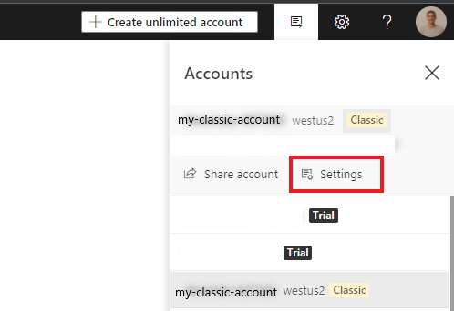
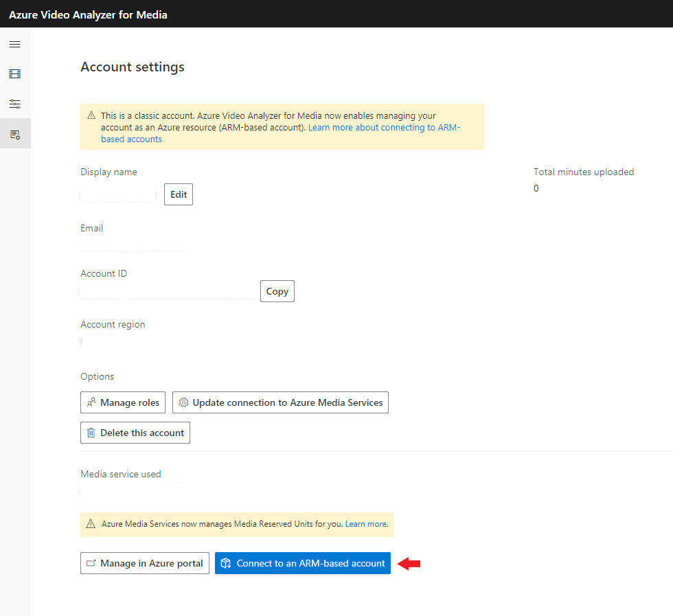

# Connect an existing classic paid Video Analyzer for Media account to ARM-based account  

This article details how to connect an existing classic paid Azure Video Analyzer for Media account to an Azure Resource Manager (ARM) based account.
Today, Azure Video Analyzer for Media (formerly Video Indexer), is a GA(general availability) product that is not an ARM resource on Azure.
In this article, we will go through options on connecting your **existing** Video Analyzer for Media account to [ARM][docs-arm-overview].

## Prerequisites

* Unlimited paid Video Analyzer for Media account (classic account).
  * To perform the connect to ARM action, you should have owner's permissions on the Video Analyzer for Media account.
* Azure Subscription.
* User assigned managed identity (can be created along the flow).

#### Transition state and recommended steps before connecting a classic account to be ARM-based

In the connect process the account management is connected to ARM, which will trigger 30 days of a transition state for the account. In that state, a connected account can be accessed through API by both access token [generated through API Management](https://aka.ms/avam-dev-portal)(classic way) or by an access token generated through ARM. The transition state, which moves all account management to be managed by ARM will disable the invite user feature from the Video Analyzer for Media portal, due to the fact account-management will be handled by [Azure RBAC][docs-rbac-overview]:. This will result all invited users on this account losing their access to the Video Analyzer for Media account Media portal. Of course, this can easily be resolved by assigning the right role-assignment to all these users through Azure RBAC [How to assign RBAC][docs-rbac-assignment]. Only the account owner, who performed the connect action, will be automatically assigned as an owner on the connected account. If users won't be added through Azure RBAC to the account, after 30 days, they will lose access also through API, since after the transition state ends, no user can't generate a valid access token through APIM (classic way) anymore, but only through ARM. Making Azure RBAC the exclusive way to manage role based access control on the account.

> [!NOTE]
> If there are invited users you wish to remove their access before the end of the 30 days of transition state you should do so through the account settings on the Azure Video Analyzer for Media account settings **before** connecting the account to ARM 

## Get started

### Browse to [Video Analyzer for Media portal](https://aka.ms/vi-portal-link)

1. Sign in using your AAD account.
1. On the top right bar press *User account* to open the side pane account list.
3. Select the Video Analyzer for Media classic account you wish to connect to ARM (Classic accounts will be tagged with a *classic tag*).
4. Click **Settings**

  
   
5. Click **Connect to an ARM-based account**.

  

7. Sign to Azure portal
8. The Video Analyzer for Media create blade will open
10. In the **Create Video Analyzer for Media account** section enter required values.
    * If you followed the steps the fields should be auto-populated, make sure to validate the eligible values.

 

 | Name | Description |
 | ---|---|
 |**Subscription**| The subscription currently contains the classic account and other related resources such as the Media Services.|
 |**Resource Group**|Select an existing resource or create a new one. The resource group must be the same location as the classic account being connected|
 |**Video Analyzer for Media account** (radio button)| Select the *"Connecting an existing classic account"*.|
 |**Existing account ID**| Enter the ID of existing Video Analyzer for Media classic account.|
 |**Resource name**|Enter the name of the new Video Analyzer for Media account. Default value would be the same name the account had as classic.|
 |**Location**|The geographic region can be changed in the connect process, the connected account must stay in the same region. |
 |**Media Services account name**|The original Media Services account name that was associated with classic account.|
 |**User-assigned managed identity**|Select a user-assigned managed identity, or create a new one. Video Analyzer for Media account will use it to access the Media services. The user-assignment managed identity will be assigned the roles of Contributor for the Media Service account.|

1. Click **Review + create** at the bottom of the form.

### Next steps

Learn how to [Upload a video using C#](https://github.com/Azure-Samples/media-services-video-indexer/tree/master/ApiUsage/ArmBased).
  
<!-- links -->
[docs-arm-overview]: ../../azure-resource-manager/management/overview.md
[docs-rbac-overview]: ../../role-based-access-control/overview.md
[docs-rbac-assignment]: ../../role-based-access-control/role-assignments-portal.md
