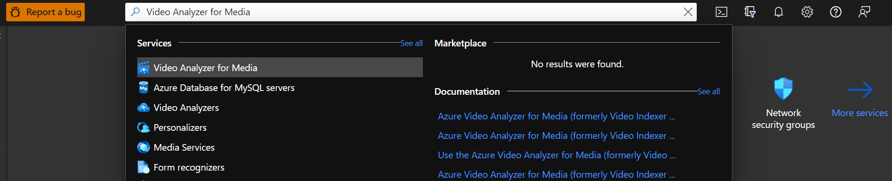
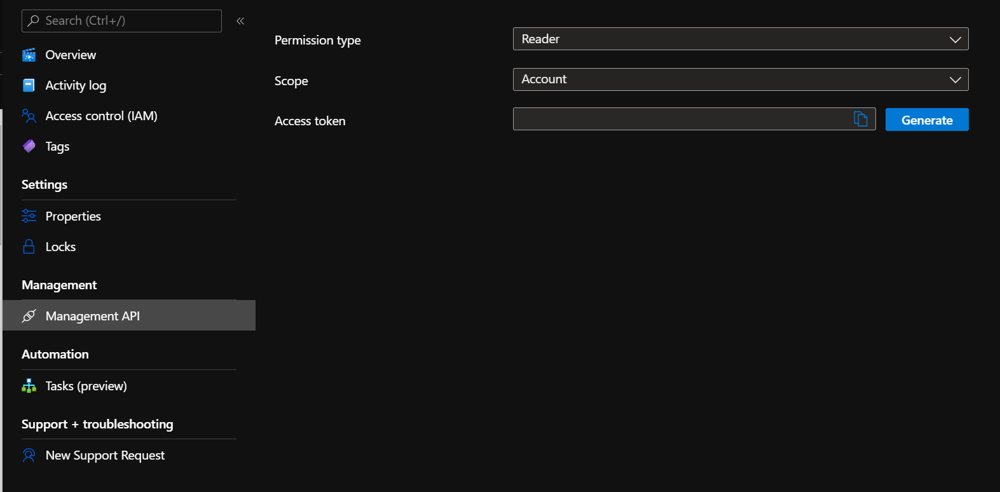

# Generate Azure Video Analyzer for Media access token  

This article details how to generate Azure Video Analyzer for Media access token. 

## [Portal](#tab/portal/)

1. Sign in at the [Azure portal](https://portal.azure.com/).
1. Using the search bar at the top, enter **Video Analyzer for Media**.
1. Click on *Video Analyzer for Media* under *Services*.
    
1. Find and select your account. 
2. In the pane to the left, click **Management API**.
3. In the **Permission type** section, choose *Reader* or *Contributor*.
4. In the **Scope** section, choose *Account* or *Video* or *Project*. 
   In case you chose *Video*, enter the *Video ID*. 
   In case you chose *Project*, enter the *Project ID*. 
6. Click on the **Generate** button. 
   
