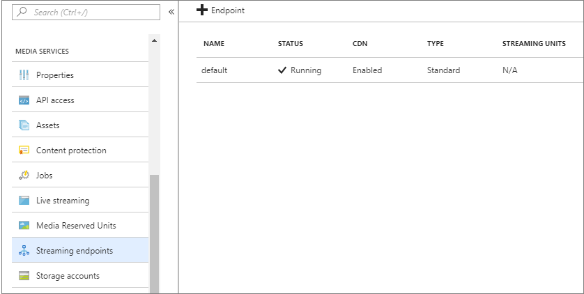

# Create a classic Azure AI Video Indexer account

[!INCLUDE [Gate notice](./includes/face-limited-access.md)]

This topic shows how to create a new classic account connected to Azure using the [Azure AI Video Indexer website](https://aka.ms/vi-portal-link). You can also create an Azure AI Video Indexer classic account through our [API](https://aka.ms/avam-dev-portal).

The topic discusses prerequisites that you need to connect to your Azure subscription and how to configure an Azure Media Services account.

A few Azure AI Video Indexer account types are available to you. For detailed explanation, review [Account types](accounts-overview.md).

For the pricing details, see [pricing](https://azure.microsoft.com/pricing/details/video-indexer/).

## Prerequisites for connecting to Azure

* An Azure subscription.

    If you don't have an Azure subscription yet, sign up for [Azure Free Trial](https://azure.microsoft.com/free/).
* An Azure Active Directory (Azure AD) domain.

    If you don't have an Azure AD domain, create this domain with your Azure subscription. For more information, see [Managing custom domain names in your Azure AD](../active-directory/enterprise-users/domains-manage.md)
* A user in your Azure AD domain with an **Application administrator** role. You'll use this member when connecting your Azure AI Video Indexer account to Azure.

    This user should be an Azure AD user with a work or school account. Don't use a personal account, such as outlook.com, live.com, or hotmail.com.

    :::image type="content" alt-text="Screenshot that shows how to choose a user in your Azure A D domain." source="./media/create-account/all-aad-users.png":::
* A user and member in your Azure AD domain.

    You'll use this member when connecting your Azure AI Video Indexer account to Azure.

    This user should be a member in your Azure subscription with either an **Owner** role, or both **Contributor** and **User Access Administrator** roles. A user can be added twice, with two roles. Once with Contributor and once with user Access Administrator. For more information, see [View the access a user has to Azure resources](../role-based-access-control/check-access.md).

    :::image type="content" alt-text="Screenshot that shows the access control settings." source="./media/create-account/access-control-iam.png":::
* Register the Event Grid resource provider using the Azure portal.

    In the [Azure portal](https://portal.azure.com/), go to **Subscriptions**->[subscription]->**ResourceProviders**.

    Search for **Microsoft.Media** and **Microsoft.EventGrid**. If not in the "Registered" state, select **Register**. It takes a couple of minutes to register.

    :::image type="content" alt-text="Screenshot that shows how to select an Event Grid subscription." source="./media/create-account/event-grid.png":::

## Connect to Azure 

> [!NOTE]
> Use the same Azure AD user you used when connecting to Azure.

It's strongly recommended to have the following three accounts located in the same region: 

* The Azure AI Video Indexer account that you're creating.
* The Azure AI Video Indexer account that you're connecting with the Media Services account.
* The Azure storage account connected to the same Media Services account. 

    When you create an Azure AI Video Indexer account and connect it to Media Services, the media and metadata files are stored in the Azure storage account associated with that Media Services account. 

If your storage account is behind a firewall, see [storage account that is behind a firewall](faq.yml#can-a-storage-account-connected-to-the-media-services-account-be-behind-a-firewall).

### Create and configure a Media Services account

1. Use the [Azure](https://portal.azure.com/) portal to create an Azure Media Services account, as described in [Create an account](/azure/media-services/previous/media-services-portal-create-account).

    > [!NOTE]
    > Make sure to write down the Media Services resource and account names. 
1. Before you can play your videos in the [Azure AI Video Indexer](https://www.videoindexer.ai/) website, you must start the default **Streaming Endpoint** of the new Media Services account.

    In the new Media Services account, select **Streaming endpoints**. Then select the streaming endpoint and press start.

    :::image type="content" alt-text="Screenshot that shows how to specify streaming endpoints." source="./media/create-account/create-ams-account-se.png":::
1. For Azure AI Video Indexer to authenticate with Media Services API, an AD app needs to be created. The following steps guide you through the Azure AD authentication process described in [Get started with Azure AD authentication by using the Azure portal](/azure/media-services/previous/media-services-portal-get-started-with-aad):

    1. In the new Media Services account, select **API access**.
    2. Select [Service principal authentication method](/azure/media-services/previous/media-services-portal-get-started-with-aad).
    3. Get the client ID and client secret

        After you select **Settings**->**Keys**, add **Description**, press **Save**, and the key value gets populated.

        If the key expires, the account owner will have to contact Azure AI Video Indexer support to renew the key.

        > [!NOTE]
        > Make sure to write down the key value and the Application ID. You'll need it for the steps in the next section.

### Azure Media Services considerations

The following Azure Media Services related considerations apply:

* If you connect to a new Media Services account, Azure AI Video Indexer automatically starts the default **Streaming Endpoint** in it:

    

    Streaming endpoints have a considerable startup time. Therefore, it may take several minutes from the time you connected your account to Azure until your videos can be streamed and watched in the [Azure AI Video Indexer](https://www.videoindexer.ai/) website.
* If you connect to an existing Media Services account, Azure AI Video Indexer doesn't change the default Streaming Endpoint configuration. If there's no running **Streaming Endpoint**, you can't watch videos from this Media Services account or in Azure AI Video Indexer.

## Create a classic account

1. On the [Azure AI Video Indexer website](https://aka.ms/vi-portal-link), select **Create unlimited account** (the paid account).
2. To create a classic account, select **Switch to manual configuration**.

In the dialog, provide the following information:

|Setting|Description|
|---|---|
|Azure AI Video Indexer account region|The name of the Azure AI Video Indexer account region. For better performance and lower costs, it's highly recommended to specify the name of the region where the Azure Media Services resource and Azure Storage account are located. |
|Azure AD tenant|The name of the Azure AD tenant, for example "contoso.onmicrosoft.com". The tenant information can be retrieved from the Azure portal. Place your cursor over the name of the signed-in user in the top-right corner. Find the name to the right of **Domain**.|
|Subscription ID|The Azure subscription under which this connection should be created. The subscription ID can be retrieved from the Azure portal. Select **All services** in the left panel, and search for "subscriptions". Select **Subscriptions** and choose the desired ID from the list of your subscriptions.|
|Azure Media Services resource group name|The name for the resource group in which you created the Media Services account.|
|Media service resource name|The name of the Azure Media Services account that you created in the previous section.|
|Application ID|The Azure AD application ID (with permissions for the specified Media Services account) that you created in the previous section.|
|Application key|The Azure AD application key that you created in the previous section. |

## Import your content from the trial account

See [Import your content from the trial account](import-content-from-trial.md).

## Automate creation of the Azure AI Video Indexer account

To automate the creation of the account is a two steps process:

1. Use Azure Resource Manager to create an Azure Media Services account + Azure AD application.

    See an example of the [Media Services account creation template](https://github.com/Azure-Samples/media-services-v3-arm-templates).
1. Call [Create-Account with the Media Services and Azure AD application](https://videoindexer.ai.azure.us/account/login?source=apim).

## Azure AI Video Indexer in Azure Government

### Prerequisites for connecting to Azure Government

- An Azure subscription in [Azure Government](../azure-government/index.yml).
- An Azure AD account in Azure Government.
- All pre-requirements of permissions and resources as described above in [Prerequisites for connecting to Azure](#prerequisites-for-connecting-to-azure). 

### Create new account via the Azure Government portal

> [!NOTE]
> The Azure Government cloud does not include a *trial* experience of Azure AI Video Indexer.

To create a paid account via the Azure AI Video Indexer website:

1. Go to https://videoindexer.ai.azure.us
1. Sign-in with your Azure Government Azure AD account.
1.If you don't have any Azure AI Video Indexer accounts in Azure Government that you're an owner or a contributor to, you'll get an empty experience from which you can start creating your account.

    The rest of the flow is as described in above, only the regions to select from will be Government regions in which Azure AI Video Indexer is available

    If you already are a contributor or an admin of an existing one or more Azure AI Video Indexer accounts in Azure Government, you'll be taken to that account and from there you can start a following steps for creating an additional account if needed, as described above.

### Create new account via the API on Azure Government

To create a paid account in Azure Government, follow the instructions in [Create-Paid-Account](https://api-portal.videoindexer.ai/api-details#api=Operations&operation=Create-Paid-Account). This API end point only includes Government cloud regions.

### Limitations of Azure AI Video Indexer on Azure Government

* Only paid accounts (ARM or classic) are available on Azure Government. 
* No manual content moderation available in Azure Government.

    In the public cloud when content is deemed offensive based on a content moderation, the customer can ask for a human to look at that content and potentially revert that decision.
* Bing description - in Azure Government we won't present a description of celebrities and named entities identified. This is a UI capability only.

## Clean up resources

After you're done with this tutorial, delete resources that you aren't planning to use.

### Delete an Azure AI Video Indexer account

If you want to delete an Azure AI Video Indexer account, you can delete the account from the Azure AI Video Indexer website. To delete the account, you must be the owner.

Select the account -> **Settings** -> **Delete this account**.

The account will be permanently deleted in 90 days.

## Next steps

You can programmatically interact with your trial account and/or with your Azure AI Video Indexer accounts that are connected to Azure by following the instructions in: [Use APIs](video-indexer-use-apis.md).

