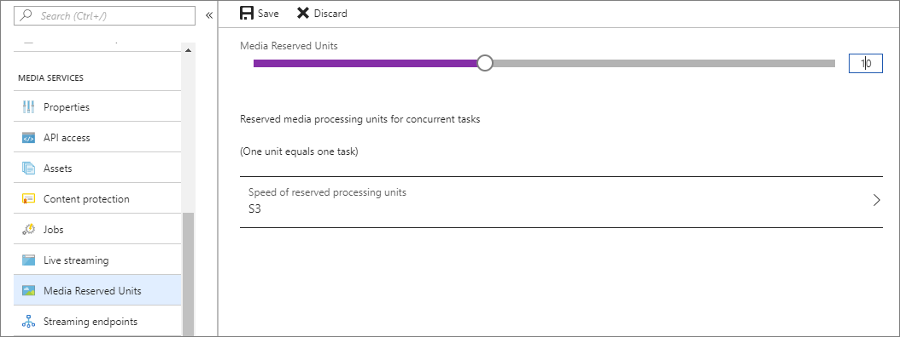

# Create an Azure Video Indexer account

When creating an Azure Video Indexer account, you can choose a free trial account (where you get a certain number of free indexing minutes) or a paid option (where you're not limited by the quota). With a free trial, Azure Video Indexer provides up to 600 minutes of free indexing to users and up to 2400 minutes of free indexing to users that subscribe to the Azure Video Indexer API on the [developer portal](https://aka.ms/avam-dev-portal). With the paid options, Azure Video Indexer offers two types of accounts: classic accounts(General Availability), and ARM-based accounts(Public Preview). Main difference between the two is account management platform. While classic accounts are built on the API Management, ARM-based accounts management is built on Azure, enables to apply access control to all services with role-based access control (Azure RBAC) natively.

* You can create an Azure Video Indexer **classic** account through our [API](https://aka.ms/avam-dev-portal).
* You can create an Azure Video Indexer **ARM-based** account through one of the following:

  1. [Azure Video Indexer portal](https://aka.ms/vi-portal-link)
  2. [Azure portal](https://portal.azure.com/#home)
  3. [QuickStart ARM template](https://github.com/Azure-Samples/media-services-video-indexer/tree/master/ARM-Samples/Create-Account)

To read more on how to create a **new ARM-Based** Azure Video Indexer account, read this [article](create-video-analyzer-for-media-account.md)

## How to create classic accounts
This article shows how to create an Azure Video Indexer classic account. The topic provides steps for connecting to Azure using the automatic (default) flow. It also shows how to connect to Azure manually (advanced).

If you are moving from a *trial* to *paid ARM-Based* Azure Video Indexer account, you can choose to copy all of the videos and model customization to the new account, as discussed in the [Import your content from the trial account](#import-your-content-from-the-trial-account) section.

The article also covers [Linking an Azure Video Indexer account to Azure Government](#azure-video-indexer-in-azure-government).

## Prerequisites for connecting to Azure

* An Azure subscription.

    If you don't have an Azure subscription yet, sign up for [Azure Free Trial](https://azure.microsoft.com/free/).
* An Azure Active Directory (Azure AD) domain.

    If you don't have an Azure AD domain, create this domain with your Azure subscription. For more information, see [Managing custom domain names in your Azure AD](../active-directory/enterprise-users/domains-manage.md)
* A user in your Azure AD domain with an **Application administrator** role. You'll use this member when connecting your Azure Video Indexer account to Azure.

    This user should be an Azure AD user with a work or school account. Don't use a personal account, such as outlook.com, live.com, or hotmail.com.

    :::image type="content" alt-text="Screenshot that shows how to choose a user in your Azure A D domain." source="./media/create-account/all-aad-users.png":::

### Additional prerequisites for automatic flow

* A user and member in your Azure AD domain.

    You'll use this member when connecting your Azure Video Indexer account to Azure.

    This user should be a member in your Azure subscription with either an **Owner** role, or both **Contributor** and **User Access Administrator** roles. A user can be added twice, with two roles. Once with Contributor and once with user Access Administrator. For more information, see [View the access a user has to Azure resources](../role-based-access-control/check-access.md).

    :::image type="content" alt-text="Screenshot that shows the access control settings." source="./media/create-account/access-control-iam.png":::

### Additional prerequisites for manual flow

* Register the Event Grid resource provider using the Azure portal.

    In the [Azure portal](https://portal.azure.com/), go to **Subscriptions**->[subscription]->**ResourceProviders**.

    Search for **Microsoft.Media** and **Microsoft.EventGrid**. If not in the "Registered" state, click **Register**. It takes a couple of minutes to register.

    :::image type="content" alt-text="Screenshot that shows how to select an event grid subscription." source="./media/create-account/event-grid.png":::

## Connect to Azure manually (advanced option)

If the connection to Azure failed, you can attempt to troubleshoot the problem by connecting manually.

> [!NOTE]
> It's mandatory to have the following three accounts in the same region: the Azure Video Indexer account that you're connecting with the Media Services account, as well as the Azure storage account connected to the same Media Services account.

### Create and configure a Media Services account

1. Use the [Azure](https://portal.azure.com/) portal to create an Azure Media Services account, as described in [Create an account](/azure/azure/media-services/previous/media-services-portal-create-account).

     Make sure the Media Services account was created with the classic APIs.

    :::image type="content" alt-text="Screenshot that shows how to use the classic API." source="./media/create-account/enable-classic-api.png":::

    When creating a storage account for your Media Services account, select **StorageV2** for account kind and **Geo-redundant** (GRS) for replication fields.

    :::image type="content" alt-text="Screenshot that shows how to specify a storage account." source="./media/create-account/create-new-ams-account.png":::

    > [!NOTE]
    > Make sure to write down the Media Services resource and account names. You'll need them for the steps in the next section.

1. Before you can play your videos in the Azure Video Indexer web app, you must start the default **Streaming Endpoint** of the new Media Services account.

    In the new Media Services account, select **Streaming endpoints**. Then select the streaming endpoint and press start.

    :::image type="content" alt-text="Screenshot that shows how to specify streaming endpoints." source="./media/create-account/create-ams-account-se.png":::
4. For Azure Video Indexer to authenticate with Media Services API, an AD app needs to be created. The following steps guide you through the Azure AD authentication process described in [Get started with Azure AD authentication by using the Azure portal](/azure/azure/media-services/previous/media-services-portal-get-started-with-aad):

    1. In the new Media Services account, select **API access**.
    2. Select [Service principal authentication method](/azure/azure/media-services/previous/media-services-portal-get-started-with-aad).
    3. Get the client ID and client secret

        After you select **Settings**->**Keys**, add **Description**, press **Save**, and the key value gets populated.

        If the key expires, the account owner will have to contact Azure Video Indexer support to renew the key.

        > [!NOTE]
        > Make sure to write down the key value and the Application ID. You'll need it for the steps in the next section.

### Connect manually

In the **Create a new account on an Azure subscription** dialog of your [Azure Video Indexer](https://www.videoindexer.ai/) page, select the **Switch to manual configuration** link.

In the dialog, provide the following information:

|Setting|Description|
|---|---|
|Azure Video Indexer account region|The name of the Azure Video Indexer account region. For better performance and lower costs, it's highly recommended to specify the name of the region where the Azure Media Services resource and Azure Storage account are located. |
|Azure AD tenant|The name of the Azure AD tenant, for example "contoso.onmicrosoft.com". The tenant information can be retrieved from the Azure portal. Place your cursor over the name of the signed-in user in the top-right corner. Find the name to the right of **Domain**.|
|Subscription ID|The Azure subscription under which this connection should be created. The subscription ID can be retrieved from the Azure portal. Select **All services** in the left panel, and search for "subscriptions". Select **Subscriptions** and choose the desired ID from the list of your subscriptions.|
|Azure Media Services resource group name|The name for the resource group in which you created the Media Services account.|
|Media service resource name|The name of the Azure Media Services account that you created in the previous section.|
|Application ID|The Azure AD application ID (with permissions for the specified Media Services account) that you created in the previous section.|
|Application key|The Azure AD application key that you created in the previous section. |

### Import your content from the *trial* account

When creating a new **ARM-Based** account, you have an option to import your content from the *trial* account into the new **ARM-Based** account free of charge.
> [!NOTE]
> * Import from trial can be performed only once per trial account.
> * The target ARM-Based account needs to be created and available before import is assigned.
> * Target ARM-Based account has to be an empty account (never indexed any media files).

To import your data, follow the steps:
 1. Go to [Azure Video Indexer portal](https://aka.ms/vi-portal-link)
 2. Select your trial account and go to the *account settings* page
 3. Click the *Import content to an ARM-based account*
 4. From the dropdown menu choose the ARM-based account you wish to import the data to.
   * If the account ID isn't showing, you can copy and paste the account ID from Azure portal or the account list, on the side blade in the Azure Video Indexer Portal.
 5. Click **Import content**

    :::image type="content" alt-text="Screenshot that shows how to import your data." source="./media/create-account/import-to-arm-account.png":::

All media and content model customizations will be copied from the *trial* account into the new ARM-Based account.

> [!NOTE]
>
> The *trial* account is not availagle on the Azure Government cloud.

## Azure Media Services considerations

The following Azure Media Services related considerations apply:

* If you plan to connect to an existing Media Services account, make sure the Media Services account was created with the classic APIs.

    
* If you connect to an existing Media Services account, Azure Video Indexer doesn't change the existing media **Reserved Units** configuration.

   You might need to adjust the type and number of Media Reserved Units according to your planned load. Keep in mind that if your load is high and you don't have enough units or speed, videos processing can result in timeout failures.
* If you connect to a new Media Services account, Azure Video Indexer automatically starts the default **Streaming Endpoint** in it:

    

    Streaming endpoints have a considerable startup time. Therefore, it may take several minutes from the time you connected your account to Azure until your videos can be streamed and watched in the Azure Video Indexer web app.
* If you connect to an existing Media Services account, Azure Video Indexer doesn't change the default Streaming Endpoint configuration. If there's no running **Streaming Endpoint**, you can't watch videos from this Media Services account or in Azure Video Indexer.
* If you connect automatically, Azure Video Indexer sets the media **Reserved Units** to 10 S3 units:

    

## Automate creation of the Azure Video Indexer account

To automate the creation of the account is a two steps process:

1. Use Azure Resource Manager to create an Azure Media Services account + Azure AD application.

    See an example of the [Media Services account creation template](https://github.com/Azure-Samples/media-services-v3-arm-templates).
1. Call [Create-Account with the Media Services and Azure AD application](https://videoindexer.ai.azure.us/account/login?source=apim).

## Azure Video Indexer in Azure Government

### Prerequisites for connecting to Azure Government

-	An Azure subscription in [Azure Government](../azure-government/index.yml).
- An Azure AD account in Azure Government.
- All pre-requirements of permissions and resources as described above in [Prerequisites for connecting to Azure](#prerequisites-for-connecting-to-azure). Make sure to check [Additional prerequisites for automatic flow](#additional-prerequisites-for-automatic-flow) and [Additional prerequisites for manual flow](#additional-prerequisites-for-manual-flow).

### Create new account via the Azure Government portal

> [!NOTE]
> The Azure Government cloud does not include a *trial* experience of Azure Video Indexer.

To create a paid account via the Azure Video Indexer portal:

1. Go to https://videoindexer.ai.azure.us
1. Log in with your Azure Government Azure AD account.
1.	If you do not have any Azure Video Indexer accounts in Azure Government that you are an owner or a contributor to, you will get an empty experience from which you can start creating your account.

    The rest of the flow is as described in above, only the regions to select from will be Government regions in which Azure Video Indexer is available

    If you already are a contributor or an admin of an existing one or more Azure Video Indexer accounts in Azure Government, you will be taken to that account and from there you can start a following steps for creating an additional account if needed, as described above.

### Create new account via the API on Azure Government

To create a paid account in Azure Government, follow the instructions in [Create-Paid-Account](https://api-portal.videoindexer.ai/api-details#api=Operations&operation=Create-Paid-Account). This API end point only includes Government cloud regions.

### Limitations of Azure Video Indexer on Azure Government

*	No manual content moderation available in Government cloud.

    In the public cloud when content is deemed offensive based on a content moderation, the customer can ask for a human to look at that content and potentially revert that decision.
*	No trial accounts.
* Bing description - in Gov cloud we will not present a description of celebrities and named entities identified. This is a UI capability only.

## Clean up resources

After you are done with this tutorial, delete resources that you are not planning to use.

### Delete an Azure Video Indexer account

If you want to delete an Azure Video Indexer account, you can delete the account from the Azure Video Indexer website. To delete the account, you must be the owner.

Select the account -> **Settings** -> **Delete this account**.

The account will be permanently deleted in 90 days.

## Firewall

See [Storage account that is behind a firewall](faq.yml#can-a-storage-account-connected-to-the-media-services-account-be-behind-a-firewall).

## Next steps

You can programmatically interact with your trial account and/or with your Azure Video Indexer accounts that are connected to Azure by following the instructions in: [Use APIs](video-indexer-use-apis.md).

You should use the same Azure AD user you used when connecting to Azure.
