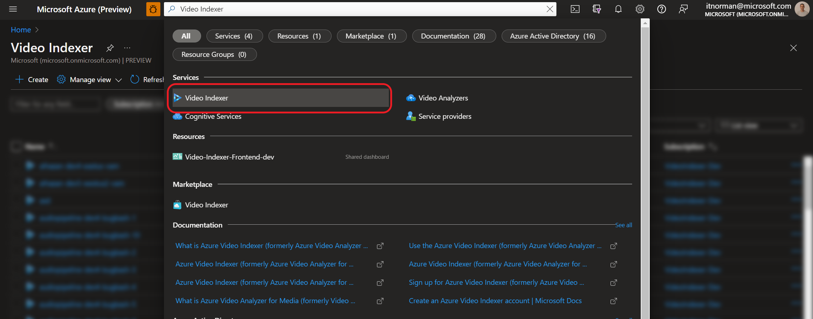
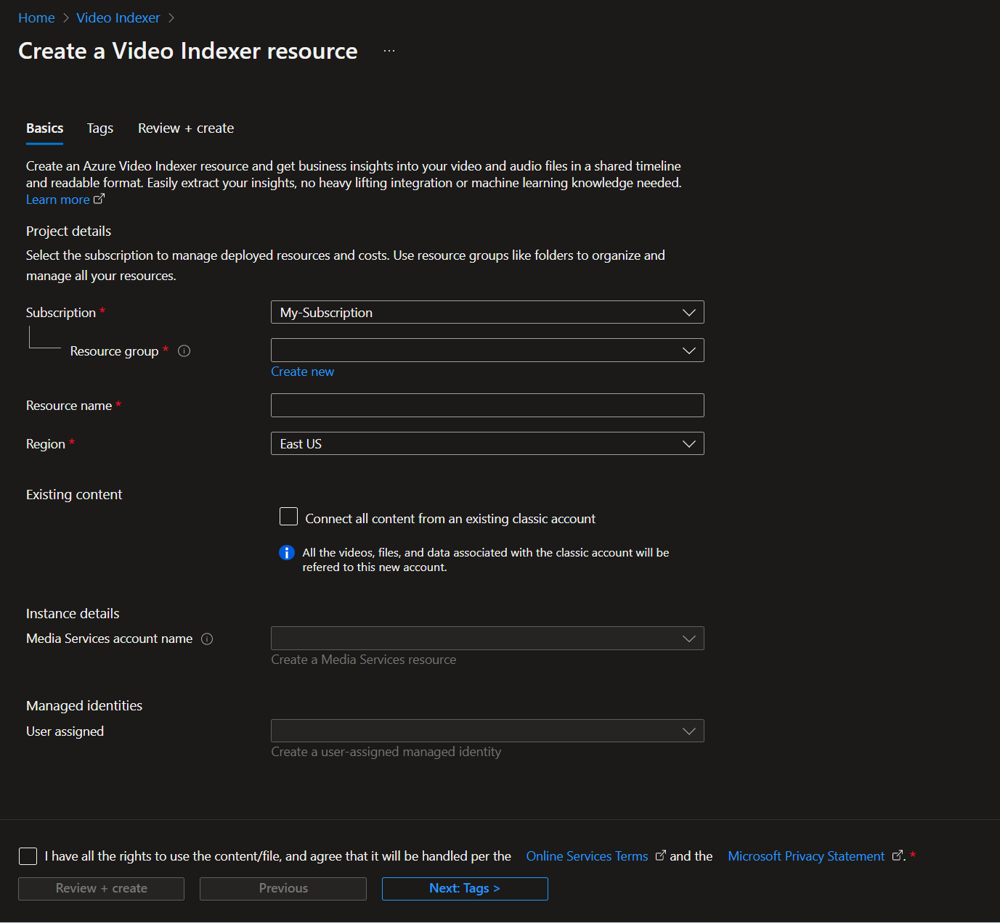
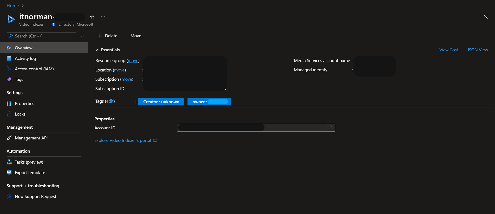
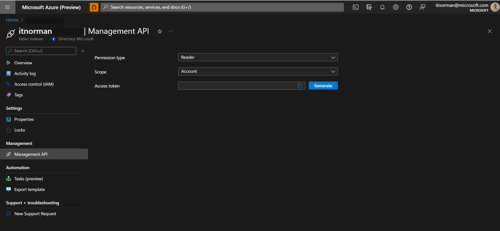

# Get started with Azure Video Indexer in Azure portal

This Quickstart walks you through the steps to get started with Azure Video Indexer. You will create an Azure Video Indexer account and its accompanying resources by using the Azure portal.

To start using Azure Video Indexer, you will need to create an Azure Video Indexer account. The account needs to be associated with a [Media Services][docs-ms] resource and a [User-assigned managed identity][docs-uami]. The managed identity will need to have Contributor permissions role on the Media Services.

## Prerequisites

### Azure level

* This user should be a member of your Azure subscription with either an **Owner** role, or both **Contributor** and **User Access Administrator** roles. A user can be added twice, with two roles. Once with Contributor and once with user Access Administrator. For more information, see [View the access a user has to Azure resources](../role-based-access-control/check-access.md).
* Register the **EventGrid** resource provider using the Azure portal.
    
    In the [Azure portal](https://ms.portal.azure.com), go to **Subscriptions**->[<*subscription*>]->**ResourceProviders**.
Search for **Microsoft.Media** and **Microsoft.EventGrid**. If not in the "Registered" state, click **Register**. It takes a couple of minutes to register. 

### Azure Video Indexer

* Owner* role assignment on the Subscription level.

    * Owner* role assignment on the related Azure Media Services (AMS)
    * Owner* role assignment on the related Managed Identity

*Or both **Contributor** and **User Access Administrator** roles

## Azure portal

### Create an Azure Video Indexer account in the Azure portal

1. Sign into the [Azure portal](https://portal.azure.com/).
1. Using the search bar at the top, enter **"Azure Video Indexer"**.
1. Click on *Azure Video Indexer* under *Services*.

    

1. Click **Create**.
1. In the **Create an Azure Video Indexer resource** section enter required values. 

    
    
    Here are the definitions:
    
    | Name | Description|
    |---|---|
    |**Subscription**|Choose the subscription that you are using to create the Azure Video Indexer account.|
    |**Resource Group**|Choose a resource group where you are creating the Azure Video Indexer account, or select **Create new** to create a resource group.|
    |**Azure Video Indexer account**|Select *Create a new account* option.|
    |**Resource name**|Enter the name of the new Azure Video Indexer account, the name can contain letters, numbers and dashes with no spaces.|
    |**Region**|Select the geographic region that will be used to deploy the Azure Video Indexer account. The location matches the **resource group location** you chose, if you'd like to change the selected location change the selected resource group or create a new one in the preferred location. [Azure region in which Azure Video Indexer is available](https://azure.microsoft.com/global-infrastructure/services/?products=cognitive-services&regions=all)|
    |**Media Services account name**|Select a Media Services that the new Azure Video Indexer account will use to process the videos. You can select an existing Media Services or you can create a new one. The Media Services must be in the same location you selected.|
    |**User-assigned managed identity**|Select a user-assigned managed identity that the new Azure Video Indexer account will use to access the Media Services. You can select an existing user-assigned managed identity or you can create a new one. The user-assignment managed identity will be assigned the role of Contributor role on the Media Services.|
1. Click **Review + create** at the bottom of the form.

### Review deployed resource

You can use the Azure portal to validate the Azure Video Indexer account and other resources that were created. After the deployment is finished, select **Go to resource** to see your new Azure Video Indexer account.

### Overview

Click on *Explore Azure Video Indexer's portal* to view your new account on the [Azure Video Indexer portal](https://aka.ms/vi-portal-link)

### Management API

Use the *Management API* tab to manually generate access tokens for the account.
This token can be used to authenticate API calls for this account. Each token is valid for one hour.

Choose the following:
* Permission type: **Contributor** or **Reader**
* Scope: **Account**, **Project** or **Video**
    * For **Project** or **Video** you should also insert the matching ID
* Click **Generate**

---

### Next steps

Learn how to [Upload a video using C#](https://github.com/Azure-Samples/media-services-video-indexer/tree/master/ApiUsage/ArmBased).

<!-- links -->
[docs-uami]: ../active-directory/managed-identities-azure-resources/overview.md
[docs-ms]: /azure/media-services/latest/media-services-overview
[docs-role-contributor]: ../../role-based-access-control/built-in-roles.md#contibutor
[docs-contributor-on-ms]: ./add-contributor-role-on-the-media-service.md
