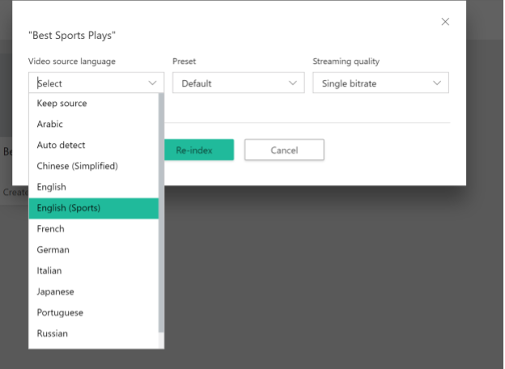
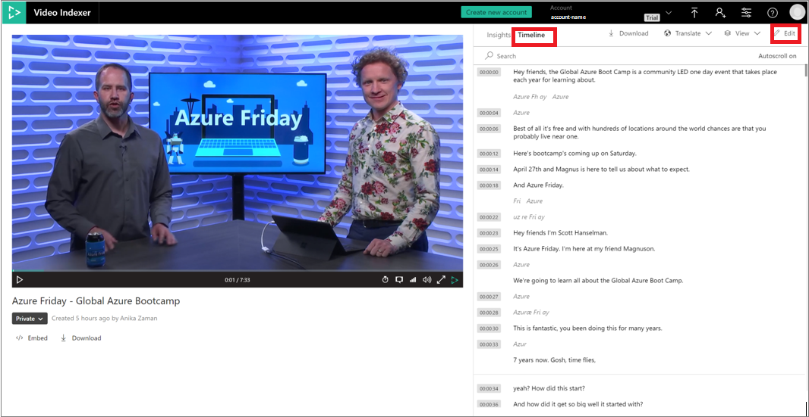

# Customize a Language model with the Azure AI Video Indexer website

[!INCLUDE [AMS AVI retirement announcement](./includes/important-ams-retirement-avi-announcement.md)]

Azure AI Video Indexer lets you create custom Language models to customize speech recognition by uploading adaptation text, namely text from the domain whose vocabulary you'd like the engine to adapt to. Once you train your model, new words appearing in the adaptation text will be recognized.

For a detailed overview and best practices for custom language models, see [Customize a Language model with Azure AI Video Indexer](customize-language-model-overview.md).

You can use the Azure AI Video Indexer website to create and edit custom Language models in your account, as described in this topic. You can also use the API, as described in [Customize Language model using APIs](customize-language-model-with-api.md).

## Create a Language model

1. Go to the [Azure AI Video Indexer](https://www.videoindexer.ai/) website and sign in.
1. To customize a model in your account, select the **Content model customization** button on the left of the page.

    > [!div class="mx-imgBorder"]
    > :::image type="content" source="./media/customize-language-model/model-customization.png" alt-text="Customize content model in Azure AI Video Indexer ":::
1. Select the **Language** tab.

    You see a list of supported languages.
1. Under the language that you want, select **Add model**.
1. Type in the name for the Language model and hit enter.

    This step creates the model and gives the option to upload text files to the model.
1. To add a text file, select **Add file**. Your file explorer will open.
1. Navigate to and select the text file. You can add multiple text files to a Language model.

    You can also add a text file by selecting the **...** button on the right side of the Language model and selecting **Add file**.
1. Once you're done uploading the text files, select the green **Train** option.

The training process can take a few minutes. Once the training is done, you see **Trained** next to the model. You can preview, download, and delete the file from the model.

> [!div class="mx-imgBorder"]
> :::image type="content" source="./media/customize-language-model/customize-language-model.png" alt-text="Train the model":::

### Using a Language model on a new video

To use your Language model on a new video, do one of the following actions:

* Select the **Upload** button on the top of the page.

    
* Drop your audio or video file or browse for your file.

You're given the option to select the **Video source language**. Select the drop-down and select a Language model that you created from the list. It should say the language of your Language model and the name that you gave it in parentheses. For example:

Select the **Upload** option in the bottom of the page, and your new video will be indexed using your Language model.

### Using a Language model to reindex

To use your Language model to reindex a video in your collection, follow these steps:

1. Sign in to the [Azure AI Video Indexer](https://www.videoindexer.ai/) home page.
1. Click on **...** button on the video and select **Re-index**.
1. You're given the option to select the **Video source language** to reindex your video with. Select the drop-down and select a Language model that you created from the list. It should say the language of your language model and the name that you gave it in parentheses.
1. Select the **Re-index** button and your video will be reindexed using your Language model.

## Edit a Language model

You can edit a Language model by changing its name, adding files to it, and deleting files from it.

If you add or delete files from the Language model, you'll have to train the model again by selecting the green **Train** option.

### Rename the Language model

You can change the name of the Language model by selecting the ellipsis (**...**) button on the right side of the Language model and selecting **Rename**.

Type in the new name and hit enter.

### Add files

To add a text file, select **Add file**. Your file explorer will open.

Navigate to and select the text file. You can add multiple text files to a Language model.

You can also add a text file by selecting the ellipsis (**...**) button on the right side of the Language model and selecting **Add file**.

### Delete files

To delete a file from the Language model, select the ellipsis (**...**) button on the right side of the text file and select **Delete**. A new window pops up telling you that the deletion can't be undone. Select the **Delete** option in the new window.

This action removes the file completely from the Language model.

## Delete a Language model

To delete a Language model from your account, select the ellipsis (**...**) button on the right side of the Language model and select **Delete**.

A new window pops up telling you that the deletion can't be undone. Select the **Delete** option in the new window.

This action removes the Language model completely from your account. Any video that was using the deleted Language model will keep the same index until you reindex the video. If you reindex the video, you can assign a new Language model to the video. Otherwise,  Azure AI Video Indexer will use its default model to reindex the video.

## Customize Language models by correcting transcripts

Azure AI Video Indexer supports automatic customization of Language models based on the actual corrections users make to the transcriptions of their videos.

1. To make corrections to a transcript, open up the video that you want to edit from your Account Videos. Select the **Timeline** tab.

    

1. Select the pencil icon to edit the transcript of your transcription.

    

    Azure AI Video Indexer captures all lines that are corrected by you in the transcription of your video and adds them automatically to a text file called "From transcript edits". These edits are used to retrain the specific Language model that was used to index this video. 
    
    The edits that were done in the [widget's](video-indexer-embed-widgets.md) timeline are also included.
    
    If you didn't specify a Language model when indexing this video, all edits for this video will be stored in a default Language model called "Account adaptations" within the detected language of the video.
    
    In case multiple edits have been made to the same line, only the last version of the corrected line will be used for updating the Language model.  
    
    > [!NOTE]
    > Only textual corrections are used for the customization. Corrections that don't involve actual words (for example, punctuation marks or spaces) aren't included.
    
1. You'll see transcript corrections show up in the Language tab of the Content model customization page.

   To look at the "From transcript edits" file for each of your Language models, select it to open it.

    

## Next steps

[Customize language model using APIs](customize-language-model-with-api.md)
