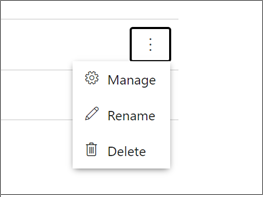

# Customize a Person model with the Azure AI Video Indexer website

[!INCLUDE [Gate notice](./includes/face-limited-access.md)]

Azure AI Video Indexer supports celebrity recognition for video content. The celebrity recognition feature covers approximately one million faces based on commonly requested data source such as IMDB, Wikipedia, and top LinkedIn influencers. For a detailed overview, see [Customize a Person model in Azure AI Video Indexer](customize-person-model-overview.md).

You can use the Azure AI Video Indexer website to edit faces that were detected in a video, as described in this article. You can also use the API, as described in [Customize a Person model using APIs](customize-person-model-with-api.md).

## Central management of Person models in your account

1. To view, edit, and delete the Person models in your account, browse to the Azure AI Video Indexer website and sign in.
1. Select the content model customization button on the left of the page.

    > [!div class="mx-imgBorder"]
    > :::image type="content" source="./media/content-model-customization/content-model-customization.png" alt-text="Customize content model":::
1. Select the People tab.

    You'll see the Default Person model in your account. The Default Person model holds any faces you may have edited or changed in the insights of your videos for which you didn't specify a custom Person model during indexing.

    If you created other Person models, they'll also be listed on this page.

    > [!div class="mx-imgBorder"]
    > :::image type="content" source="./media/customize-face-model/content-model-customization-people-tab.png" alt-text="Customize people":::

## Create a new Person model

1. Select the **+ Add model** button on the right.
1. Enter the name of the model and select the check button to save the new model created. You can now add new people and faces to the new Person model.
1. Select the list menu button and choose **+ Add person**.

    > [!div class="mx-imgBorder"]
    > :::image type="content" source="./media/customize-face-model/add-new-person.png" alt-text="Add a peron":::

## Add a new person to a Person model

> [!NOTE]
> Azure AI Video Indexer allows you to add multiple people with the same name in a Person model. However, it's recommended you give unique names to each person in your model for usability and clarity.

1. To add a new face to a Person model, select the list menu button next to the Person model that you want to add the face to.
1. Select **+ Add person** from the menu.

    A pop-up will prompt you to fill out the Person's details. Type in the name of the person and select the check button.

    You can then choose from your file explorer or drag and drop the face images of the face. Azure AI Video Indexer will take all standard image file types (ex: JPG, PNG, and more).

    Azure AI Video Indexer can detect occurrences of this person in the future videos that you index and the current videos that you had already indexed, using the Person model to which you added this new face. Recognition of the person in your current videos might take some time to take effect, as this is a batch process.

## Rename a Person model

You can rename any Person model in your account including the Default Person model. Even if you rename your default Person model, it will still serve as the Default person model in your account.

1. Select the list menu button next to the Person model that you want to rename.
1. Select **Rename** from the menu.
1. Select the current name of the model and type in your new name.
1. Select the check button for your model to be renamed.

## Delete a Person model

You can delete any Person model that you created in your account. However, you can't delete your Default person model.

1. Select **Delete** from the menu.

    A pop-up will show up and notify you that this action will delete the Person model and all of the people and files that it contains. This action can't be undone.
1. If you're sure, select delete again.

> [!NOTE]
> The existing videos that were indexed using this (now deleted) Person model won't support the ability for you to update the names of the faces that appear in the video. You'll be able to edit the names of faces in these videos only after you reindex them using another Person model. If you reindex without specifying a Person model, the default model will be used.

## Manage existing people in a Person model

To look at the contents of any of your Person models, select the arrow next to the name of the Person model. Then you can view all of the people in that particular Person model. If you select the list menu button next to each of the people, you see manage, rename, and delete options.  

### Rename a person

1. To rename a person in your Person model, select the list menu button and choose **Rename** from the list menu.
1. Select the current name of the person and type in your new name.
1. Select the check button, and the person will be renamed.

### Delete a person

1. To delete a person from your Person model, select the list menu button and choose **Delete** from the list menu.
1. A pop-up tells you that this action will delete the person and that this action can't be undone.
1. Select **Delete** again and this will remove the person from the Person model.

### Check if a person already exists 

You can use the search to check if a person already exists in the model.

### Manage a person

If you select **Manage**, you see the **Person's details** window with all the faces that this Person model is being trained from. These faces come from occurrences of that person in videos that use this Person model or from images that you've manually uploaded.

> [!TIP]
> You can get to the **Person's details** window by clicking on the person's name or by clicking **Manage**, as shown above.

#### Add a face

You can add more faces to the person by selecting **Add images**.

#### Delete a face

Select the image you wish to delete and click **Delete**.

#### Rename and delete a person 

You can use the manage pane to rename the person and to delete the person from the Person model.

## Use a Person model to index a video

You can use a Person model to index your new video by assigning the Person model during the upload of the video.

To use your Person model on a new video, do the following steps:

1. Select the **Upload** button on the right of the page.
1. Drop your video file or browse for your file.
1. Select the **Advanced options** arrow.
1. Select the drop-down and select the Person model that you created.
1. Select the **Upload** option in the bottom of the page, and your new video will be indexed using your Person model.

If you don't specify a Person model during the upload, Azure AI Video Indexer will index the video using the Default Person model in your account.

## Use a Person model to reindex a video

To use a Person model to reindex a video in your collection, go to your account videos on the Azure AI Video Indexer home page, and hover over the name of the video that you want to reindex.

You see options to edit, delete, and reindex your video.

1. Select the option to reindex your video.

    

    You can now select the Person model to reindex your video with.
1. Select the drop-down and select the Person model that you want to use.
1. Select the **Reindex** button and your video will be reindexed using your Person model.

Any new edits that you make to the faces detected and recognized in the video that you just reindexed will be saved in the Person model that you used to reindex the video.

## Managing people in your videos

You can manage the faces that are detected and people that are recognized in the videos that you index by editing and deleting faces.

Deleting a face removes a specific face from the insights of the video.

Editing a face renames a face that's detected and possibly recognized in your video. When you edit a face in your video, that name is saved as a person entry in the Person model that was assigned to the video during upload and indexing.

If you don't assign a Person model to the video during upload, your edit is saved in your account's Default person model.

### Edit a face

> [!NOTE]
> If a Person model has two or more different people with the same name, you won't be able to tag that name within the videos that use that Person model. You'll only be able to make changes to people that share that name in the People tab of the content model customization page in Azure AI Video Indexer. For this reason, it's recommended that you give unique names to each person in your Person model.

1. Browse to the Azure AI Video Indexer website and sign in.
1. Search for a video you want to view and edit in your account.
1. To edit a face in your video, go to the Insights tab and select the pencil icon on the top-right corner of the window.

    

1. Select any of the detected faces and change their names from "Unknown #X" (or the name that was previously assigned to the face).
1. After typing in the new name, select the check icon next to the new name. This action saves the new name and recognizes and names all occurrences of this face in your other current videos and in the future videos that you upload. Recognition of the face in your other current videos might take some time to take effect as this is a batch process.

If you name a face with the name of an existing person in the Person model that the video is using, the detected face images from this video of that person will merge with what already exists in the model. If you name a face with a new name, a new Person entry is created in the Person model that the video is using.

### Delete a face

To delete a detected face in your video, go to the Insights pane and select the pencil icon in the top-right corner of the pane. Select the **Delete** option underneath the name of the face. This action removes the detected face from the video. The person's face will still be detected in the other videos in which it appears, but you can delete the face from those videos as well after they've been indexed.

The person, if they had been named, will also continue to exist in the Person model that was used to index the video from which you deleted the face unless you specifically delete the person from the Person model.

## Optimize the ability of your model to recognize a person

To optimize your model ability to recognize the person, upload as many different images as possible and from different angles. To get optimal results, use high resolution images.

## Next steps

[Customize Person model using APIs](customize-person-model-with-api.md)
