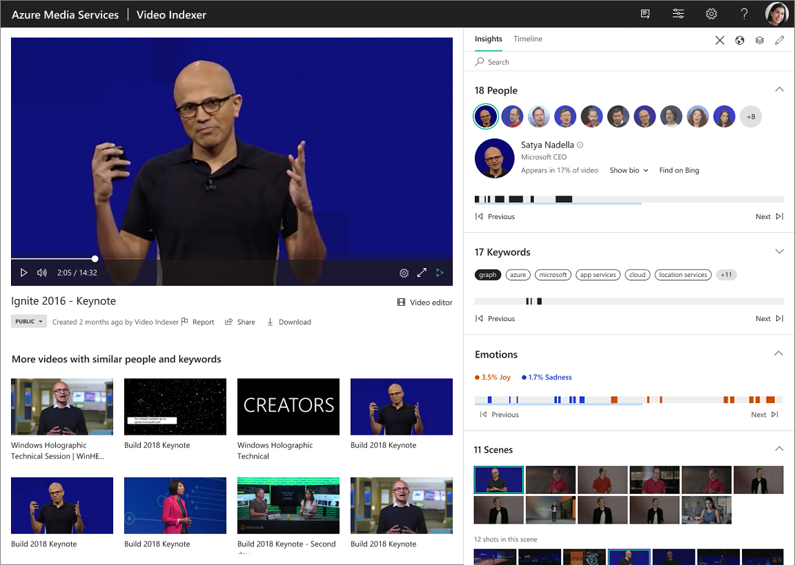

# Azure AI Video Indexer insights

[!INCLUDE [AMS AVI retirement announcement](./includes/important-ams-retirement-avi-announcement.md)]

When a video is indexed, Azure AI Video Indexer analyzes the video and audio content by running 30+ AI models, generating rich insights. Insights contain an aggregated view of the data: transcripts, optical character recognition elements (OCRs), face, topics, emotions, etc. Once the video is indexed and analyzed, Azure AI Video Indexer produces a JSON content that contains details of the video insights. For example, each insight type includes instances of time ranges that show when the insight appears in the video. 

Read details about the following insights here:

- [Audio effects detection](audio-effects-detection-overview.md)
- [Text-based emotion detection](emotions-detection.md)
- [Faces detection](face-detection.md)
- [OCR](ocr.md)
- [Keywords extraction](keywords.md)
- [Transcription, translation, language](transcription-translation-lid.md)
- [Labels identification](labels-identification.md)
- [Named entities](named-entities.md)
- [Observed people tracking & matched faces](observed-matched-people.md)
- [Topics inference](topics-inference.md)

For information about features and other insights, see:

- [Azure AI Video Indexer overview](video-indexer-overview.md)
- [Transparency note](/legal/azure-video-indexer/transparency-note?context=/azure/azure-video-indexer/context/context)

Once you [set up](video-indexer-get-started.md) an Azure AI Video Indexer account (see [account types](accounts-overview.md)) and [upload a video](upload-index-videos.md), you can view insights as described below.

## Get the insights using the website

To visually examine the video's insights, press the **Play** button on the video on the [Azure AI Video Indexer](https://www.videoindexer.ai/) website. 

To get insights produced on the website or the Azure portal:

1. Browse to the [Azure AI Video Indexer](https://www.videoindexer.ai/) website and sign in.
1. Find a video whose output you want to examine.
1. Press **Play**.
1. Choose the **Insights** tab.
2. Select which insights you want to view (under the **View** drop-down, on the right-top corner).
3. Go to the **Timeline** tab to see timestamped transcript lines.
4. Select **Download** > **Insights (JSON)** to get the insights output file.
5. If you want to download artifacts, beware of the following:

    [!INCLUDE [artifacts](./includes/artifacts.md)]

## Get insights produced by the API

When indexing with an API and the response status is OK, you get a detailed JSON output as the response content. When calling the [Get Video Index](https://api-portal.videoindexer.ai/api-details#api=Operations&operation=Get-Video-Index) API, we recommend passing `&includeSummarizedInsights=false`. 

[!INCLUDE [insights](./includes/insights.md)]

This API returns a URL only with a link to the specific resource type you request. An additional GET request must be made to this URL for the specific artifact. The file types for each artifact type vary depending on the artifact.

[!INCLUDE [artifacts](./includes/artifacts.md)]

## Examine the Azure AI Video Indexer output

For more information, see [Examine the Azure AI Video Indexer output]( video-indexer-output-json-v2.md).

## Next steps

[View and edit video insights](video-indexer-view-edit.md).
