# Logic Apps connector with ARM-based AVI accounts

Azure Video Indexer (AVI) [REST API](https://api-portal.videoindexer.ai/api-details#api=Operations&operation=Upload-Video) supports both server-to-server and client-to-server communication. The API enables you to integrate video and audio insights into your application logic. To make the integration easier, we support [Logic Apps](https://azure.microsoft.com/services/logic-apps/) and [Power Automate](https://preview.flow.microsoft.com/connectors/shared_videoindexer-v2/video-indexer-v2/) connectors that are compatible with the Azure Video Indexer API. 

You can use the connectors to set up custom workflows to effectively index and extract insights from a large amount of video and audio files, without writing a single line of code. Furthermore, using the connectors for the integration gives you better visibility on the health of your workflow and an easy way to debug it.

> [!TIP]
> If you are using a classic AVI account, see [Logic Apps connector with classic-based AVI accounts](logic-apps-connector-tutorial.md).

## Get started with the Azure Video Indexer connectors

To help you get started quickly with the Azure Video Indexer connectors, the example in this article creates Logic App flows. The Logic App and Power Automate capabilities and their editors are almost identical, thus the diagrams and explanations are applicable to both. The example in this article is based on the ARM AVI account. If you're working with a classic account, see [Logic App connectors with classic-based AVI accounts](logic-apps-connector-tutorial.md).

The "upload and index your video automatically" scenario covered in this article is composed of two different flows that work together. The "two flow" approach is used to support async upload and indexing of larger files effectively. 

* The first flow is triggered when a blob is added or modified in an Azure Storage account. It uploads the new file to Azure Video Indexer with a callback URL to send a notification once the indexing operation completes.
* The second flow is triggered based on the callback URL and saves the extracted insights back to a JSON file in Azure Storage. 

The logic apps that you create in this article, contain one flow per app. The second section ("**Create a second flow - JSON extraction**") explains how to connect the two. The second flow stands alone and is triggered by the first one (the section with the callback URL). 

## Prerequisites

- [!INCLUDE [quickstarts-free-trial-note](../../includes/quickstarts-free-trial-note.md)]
- Create an ARM-based [Azure Video Indexer account](create-account-portal.md).
- Create an Azure Storage account. Keep note of the access key for your Storage account.

    Create two containers: one to store the media files, second to store the insights generated by Azure Video Indexer. In this article, the containers are `videos` and `insights`.

## Set up the first flow - file upload

In this section you'll, you create the following flow. The first flow is triggered when a blob is added or modified in an Azure Storage account. It uploads the new file to Azure Video Indexer with a callback URL to send a notification once the indexing operation completes. 

The following image shows the first flow:

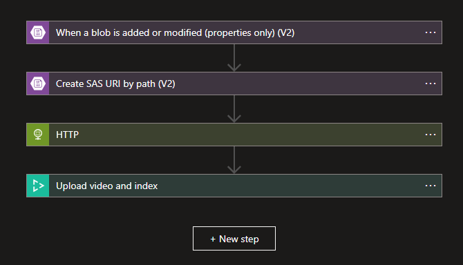

1. Create the [Logic App](https://ms.portal.azure.com/#create/Microsoft.LogicApp). We create a Logic App in the same region as the Azure Video  Indexer region (recommended but not required). We call the logic app `UploadIndexVideosApp`.

    1. Select **Consumption** for **Plan type**.
    1. Press **Review + Create** -> **Create**.
    1. Once the Logic App deployment is complete, in the Azure portal, go to the newly created Logic App.
    1. Under the **Settings** section, on the left side's panel, select the **Identity** tab.
    1. Under **System assigned**, change the **Status** from **Off** to **On** (the step is important for later on in this tutorial).
    1. Press **Save** (on the top of the page).
    1. Select the **Logic app designer** tab, in the pane on the left.
    1. Pick a **Blank Logic App** flow.
    1. Search for "blob".
    1. In the **All** tab, choose the **Azure Blob Storage** component.
    1. Under **Triggers**, select the **When a blob is added or modified (properties only) (V2)** trigger. 
1. Set the storage connection.

    After creating a **When a blob is added or modified (properties only) (V2)** trigger, the connection needs to be set to the following values:  
    
    |Key | Value|
    |--|--|
    |Connection name | <*Name your connection*>.  | 
    |Authentication type | Access Key|
    |Azure Storage Account name| <*Storage account name where media files are going to be stored*>.|
    |Azure Storage Account Access Key| To get access key of your storage account: in the Azure portal -> my-storage -> under **Security + networking** -> **Access keys** -> copy one of the keys.|
    
    Select **Create**.
     
    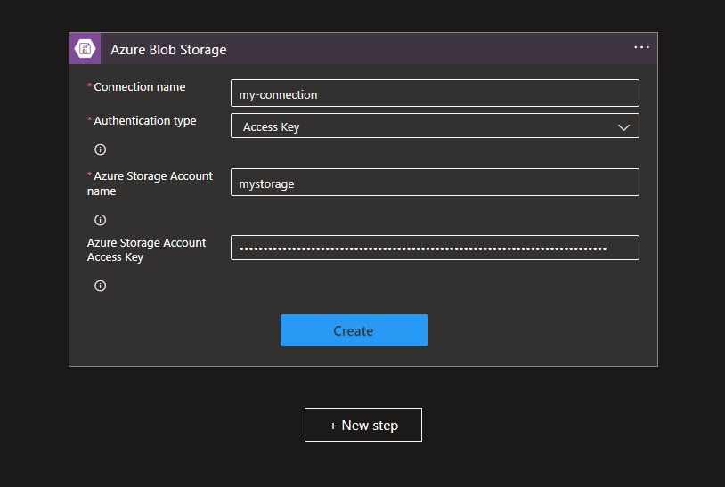
    
    After setting the connection to the storage, it's required to specify the blob storage container that is being monitored for changes.
    
    |Key| Value|
    |--|--|
    |Storage account name | *Storage account name where media files are stored*|
    |Container| `/videos`|
     
    Select **Save** -> **+New step**
     
    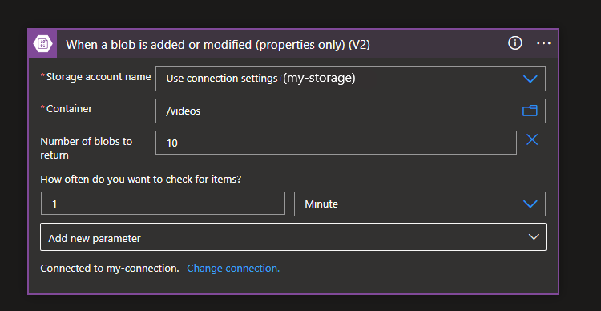
1. Create SAS URI by path action.
    
    1. Select the **Action** tab.  
    1. Search for and select **Create SAS URI by path (V2)**.
    
    |Key| Value|
    |--|--|
    |Storage account name | <*The storage account name where media files as stored*>.|
    | Blob path| Under **Dynamic content**, select **List of Files Path**|
    | Group Policy Identifier| Leave the default value.|
    | Permissions| **Read** |
    | Shared Access protocol (appears after pressing **Add new parameter**)| **HttpsOnly**|
    
    Select **Save** (at the top of the page). 
    
    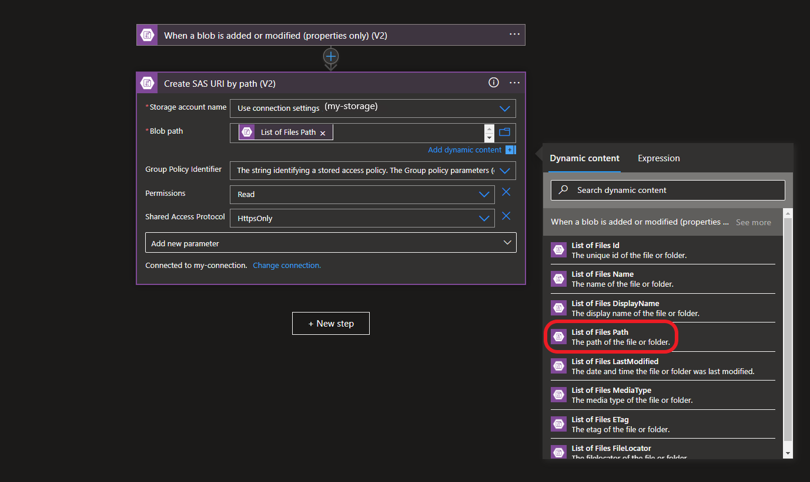
        
    Select **+New Step**.
1. Generate an access token.
    
    > [!NOTE]
    > For details about the ARM API and the request/response examples, see [Generate an Azure Video Indexer access token](/rest/api/videoindexer/generate/access-token?tabs=HTTP).
    >
    > Press **Try it** to get the correct values for your account.

    Search and create an **HTTP** action.
    
    |Key| Value|
    |----|----|
    |Method | **POST**|
    | URI| `https://management.azure.com/subscriptions/{subscriptionId}/resourceGroups/{resourceGroupName}/providers/Microsoft.VideoIndexer/accounts/{accountName}/generateAccessToken?api-version={API-version}`. |
    | Body|`{ "permissionType": "Contributor", "scope": "Account" }` |
    | Add new parameter | **Authentication**  |
    
    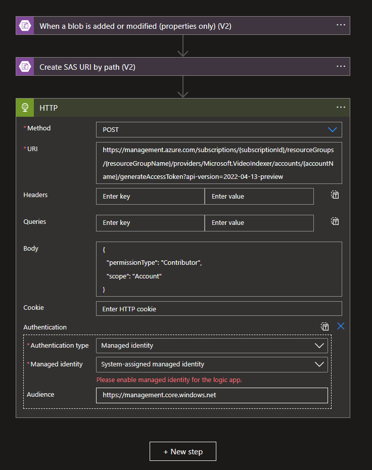
     
    After the **Authentication** parameter is added, fill the required parameters according to the table below:
        
    |Key| Value|
    |----|----|
    | Authentication type | **Managed identity** |
    | Managed identity | **System-assigned managed identity**|
    | Audience | `https://management.core.windows.net` |
    
    Select **Save**.
    
    > [!TIP]
    > Before moving to the next step step up the right permission between the Logic app and the Azure Video Indexer account.
    >
    > Make sure you have followed the steps to enable the system -assigned managed identity of your Logic Apps.

    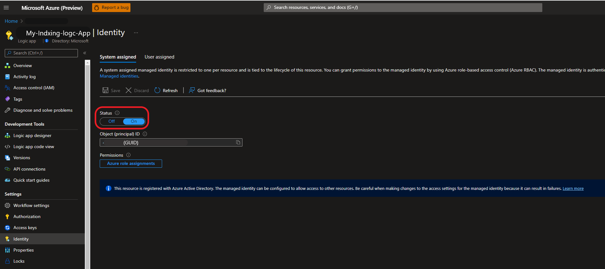
    1. Set up system assigned managed identity for permission on Azure Video Indexer resource.

        In the Azure portal, go to your Azure Video Indexer resource/account.

        1. On the left side blade, and select **Access control**.
        1. Select **Add** -> **Add role assignment** -> **Contributor** -> **Next** -> **User, group, or service principal** -> **+Select members**.
        1. Under **Members**, search for the Logic Apps name you created (in this case, `UploadIndexVideosApp`).
        1. Press **Select**.
        1. Press **Review + assign**.
1. Back in your Logic App, create an **Upload video and index** action.
    
    1. Select **Video Indexer(V2)**.
    1. From Video Indexer(V2) chose **Upload Video and index**.
    1. Set the connection to the Video Indexer account.

        |Key| Value|
        |----|----|
        | Connection name| <*Enter a name for the connection*>, in this case `aviconnection`.|
        | API key| This is your personal API key, which is available under **Profile** in the [developer portal](https://api-portal.videoindexer.ai/profile)|
    
        Select **Create**.
    1. Fill **Upload video and index** action parameters.
    
        > [!TIP]
        > If the AVI Account ID cannot be found and isn't in the drop-down, use the custom value.
        
        |Key| Value|
        |----|----|
        |Location| Location of the associated the Azure Video Indexer account.|	
        | Account ID| Account ID of the associated Azure Video Indexer account. You can find the **Account ID** in the **Overview** page of your account, in the Azure portal. Or, the **Account settings** tab, left of the [Azure Video Indexer website](https://www.videoindexer.ai/).|
        |Access Token| Use the `body('HTTP')['accessToken']` expression to extract the access token in the right format from the previous HTTP call.|
        | Video Name| Select **List of Files Name** from the dynamic content of **When a blob is added or modified** action. |
        |Video URL|Select **Web Url** from the dynamic content of **Create SAS URI by path** action.|
        | Body| Can be left as default.|
        
        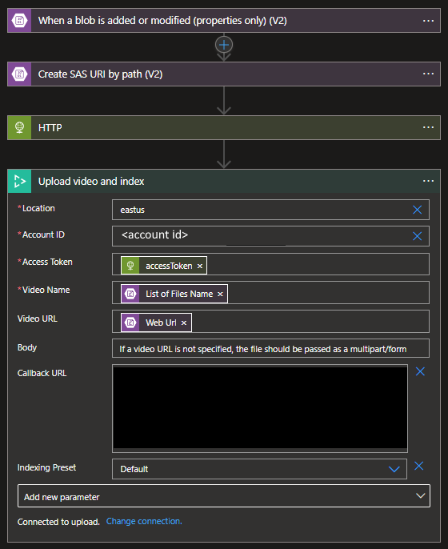

        Select **Save**.

The completion of the uploading and indexing from the first flow will send an HTTP request with the correct callback URL to trigger the second flow. Then, it will retrieve the insights generated by Azure Video Indexer. In this example, it will store the output of your indexing job in your Azure Storage. However, it's up to you what you do with the output.

## Create a second flow - JSON extraction

Create the second flow, Logic Apps of type consumption. The second flow is triggered based on the callback URL and saves the extracted insights back to a JSON file in Azure Storage. 

1. Set up the trigger
    
    Search for the **When an HTTP request is received**.
    
    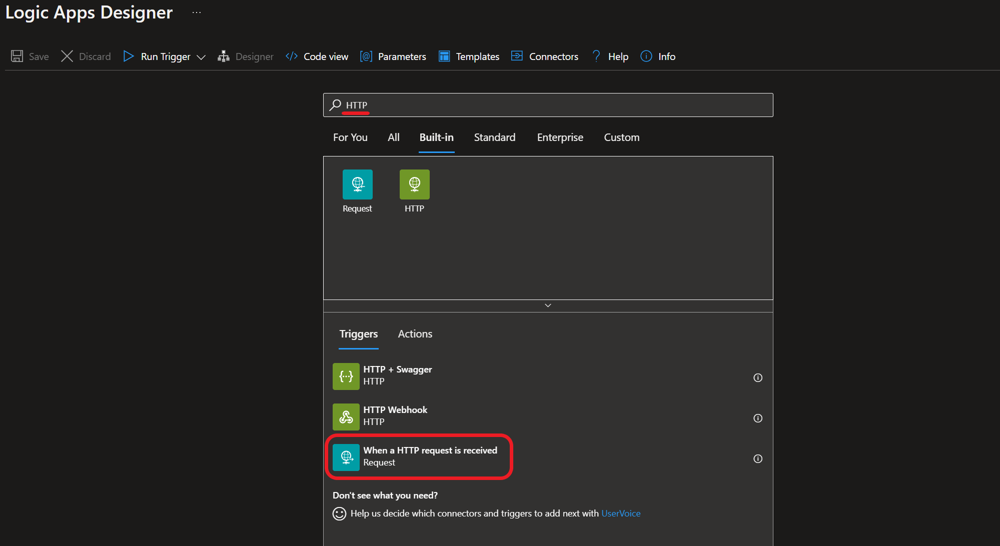
    
    For the trigger, we'll see an HTTP POST URL field. The URL won’t be generated until after you save your flow; however, you'll need the URL eventually.

    > [!TIP]
    > We will come back to the URL created in this step. 
1. Generate an access token.
    
    Follow all the steps from:

    1. **Generate an access token** we did for the first flow.
    1. Select **Save** -> **+ New step**.
1. Get Video Indexer insights.

    1. Search for "Video Indexer".
    1. From **Video Indexer(V2)** chose **Get Video Index** action.
    
        Set the connection name:
        
        |Key| Value|
        |----|----|
        |Connection name| <*A name for connection*>. For example, `aviconnection`.|
        | API key| This is your personal API key, which is available under **Profile** at the [developer portal](https://api-portal.videoindexer.ai/profile). For more information, see [Subscribe to the API](video-indexer-use-apis.md#subscribe-to-the-api).|
        1. Select **Create**.
    1. Fill out the required parameters according to the table: 

        |Key| Value|
        |----|----|
        |Location|  The Location of the Azure Video Indexer account.|
        | Account ID| The Video Indexer account ID can be copied from the resource/account **Overview** page in the Azure portal.|
        | Video ID\*| For Video ID, add dynamic content of type **Expression** and put in the following expression: **triggerOutputs()['queries']['id']**. |
        | Access Token| From the dynamic content, under the **Parse JSON** section select the **accessToken** that is the output of the parse JSON action. |

        \*This expression tells the connecter to get the Video ID from the output of your trigger. In this case, the output of your trigger will be the output of **Upload video and index** in your first trigger.

        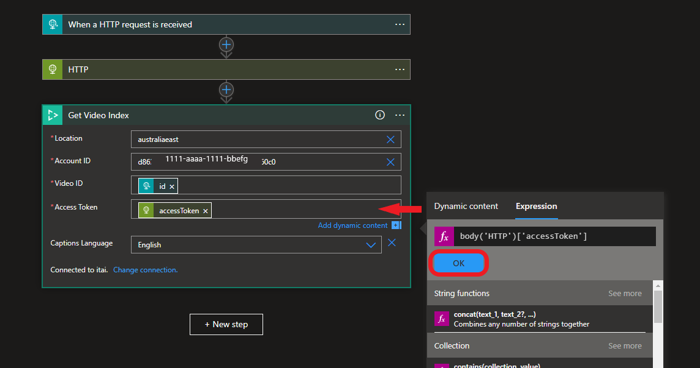

         Select **Save** -> **+ New step**.
1. Create a blob and store the insights JSON.

    1. Search for "Azure blob", from the group of actions.
    1. Select **Create blob(V2)**.
    1. Set the connection to the blob storage that will store the JSON insights files.
    
        |Key| Value|
        |----|----|
        | Connection name| <*Enter a connection name*>.|
        | Authentication type |Access Key|
        | Azure Storage Account name| <* The storage account name where insights will be stored*>. |
        | Azure Storage Account Access key| Go to Azure portal-> my-storage-> under **Security + networking** ->Access keys -> copy one of the keys. |  
    
        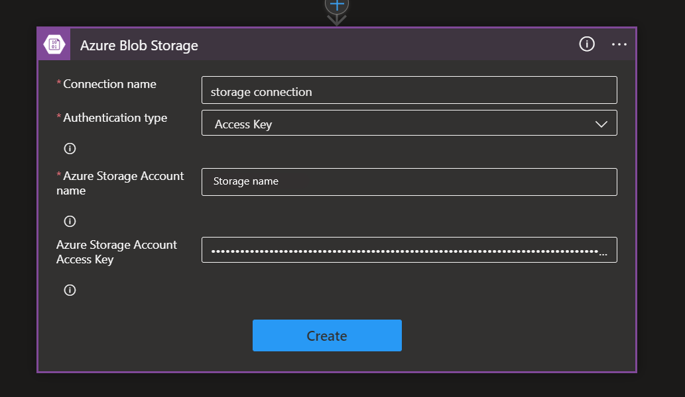
    1. Select **Create**.
    1. Set the folder in which insights will be stored.
        
        |Key| Value|
        |----|----|
        |Storage account name| <*Enter the storage account name that would contain the JSON output (in this tutorial is the same as the source video).>*|
        | Folder path | From the dropdown, select the `/insights`|
        | Blob name| From the dynamic content, under the **Get Video Index** section select **Name** and add `_insights.json`, insights file name will be the video name + insights.json   |
        | Blob content| From the dynamic content, under the **Get Video Index** section, select the **Body**. |
        
        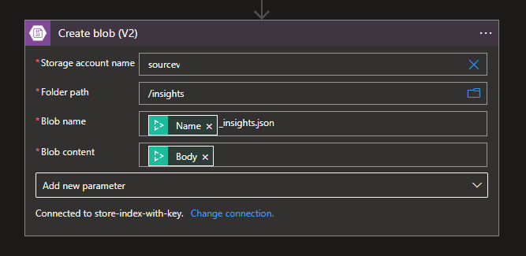
    1. Select **Save flow**. 
1. Update the callback URL to get notified when an index job is finished.

    Once the flow is saved, an HTTP POST URL is created in the trigger. 

    1. Copy the URL from the trigger. 

       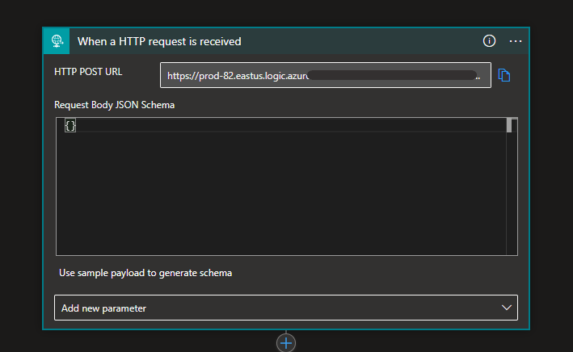
    1. Go back to the first flow and paste the URL in the **Upload video and index** action for the **Callback URL parameter**.
 
Make sure both flows are saved.

## Next steps

Try out your newly created Logic App or Power Automate solution by adding a video to your Azure blobs container, and go back a few minutes later to see that the insights appear in the destination folder. 
