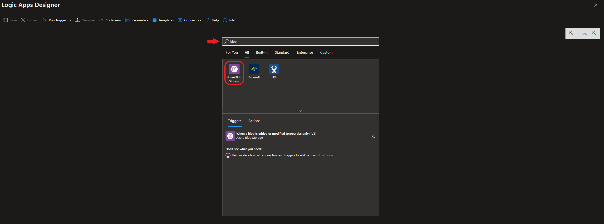
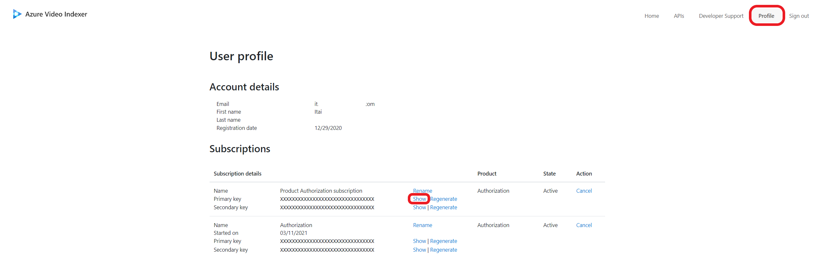

# Logic Apps connector with ARM-based AVI accounts

Azure Video Indexer [REST API](https://api-portal.videoindexer.ai/api-details#api=Operations&operation=Upload-Video) supports both server-to-server and client-to-server communication. The API enables you to integrate video and audio insights into your application logic.

To make the integration easier, we support [Logic Apps](https://azure.microsoft.com/services/logic-apps/) and [Power Automate](https://preview.flow.microsoft.com/connectors/shared_videoindexer-v2/video-indexer-v2/) connectors that are compatible with the Azure Video Indexer API. 

You can use the connectors to set up custom workflows to effectively index and extract insights from a large amount of video and audio files, without writing a single line of code. Furthermore, using the connectors for the integration gives you better visibility on the health of your workflow and an easy way to debug it.

To help you get started quickly with the Azure Video Indexer connectors, we'll do a walkthrough  of a Logic App example. The Logic App and Power Automate  editors and capabilities are almost identical, thus the diagrams and explanations are applicable to both.

The "upload and index your video automatically" scenario covered in this article is comprised of two different flows that work together. 

* The first flow is triggered when a blob is added or modified in an Azure Storage account. It uploads the new file to Azure Video Indexer with a callback URL to send a notification once the indexing operation completes. 
* The second flow is triggered based on the callback URL and saves the extracted insights back to a JSON file in Azure Storage. 

The "two flow" approach is used to support async upload and indexing of larger files effectively. 

## Prerequisites

- [!INCLUDE [quickstarts-free-trial-note](../../includes/quickstarts-free-trial-note.md)]
- Create an ARM-based [Azure Video Indexer account](create-account-portal.md).
- Create a Azure Storage account. Keep note of the access key for your Storage account.

    Create two containers; one to store the media files, second to store the insights generated by Azure Video Indexer.

	* For this tutorial the containers would be referred as: `videos` and `insights`.
- Open two separate flows on either Logic Apps or Power Automate (depending on which you're using). 

## Set up the first flow - file upload   

In this section you'll create the following flow. The first flow is triggered when a blob is added or modified in an Azure Storage account. It uploads the new file to Azure Video Indexer with a callback URL to send a notification once the indexing operation completes. 

1. Create the Logic App.

    First step, create a [Logic App](https://ms.portal.azure.com/#create/Microsoft.LogicApp). We create a Logic App in the same region of the Azure Video  Indexer region.

    The **Plan type** is **Consumption**.

    Once the Logic App deployment is completed:

    - Under **settings** on the left side pane, select *Identity* and change the Status of the System assigned from off to on (the step is important for later on in this tutorial).
     - Select and **blank/new** flow.

        
     - In the **Logic Apps Designer blade**, search for *blob* in the **All** tab and chose the **Azure Blob Storage** component.
     - Under **Triggers**, select **When a blob is added or modified (properties only) (V2)**. 
1. Select a trigger and set the storage connection.

    After creating a **When a blob is added or modified (properties only) (V2)** trigger, the connections need to be set to the following values:  
    
    |Key | Value|
    |--|--|
    |Connection name | *Name your connection*  | 
    |Authentication type | Access Key|
    |Azure Storage Account name| *Storage account name where media files as stored*|
    |Azure Storage Account Access Key| Go to Azure portal-> my-storage-> under **Security + networking** ->**Access keys** -> copy one of the keys.
    
    Select **Create**.
     
    
    
    After setting the connection to the storage, it is required to specify the blob storage container that is been monitored for changes.
    
    |Key| Value|
    |--|--|
    |Storage account name | Storage account name where media files are stored|
    |Container| /videos|
     
    Select **Save** -> **+New Step**
     
    
1. Create SAS URI by path.
      
    Select **Create SAS URI by path (V2)**.
    
    |Key| Value|
    |--|--|
    |Storage account name | Storage account name where media files as stored|
    | Blob path| Dynamic content -> 'List of Files Path'|
    | Group Policy Identifier| Default value|
    | Permissions| Read |
    | Shared Access protocol | HttpsOnly|
    
    Select **Save**.
    
    
    
    > [!NOTE]
    > For the next step we will need to generate an access token as a previous step of 'upload a video'.
    Users of ARM-based account may proceed in this flow, if you are using a classic account flow the relevant explanation.
    
    Select **+New Step**.
1. Generate an access token.
    
    Search and create an 'HTTP' action
    
    > [!TIP]
    > For easy copy of the values of the table visit [Azure Video Indexer ARM REST API documentation](https://aka.ms/avam-arm-api) 
    
    |Key| Value|
    |----|----|
    |Method | 'POST'|
    | URI| `https://management.azure.com/subscriptions/{subscriptionId}/resourceGroups/{resourceGroupName}/providers/Microsoft.VideoIndexer/accounts/{accountName}/generateAccessToken?api-version={API-version}`|
    |Body|`{ "permissionType": "Contributor", "scope": "Account" }` |
    | Add new parameter | Authentication  |
    
    
     
    After Authentication parameter is added, fill the required parameters according to the table below:
    
    After adding the 'Authentication' fill the following:
    
    |Key| Value|
    |----|----|
    | Authentication type | Select Managed identity |
    | Managed identity |Select System-assigned managed identity|
    | Audience | https://management.core.windows.net |
    
    Select **Save**.
    
    > [!TIP]
    > Before moving to the next step step up the right permission between the Logic app and the Azure Video Indexer account.
    > Make sure you have followed the steps to enable the system assigned managed identity of your Logic Apps.
    
    

        1.  Set up system assigned managed identity for permission on Azure Video Indexer resource
          
         - Go to the Azure Video Indexer resource, on the left side blade, select *Access control*
        
        	 - Add
        		 - Add role assignment
        	 - Contributor
        		 - Next
        	 - User, group, or service principal
        		 - Select members
        	 - Search the Logic Apps' name and select.
1. Create an "Upload video and index" action.
    
    - Search for *Video Indexer*
    
    	- From Video Indexer(V2) chose *Upload Video and index*
    	
    1. Set the connection to the Video Indexer account
    
        |Key| Value|
        |----|----|
        |Connection name| Enter name for connection|
        | API key| This is your personal API key, which is available under *Profile* at the [developer portal](https://api-portal.videoindexer.ai/profile)|
        
        Select **Create**.
        
        
    1.Fill "Upload video and index" action parameters
    
        |Key| Value|
        |----|----|
        |Location| Of the associated Video Indexer account.|	
        | Account ID| Of the associated Video Indexer account.|
        |Access Token| accessToken, select from the dynamic content of the 'Parse JSON' action.|
        | Video Name| 'List of Files Name' select from the dynamic content of 'When a blob is added or modified' action. |
        |Video URL|'Web Url', select from the dynamic content of 'Create SAS URI by path' action.|
        | Body| Can be left as default.|
        
        
        
1. Set up the second flow - JSON insights extraction  

The completion of the uploading and indexing from the first flow will send an HTTP request with the correct callback URL to trigger the second flow. Then, it will retrieve the insights generated by Azure Video Indexer. In this example, it will store the output of your indexing job in your Azure Storage.  However, it's up to you what you can do with the output.

## Create a second flow or Logic App

Create the second flow, Logic Apps of type consumption. The second flow is triggered based on the callback URL and saves the extracted insights back to a JSON file in Azure Storage. 

1. Set up the trigger
    
    Search for the **When an HTTP request is received**.
    
    
    
    For the trigger, we'll see an HTTP POST URL field. The URL won’t be generated until after you save your flow; however, you'll need the URL eventually.

    > [!TIP]
    > We will come back to the URL created in this step. 
1. Generate an access token 
    
    Follow all the steps from:

    1. **Generate an access token** we did for the first flow.
    1. Select **Save** -> **+ New step**.
1. Get Video Indexer insights
    
    - Search for *Video Indexer*
    
    	- From Video Indexer(V2) chose **Get Video Index** action.
    - Set the connection, same as done in section 1.5:
    
    |Key| Value|
    |----|----|
    |Connection name| Enter name for connection|
    | API key| This is your personal API key, which is available under *Profile* at the [developer portal](https://api-portal.videoindexer.ai/profile)|

    - Select **Create**.
    - Fill out the required parameters according to the table: 
        
        |Key| Value|
        |----|----|
        |Location| Enter the Location of the Azure Video Indexer account|
        | Account ID| The Video Indexer account Id can be copied from the resource overview in the Azure portal|
        | Video ID| For Video ID, add dynamic content of type 'Expression' and put in the following expression: triggerOutputs()['queries']['id'] * |
        | Access Token| From the dynamic content, under the 'Parse JSON' section select the 'accessToken' that is the output of the parse JSON action |
        
        *This expression tells the connecter to get the Video ID from the output of your trigger. In this case, the output of your trigger will be the output of “Upload video and index” in your first trigger.
        
        
        
    Select **Save** -> **+ New step**.
1. Create a blob and store the insights JSON.

    1. Search for "Azure blob", from the group of actions 
    1. Select **Create blob(V2)**.
    1. Set the connection to the blob storage that will store the JSON insights files.
    
        |Key| Value|
        |----|----|
        |Connection name| Enter a connection name|
        | Authentication type |Access Key|
        | Azure Storage Account name| Storage account name where insights will be stored |
        | Azure Storage Account Access key| Go to Azure portal-> my-storage-> under 'Security + networking' ->Access keys -> copy one of the keys |  
        
        

    1. Select **Create**.
    1. Set the folder in which insights will be stored.
    
        |Key| Value|
        |----|----|
        |Storage account name| Enter the storage account name that would contain the JSON output (in this tutorial is the same as the source video)|
        | Folder path | From the dropdown, select the " /insights "|
        | Blob name| From the dynamic content, under the 'Get Video Index' section select 'Name' and add "_insights.json", insights file name will be the video name + insights.json   |
        | Blob content| From the dynamic content, under the 'Get Video Index' section select the 'Body'. |
        
        
    1. Select **Save flow**. 
1. Update the callback URL to get notified when an index job is finished.
    
    Once the flow is saved, an HTTP POST URL is created in the trigger. 
    
    1. Copy the URL from the trigger. 
    
    
    1. Go back to the first flow and paste the URL in the **Upload video and index** action for the **Callback URL parameter**.
 
    Make sure both flows are saved.

## Next steps

Try out your newly created Logic App or Power Automate solution by adding a video to your Azure blobs container, and go back a few minutes later to see that the insights appear in the destination folder. 
