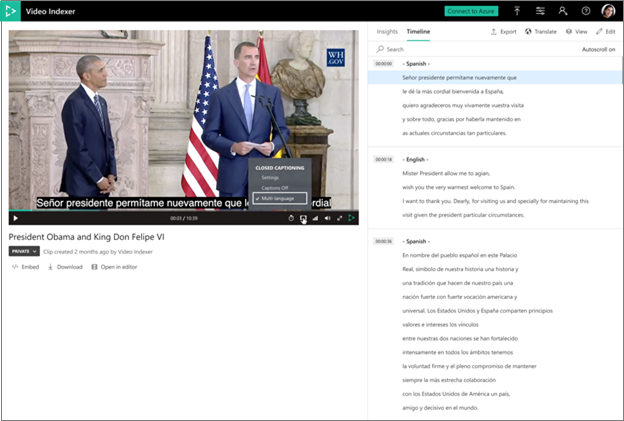

# Automatically identify and transcribe multi-language content

Azure AI Video Indexer supports automatic language identification and transcription in multi-language content. This process involves automatically identifying the spoken language in different segments from audio, sending each segment of the media file to be transcribed and combine the transcription back to one unified transcription. 

## Choosing multilingual identification on indexing with portal

You can choose **multi-language detection** when uploading and indexing your video. Alternatively, you can choose **multi-language detection**  when re-indexing your video. The following steps describe how to reindex:

1. Browse to the [Azure AI Video Indexer](https://vi.microsoft.com/) website and sign in.
1. Go to the **Library** page and hover over the name of the video that you want to reindex. 
1. On the right-bottom corner, click the **Re-index video** button. 
1. In the **Re-index video** dialog, choose **multi-language detection** from the **Video source language** drop-down box.

    * When a video is indexed as multi-language, the insight page will include that option, and an additional insight type will appear, enabling the user to view which segment is transcribed in which language "Spoken language".
    * Translation to all languages is fully available from the multi-language transcript.
    * All other insights will appear in the master language detected – that is the language that appeared most in the audio.
    * Closed captioning on the player is available in multi-language as well.



## Choosing multilingual identification on indexing with API

When indexing or [reindexing](https://api-portal.videoindexer.ai/api-details#api=Operations&operation=Re-Index-Video) a video using the API, choose the `multi-language detection` option in the `sourceLanguage` parameter.

### Model output

The model will retrieve all of the languages detected in the video in one list

```json
"sourceLanguage": null,
"sourceLanguages": [
    "es-ES",
    "en-US"
],
```

Additionally, each instance in the transcription section will include the language in which it was transcribed

```json
{
  "id": 136,
  "text": "I remember well when my youth Minister took me to hear Doctor King I was a teenager.",
  "confidence": 0.9343,
  "speakerId": 1,
  "language": "en-US",
  "instances": [
    {
       "adjustedStart": "0:21:10.42",
       "adjustedEnd": "0:21:17.48",
       "start": "0:21:10.42",
       "end": "0:21:17.48"
    }
  ]
},
```

## Guidelines and limitations

* Set of supported languages: English, French, German, Spanish.
* Support for multi-language content with up to three supported languages.
* If the audio contains languages other than the supported list above, the result is unexpected.
* Minimal segment length to detect for each language – 15 seconds.
* Language detection offset is 3 seconds on average.
* Speech is expected to be continuous. Frequent alternations between languages may affect the models performance.
* Speech of non-native speakers may affect the model performance (for example, when speakers use their native tongue and they switch to another language).
* The model is designed to recognize a spontaneous conversational speech with reasonable audio acoustics (not voice commands, singing, etc.).
* Project creation and editing is currently not available for multi-language videos.
* Custom language models are not available when using multi-language detection.
* Adding keywords is not supported.
* When exporting closed caption files the language indication will not appear.
* The update transcript API does not support multiple languages files.

## Next steps

[Azure AI Video Indexer overview](video-indexer-overview.md)
