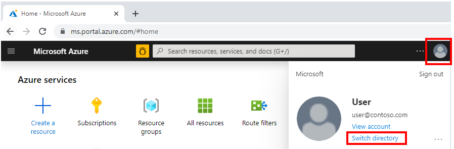

# Switch between multiple tenants

This article shows how to switch between multiple tenants on the Azure Video Indexer website.

To make sure you sign in with the correct  domain name, you first go to the Azure portal to get the correct domain name. You then sign out of your Azure Video Indexer (AVI) account on the AVI website and sign in with the correct domain name you got from the Azure portal. 

## Sign in to the Azure portal to get the domain name

From a browser, go to the Azure [portal](https://portal.azure.com/) and sign in with your Azure account.

If you have multiple subscriptions and need to switch subscriptions:

1. Select the profile button, and then select the **Switch Directory** link.

    > [!div class="mx-imgBorder"]
    > 
1. Select the **All Directories** tab.
1. Find the directory you want to switch to. For more information, see [Switch and manage directories](../azure-portal/set-preferences.md#switch-and-manage-directories).
1. Copy the domain name for the selected directory, you'll use it in the later steps.

## Sign in with the correct domain name on the AVI website

1. Go to the [Azure Video Indexer](https://www.videoindexer.ai/) website.
1. Press **Sign out** after pressing the button in the top-right corner.
1. On the AVI website, press **Sign in** and choose the AAD account.

    > [!div class="mx-imgBorder"]
    > 
1. Press **Use another account**.

    > [!div class="mx-imgBorder"]
    > 
1. Choose **Sign-in with other options**.

    > [!div class="mx-imgBorder"]
    > 
1. Press **Sign in to an organization**.

    > [!div class="mx-imgBorder"]
    > 
1. Enter the domain name you copied in the [Sign in to the Azure portal to get the domain name](#sign-in-to-the-azure-portal-to-get-the-domain-name) section.

    > [!div class="mx-imgBorder"]
    > 

## Next steps

[FAQ](faq.yml)