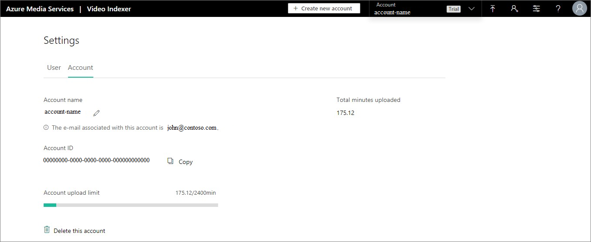

# Tutorial: Use the Azure AI Video Indexer API

[!INCLUDE [AMS AVI retirement announcement](./includes/important-ams-retirement-avi-announcement.md)]

Azure AI Video Indexer consolidates various audio and video artificial intelligence (AI) technologies offered by Microsoft into one integrated service, making development simpler. The APIs are designed to enable developers to focus on consuming Media AI technologies without worrying about scale, global reach, availability, and reliability of cloud platforms. You can use the API to upload your files, get detailed video insights, get URLs of embeddable insight and player widgets, and more.

[!INCLUDE [accounts](./includes/create-accounts-intro.md)]

This article shows how the developers can take advantage of the [Azure AI Video Indexer API](https://api-portal.videoindexer.ai/).

## Prerequisite

Before you start, see the [Recommendations](#recommendations) section (that follows later in this article).

## Subscribe to the API

1. Sign in to the [Azure AI Video Indexer API developer portal](https://api-portal.videoindexer.ai/).

   > [!Important]
   > * You must use the same provider you used when you signed up for Azure AI Video Indexer.
   > * Personal Google and Microsoft (Outlook/Live) accounts can only be used for trial accounts. Accounts connected to Azure require Microsoft Entra ID.
   > * There can be only one active account per email. If a user tries to sign in with user@gmail.com for LinkedIn and later with user@gmail.com for Google, the latter will display an error page, saying the user already exists.
	
   
1. Subscribe.

   Select the [Products](https://api-portal.videoindexer.ai/products) tab. Then, select **Authorization** and subscribe.

   > [!NOTE]
   > New users are automatically subscribed to Authorization.
	
   After you subscribe, you can find your subscription under **[Products](https://api-portal.videoindexer.ai/products)** -> **Profile**. In the subscriptions section, you'll find the primary and secondary keys. The keys should be protected. The keys should only be used by your server code. They shouldn't be available on the client side (.js, .html, and so on).

   

An Azure AI Video Indexer user can use a single subscription key to connect to multiple Azure AI Video Indexer accounts. You can then link these Azure AI Video Indexer accounts to different Media Services accounts.

## Obtain access token using the Authorization API

Once you subscribe to the Authorization API, you can obtain access tokens. These access tokens are used to authenticate against the Operations API.

Each call to the Operations API should be associated with an access token, matching the authorization scope of the call.

- User level: User level access tokens let you perform operations on the **user** level. For example, get associated accounts.
- Account level: Account level access tokens let you perform operations on the **account** level or the **video** level. For example, upload video, list all videos, get video insights, and so on.
- Video level: Video level access tokens let you perform operations on a specific **video**. For example, get video insights, download captions, get widgets, and so on.

You can control the permission level of tokens in two ways:

* For **Account** tokens, you can use the **Get Account Access Token With Permission** API and specify the permission type (**Reader**/**Contributor**/**MyAccessManager**/**Owner**).
* For all types of tokens (including **Account** tokens), you can specify **allowEdit=true/false**. **false** is the equivalent of a **Reader** permission (read-only) and **true** is the equivalent of a **Contributor** permission (read-write).

For most server-to-server scenarios, you'll probably use the same **account** token since it covers both **account** operations and **video** operations. However, if you're planning to make client side calls to Azure AI Video Indexer (for example, from JavaScript), you would want to use a **video** access token to prevent clients from getting access to the entire account. That's also the reason that when embedding Azure AI Video Indexer client code in your client (for example, using **Get Insights Widget** or **Get Player Widget**), you must provide a **video** access token.

To make things easier, you can use the **Authorization** API > **GetAccounts** to get your accounts without obtaining a user token first. You can also ask to get the accounts with valid tokens, enabling you to skip an additional call to get an account token.

Access tokens expire after 1 hour. Make sure your access token is valid before using the Operations API. If it expires, call the Authorization API again to get a new access token.

You're ready to start integrating with the API. Find [the detailed description of each Azure AI Video Indexer REST API](https://api-portal.videoindexer.ai/).

## Operational API calls

The Account ID parameter is required in all operational API calls. Account ID is a GUID that can be obtained in one of the following ways:

* Use the **Azure AI Video Indexer website** to get the Account ID:

    1. Browse to the [Azure AI Video Indexer](https://www.videoindexer.ai/) website and sign in.
    2. Browse to the **Settings** page.
    3. Copy the account ID.

        

* Use **Azure AI Video Indexer Developer Portal** to programmatically get the Account ID.

    Use the [Get account](https://api-portal.videoindexer.ai/api-details#api=Operations&operation=Get-Account) API.

    > [!TIP]
    > You can generate access tokens for the accounts by defining `generateAccessTokens=true`.

* Get the account ID from the URL of a player page in your account.

    When you watch a video, the ID appears after the `accounts` section and before the `videos` section.

    ```
    https://www.videoindexer.ai/accounts/00000000-f324-4385-b142-f77dacb0a368/videos/d45bf160b5/
    ```

## Recommendations

This section lists some recommendations when using Azure AI Video Indexer API.

### Uploading

- If you're planning to upload a video, it's recommended to place the file in some public network location (for example, an Azure Blob Storage account). Get the link to the video and provide the URL as the upload file param.

	The URL provided to Azure AI Video Indexer must point to a media (audio or video) file. An easy verification for the URL (or SAS URL) is to paste it into a browser, if the file starts playing/downloading, it's likely a good URL. If the browser is rendering some visualization, it's likely not a link to a file but to an HTML page.
When you're uploading videos by using the API, you have the following options:

* Upload your video from a URL (preferred).
* Send the video file as a byte array in the request body.
* Use existing an Azure Media Services asset by providing the [asset ID](/azure/media-services/latest/assets-concept). This option is supported in paid accounts only.
* There is an API request limit of 10 requests per second and up to 120 requests per minute.
  
### Getting JSON output

- When you call the API that gets video insights for the specified video, you get a detailed JSON output as the response content. [See details about the returned JSON in this article](video-indexer-output-json-v2.md).
- The JSON output produced by the API contains `Insights` and `SummarizedInsights` elements. We highly recommend using `Insights` and not using `SummarizedInsights` (which is present for backward compatibility).
- We don't recommend that you use data directly from the artifacts folder for production purposes. Artifacts are intermediate outputs of the indexing process. They're essentially raw outputs of the various AI engines that analyze the videos; the artifacts schema may change over time. 

    It's recommended that you use the [Get Video Index](https://api-portal.videoindexer.ai/api-details#api=Operations&operation=Get-Video-Index) API, as described in [Get insights and artifacts produced by the API](insights-overview.md#get-insights-produced-by-the-api) and **not** [Get-Video-Artifact-Download-Url](https://api-portal.videoindexer.ai/api-details#api=Operations&operation=Get-Video-Artifact-Download-Url).

## Code sample

The following C# code snippet demonstrates the usage of all the Azure AI Video Indexer APIs together.

> [!NOTE]
> The following sample is intended for classic accounts only and not compatible with ARM-based accounts. For an updated sample for ARM (recommended), see [this ARM sample repo](https://github.com/Azure-Samples/media-services-video-indexer/blob/master/API-Samples/C%23/ArmBased/Program.cs).

```csharp
var apiUrl = "https://api.videoindexer.ai";
var accountId = "..."; 
var location = "westus2"; // replace with the account's location, or with “trial” if this is a trial account
var apiKey = "..."; 

System.Net.ServicePointManager.SecurityProtocol = System.Net.ServicePointManager.SecurityProtocol | System.Net.SecurityProtocolType.Tls12;

// create the http client
var handler = new HttpClientHandler(); 
handler.AllowAutoRedirect = false; 
var client = new HttpClient(handler);
client.DefaultRequestHeaders.Add("Ocp-Apim-Subscription-Key", apiKey); 

// obtain account access token
var accountAccessTokenRequestResult = client.GetAsync($"{apiUrl}/auth/{location}/Accounts/{accountId}/AccessToken?allowEdit=true").Result;
var accountAccessToken = accountAccessTokenRequestResult.Content.ReadAsStringAsync().Result.Replace("\"", "");

client.DefaultRequestHeaders.Remove("Ocp-Apim-Subscription-Key");

// upload a video
var content = new MultipartFormDataContent();
Debug.WriteLine("Uploading...");
// get the video from URL
var videoUrl = "VIDEO_URL"; // replace with the video URL

// as an alternative to specifying video URL, you can upload a file.
// remove the videoUrl parameter from the query string below and add the following lines:
  //FileStream video =File.OpenRead(Globals.VIDEOFILE_PATH);
  //byte[] buffer = new byte[video.Length];
  //video.Read(buffer, 0, buffer.Length);
  //content.Add(new ByteArrayContent(buffer));

var uploadRequestResult = client.PostAsync($"{apiUrl}/{location}/Accounts/{accountId}/Videos?accessToken={accountAccessToken}&name=some_name&description=some_description&privacy=private&partition=some_partition&videoUrl={videoUrl}", content).Result;
var uploadResult = uploadRequestResult.Content.ReadAsStringAsync().Result;

// get the video id from the upload result
var videoId = JsonConvert.DeserializeObject<dynamic>(uploadResult)["id"];
Debug.WriteLine("Uploaded");
Debug.WriteLine("Video ID: " + videoId);           

// obtain video access token
client.DefaultRequestHeaders.Add("Ocp-Apim-Subscription-Key", apiKey);
var videoTokenRequestResult = client.GetAsync($"{apiUrl}/auth/{location}/Accounts/{accountId}/Videos/{videoId}/AccessToken?allowEdit=true").Result;
var videoAccessToken = videoTokenRequestResult.Content.ReadAsStringAsync().Result.Replace("\"", "");

client.DefaultRequestHeaders.Remove("Ocp-Apim-Subscription-Key");

// wait for the video index to finish
while (true)
{
  Thread.Sleep(10000);

  var videoGetIndexRequestResult = client.GetAsync($"{apiUrl}/{location}/Accounts/{accountId}/Videos/{videoId}/Index?accessToken={videoAccessToken}&language=English").Result;
  var videoGetIndexResult = videoGetIndexRequestResult.Content.ReadAsStringAsync().Result;

  var processingState = JsonConvert.DeserializeObject<dynamic>(videoGetIndexResult)["state"];

  Debug.WriteLine("");
  Debug.WriteLine("State:");
  Debug.WriteLine(processingState);

  // job is finished
  if (processingState != "Uploaded" && processingState != "Processing")
  {
      Debug.WriteLine("");
      Debug.WriteLine("Full JSON:");
      Debug.WriteLine(videoGetIndexResult);
      break;
  }
}

// search for the video
var searchRequestResult = client.GetAsync($"{apiUrl}/{location}/Accounts/{accountId}/Videos/Search?accessToken={accountAccessToken}&id={videoId}").Result;
var searchResult = searchRequestResult.Content.ReadAsStringAsync().Result;
Debug.WriteLine("");
Debug.WriteLine("Search:");
Debug.WriteLine(searchResult);

// get insights widget url
var insightsWidgetRequestResult = client.GetAsync($"{apiUrl}/{location}/Accounts/{accountId}/Videos/{videoId}/InsightsWidget?accessToken={videoAccessToken}&widgetType=Keywords&allowEdit=true").Result;
var insightsWidgetLink = insightsWidgetRequestResult.Headers.Location;
Debug.WriteLine("Insights Widget url:");
Debug.WriteLine(insightsWidgetLink);

// get player widget url
var playerWidgetRequestResult = client.GetAsync($"{apiUrl}/{location}/Accounts/{accountId}/Videos/{videoId}/PlayerWidget?accessToken={videoAccessToken}").Result;
var playerWidgetLink = playerWidgetRequestResult.Headers.Location;
Debug.WriteLine("");
Debug.WriteLine("Player Widget url:");
Debug.WriteLine(playerWidgetLink);
```

## Clean up resources

After you're done with this tutorial, delete resources that you aren't planning to use.

## See also

- [Azure AI Video Indexer overview](video-indexer-overview.md)
- [Regions](https://azure.microsoft.com/global-infrastructure/services/?products=cognitive-services)

## Next steps

- [Examine details of the output JSON](video-indexer-output-json-v2.md)
- Check out the [sample code](https://github.com/Azure-Samples/media-services-video-indexer) that demonstrates important aspect of uploading and indexing a video. Following the code will give you a good idea of how to use our API for basic functionalities. Make sure to read the inline comments and notice our best practices advice.
