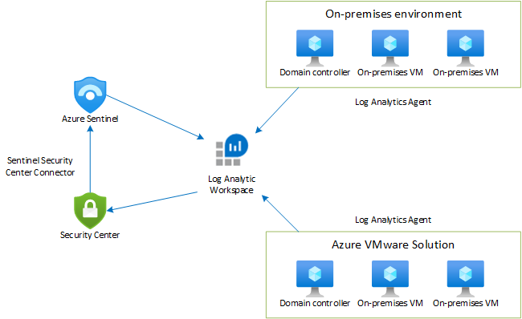

# Protect your Azure VMware Solution VMs with Azure Security Center integration

Azure native security tools provide protection for a hybrid environment of Azure, Azure VMware Solution, and on-premises virtual machines (VMs). This article shows you how to set up Azure tools for hybrid environment security. You'll use these tools to identify and address various threats.

## Azure native services

Here's a quick summary of Azure native services:

- **Log Analytics workspace:** Log Analytics workspace is a unique environment to store log data. Each workspace has its own data repository and configuration. Data sources and solutions are configured to store their data in a specific workspace.
- **Azure Security Center:** Azure Security Center is a unified infrastructure security management system. It strengthens security of data centers, and provides advanced threat protection across hybrid workloads in the cloud or on premises.
- **Azure Sentinel:** Azure Sentinel is a cloud-native, security information event management (SIEM) solution. It provides security analytics, alert detection, and automated threat response across an environment.

## Topology



The Log Analytics agent enables collection of log data from Azure, Azure VMware Solution, and on-premises VMs. The log data is sent to Azure Monitor Logs and is stored in a Log Analytics workspace. You can deploy the Log Analytics agent using Arc enabled servers [VM extensions support](../azure-arc/servers/manage-vm-extensions.md) for new and existing VMs. 

Once the logs are collected by the Log Analytics workspace, you can configure the Log Analytics workspace with Azure Security Center. Azure Security Center will assess the vulnerability status of Azure VMware Solution VMs and raise an alert for any critical  vulnerability. For instance, it assesses missing operating system patches, security misconfigurations, and [endpoint protection](../security-center/security-center-services.md).

You can configure the Log Analytics workspace with Azure Sentinel for alert detection, threat visibility, hunting, and threat response. In the preceding diagram, Azure Security Center is connected to Azure Sentinel using Azure Security Center connector. Azure Security Center will forward the environment vulnerability to Azure Sentinel to create an incident and map with other threats. You can also create the scheduled rules query to detect unwanted activity and convert it to the incidents.

## Benefits

- Azure native services can be used for hybrid environment security in Azure, Azure VMware Solution, and on-premises services.
- Using a Log Analytics workspace, you can collect the data or the logs to a single point and present the same data to different Azure native services.
- Azure Security Center offers many features, including:
    - File integrity monitoring
    - Fileless attack detection
    - Operating system patch assessment 
    - Security misconfigurations assessment
    - Endpoint protection assessment
- Azure Sentinel allows you to:
    - Collect data at cloud scale across all users, devices, applications, and infrastructure, both on premises and in multiple clouds.
    - Detect previously undetected threats.
    - Investigate threats with artificial intelligence and hunt for suspicious activities at scale.
    - Respond to incidents rapidly with built-in orchestration and automation of common tasks.

## Create a Log Analytics workspace

You'll need a Log Analytics workspace to collect data from various sources. For more information, see [Create a Log Analytics workspace from the Azure portal](../azure-monitor/logs/quick-create-workspace.md). 

## Deploy Security Center and configure Azure VMware Solution VMs

Azure Security Center is a pre-configured tool that doesn't require deployment. In the Azure portal, search for **Security Center** and select it.

### Enable Azure Defender

Azure Defender extends Azure Security Center's advanced threat protection across your hybrid workloads, both on premises and in the cloud. So to protect your Azure VMware Solution VMs, you'll need to enable Azure Defender. 

1. In Security Center, select **Getting started**.

2. Select the **Upgrade** tab and then select your subscription or workspace. 

3. Select **Upgrade** to enable Azure Defender.

## Add Azure VMware Solution VMs to Security Center

1. In the Azure portal, search on **Azure Arc** and select it.

2. Under Resources, select **Servers** and then **+Add**.

    :::image type="content" source="media/azure-security-integration/add-server-to-azure-arc.png" alt-text="A screenshot showing Azure Arc Servers page for adding an Azure VMware Solution VM to Azure.":::

3. Select **Generate script**.
 
    :::image type="content" source="media/azure-security-integration/add-server-using-script.png" alt-text="A screenshot of Azure Arc page showing option for adding a server using interactive script."::: 
 
4. On the **Prerequisites** tab, select **Next**.

5. On the **Resource details** tab, fill in the following details: 
    - Subscription
    - Resource group
    - Region 
    - Operating system
    - Proxy Server details
    
    Then select **Next: Tags**.

6. On the **Tags** tab, select **Next**.

7. On the **Download and run script** tab, select **Download**.

8. Specify your operating system and run the script on your Azure VMware Solution VM.

## View recommendations and passed assessments

1. In Azure Security Center, select **Inventory** from the left pane.

2. For Resource type, select **Servers - Azure Arc**.
 
     :::image type="content" source="media/azure-security-integration/select-resource-in-security-center.png" alt-text="A screenshot of the Azure Security Center Inventory page showing Servers - Azure Arc selected under Resource type.":::

3. Select the name of your resource. A page opens showing the security health details of your resource.

4. Under **Recommendation list**, select the **Recommendations**, **Passed assessments**, and **Unavailable assessments** tabs to view these details.

    :::image type="content" source="media/azure-security-integration/view-recommendations-assessments.png" alt-text="A screenshot of Azure Security Center showing security recommendations and assessments.":::

## Deploy an Azure Sentinel workspace

Azure Sentinel is built on top of a Log Analytics workspace. Your first step in onboarding Azure Sentinel is to select the Log Analytics workspace you wish to use for that purpose.

1. In the Azure portal, search for **Azure Sentinel**, and select it.

2. On the Azure Sentinel workspaces page, select **+Add**.

3. Select the Log Analytics workspace and select **Add**.

## Enable data collector for security events on Azure VMware Solution VMs

Now you're ready to connect Azure Sentinel with your data sources, in this case, security events.

1. On the Azure Sentinel workspaces page, select the configured workspace.

2. Under Configuration, select **Data connectors**.

3. Under the Connector Name column, select **Security Events** from the list, and then select **Open connector page**.

4. On the connector page, select the events you wish to stream and then select **Apply Changes**.

    :::image type="content" source="media/azure-security-integration/select-events-you-want-to-stream.png" alt-text="Screenshot of Security Events page in Azure Sentinel where you can select which events to stream.":::

## Connect Azure Sentinel with Azure Security Center  

1. On the Azure Sentinel workspace page, select the configured workspace.

2. Under Configuration, select **Data connectors**.

3. Select **Azure Security Center** from the list and then select **Open connector page**.

    :::image type="content" source="media/azure-security-integration/connect-security-center-with-azure-sentinel.png" alt-text="Screenshot of Data connectors page in Azure Sentinel showing selection to connect Azure Security Center with Azure Sentinel.":::

4. Select **Connect** to connect the Azure Security Center with Azure Sentinel.

5. Enable **Create incident** to generate an incident for Azure Security Center.

## Create rules to identify security threats

After connecting data sources to Azure Sentinel, you can create rules to generate alerts for detected threats. In the following example, we'll create a rule for attempts to sign in to Windows server with the wrong password.

1. On the Azure Sentinel overview page, under Configurations, select **Analytics**.

2. Under Configurations, select **Analytics**.

3. Select **+Create** and on the drop-down, select **Scheduled query rule**.

4. On the **General** tab, enter the required information.

    - Name
    - Description
    - Tactics
    - Severity
    - Status

    Select **Next: Set rule logic >**.

5. On the **Set rule logic** tab, enter the required information.

    - Rule query (here showing our example query)
    
        ```
        SecurityEvent
        |where Activity startswith '4625'
        |summarize count () by IpAddress,Computer
        |where count_ > 3
        ```
        
    - Map entities
    - Query scheduling
    - Alert threshold
    - Event grouping
    - Suppression

    Select **Next**.

6. On the **Incident settings** tab, enable **Create incidents from alerts triggered by this analytics rule** and select **Next: Automated response >**.
 
    :::image type="content" source="media/azure-security-integration/create-new-analytic-rule-wizard.png" alt-text="Screenshot of the Analytic rule wizard for creating a new rule in Azure Sentinel. Shows Create incidents from alerts triggered by this rule as enabled.":::

7. Select **Next: Review >**.

8. On the **Review and create** tab, review the information and select **Create**.

After the third failed attempt to sign in to Windows server, the created rule triggers an incident for every unsuccessful attempt.

## View alerts

You can view generated incidents with Azure Sentinel. You can also assign incidents and close them once they're resolved, all from within Azure Sentinel.

1. Go to the Azure Sentinel overview page.

2. Under Threat Management, select **Incidents**.

3. Select an incident. You can then assign the incident to a team for resolution.

    :::image type="content" source="media/azure-security-integration/assign-incident.png" alt-text="Screenshot of Azure Sentinel Incidents page with incident selected and option to assign the incident for resolution.":::

    After resolving the issue, you can close it.

## Hunt security threats with queries

You can create queries or use the available pre-defined query in Azure Sentinel to identify threats in your environment. The following steps run a pre-defined query.

1. Go to the Azure Sentinel overview page.

2. Under Threat management, select **Hunting**. A list of pre-defined queries is displayed.

3. Select a query and then select **Run Query**.

4. Select **View Results** to check the results.

### Create a new query

1.  Under Threat management, select **Hunting** and then **+New Query**.

    :::image type="content" source="media/azure-security-integration/create-new-query.png" alt-text="Screenshot of Azure Sentinel Hunting page with + New Query highlighted.":::

2. Fill in the following information to create a custom query.

    - Name
    - Description
    - Custom query
    - Enter Mapping
    - Tactics
    
3. Select **Create**. You can then select the created query, **Run Query**, and **View Results**.

## Next steps

Now that you've covered how to protect your Azure VMware Solution VMs, you may want to learn about:

- Using the [Azure Defender dashboard](../security-center/azure-defender-dashboard.md)
- [Advanced multistage attack detection in Azure Sentinel](../azure-monitor/logs/quick-create-workspace.md)
- [Lifecycle management of Azure VMware Solution VMs](lifecycle-management-of-azure-vmware-solution-vms.md)
