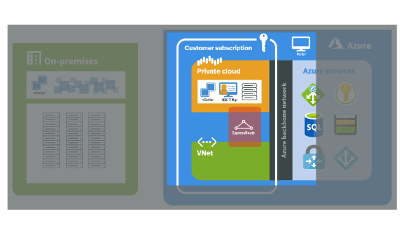
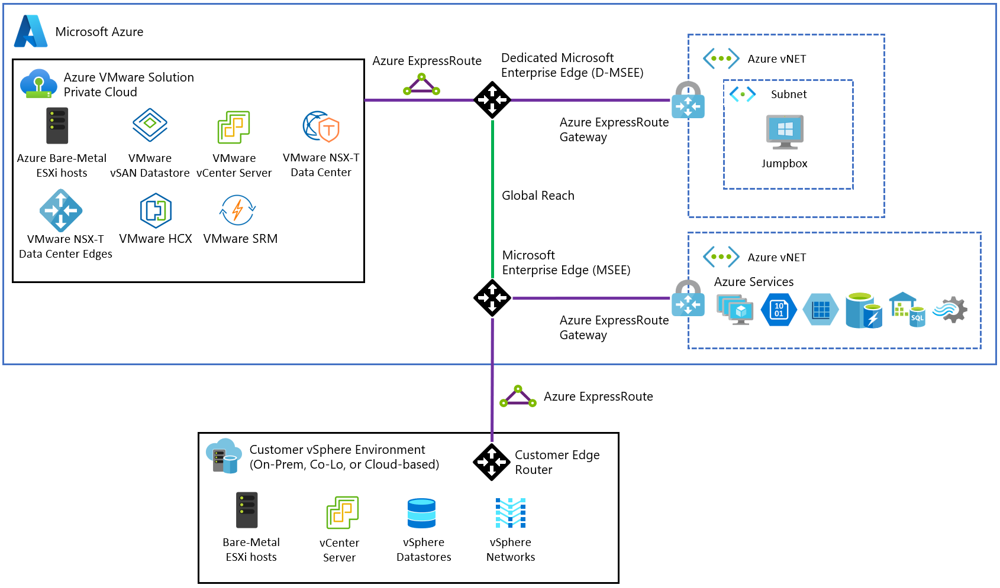

# Azure VMware Solution (AVS) Preview networking and interconnectivity concepts

Network interconnectivity between your Azure VMware Solution (AVS) private clouds and on-premises environments or virtual networks in Azure enables you to access and use your private cloud. A few key networking and interconnectivity concepts that establish the basis of interconnectivity are described in this article.

A useful perspective on interconnectivity is to consider the two types of AVS private cloud implementations: implementations with basic Azure-only interconnectivity and implementations with full on-premises to private cloud interconnectivity.

The use cases for AVS private clouds include:
- new VMware VM workloads in the cloud
- VM workload bursting to the cloud
- VM workload migration to the cloud
- disaster recovery
- consumption of Azure services

 All use cases for the AVS service are enabled with on-premises to private cloud connectivity. The basic interconnectivity model is best suited for AVS evaluations or implementations that don't require access from on-premises environments.

The two types of AVS private cloud interconnectivity are described in the sections below.  The most basic interconnectivity is "Azure virtual network connectivity"; it enables you to manage and use your private cloud with only a single virtual network in Azure. The interconnectivity described in "On-premises connectivity" extends the virtual network connectivity to also include interconnectivity between on-premises environments and AVS private clouds.

## Azure virtual network interconnectivity

The basic network interconnectivity that is established at the time of a private cloud deployment is shown in the diagram below. It shows the logical, ExpressRoute-based networking between a virtual network in Azure and a private cloud. The interconnectivity fulfills three of the primary use cases:
- Inbound access to management networks where vCenter server and NSX-T manager are located.
    - Accessible from VMs within your Azure subscription, not from your on-premises systems.
- Outbound access from VMs to Azure services.
- Inbound access and consumption of workloads running a private cloud.

The ExpressRoute circuit in this virtual network to private cloud scenario is established when you create a connection from a virtual network in your subscription to the ExpressRoute circuit of your private cloud. The peering uses an authorization key and a circuit ID that you request in the Azure portal. The ExpressRoute connection that's established through the peering is a private, one-to-one connection between your private cloud and the virtual network. You can manage your private cloud, consume workloads in your private cloud, and access Azure services over that ExpressRoute connection.

When you deploy an AVS private cloud, a single /22 private network address space is required. This address space shouldn't overlap with address spaces used in other virtual networks in your subscription. Within this address space, management, provisioning, and vMotion networks are provisioned automatically. The routing is BGP-based and it's automatically provisioned and enabled by default for each private cloud deployment.

When a private cloud is deployed, you're provided with the IP addresses for vCenter and NSX-T Manager. To access those management interfaces, you'll create additional resources in a virtual network in your subscription. The procedures for creating those resources and establishing ExpressRoute private peering are provided in the tutorials.

You design the private cloud logical networking and implement it with NSX-T. The private cloud comes with pre-provisioned NSX-T. A Tier-0 Gateway & Tier-1 Gateway is pre-provisioned for the you. You can create a segment and attach it to the existing Tier-1 gateway or attach to a new Tier-1 gateway that you can define. NSX-T logical networking components provide East-West connectivity between workloads and also provide North-South connectivity to the internet and Azure services. 

## On-premises interconnectivity

You can also connect on-premises environments to your AVS private clouds. This type of interconnectivity is an extension to the basic interconnectivity described in the previous section.

To establish full interconnectivity to a private cloud, you use the Azure portal to enable ExpressRoute Global Reach between a private cloud ExpressRoute circuit and an on-premises ExpressRoute circuit. This configuration extends the basic connectivity to include access to private clouds from on-premises environments.

An on-premises to Azure virtual network ExpressRoute circuit is required to connect from on-premises environments to your private cloud in Azure. This ExpressRoute circuit is in your subscription and isn't part of a private cloud deployment. The on-premises ExpressRoute circuit is beyond the scope of this document. If you require on-premises connectivity to your private cloud, you can use one of your existing ExpressRoute circuits or purchase one in the Azure portal.

Once linked with Global Reach, the two ExpressRoute circuits will route network traffic between your on-premises environments and your private cloud. The on-premises to private cloud interconnectivity is shown in the preceding diagram. The interconnectivity represented in the diagram enables the following use cases:

- Hot/Cold Cross-vCenter vMotion
- On-Premises to AVS private cloud management access

To enable full connectivity, an Authorization Key and private peering ID for Global Reach can be requested in the Azure portal. You use the key and ID to establish Global Reach between an ExpressRoute circuit in your subscription and the ExpressRoute circuit for your new private cloud. The [tutorial for creating a private cloud](tutorial-create-private-cloud.md) provides you with the procedures for requesting and using the key and ID.

The routing requirements of the solution require you to plan private cloud network address spaces so that you avoid overlaps with other virtual networks and on-premises networks. AVS private clouds require a minimum of a `/22` CIDR network address block for subnets, shown below. This network complements your on-premises networks. In order to connect to on-premises environments and virtual networks, this must be a non-overlapping network address block.

Example `/22` CIDR network address block:  `10.10.0.0/22`

The subnets:

| Network usage             | Subnet | Example        |
| ------------------------- | ------ | -------------- |
| Private cloud management            | `/24`    | `10.10.0.0/24`   |
| vMotion network       | `/24`    | `10.10.1.0/24`   |
| VM workloads | `/24`   | `10.10.2.0/24`   |
| ExpressRoute peering | `/24`    | `10.10.3.8/30`   |

## Next steps 

The next step is to learn about [private cloud storage concepts](concepts-storage.md).

<!-- LINKS - external -->
[enable Global Reach]: https://docs.microsoft.com/azure/expressroute/expressroute-howto-set-global-reach

<!-- LINKS - internal -->

