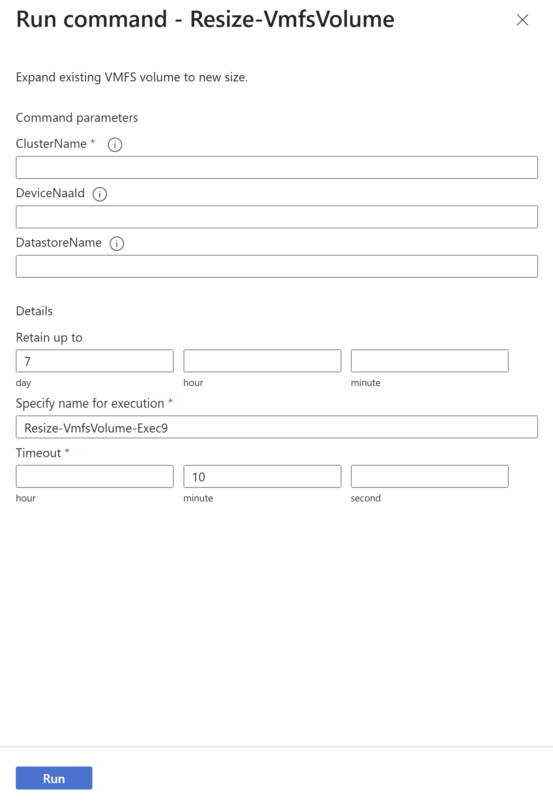

# Use Azure VMware Solution with Azure Elastic SAN 

This article explains how to use Azure Elastic SAN as backing storage for Azure VMware Solution. [Azure VMware Solution](introduction.md) supports attaching iSCSI datastores as a persistent storage option. You can create Virtual Machine File System (VMFS) datastores with Azure Elastic SAN volumes and attach them to clusters of your choice. By using VMFS datastores backed by Azure Elastic SAN, you can expand your storage instead of scaling the clusters.

Azure Elastic storage area network (SAN) addresses the problem of workload optimization and integration between your large scale databases and performance-intensive mission-critical applications. For more information on Azure Elastic SAN, see [What is Azure Elastic SAN?](../storage/elastic-san/elastic-san-introduction.md).

To accompany the steps below, you can use this [interactive demo](https://regale.cloud/microsoft/play/4092/expand-storage-with-elastic-san#/0/0) as a visual representation of what you need to do to connect Elastic SAN and AVS.

## Prerequisites

The following prerequisites are required to continue.

- Have a fully configured Azure VMware solution private cloud in a [region that Elastic SAN is available in](../storage/elastic-san/elastic-san-create.md).
    - Size your ExpressRoute gateways to handle your elastic SAN's bandwidth capabilities. For example, a single ultra performance ExpressRoute gateway supports a bandwidth of 1,280 mbps. An individual elastic SAN datastore used to its full potential would use the entirety of that bandwidth. Multiple gateways might be required depending on your needs.
- Know the availability zone your private cloud is in. 
  - In the UI, select an Azure VMware Solution host.
    > [!NOTE]
    > The host exposes its availability zone. Use that availability zone when deploying other Azure resources for the same subscription.

- Have permission to set up new resources in the subscription your private cloud is in.
- Reserve a dedicated address block for your external storage.
- Use either the [Azure portal](/azure/storage/elastic-san/elastic-san-create?tabs=azure-portal), [Azure PowerShell module](/azure/storage/elastic-san/elastic-san-create?tabs=azure-powershell), or [Azure CLI](/azure/storage/elastic-san/elastic-san-create?tabs=azure-cli) to create an Elastic SAN that has at least 16 TiB base size and that is in the same region and availability zone as your private cloud.
    > [!NOTE]
    > Make sure CRC protection on your volume groups is disabled since it's not currently supported for Azure VMware Solution.

## Supported host types

You can use the following host types when Azure Elastic SAN is the backing storage for Azure VMware solution:

- AV36
- AV36P
- AV48
- AV52
- AV64

## Configuration recommendations

Use multiple private endpoints to establish multiple sessions between an Elastic SAN and each volume you intend to connect to your software defined data center (SDDC). Having multiple sessions provides better performance due to parallelization, and better reliability to handle single session disconnects. When you establish multiple sessions, it also mitigates the impact of session disconnects, as long as the connection is re-established within a few seconds, your other sessions help load-balance traffic.

   > [!NOTE]
   > Session disconnects might show up as "All Paths Down" or "APD" events, which can be seen in the Events section of the ESXi Host at vCenter. You can also see them in the logs: it shows the identifier of a device or filesystem, and states it entered the All Paths Down state.

When an Elastic SAN volume is attached to a cluster, it automatically attaches to all nodes. If you have 16 nodes and each node is configured to use eight iSCSI sessions that use the maximum number of connections (128). This would prevent you from attaching an additional node for maintenance. The following recommendations help you avoid this situation:

If your Elastic SAN is only connecting to a single cluster, and will only ever have 16 nodes in a cluster, use one of the following configurations:
- AV36, AV36P, AV52 - Six iSCSI sessions over three Private Endpoints
- AV64 - Seven iSCSI sessions over seven Private Endpoints

If your Elastic SAN is connecting to a single cluster that won't have 16 nodes, use one of the following configurations.
-  AV36, AV36P, AV52 - Eight iSCSI sessions over four Private Endpoints
- AV64 - Eight iSCSI sessions over eight Private Endpoints

If you're planning on connecting an Elastic SAN datastore to multiple clusters, you must calculate the number of hosts, sessions, and connections per cluster. An Elastic SAN datastore only supports a maximum of 128 connections, and each time you connect an Elastic SAN datastore to a cluster, it automatically connects to all nodes in that cluster. This can rapidly use up the available connections when each node in a cluster is establishing multiple connections.

## Configure Private Endpoint

Using the guidance from the previous section, create as many private endpoints for your volume groups as you need.

Edit your volume group, or create a new one. Then select **Networking**, then select **+ Create a private endpoint** under **Private endpoint connections**. You don't need to configure a dedicated virtual network for your Elastic SAN, since you're using private endpoint connections to access your Elastic SAN volumes.

Fill out the values in the menu that pops up, select the virtual network that has your [ExpressRoute connection configured](/azure/azure-vmware/tutorial-configure-networking#connect-expressroute-to-the-virtual-network-gateway), and the subnet that your applications are going to use to connect. When you're done, select **Add**, and **Save**.

 Repeat these steps to create as many private endpoints as you need.

:::image type="content" source="../storage/elastic-san/media/elastic-san-create/elastic-san-edit-volume-network.png" alt-text="Screenshot of the volume group private endpoint creation experience." lightbox="../storage/elastic-san/media/elastic-san-create/elastic-san-edit-volume-network.png":::

> [!NOTE]
> Using Private Endpoints provides the highest network security. However, since your private cloud connects to Elastic SAN in Azure through an ExpressRoute virtual network gateway, you might experience intermittent connectivity issues during [gateway maintenance](/azure/expressroute/expressroute-about-virtual-network-gateways). 
> These connectivity issues aren't expected to impact the availability of the datastore backed by Elastic SAN as the connection is re-established within seconds. The potential impact from gateway maintenance is covered under the [Service Level Agreement](https://www.microsoft.com/licensing/docs/view/Service-Level-Agreements-SLA-for-Online-Services?lang=1) for ExpressRoute virtual network gateways and private endpoints.

## Configure external storage address block

Start by providing an IP block for deploying external storage. Navigate to the **Storage** tab in your Azure VMware Solution private cloud in the Azure portal. The address block should be a /24 network. 

:::image type="content" source="media/configure-azure-elastic-san/configure-external-storage-address-block.png" alt-text="Screenshot showing External storage address block tab." border="false"lightbox="media/configure-azure-elastic-san/configure-external-storage-address-block.png":::

- The address block must be unique and not overlap with the /22 used to create your Azure VMware Solution private cloud or any other connected Azure virtual networks or on-premises network. 
- The address block must fall within the following allowed network blocks: 10.0.0.0/8, 172.16.0.0/12, 192.168.0.0/16. If you want to use a non-RFC 1918 address block, submit a support request. 
- The address block can't overlap any of the following restricted network blocks: 100.72.0.0/15 
- The address block provided is used to enable multipathing from the ESXi hosts to the target, it can’t be edited or changed. If you do need to change it, submit a support request.

## Add an Elastic SAN volume as a datastore

Configure all Private Endpoints before attaching a volume as a datastore. Adding Private Endpoints after a volume is attached as a datastore requires detaching the datastore and reconnecting it to the cluster.

Once your SDDC express route is connected with the private endpoint for your Elastic SAN volume group, use the following steps to connect the volume to your SDDC: 

1. From the left navigation in your Azure VMware Solution private cloud, select **Storage**, then **+ Connect Elastic SAN**.
1. Select your **Subscription**, **Resource**, **Volume Group**, **Volume(s)**, and **Client cluster**.
1. From section, "Rename datastore as per VMware requirements", under **Volume name** > **Data store name**, give names to the Elastic SAN volumes.
   > [!NOTE]
   > When creating virtual disks, use eager zeroed thick provisioning.
   > This means setting up virtual disks where all the space is reserved and cleaned out in advance, so they're ready for fast and secure use.

## Disconnect and delete an Elastic SAN-based datastore

To delete the Elastic SAN-based datastore, use the following steps from the Azure portal.

1. From the left navigation in your Azure VMware Solution private cloud, select **Storage**, then **Datastore list**.
1. On the far right is an **ellipsis**. Select **Delete** to disconnect the datastore from the clusters.

   :::image type="content" source="data:image/png;base64,iVBORw0KGgoAAAANSUhEUgAABGYAAADoCAYAAACtvOJIAAAAAXNSR0IArs4c6QAAAARnQU1BAACxjwv8YQUAAAAJcEhZcwAADsMAAA7DAcdvqGQAAFgcSURBVHhe7d0JfFTV2cfxfwSJW/C1gq8KsiSihNoiokJBAlgSaRNtBakWRDYr4MJSAdsaUFl8FVJZrE2wsqmgFqGthhYJskRFqFJAa4JiwmJAKigV3Njfc+7cWTOTPUwIv6+fK3OXuTOZe+bec577nDMxMo4b9l8AAAAAAABUjxjDfehzmvsvAAAAAAAATjACMwAAAAAAAFFCYAYAAAAAACBKCMwAAAAAAABECYEZAAAAAACAKCEwAwAAAAAAECUEZgAAAAAAAKKEwAwAAAAAAECUEJgBAAAAAACIEgIzAAAAAAAAURKzq3HjpHNGjVrtzqMaxLZvr3rt2rlzAAAAAADgVBRjuA99YoouvnjcaTExj7jzqAbn3H+/4kaOdOcAAAAAAMCpKFxghq5MAAAAAAAAURKUMWO729huN6i8g2vX6tC6dc5jMmYAAAAAAECpXZls8MAGEVB5X/3+9zowdarzmMAMAAAAAACgKxMAAAAAAEANQmAGAAAAAAAgSgjMAAAAAAAARAmBGVdhZg+1ShylHDtzYKMWTJqgRZudVaiknFEt1TOzwJ07leRojLdMhWHL3In8XEo8Dluy1LOE91o6+7f20Mwt7iwAAAAAoExKCczYxlZLtfJNrZV0U39NfKVAB90tSrRpjgak9q9EY22vcsbdpqRxFW8uVsjXHyjnhZeV8/5ed0EYu3M09rbrNHapOx8lnoBS4DEqpXG8dJRa3ZylQne2Jjp1AzkAAAAAgFNNmTJm4gfNVe7KJVrw5Bj1uWy/Fj2QquRROTrgro/o0w+0rnC/O1MRX6rw/Y3a+407e6Jc2Edz/r1JWb0auAvCOFCgvE17yxagqmaJw5YoL3+zOy3W4BbuCgAAAAAAUKOVKTATe3ZDNbgwQVd266PBGYu1YFgr7V0yTbM32bUFWjTqNiW19WRstLlhsBbYLkA2M2NktnmQp+k3mXVOlkaEbY0DKx/XgBtae7I+rk3VlHUFmnlzqqbb9Uvuc5aPsdkpR/cqJ6O/Utx9tEsdrJnr3OCP0x2jpYaMf1w97fpROZ7tJ/VQuyvM/BXXque4bBUd9Wwekbsf5/W0X7lBr/e41tn1N01TvlmbPdIur0wXkOrgyXTyvH/D+Xt66LGJPTzHZPM0pRVb7/n7Av8WT+ZKlidryhy/1TY7x3ymdrln2+DsHP9yz/ZlycoJfE7PzFXmmLfU8CVS/oxUsyz4vfj2Hfh5O+99lGa6mUP2bwrOIgo+NoHrembmmNcL+BsifA6hStp/4Pv0fb5egfs3n09gTpB9XuBnbT+7oNexZdkVfnlgdltJWVOFzmdc6nZBn0VoBpP9bkZa5+H5HCJ/hgAAAAAAjwqNMZN4e28lmcZZ7jrbINujg40GaeZr/9S61yYq6cBqTXxsvvZ2HafccclmfYIGzHpTuX8aoPhI2x7N0YT75mhPuwwtW/NPLRvfXvUOJKj/n+ZqgM3+6DZWuSvf1NiuUu6kn2v43P1KnrrELFus4fEfaPqgYVqw074zj9z3YzVxzWblZSR7tl/aSMNf3qQNrwxXw+WjNGTGRnfLMlg6XkNm7VG7Scu1bs1yTWwXq/3xAzRzlv17pORx5m9bOc58HjVJsiZPTVP2TE8DP2fmNGnYFP0mfbHyzHK1HKHs/M2a3N1uaxr0Ny1Tyituxs1UaXhAUCV/xsdKtsv/MkSX2AVL7lNON8+22cOk6WO82+aY/550s3aWaLimaXQp3ZFsgGG47zmbtWhoFw3+y2ZNT/VmAWWYv8TdrsDznsO9RylbyzTFWTe5e4FyClJ8205PzdZwb/Bi6SilLfOvm6JMT+DPUfLn4Bd5/6F/T/Ly+8w78wrZ/2Qpa0aeu84j8LOOD3mv03WfJwASstyWcU+g5D5pqrushKyp/BmZ0mR3u6nxmn5TuOCJfa/TlODb3xKlLEt1A02egOmyFG+W1pNKcZ7j5z9enuMHAAAAAIisYoP/xp2r+vZfJ/OkvXqPTFZig/qKa3KL0jqYRV8e0P7Y+mpwXqyZiVX9hg3UoIF9HGHbb750ugTt3/eZDpjnNe4+VsO7mWc2aKj6dewuLlCDCxsoLtY0/v+8V437j9PopASzrJV6PzhU7Y6uVc5K/3gwSb8YqET7cqaBabdP7D1CvVvGKja+j3qa1yxcszZMgzu8A9/Yd/aleW/7Va9+YyWPG6HkOrFq0PBc85eZt3ae+dsurO88jhZPdombweANJnTP0PSEacrKzFKWaSRPGZrgbBuqMDNT2alD/Q357jcobfPHpvntkThsaHDjOvVJN6AjxXdLUaJv22RNdoIEVoKSU1q5jyOLbx5v2vkFpRyLHGXNkIZPHuIEwhzdh2q4linHl+2RpiG+vy9BgzP82yZ3S3MfFWjmzGylDfavix86RcNbeh6X9jn4Rdq/+z4H+z+t5IwnzTvzKLb/FkM0ZVjwZ+T/rIu/V/s6+QXmk0q4NOAz90pQvPnzC7YWf7ehEodNCfgbzefYMls5IZk9nvfqP87O3zw4TdnLc6QtOeaTDyxPyRocWLaWj1LajHhNt8EldxEAAAAAILKKBWZ2f6Y95p+GDRo6XYXWzUrXgJu6KaVTa6cbSkSRto27RROf7KOG6yaoZ9vWSrl7vvLDdTfaUqA8szwx8Up3gXHhBTLvQvsPfOmZN+rHOWEj3/aBgQvnNY94VpdFXI9Jyrr9Aq2d1ENtru2mIc8HZznUBEFjzAQ0iJMHj1DBjGVKCQxqhON2FfNMNsujUIURu8IEaJFgmux+gV1s0kKyQcLqnqHslGVOt6qSuz7FKz4oA8QGIvJsTCc8243O+/c43em8Wikh8A2HKuvnEHH/oe8zWGJC+UIVnm5yAa9jg1gthmiRzeZxlvuzXZIzPFktdtuyD5zsCeiEU+y92oCQff2Cj5VvPsTwf0meps/IVtpUMmUAAAAAoKwqFJjZ+PwCrauTrOTu9bVxRj8NmLVHyY++qEXLNzndUCIpadu4rmO16J+btGzmLYpbOUHps8I0LlskqFUdKT8/oCtSYJAolBs4uHLUcn/gIiR4Ubr6SnpwsdatX66sHvWVOyldM8uabhNltgtTQmp8QHej8IIHD7ZT+QcQtkGZtIKhvn1kh2SDRBI/dLFnexugCRhHJVhogMQGCCIEWWzQZOal/q4+tuuWT2gwp1AFAT+JXqbPocT9h7zPLQVBmS1OxkuAgoKSgletNNzb7ck7ectt9wz3tQO7WyU43cCCux2VJvLnGPpeFRiQiZjlZN7z1BEqGFnKL4MBAAAAAHzKFJg5+PUe7d1doI3L52v64G7qPetLpWVMUs84ac9e2/Ssp9izzHZb5it7nec5jrPOVZxpDG9YV+D8slLEbbfM0dipq1Vktjn3ew0DugWZ559r/slfq9zd+3VQyUr+RQMVzR2vKblmn7vztGBSptY1uEU9u7tZMkHaKTm1vjbOTddMZ/u9yl86QXNWuqvLoHBWuqbnFung0fpq2LCeu9SIi3O6c+WtX629+2rCbzOFWDrKGedjSIbt9jNNWREa6rY7kmaMrnRD2gYZ/FkWBcpZVr7MosjdmswxT80LDi4tzdR0pSg5TPCocKvZKiCjI2e5N6PF073KO+6O5XTZcR+X9XOIvH/3fc70B5dsYMwOEG053b6WZPr3vyVLWRGzy+x7DRy/J4IKdGuyY8x432Fh5uiwn6Pnvd4XENxxu1Z1S3a7eAWOH5SjmYEZOgk2o8eOXUNwBgAAAADKokyBmcJZ/ZXUNVW9HzCNuiOdNXnJ65rsBkKS+45VUlyuxqZep95Pmkbd1c5ij449NbCdzTJJVVK/LCVE2jauoQ4uH62Utq3V7rbZOpg6URMH2dv4DXTjbbeo8e75GtL1Wk1cLiU9+KIm96inV0eafXbtoem7u2jy/IlKjvPsKlh9JU+aq9E/2KPZd9vtr1P/J4sU29hdXQb1G36nnFHd1Kbtter5zCGljZ+owbZVfuGN6t2rsXY+P1hJnSb4GrvREDTGjJnGzMlSz5GF7rgsCRo8OSCLwRmfJeBXmZyuMbYh7X9+4C8AlZUdTyXB9z5GqyCh9IyZwK5PrUbKNy6J7YKlgF9lSs7Y7IyX43R5spPNWImQ9eSMG1Pg75KU4xvlxa5bHLSf0bJjrLgry/g5lLR/250oaF03/xgzxfY/RhpSQlZR6Hu1k3O8ArtROYMJ225DdkBe/3Z2AOJFEcYUShx2qXLc7SKOBWPf6yu2zHj3maqCwd7BopM1OT/wWN+nguYhr2W7qNmBoc3fWrbMHQAAAAA4dcUUXXzxuNNiYh6xM3EjR+qc++93VqByvvr973Vg6lTnsf1M7WeLmsb+xPRrSubXgwAAAAAAJ0CM4T70qdjgv0AtkDPqPmWn3kBQBgAAAAAQNQRmcMoI6jplJjsGT7bvJ74BAAAAADjxCMzglOH9Bahiv3IEAAAAAECUEJgBAAAAAACIEgIzAAAAAAAAUUJgBgAAAAAAIEoIzAAAAAAAAEQJgRkAAAAAAIAoiSm6+OJxp8XEPGJn4kaO1Dn336+Y337grET5Hf+/7zv/fvX73+vA1KnOY/uZ2s8WAAAAAACcumIM96EPGTMAAAAAAABREjZjBpVHxgwAAAAAAAhExgwAAAAAAEANQmAGAAAAAAAgSoK6MtVr3171fvQjZwUq59Dbb+vQ2rXOY7oyAQAAAACAcF2ZggIzqB4EZgAAAAAAAGPMAAAAAAAA1CAxuxo37nzOiBGr3HlUg9iOHZ1uYgAAAAAA4NQVtiuT/d9xw5kDAAAAAABAtaArEwAAAAAAQA1CYAYAAAAAACBKCMwAAAAAAABECYEZAAAAAACAKCEwAwAAAAAAECUEZgAAAAAAAKKEwAwAAAAAAECUEJgBAAAAAACIEgIzAAAAAAAAUUJgBgAAAAAAIEoIzAAAAAAAAEQJgRkAAAAAAIAoITADAAAAAAAQJQRmAAAAAAAAooTADAAAAAAAQJTE2P8dN5w51z/XrdVbb76hI0eOuEsAILy6deuq43WddG279u6SsrNnnm+OHNPBI8d1+OhxHQs6EwHV6zRzBTy9Toxi68borLqnKca5IlYdyvepozrLEuWobKr7+wwAQFWJMdyHPs6C0MDM1N9P0cA779K5557rLgGA8L788kvNfuZpjbx/tLukbA4cOqavDh5z54DoOyf2NMXVq5pEUsr3qa2qyhLlqOKq8vsMAEBVCheYCXvFspkyBGUAlIU9V5Qnu+7IsePa+/VRGhuocWyZtGXTltGKonzDqmxZohxVXlV8nwEAOFG4lQDghLEV5M+/OarDVJRRQ9myactoRRpzlG8EqmhZohxVncp8nwEAOJEIzAA4Yf777THGR0CNZ8uoLavlRflGqIqUJcpR1aro9xkAgBOpigIzx7X1ne3qmbFZHR7drKvMlPr8Z8pn7GAALjtWAneAEQ0HNr+nHYfdmTCObHtPH37lzrhsWbVltqwo36eCb/Th+wWKXLU5rB3v5+uAO+dVnrJUlnL0/ob15Zp2frLDfeapq7zfZwAATrQqCMwc14YlH+vOgnP01K9bas3vWupfv7tcs9p+q1F/KNIGroPAKc8OL17usRJWjlVa52vcaazWuItR3Jrx3s8p8PPappfuNI/Hr3C3qoSv3ld21nxt+tKdL83RXVqdMVB9u3vez803P6Bln7nrrK9e0cP2fd45W5+4ixyFszUs3HKnLFS8DJx5Rr4W//6lsMGZI9te0h9ezNeZse6CALbMBg+NH175y7d7bNzjNWzeNnd5DVLaMawBnHJfzvL9ybzbnfJVMafrzIJn9Ye/hgvOHNaOv07U4oJ6OtNdEqgsZams5WjS2DF6f9P6Mk3Ll2brr3+e7z6zvFZoijn2U1a6sxHYzzRSGY68zv8dmLLSvs7teqnQLLbngNDvfxUp6/cZAIBoqHxg5rs9emrbOXrmtvN1oW9vMbowsanmdzyojNe/cZdVxHa99Ju+GtDPM41ZuN1dXj1yZ/TV1LXuDIAqY3/qtVxs5fxh6Xer31G2neY01ydO48BW5t0KfA1iG4ilNV6qXXwfTVq4VM850xhd4y6ukLz5erDv3f7PecebWvLXP+vdAne+FO/OGKgpbzXUrdPte1moB39+vg4FZKTsW7ZU7/7gB2q5ZYXWhDuWhZnKWrzLnam8us1u1b23qVhwxhOUkXrcf6uanO4uDFGWslve8r1mfC+91Wmhp2yb6TbTAHYaojYAVZZAQ1m3q4TSjuGp6XQ1+Xm6eig0OOMGZXSH7v15guq6S0OVVk7KWo5aXdFahw4dUu/+d5U4/eSmnvr4wzxd3b6j+8xyWrlSn/y4uz6ZXw2BkpWz9FyTx53yP7rr9Rq9+nndGu+u86n68325r0UAAJwglQ/MfPC1vm19vpq7s4H+55r6Ou/9L7TVnS+v3BnpWt92oubMe86Z0vSOqjc0A6A6HDxSztuU27eq8Mdd1cGdVfxA3drVfYzw6tTX9y44X+c5U5xpQlbCfzZr04797ozRaqgyl/5Ng65y50u0TQUffK7zutyitMvte2mmq/uNUZqv0fW53nrjHV19w0SldPhQq15/313u17rNNdo0d7pWlzVDpwxCgzNlCcpYZSm75Svf2/TJjsvVsVMzd17q0G+gLnEf1xQlH8NTWWhwpmxBGau0clLWcvTgpCkq2r5Nc5/+g7ukuH1ffK7fjRiiAUOHq13HJHdp+ax5Y6s63j5IHRUhgHoSKve1CACAE6TSgZnvDh7TmbEl1GqPmW3ch+WzXZ/uulht2zV156WkXrfIPwfgZHH4aDkrw127qvPrD4SkwNu7p7303JYP9dyAgC4MQV2eAu6uuinxLzndfGw3GE9avnfbwH073Rt8y2eb7fzdZgK7CYVLybfrH31dWv2w2ebOdD0S+B4Mu94+z5PSvyKgC0tw15zSXqeyKf6bX7hbQ1Pd10i9XVlrPCNhfL1mskbd3NGzvPsEvWs/z4eXmjWez9l5L85n7P+7dr8+wfecW+/K1GbPYlczdehyufb9baIenveO9h11F3vtXqpV/+qoDl0vVsek6/VJ7pshz5f+J22M+l6wQs/MfstdUjV8wZlHR2taGYIyVlnKbvnKt/l8Osl8tiFds7yfuyn33s86sFz6ykux7UKzCgLnA8t84DZ+kbK9Ih7DkLJQprLx5Tt66be9dOv1toz9TFOWfe7bdphbJm+9a7LWfOEs1tf/mq2He3v2cXPvEfrLh4c8K3Yu1Yy7rvcsv3Oy3g3M4HFe42e62f6t5jUefuFDOclRgctvHaElWw86m1eOPzgz7ZHflSkoY5VWTspajurUqaPfTZisvZ99FjY48+V/92ns/fdqyPAxurqdL7xdTiv01o7r1SHeU17feiPwnBRYrkLKcYnrXEFl2G5jnxO6bRnO997zoXtu9J/rIyv3tQgAgBOk0oGZM5rHat8WtzYVass3ym98lhLd2fJpqvZtpaVjpyvXXRLIdjsq3sVpjaa6y4KW73hZY37zsl5ynuPub+1033YDzDp/Jk7APmaUdHkHUFblHxPVprYvVMc3ejkVcE/DsZlufWah+ra4XH3nvKPscde7FfzALk/X663ABu+WTO3oZNdNUAdnn+52qx/XJbNnebYz+xg6u7lvH6NNI2G182RPo/Ut5/l2su8nvVjjtsO4d/S7H0udHzbbPDNRAwcGNmJM4+b17rqtnyc7onD2bPNmPfvLHLhVj7qNjbK8TqnM3zrU22AJ083lf64aqodetvt/S7/rtEvZcxeaRs0KzUpfqNjebreapWN1ddcJyn64u3mG53Oe4b53n3WTNXr8W/peP9MQWrpUd198QKFXgEtuz9Skfs1VNO9u9Q0IAlm7V76uzR2uV8dzpLM7dVSHnSv0Tp670scc6+F9dM5fM03DzF0UJWUpu+Ut35f0e958xtKjgY1L7+f+Y9u9w9Otw9nOKROe8vKiDZKF2S6ST+aZfQ/0dpkqedtQJR3DiMKWDVPWHr5bz33eUaOfe0t/mW7e+6dmX3bbPxxSz+fMe1tht12qR594RV/vXqhHf7dCCQ+tNO/5Lf2+617NmjhLm21D/aGxeuv8oZqx9C39+YHm+sIX0bOvMUJvtZisP5u/1b7GF1npejHvgNZMf0DP7emoB1+yr91LKgoT9DxBSisn5SlHp512mu5/8BF9uW9fUHDGBmUe+c1I3Tv6QbVuW/EOjU7Z6XS9k8l1iflXb7jd7ZyAyQMB5aqrdsz+0FlT8roAQWXYnpvDiXC+f6Oru2/znei0QlO8Qeygc31k5b8WAQBwYlS+K9NFF6jPd3t07zsheTEH9il9yRENSv2eu6D8mvZ6XHOGSnNCgic2KLP+Wk/3pjnzJqrt+j/qJedHBzpopNvtac68oboo+6/+oM6nf9Mu5znDlWQDNZnSAO+2j/kzcd7LfEdt3ef/cP3f3P0COPFsxdxWtB+XHg5/V/+THVvV+eGAinj8QN3246V6y7tti6G6LaALlD8D4QGt1lZ9UujZR/zAQb59XNJvoDo7j2yXEzcTxnmO5+7tjlL6UwY1Ylau1OqALlnxAyf6GsfO67y+UnaQ3jK9jvnbZjxTQpeXwDFmhl/nLvSL+/o9/Tm9l+7s1V2P/sM0jJ2hFloqvk09bZo1xjRwVqjwW2fTEr27Zqn2XTVIQ39+uc4+83x1vuMXYd5TnFr3m6Znljyv0V0OKvu3A/WcE3zZptW269KaCbrV/q2pE7TmqFmWW7w7k34wQoN+vlcv/XGhdruLKsvXfel3UzQizJgzJ5RtnLqNy6ERM6H82QdDTQO3cHv5onWXNGmuwtm9Shz/yAYWR4ftJhjpGEYWtmx89pbe/lec0gaN0NWN6un0y813spMpAisXat8XSzXlZvP3Xd/dvEdTJnfvVd7yv2nTtx/qpbtsxkxHDXveNOx37NIXO1borS1x6vrzXoo/0+ynRS+lXO2+8I6lWvavQyo032+bGXPzXbNVaMra7v+8o3dXHVDrnw7S1Rea51zYUamdLnefVBn+7ksjHno0zJgzJ0ZMTIyGPzBW337ztZb/I9tZNil9jO65/zdq2eoKZ75itmnNG/J3t4u/PqA7U6F2aKhG+wK21+u2gd7PtKR1lWfP1Z4smzDfiZBzPQAAJ5vKd2Xa9plm7T9DzT/crg7TCnTv81t17+yP9ePM/6pVn3j1jnM3rKj2w53gycNt39HDTnDGdnGyARQ3q6VfupaaBbvccSK3L3zAXZ6p97RLn3oDKxf9TD3aex5uX/eOlPZzhet1/cOhw93lHdS2rX+/ACrutBj3QYVcr9EPd9fqNyo32KkNygzdPtC922rvxLrLt39oGrAhWSE+7t1a9w6tncI3YgPY4FATTyPGjtHQ9/br3RUlqcDrhAocY+bceu5C12cL9eioWfqq23RlLlyhTF9j6WKlTV6pGQ9cr9i1kzXs5ruVXUoU5NBB04A+I1a+V4hvFjlYdObl6vybcbr5wm16551tpt1mG9c/UN+n3QCSmTLv7ejJonGfEujqgSPUoWCyspaVIVujFKFjykQaEDhUWcpuZcr3Jf0mqq+v0RvIBmVmq4m3XDhZTOXkBn86vmEbsuG7MpUq9BieFaez3VWhwpaN7w7ogOJ0+lnuMuMSs9xx1Rg9F1Dms58ZqAvt8nN76eHA5TYLwol6BO/ncNA4rnGmLAc+x/MdOnhUOv10//fh8NHKdmUKHVMm0oDAxZVWTipajuwYMrs/LXIeHzl8SAktWjqPK8z5nrpdiJwgiCdY7GQCFm6LEEQ0SlpXReJ92TjuZDNpyqFy1yIAAKpPpQIz320rUs+/ShPvbab7b79ca+5trPTUi5Tes5leH9NcvRtW3RWwaa+71V3vaK0TaLlY3Se42S7uNLK9Jyjz8Kc/c5dNVPeLnKcWs/3TXbroEkarAU6U0+uU81ywcmzQXX7nTmkYNiNg9cMBXZcKZ+vF17urY5ighg3AxDd101WchofnYYdO3bU64FdHbAq/pyuTaVQ2MY2T58sfEOrQqblpxMx2x2hwFxqFvu4A7us42TRlfB13HIWIDZ+j+/XFZ59rnzsdDhwX5CvTOD4ap+81bKDTv31fq94I6F5Qp57iuw7UsNG/UMtv31Gh/VwanG8ayAe07wt3bI8ArVubhtCaP2r6Xz/U198eUuFfX9Emd53HNmU/NlnZ729z3kfhsj/r7d1xurRFM21+/R8qbHGdOjgDynqmSzp3VOvdr2jVOvfpgc7troH9r9G7ayo31kykgX7LEpwpS9ktX/neppfGBx7HQu0I113LaeQ21yVu+Vnzhh33JxxP+fF1nwso2142KyYzqIudX6QxZiIdQ13UQP+rD/Xeug91+NtdWv3GO+4zIpSNJtfomia79Jcnp+ndnYd0ePdbWmbeh7Ptv2bpmWW7nLFgDm9ZqOf+uk2XXNVRl3y5UM/Oft8pw3b7Wfa7Ef8DtfreLq16aaEKzb6//lemFnlTYp3XOKDsWZnabLO+Du3Su1mzzXmhtRKvlt59dZbe3W1ee+dSLXq1+GdQdpEG+i1bcKa0clLu82Q1+cQGwUMDIDZ92Xb/dLJnMvWir8ys0Ive7kolrasCngwwtwtqBdWUzxgAgFAVDsz4gzKN1cZbO6kbqwvPO0MXnlvaEHhlsV0vzQgc+2Wndn1q/22qiy7epaV/LX5ptgGXhhc18szseEfrne2LS7r2ar2XGX7sGgBVL7ZuOSvDXQepyXzv3dprNPSN65Xp3Bn1DpxqlttxVLpO8IzV4m6XNmCFOs4JP8ZAh9ttw8IzZk3ao1t1iZsxY/fxuyb+8Vmm6Hq3K5Nt0C5U3x3+1PlIA0s6wR1n8F+3wd21qy6ZnSn1Ce56FN9kq79riu9vKvvrlKhwvh7s1V19nWm4Fgd2hYrvpdtulF67v6NuHvRX1fuBN2PmLWV5BwS++89Sj2kaZD5ftfqJkn+wV9lm+2HPBzdkz/7JBM0Y0lKf/Ol23dq9o377952Kddd5xOl7dTfrpdG9nPcybPpmNR74uAZ1eF/v5G7T2d+/PDjD5oIfqmX8Aa2MEHy5sMcYX3ZTRX37XWLEgX49wZlEfRshkaIsZbd85buZbu201T8eUOcHpIfd8V/cQa+d7BZ5uuV5y/ZbCsiYCdyuMHLZDhw82JY3fxeT0oU/hmZFk166o9fl+tgc/5tvGaP8s/zZGeHLxg/Ud/rjSquzVJN6m/LXf7I2fRtntk3XpIEt9eETnoF5bx9vWvMXne/8AthD426SFg3Uzddfo18MnaUvzrcfzjXqO3agmmyYrGHdu2r4wga6xpf2al7jsQlK0UKN6m7+3psG6sXPGphydr7Sfj1Wnb9aqIdv7ajbH3lPl3apTNeaw/o2IdJAv25wJuGQIvUILK2clPs8WS1CujF52aBLC9tN1JTf3w3VJ76ulyvVxJeBV9K6iijlfG+mkrrphVMzPmMAAIpzrlDHDWfONeXx/9PoB37rzhUXNihTHewAvZnvujO2m5EnM8YJ2vzGdmFyFhtXa4B37Jixf9Meu+iiq/VD7dLFdz+uW2WW/1G6J2AsGSe7Jtvtp3TRz/SwWbfdHbvG8xr+sWy88wDCK+2cYc8wu7860SMwVJDNTHlUGl3SeC6lst1QVqpjwECUtpE8RROLD6aLGu3Cc+oqppS23ElVvhE1pZWlipajf73ztvLe36TbBw7Rrwf30xMz57lrEKos32cAAKpbjB0oLkT5AzMHdqvPrCMaVd1BGQAnjdICM9aBQ8f01cGgQSFqJNu148WmCysVQPGNZxMw/gGBmZPPObGnKa5e2RJLT5byjegoa1mqSDna8mG+Zv9xmvP4e+c31OhxE53HCFae7zMAANUpXGCm/FeouAs1fwRBGQDlYyvEp9fEkRdthkxAavyjerwSwRPPr+gEdlPCycmW1fI04mps+UbUlacsVaQctbg8Uf83faYzEZQJr7zfZwAATrTyZ8wAQIiynjOOHDuuz785KvMPUGPZdvH5Z9VR3XI2kCnfCFWRskQ5qloV/T4DAFBdqiZjBgAqyFaMbQWZzALUVLZsVrQRR/lGoIqWJcpR1anM9xkAgBMpbGCmbt26+vLLL905AIjMnivsOaOsbAW5wdl1nP7+QE1iy6Qtm5VpxFG+YVW2LFGOKq8qvs8AAJwoztUqtCvTP9et1VtvvqEjR/iVCQAls0GZjtd10rXtyv/zZfbM882RYzp45LgOHz1O6j5OKNteO71OjPMTumfVPa3Kf62F8n3qqM6yRDkqm+r+PgMAUFXCdWVyFoQGZgAAAAAAAFC1GGMGAAAAAACgBiEwAwAAAAAAECUEZgAAAAAAAKKEwAwAAAAAAECUEJgBAAAAAACIEgIzAAAAAAAAUUJgBgAAAAAAIEoIzAAAAAAAAEQJgRkAAAAAAIAoITADAAAAAAAQJQRmAAAAAAAAooTADAAAAAAAQJQQmAEAAAAAAIgSAjMAAAAAAABRQmAGAAAAAAAgSgjMAAAAAAAARAmBGQAAAAAAgCghMAMAAAAAABAllQ/MbMlSz8SWanVzlgrdRY6lo9QqcZRy3FnUIkeLlD3uNiW1NcfdHPs2ne7Tot3uOgAVt2+tZt6dqnZXeL5b7VIf1zp3FYAo8tZ1vFPb69R71Byt2+uurwoHNmpBhtnnPvPYqUP10MwtnlWofgfWZWlI6rWe43vFtUrLWOuuQe11UIWvpKt3p9bu97qbhrxQ4Pu+j1lqtylSTsbjyt7hPOEEKdDMm837GUUrqiq1S+ymKevdGVdhZg+16pCuXNO2qfbjHFSuar6cUaYMhrbvUa2qLmNmyzRNeL7InYm+A7mPacDD/9DnR90FqDK5k27TmJUNNWTem8pduUTTe1+ggwfMik1zNCC1fw2sSG7UnEGpGvC0udgCNVaRFozsr+l7kjTlFfvdWqyxV8Zqv1mzd7mtOKYT6AaiLHmc/W6+qeynhyqhYJoGdOmvBTvdlZGU9dpYuEoLXpiv3I/ceZw4O+dr2KBp2tN1irLN8c19cZza1LEVm73KsTeixpXh7Ftj60AIb79yHkxV2u/Wqn6PDC0y9dkFwxKVtz6kGXpgo7JfWKDsSkRhT+w1vBxl9hRz43lFylm50Z2zCpSzLE9x3ZKV9E1px7nmtSWoG9Y+VRaYadeuvdb98XFl2zs9UWaDMo99GKcffrtJT/ye4ExVy9+wVw2691HvKxqowYUJSho6Vr1bmBWffqB1hbYZWdPsUf6aAu2nHKBGy9fGdVJSj6FKirffrVZKmzRCyWbN/i152rj3O89mAKIm9jz73Wyg+LZ9NOHleRrQdK2mz1rtro2grNfG1iOUvX65Rrdz53HivL9B6452Vs9BnRVvjm+DK9I0YaQ9+36pwvc3au83ns1KVGPrQAhr02xNX/yd0jIWK8sc60RTn72y35Oa8cuG7gauuDRNX79JWb0auAvK78Rew8tRZk8xSd3rq+ittf4MkJ25Wr25vlK6di7Dca55bQnqhrVPlQVmGvYaq+H/m6PJT4apoOzO0djbrlMbmyaY2Fopd89Xvi3Y3pSueS9reDebOmpTCPOU/3R/Typ/2x6akute5JwU/26efdhUw1l5nuXFfK7NR3+uh37VUvUvvVWTflZPm//jrkKVSP5JK+19IV1DMtdqr/cEZdOuR2abB3maflNL9cz0RJSLlqSr57X2uJvp2h4au8TNqnLStFM1/EF7rG26ticS7evC0WuCcr1Bvh0va4ybXtzm5gkaO9hs403vDFMuDnrWuHI0JvE+2XeWPyNVrW5+SI+ktlRKhj9ivjGjm1rdPkdFbur4xFkT3PfcWj0nrZa9Z2YF/i32/eVUZQo7oHZK7tFAuRn9NfaVAl85tmm2aTPs+S5bw03Zc1Jgne6EPQK+L+m+9Fsn9fSm+zS2v/nO2BTUSOdfo2jhKKX5yrr5Tnv3bzhp/Td40rvb3DBYc/4d/M2yPGmuEzRznPsd7DZYCzZ71m2c1d/dt5nMd3/iSnsu96Znz9GikeZ7Z9alDDbvZ3OWBnjfx2N853CSqHOlkrs21oEN+Z6KfrjrUZhro+cuZ0DXiefd+kyk7kv7VmtiwHd47Ep3OapOxxvUs8FqTRlozqWF3nOdPV+laro9py25z3z2nu75Yc9tYY6z00UioEt/4PyBlRMCykC6cj2b4ATamJOtwha3aIBprAe6su2V7iNXaPeTCPXOSNfDsNfwEPZa5y0P7XpNU2BOh6ce669XB80fzdOCgO7PvWetCltmS3zPAfWF2i6py42K27xMOe45du/K1dp43o3mPG5mAo+z+3jIqHSltLXLQtsSpm4Ver4OnC+h3hWeWzcaOU0z7bEwz7PtHW87KFx9rFi5+uPjSgl4P7njzX46mH04c+b9XHGtJtqZwLLgvLcsT/dZ73sYPEpj7WuFdKM7YP6+JNtec+t4qB5VOPhvgganD1D9F6Z7TgiBzm6knul/19r8zcpbMlQNzAVpQUDFYu37Z2j0K29qcvfvlDuph9K/HqHcfy7W4CZ5mjP7Ve11UvwHa1nLGc4+NsxL056M0e6zQ52va7q2VD13Tpf/WB0vdh+jSsTfNVdz7klQ4VP9leStlHTPUN7UNLO2lYa/slmLhibogK18jlqlhPTl2rBxk2mINdLqUYM1fZNnP/YkUNRgjHL/bY51iwZqf/dM5W4yZWTjk0rZOV/TF9qLkDlRDE/X6qbDtWj9Jq39v3jted/zbHMpC1susnz7t5I1Of9J2XeWOGyJ8v7yiH7WLUFFS19zL3yrlb24yDSIe6qxM5+nDbuTNP2NTVo28xbp+cFKX2z+vlxTiXrsOw34u3l//35TYxu/quGPvOw8A6ga9ZU8/kVNTjWX2QdS1cat1MUPXazsYa3M+jRNN+V8cvf9TprymJXxGvv3TdqwfrGGX7hKY4YGVOa27FSDUW+Y8j5E8ZHOv6biMXxcrhoPW2y+n//UxKZ7tMHzbE9a/93LlPj7fyovf5MWdN+jKQ9khlQWXVs2aH+3uVr7xpPqGWsakM95LuYN2o1Q1irzmub505PNd/WPC/x3qdZ9oNhRS5SbkabvzHer59jvNHyVOUfclaD8eXP0qh2ziu8cTgL1z/Y26iJcjy4qfm2MbXyLxr5iv1ublT24gXIfW+BpPEWQk2HOBWcP0qv/9nyfJthGBKpWXLImzM8wZ9lXNSbVNFZswPioqdf+ZYmGtzTrU580n32Gk8EY9twWpg4UWY4m3zdfsXeaOok9L6+fqCR3DU6cPbuLpMu+r0R3vmxKqXeGuR4Wv4Z7NvWx1zpTV2549wtat95e6w5oj7uqNIWz0jUxv42mrLflcbMWDOoSpsyW9p799YVar2OSUs7L0+pce5N4r5YtX6u47kkRv38bjrbXgn/aYxbaljB1K88m4ZXS7o3o3QLF/eYNbVjygK7c4raDItTH9oeWq7vbK8n8bRs22ptgG7Uut74an7VB+TZQs/5fWmf+ynYdTZvqLttlPk1Za0z9cfkMJe+ZpgHjXvbdENP7B9Vu/iblZdizncfBzVnqP2qt2mfM1WBbtlBtqjAwY7R9QGN++ZlmPjbfnAYCnFXfNIRHa0C3bkpyI8EHj3hWWe27pZnC00Bp3dpL5kvQ85dXKvasVroxxRS4Lw9of2G2Fq07qPzMHk6Er02vLOWbBjuipb7aDZ2pZf9cbE5WB7Xg7l8GBFv81q58WXvbDdWYmxorNjZWib8cpBsbFSh3jffYtVJKWivFOo/ra//GLA252ZQRO5iwjd7a6HJhjpZtrq8bb+ujxLNiFduyj3p2cJ5g1oUvFzs/dddHcOUvbtGVO3OUYwcAy8011bBb1PNn3sq1KX+DOquxeb+Nk3orxZyAiv6zRzmvzdfevdka06mlWl1xncYsNSe+Im7fo4rVaay08Yu1dvlMDW/6gSbeYr4Lvqul1zrl/m2v2g3+jdKamO+EOVf27n+jGhfmap33zk3LFN14heebFen8W7hymfLPu1G9bzffQfv9vP0WdfY8Q4VLFmndN3ma2cveoWmtnk/nmYVF4SuLLVLUM8l8xxskK8nWcHd+Zqo70rlfb9DM+1KV0rWThtvgZsA5X+1uUFqjWDVIvcF848zsz27Xleb7nZiWYirJ+3XA/M1853AyKNpjajt1zYNyXI/izipS9oP9lNLtOvWcar6RR0tORU+8or1i10zT8AeylLO5eOYaqkiTNE34yz+1bOYINcqboJ4jAhorAUo8t5VJohLbxWrdjGEak5mjfLqcREVsfVPv215QvoFNS/ueR7geliR31atOXXnsL1uZc4NpC93dWyWF9QLFt2yjxnte1sRBpuG/vigkY9xV2nsOrC/UdnU6K7lbfW18Y7X2Hlil3HWmfdHFW/MprvMNaWpQx50pj1LavRG1u0m9W5p6XXyS2rcw15fdReWoj3VWkvnbctetk7as1drGfdT/yjytXbdXhevXqSipvdpvN22qf9dX7/tGqN155nUaddaQX5i/f7nZ3t2LOtyktMDeXAeWKf1X06R7njZtvuDsMlS9qg3MGEn3/UbJH03QxFf8l7N1j92mMW8laswry5W73hNxjKyBGl7oPgxiCtJMT0TYOyHKTIMwbdIkDQgKtoSwwRT3oU+Yk9zeF4ZpwKwvlZa5RLn/dKP9lpP6V1+xZztzjoNB6YDFy0WxuxGhGvVUz26eAcDsBVHdzQXU957M+/W91kF9F/ha7cYqN+B1Tom7C4gKe7EcPG2Eko7maN1b7sIQsbG+vEC/MN+tiOdfW7bPqme+Qa6jB4Mrdef1UVZgeXfvFpfKBtN324E0M7U/daZeXflP965OZA0bROjTzXcONdk+0+BZul9Xdk9z756W5Xq0VhP7jNLaFr/Rq6+9qQ1OlkXJGv9yrtb+JUMpsas04eZrNeCFoFtfqFL2pswQzRgW0ljxKse5rX5cpEZMY/V++p9aNClFsasfUc9OZRhAGlWuzRXtpH8v06vlbk6Uo95pr4fuw0gOHjRbBNaVWySEZGOY6/R57sNQSWPNeeRF0wAv0oJ+3XTjpEjjXVWgrlxLJXVNUdy6XL26OEe5592opIqmq511ruLch6HK1+6N7MD+Q54HZayPJXUwf8zGfylnnTlztUvSje06a93GVVq7Mc/zdztbBbepHHXOcB+EcVZ9p564p2Bn2EA1qlaVB2Z0XppG391euSv9J4f9+/ZKFzRU49iDKlr8ikoZJq+4+PZKit+vBU9O00Z7Z+FgkXIzan9fyJpqwYM2Ml+gvbv3Kv+V55Wzs75atUwwrStzjM0laM8eT/Oufac0xa2cpgmvFJkLz0HlvzBLr+5upZSuxe8F7P+vvTBdoMYNYnVw/ata5r1QtrhSbRoU6dW585X/zUEdWDdNc7w53xHKRfGU8IZq2Mic4L7Y4zY866tnj1v05dLxmr60oXr/LDBavloL5mzUQdNILXplthZtaaA2VyWofVtzClyXqcn2bzFbHdw8X9PtTyoCVSZH00ea8vvvvea7VaDcOdnaoCuV+AMbuLCDER7QHufWWztnALvcGeOVveOgDn6TpwVzX1XRFSlKDpNbG+n8G39VGzXY+armvJBn9rFf656a7fvuxJsLevw+U8Zn2O+CKe87V2vK0yV1tghxwFRGj9ZXwwsbKvabjXp1mTuGRjnwnUNNdNB8n+y1r3D9fI29fZRyGo3Q2P6NS74eBV0bzXfDfCUbNmys2CNFWvRa2UYXiW2ZrMHjJ6lP64Na9+98dymqzPJpGm6zV8yx3Vu4WrOXbJDa2m4uDdXgIrP+wGeeMfVKOreF1IEaXGg7SOcrd6k5h9ltVwRsWydWid2HaMKE23XlN2uVzyE94eJ6jNDwK/I0s08PjX1howptnTZ3jsbOKKGVUuZ6Z7Dga3gw51pn6srp5lp8wNRz8194WevcdR6NnTps/rpcpx5c9MprQQHD2EZXqveoGRqeGquijXa8q5AyW8H3XGslJSvlvNWaYY5zSd2YigtpSzS23/c8rc21dagiZS/3H5VKt3sDlFQfK1auOppjvTPX1JWK1P7aBMVd2UaJGxdo0UazvFN9szPzt7cs0pzHpmndPlN/NPvK+vNqNTDtIJu9HFad9hrzpxFquPQ+9c8sf10O5VP1gRmj8e1j/RkPRvKdI9RuwwQlte6ksXtNI9ddXnZXmgtmhnpqgXq3balWHW5T1u6Kj46OymlY5wNl3ZWqpK7XqefEfMUPm6Exts/7lTeqZ9s9WjDIptoVmBPeJM0d9X3lTeymNle2Vu+5B3Tjk3M12P6CU4j424aqZ52XNcBsd+PfzlAbX/lpr+EZQ5SwboLZ97XqOa+hPae6wpeL4mGfK5X2iyu15/n+Tgqnk7ba9RbdYk6o+fG3qGdrZyNXghr/N1M3tm6tlEc2qtWDTyu9nb2AT9KcYd/Xxkc8A2Yl3W9Oio1CRu4HKqWh6u9/Vem3XWe+W6kavvA7pWRkaICpCMR1M+W00WpN7NRSY5fXV/KkuRr9g3xN+GlrtWn7S8395kZlPR2+z3PE82+74Zpy16VaO6mH2nTqoTnfS/LfgWk9QlkZdoyl29TmipZqf1um9jQIt/cIWvTWkF7SInMuaHPzyzrj6pIzZsLhO4eaKGe8/X6aa9+IV3Wwx1zlvjhEiU6mWgnXo6BrY7wGjGyvDY9dp1ad0rW3eek/weQM4mi+A62u6KH56qOsUb5vKqpKw3O1P/tB9TTHNil1mBZ9l6LJjw4wDa/6SrnpFjV+y55D05VT0rktpA6kbgOU3vWgskd2U/ubM3Wgsbd2Ys7l3sGDb3teun2mxnRzV+EEStDg55docmo9rc64TWn2ez3qZRWdfa67Ppyy1juDBV/D3YWuOPtT3aauXDC1h9q1ba3+i4tCMs0T1Pu+AUrMe1w9r+2k4e+fIW+pK5xn6rW2HCW2Vvq/2yt9gq0HhJTZCr7nWsvtznTwm5K7MRUX0paI763h/Vopzxy3Nl2GaeNZ33e3q4p2b4AS6mPFylVcFyW1K1Dhvs6mLJn5Fu3Na5u2zv+af53eKKbM/+lJ9TbtrSEdzDnshtFa23SiZo5Pjpj9Y8W2HKK5GWnaM+MuT7dyVJsY+7/jhjNXq7yuWX+K16BfNXfnUTvs1YL+12lioyeVN6kyldONmtLtNuX1f1NzbneDfM6vKhRq+Ct2MGLPIuCUsXu+BnSdoMZPbtYEGgkAAABAtYgx3Ic+1ZIxUzP8mKBMLZEzNV3Z/97v9MPNf+ERZa2rr7ROpd9ljOibvcp/PlMvH7xFvX9G5hVOVTma/mC28m066748LZiUqXXnpSmpEl8tAAAAAOVXiwMzqC0a1vlYk/tdqzZXXqueU3eq/bi5mlDhkcELNLPPdeo546B6Z4xRckm5e0Ct1tB8HR5Tb5vO2qGHpu9ur/SnJ/GdAAAAAE6wWtyVCQAAAAAAoOY4xboyAQAAAAAA1GwEZgAAAAAAAKKEwAwAAAAAAECUEJgBAAAAAACIEgIzAAAAAAAAUUJgBgAAAAAAIEoIzAAAAAAAAEQJgRkAAAAAAIAoITADAAAAAAAQJTH2f8cNZw4AAAAAgFrg0Nq1Ovj22+4cUDPsz8h4yH2oOjExuRft3LmKwAwAAAAAoNY58MQT+spMQE11XJrUaOfO9LCBma8O7HcfAQAAAABw8jn4h6d06Kmn3Dmg5ikxMPPF3s/cRwAAAAAAnHyOZM3UUTNZp7Vtq9Oubus8BqramWed7T4q3f4nnlgVExPTxT4mMAMAAAAAqLUCAzN1hwxWHTMB1eF7DS5wH5Xu00aN0hUTM9E+9gZm+FUmAAAAAACAKCEwAwAAAAAAECUEZgAAAAAAAKKEwAwAAAAAAECUEJgBAAAAAAC1wml16qhe7BlVOtl9VicCMwAAAAAAoFaoW/d091HVqY59BiIwAwAAAAAAECVVEJjJ1fhOSbrON92pZws9a7bPu9O/fMBz2u5Z7NquZwckaeC84KVaOT5oH152X+NXujPuc0Nfz/Nc7/LxWu0uRhUL+pzN5B5be4yKHc8KWP1ImHIRUWBZCPc8T/n0lx0PT9ksXkZWP1K87AEAgFquRtchbV2mvO+pIs85BQUdd28dsIZ8drRrgFNKFWXMdNOkN3L1pjM9ozvizSJzMumzqrPme5ffYRq9gQ3ewlytatZNzZ6ZV+xEc9ml0tMTQgM5fqsf6atVXZ7z7Hd8E9+229XF93rz79yhBx/J9TwBVa/bRPd4m2lOXzV1F1eIvfAEHKvOD+Vqdr+y7TGoLJipn7mYBpWblau0rVs3bXu2eHm67FLKCE5yOz/Qzx/9QB+5s9mzluj84Z5pzHp3obZpjLsseDkAwFH4nAaOk78uO6+5tofc0EHtY28EXvdsc39b5Y2xkvm3UkLqtJWxekfAexsvPVjsJjeA2qTaujJt37FDl3VJ8jfYu/b1BGxc299YrWZJ49S523KtDrn4fdTsDk1q9ifNC3tRzNXq5d3Uz9tw79pPd2m1E/Rp2tX/ek07ddZl27ZzAqvVzPHddpm6dPIHcTr3Cw4Src7doS59+6mLW0aCdLlDd217lgwZ1AofZa9UP31fn09P1edjmumjZ9cq267YKSWNMctClwMAPLZv1UfduqizO6t4U2ft6j5G7VT4nOZt+5XmB91cbKo7+iW5j6MvqE7btLkucx8CqJ2qLTBjAyN6pm+xLiQe27V6VRN1Nhe9zkndtCy3eGS5c99fadu4MGl7hdu17dLmaubO2pNo02YfaVtIBMYGfhQYGMIJFdSNLSD9Mmi5vaNg7yyMWy4tTzfLPCmk9g6Gr9zYu1hh9uPRVJ27SE/3i5TemavV2zqrc7xnu1VvhIbpzAX4Dn/GFXDy2qec96Tx3d0zY6Pv684ffq5cmx3TqJnSGnkWq9HFSv7fb7V9pzsPAJC6dlGKqYcU7w5tu0sHdnEOmQ/sauLLZgjuYu2tzzjZGe6yoNcJu4/g+lKx91WR5yBImdsJoRkwgfOhx8HOh9RpI5UHe6wGznvOMxxEWTJsbPCwmWnzuLMAap8qCsws14PeE5O38RzfV7PfmCiNs8sCL2rGynl6upl7Z8K5GK4q3rA2z3+o3N2R/Ce/RzS2zN1hUAHORcc95mGOUdN+z7hpoZ5uZfOcCkKu5j3TxJ8q/FCSOf7j9Ob4bm7XKLcbnE+uxvdbrS7z3O3fGOe/m+VyXsemd9r3EZLiuX3es9rmXnSdQOGqkG5Olnl9m531CBUYRJnNeDl/1jZ3zgjsprR+ra8r0vnDV+qpYoGVL7X9P2eqqTcAY1z2v2fpo0/3uXOunbuUowuUHLAdACBJ4954Tl1W9XXqNeFvKoYI7f7kZl6EdrEe19UTlFmd5K3L2NeZ4KkX24Z8bhfftvO7rPbUR8zyPgH1pYdMLXmZ86JGRZ6DYrZt+0jNmlSmnWDaHM/u0F3eOqo9/sXqtLZdMkEa627jtIv8NxM/emarOtvltj5cIlMfHmdeq2/NyeYBTlrfHdbBY+5j6/Bh7T/sPraOHdX+7wI3OHGqYYyZwMazvdCZZfM6a1U/f3Bmde5ypSR5Ty5JYbszWU37jS1nV5OmumOO5308pAnFGuqoQoFjzIS9oNiB0zyBmz7PfKSPnJSmpmp26fKy95FduUrLut0REqwJw14IzfuwlZM+vn3brCz5uznFJ4XvzmR0fmhi2LGOgBPpsrTmGvTebl83o482fCb98GJdZoMyz0rzbFckpzvSBcqZXL7uSE7QxwZ15kmTf/d90qEBoBhvHdJzU7G04IyTcXFnv5AbRiHd7R2227W0zLlRaae+evpjT6a37fYfeKPLW1+yy1PG++vTTfvdoRT3cUWeg+KaNbtM23ZUppXgydiPnLVtbdc2c6yf7uc99ulaph3a7tZFLwsoPyVnVK1S52I3LwGU37ea96f31G/pV+68tGLhe+qycK87J3289AN9/09F+sSdP5GqrStTECf7xduVxF60Ai9QSXrQzofpzuRcJN2uJr77yPGmcf/xVv+8c8G7TM1Cgt5OUCdCQxzVzQZlnlUz710Ee/fA4VZ6xkqP2GNfSjaUM05R6IEtQdAxt4NLB10MPRWh4t2ZrCT1Y7BoRF0zJXm7Hzldk87UnWnn6aNPv9WgO9orzdnGCOymVEaXpXX1BHX6SWPCZtwAADySNM7UW8LXS/3CZlwU627vdZk/s8KdbCaNs+ZOf3aNMz2U5Oy7JBV5DoI1bdJEH4XLpC4H+2MVb77RRattPTPiTcfAm9d2Ch9g8ezLM/ky/n3ZUcUzxgFUxJnq96sfal73c9x56fpeP9SqXg3cOenS7t/XB79qrEvc+ROp+gb/nTc+KNPFd8FwsiACsi2caaJSlkfIjHG7msxb5c67GTaerjGG7RZlTled47dr9cqAU6JvuTuPE8dWTNRETd3P3mZIBXG7uYXtwhbAM06Rm+4b1nY9+0jghdDemXAfOXeyQiou835l9hc+M8abnTUvoCcJcKKlXXm+Zm00hXD9hxr3vxf6gzGlOldNQ8aO+eg/3+iyi85z51yNvq/JyVLOhpAuTgBwKjMN4MAMGScrxeHJivDd1HFu+ngeOmMkho6F6GTnhnaPdjMrngvT7dsGB8LUS5x9B/yapO2a7e2WVJHnIAznx0P+pD5BN+VyNT70Jp0ddDegvlqsTuv0Dnguws1gT6a4r81SLrarlDSp1G5OAMrljNMVGxgBOf101T/dfWydVkf1zzgxuSuhquhVA8eY8aR/Nu3XRdt82QpJelATnQhwcDcmLxtsiZTNYC42fU2D+mP/nQBP1xNPP+DrbP9ep19vU3M+dZcFLUe1CBxjJnRQ3vi+6tfNXyZWy5sx4+/eZNM55U25dQfdKzYWkQ3g2J9D95Wj0HTRprojaav6BO3T06c3qBuTl60wmQtkuG5zzr7uMJUdt8IFREXbyzX+P7s1ZuO3voF8L7voTM0K/CWlnR/omffOV1Jbd95xnpJ/KI1b6kYWA7b5aP02389p25/OfiZHSm4TErABgFOZaaQ3e9Zbl0hSn1WdNd9tEDt1UG+dc8JW09B2Fjs3Du0Yer76r5MxYTODA+qoZrJ14s4PmYb7tjD1ptB9uNt7b0p66zePmNqSr1tSRZ6DMDxZ3JMUeFxWmWMV0kaJWKf1j2tps7JXdRnryYQJqtMWLw9lH2bB3mwMbl8VqycDqFVi7P+OG86c64u9n7mPAAAnkh0P5kfvXaC3A8aCcZblfOPOnaXxY7rqHjuArx0g2DduzD499egajftPyDbOGDWf24WOQXekanJQUAcAAKB2OpI1U0fNZNUdMlh1zITar17sGe6jqnXo4Hfuo+K+1+AC91HpPm3UKF0xMRPt4+PSpEY7d6YTmAEAAAAA1DoEZk5NJ2NgJjodqAAAAAAAOIFsPgITUzSm0hCYAQAAAADUOmVpEAMnQmlBGgIzAAAAAIBaI1wD2Lvs2LFjTEwnbPKWu9DyGIoxZgAAAAAAtUJg0/ZwZpaOP/0nz8ydg3R04ADPY6O0hjJOXqfVqaO6dQN/B7vyjhw5rGNHj7pzxZ13fkP3kUdMjBNqcdjHdqpbt65OO+00fdakCYP/AgAAAABqn8BmrX1sAzP60zOeBb/6lY6bCYiWevXqqX79+vq8eXMCMwAAAACA2sfbrLX/2m4kNjBz2qzZzrK4X/9a55gJiAZbJj/99FOde+652n/ZZfwqEwAAAACgdgkMyngCM6WP6wGcKN6uTTZgGA6BGQAAAABAreEEZ+x/BGZQwxCYAQAAAADUWt5sGScg4/0XqEEIzAAAAAAAap3QAIwnLmMDM+4CoIaIFCwMO/gvAAAAAAAnA29z1v5rMxLsdOTIER144gkdy8py1jH4L6Jt165dzi8zHW7dmsF/AQAAAAC1T2CAhtwDnEwIzAAAAAAAah2CM6hpIpVJAjMAAAAAgFohMGsGqGkIzAAAAAAAUJJPi/Tjh/J01aObzZSn+InbtCL8D+kAVYbADAAAAADgFHVc3335nXbvc6ctB7Wi8ff096HNzHShetcz8x8GrP/6qPs8oOoQmAEAAAAAnKIOasWqIvWYvE33LPlUE3ecpnvO/FYT7eMlX+q/F9fTf9ebxy9vV4fMIk185yv3eUDVITADAAAAADhFnaGf/uxcXaVY9bm9uf4QaUo7W80vPld/6HKu+7ySHThwQAP691OrxJa+yc7b5aUZM2a0lv7jH+4cTgUEZgAAAAAAsLZ9qntXfandGz7RrG3f6e9/+0R/3+euK6ezzj5bzz8/X3n5m53pmmuv1S963aJPP/3U3aLibODGBnBQO1RBYCZHYwKigK0Se2jmFs+awswe/uU3Z6nQs9hVoJk3t1TPzAJ33rV0VNA+vOy+xix1Z9znhr6eX4R9o2o4x8j7+fuPrT1GVfGZ54wqz7ELLAvhnucpn/6y4+Epm6PM2mA5o8KVJwAAUKsF1W2K1w+iy9ZlyvueKvKcU1DQcffWAWvIZ1ejy2Qt9/l3emrbIe3b9Y02fH5E+Vu+Uf537rpKuvvue3TjTTfpL39Z7C4BPKooYyZN090oYF7+Yg1uYRaZk0nashRle5cPNqe5wAbvlhwtS0hTwozMYicac/7R9DGhgRy/nFGpWpayxLPfqfHFt12aqemb3ceoHqlPusfbTH8Zonh3cYXYC88ofylIztisRUMT3LmSBZUFMw0xpSm4LLymgtQ0FcwsXp4SWxZqeMDrAicd+6sBGUXKd2cXz/1AMb/1TPeudxcGyF/yoWICtgcAGFuy1HOkqXt66zWvXKrCkBs6qH3sjcBWMy/1t1Xyp0jLK1kvDKnTVkbO1oD3NlUaXuwmN05W7du11wcffOB0afrX+vXq8KP2TgDuJ91vCJtJE24bmy3z61+PVParrzrr7DZl2RdqrmrrylS4tVCJKcn+Bnv3IZ6Ajatw+TIldMtQcmq2ckIufvkJQzU9YZqywl4Uc5SzJE1DvA337kM1XMsCgj4FmjnTnLyGtXLnUXsVqLCglVK6+YM4yUODg0Q5ywuVMnioUoLKiCvFlJ2CTDJkUCvYoEtPXaDj//d9HR92rvJf3qrgezF79NSbR9zHAACfgo+Vn3qDkt1ZtTB11u7uY9ROW7KUVTBC2UE3FxM0eKivFERdUJ024VIlug9Re7y3aZNmzZ6l15blOAG44cNHaOrUJ9y1HjbYEm6b7j/5iZ54YqrSbrxRa95e62xb2r5Qs1VbYCa+W4o0I7VYFxKPAuUsi1eyuegld0tTdpjodPLgESoYGSZtb0uBClpeak6dXgmKT8hTgduDpTBztJaZBnfNOa2emoK6sQWkXwYtt3cU7J2FkdnSkvvMMk8Kqb2D4Ss39i5WmP14JCjZFLPpN0VK78xRTkGKklt4tlu2PLSbU7wGDw6TcQWcdL7S3/OljBsaemYvaqx7Lv9GKwKyZvKXfCFdd66ud+cBAK7uNyjN1EOKd4e23aUDuziHzAd2NfFlMwR3sfbWZ5zsDHdZ0OuE3UdwfanY+6rIcxDE3iBW4A3kSEIzYALnQ4+DnQ+p00YqD/ZY9czM8gwHUZYMGxs8TDBtHncWJ78LLrjAyZhZuWKF2l17jVM+bAbMns8+Cxoc+DMzX9o2Vlm3Q81VRYGZbA23JxZnchvJLYZoUf6T0ki7LPCiZtiuRgnunQnnYvha8Ya1ef6UYeXsamIa8aOXpWhKGbvBoBKci457zMMco/ihiz2pl2bKNscxy6kg5ChrRrw/VTjDlIDuGcqbmuZ2jXK7wfnkaMxNy5Tyirt9fkaxgJvzOja9076PkBTPwsxMFbgXXSdQuCykm5NlXt9mZ42mAoMoc7oZzd3jzhmB3ZTWb/V1UYr57Yf6fbHM1G+19fN6an6RO2skNqyr/N3uzzmafd2bf7buucozCwAIlKzJ+UuUsizVqdeEv6kYIrT7k5t5EdrFenJ3T1Amp5u3LmNfZ7SnXmwb8stv8G2bnbLMUx8xy9MC6ktTtMzUtF0VeQ6KKSjIU0LzyrQXbIa+aad466j2+Ber09qgzGhpsruN0y7y30zMn/Gxku1yWx8ukakPjzSvNZjbzrXFiy+9qIYNPTfTbMaL9/tspzlz5ykuLs5Z51WWbayyboeaqRrGmAlsPNsLnVn2SoqW3eQPzuQsz1ZaN+9WyWG7M1nxQ6eUo6uJbcR/rCGVHe8EZRM4xkzYC4odOM0TuEmbkaf8AhsSiVdCy+yy95Fd+pqyU4eGBGvCsBdC8z5s5STNt2+blSV/N6cWyeG7MxnJGU+GHesIOJESU7+nez78ytf9KP9fX5uF/6NEG5R5WVpkuyg53ZTO1t9nhHZTKslX+v38r/XTPo1JgwaAiBI0+C+2XuO5qVhacMbJuBgWmqEd0t3eYbtdS9nOjUo7pWr6Zk+mt+32H3ijy1tfssvTpvrr0/FDh5qatkdFnoPiEhJaqWBrZW7KeTL2I2dtW4UqMMd6+k3eY3+fss2yQrcumhhQfkrOqHpNycVuXuJkZX9FyWay9O17h5M1s2nTJqe7UiRl2cYq63aouaqtK1MQJ/vF25XEXrQCL1AtNdzOhx1sy1wk3a4mvlNUiwQlbP7YP+9c8Frpe+9mmpOdP3PHuVDNSC1beiCqmA3KZCrBexfB3j1wuJWeydJoe5xKOTbOOEUJZQ+zOYE8b/DFDi4ddDH0VISKd2eykjWkvNlZQJVrqOt93Y9s16R6uif1HOXvPqR7bmmuHs42RphuSiVZPHe7tna9XPcHZNMAACJJ1mRTbwlfL/ULm3FRrLu9Vyt/ZoU72UwaK3GYP7vGmTKSnX2XpCLPQbD45vHKD5dJXQ72xyry8m9Qjq1nRrzpGHjz2k7hAyyefXkm3w9g+LKjimeMo5o1+x/N73i2LmrdQH2a1dNPkxvop+e568rpm6+/1u239/G1ey1vJstVbdtq5IiRQev/+MennG28Stqm9ZVX6v333nMG/LVK2xdqtuob/DdzVFCmi++C4WRBBGRbONOTSlsSITPG7WqStcydN6cmm2Hj6Rpj2G5RStEv0v1dZ+yUPayV58JVanogqpytmChe8e6Fx2ZIBXG7uYXtwhbAM06Rm+4bVoFmjgq8ENo7E+4j505WSMXllRFmf+EzY7zZWVnh4jbACdLjB2fpqff3SOv3aFSDc/zBmFKdqebnH9LWgC5O+XuOKPHM/+qpD6WnXna7Qc34Uis+/1KtfrvV3QoAYBvAgRkyTlaKw5MV4bup49z08Tx0xkgMHQvRyc4N7R7tZlbMLF77cIIDYeolzr4Dfk3Sds321qQq8hyE4fx4yDSlBd2Uy9GY0Jt0dtDdgPpqsTqtDeTlLwn5IRIvT6a4r81SLrarlDSddswJVEdn1HMfnn+eerc4S//T+Hz96Px6Smx9vhLPcNeVgw2+2CBMYHtk8uQp7loPO4hv4Hr7c9qW3c6usyJtc9FFF+kfpm1tB/+1AZxI2+HkUA1jzHjSP+OH3qACX7ZCS3PCetKJAAd3Y/KywZZI2Qxm7WDToN7svxPg6Xri6QfcyvbvpfvSiRc4xkzooLwthmhIqr9M5PiSaf3dm2w6p7wpt+6ge8XGIrIBHPtz6L5yFJoumqDB3T5WWtA+PX16g7oxedkKk7lAhus25+xrsKns8DPriKa2DZWx9yvd+/4h30C+iRfW01OBv7D0aZGe+vAsXd/WnXeco58mSqNec8eo8W5zfWO97u0C5f5a0/Xnn6u8/2vu2Q4A4DTSE2Z66xItlbYsRdlug9ipg3rrnGM+Ng1tZ7F5ToYzhp6v/utkTNjM4IA6qplsnTg5wzTcC8LUm0L34W7vvSnprd+MVoq/W1JFnoMwPFnc0xV4XF4zxyqkjRKxThs4qK8dV2iKJxMmqE5bvDxEzqwJZW82BrevitWTUcXO0fUtDmrUI5t11aMRpqe/UvPLzna3B6pWjP3fccOZAwBElR0EuFX+2cob5R8Txlnm+6nrusoY5nZNsgMEz5f+4Gz7lX6fsV2jPg/ZJlDQ9gAAALWDtzl77Ngx33T48GF9NXWqjtv0IyPu17/WOWYComXXrl2qW7eujrZpk66YmIl2mSm5kxrt3JlOYAYAAAAAcNIiMIOTQUmBmRMz+C8AAAAAAACKITADAAAAAAAQJQRmAAAAAAAAooTADAAAAAAAQJQQmAEAAAAAAIgSAjMAAAAAAABRQmAGAAAAAAAgSgjMAAAAAAAARAmBGQAAAAAAgCiJsf87bjhzri/2fuY+AgAAAACg5vI2Z48dO+aZzPyRw4d1dObTin32OWdd3K9/rXPMBETLrl27VLduXR1t0yZdMTET7TJTcic12rkzPWxgBgAAAACAk0GxwIyZDh8+rK+mTtXxmTOddQRmEG0lBWboygQAAAAAABAlBGYAAAAAAACihMAMAAAAAABAlBCYAQAAAAAAiBICMwAAAAAAAFFCYAYAAAAAgIiOa+ubW3XVI3lq9chm9Vmx310OVA0CMwAAAAAAhHVcG1YUKHVtXc16sJXyxl6sVv/apUnb3NVAFSAwAwAAAABAMZ6gzKCNMepw5GvN2nTQtKDr6/p46dPP3U2AKkBgBgAAAACAIN6gzBmaNSJBz9zTUGfkbNW9S7YrPS9WP/2+u1lEn2nNy7P17Fz/9I/N7qog+frH3H8ozz7c87YWeh/jlEJgBgAAAAAAn8CgTGO1sa3muPOV8bMzteLdw+rRv5l+eoZny5LF6dLUgbqjv2f6SUt3cSQNf6Re/X+iVvaxDdK8/Lb2OCtQ2xGYAQAAAADAESYoYxUV6ceLDuueQQm6p3GMuxCoGgRmAAAAAAAoKSgz9zv16F81QZk9axf6ujctXPtfd6nhzZKx/y7J17df2W5OkbpAoTYhMAMAAAAAOMVVR1DmgD5e4h1jZqHW2H5Jm/+hf2w+R1e73Zu6qKh4dyXbpSk1UWeek6iflKULFE56BGYAAAAAAKew6sqUCRxjppc6NJT2/PcrNWzvjiNjNGx/hcxinOIIzAAAAAAATln5uQXq825stXZf8tqz/4D7CPAjMAMAAAAAOEV9pxUbj6h5va81KPNTbThmFlVTUMZq1eQi7fm3/9eW9qz9N7+8BAIzAAAAAIBT1Hf/1ZrvztHEEZdrVpP9Sn9xWxUGZQLHmLED/X4mtfyJrq7vGdTXLlulxuG7MjVMUCMx+O+pwilpxw1nDgAAAACAk4i3OXvs2DHfdPjwYX01daqOz5zprIv79a91jpmK+WCbrnqnnjIaHdWCD77Woi/raiI/iY1qsGvXLtWtW1dH27RJV0zMRLvMlNxJjXbuTCdjBgAAAABwSnq78KDO+/pbva0zNOiXzfXpQ5cSlMEJR2AGAAAAAHBK+tGNl+v1exL0YHJD/eh/Y3WGuxw4kQjMAAAAAAAARAmBGQAAAAAAgCghMAMAAAAAABAlBGYAAAAAAACihMAMAAAAAABAlBCYAQAAAAAAiBICMwAAAAAAAFFCYAYAAAAAUCvExMQE/QvUJJHKJYEZAAAAAECtQ3AGNcXx48edfyOVSWep2cizFQAAAAAAJxFvc9b+e+zYMWc6cuSIDjzxhI5lZTnr9Ktf6biZgGixZfLss8/WoR/+MF0xMRPtMlNyJzXauTOdwAwAAAAA4KQVGJix09GjR53gzFdTp+rwU0856w7166ev+/TxbeN9jhX4GKiowGwY+9g71a1bV3Xq1NFZZ53lBGa+TkwkMAMAAAAAqF28wRY7ebNmbGDm0B/+4KyPuesuHbvzzqDtgOoSGJjxBmdOP/10Z9p/2WUEZgAAAAAAtYu3SWv/9QZmvp42Td/NmOEsP/3uu1Vn6FBfUIYmMKpTaGDmtNNOc4Iz9t99CQkEZgAAAAAAtYu3SesNungDM99On+4sr3PNNapz7bXOY5q/OBFsQCb0Xzt9M336CvPv9XYZgRkAAAAAQK3hbdbaf+1kB//1BmaAmsgbmOHnsgEAAAAAtYY3M8FOwMmAjBkAAAAAQK0Q2LQ9+PbbOrRmjTsXvA44UUIDhF898cQj7kM75kzuRTt3riAwAwAAAACoNUKbt4HzNH1xIgUGZbyPTzvttOBIjUFgBgAAAABQ69DMRU1EYAYAAAAAcMqhyYtoCsmcITADAAAAAAAQDeECM/wqEwAAAAAAQFRI/w+8hx4pn7fzOwAAAABJRU5ErkJggg==" alt-text="Screenshot showing Elastic SAN volume removal." border="false" lightbox="media/configure-azure-elastic-san/elastic-san-datastore-list-ellipsis-removal.png":::
   
1. Optionally, you can delete the volume you previously created in your Elastic SAN.
   > [!NOTE]
   > This operation can't be completed if virtual machines or virtual disks reside on an Elastic SAN VMFS Datastore.

## Resize an Elastic SAN-based datastore

To resize the Elastic SAN-based datastore, use the following steps from the Azure portal.

1. From the left navigation in your Azure VMware Solution private cloud, select **Operations**, then **Run Command**.
1. On the packages, go to the latest Azure VMware Solution VMFS package and select **Resize-VmfsVolume**.
1. In the run command, enter the ClusterName, DeviceNaaID or DatastoreName details and click **Run**.

   > [!NOTE]
   > Run Commands are executed one at a time in the order submitted.
