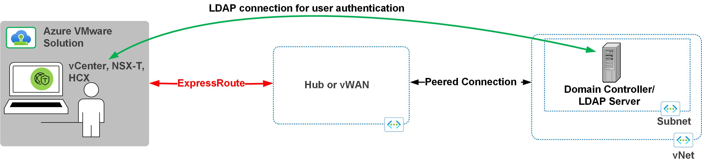
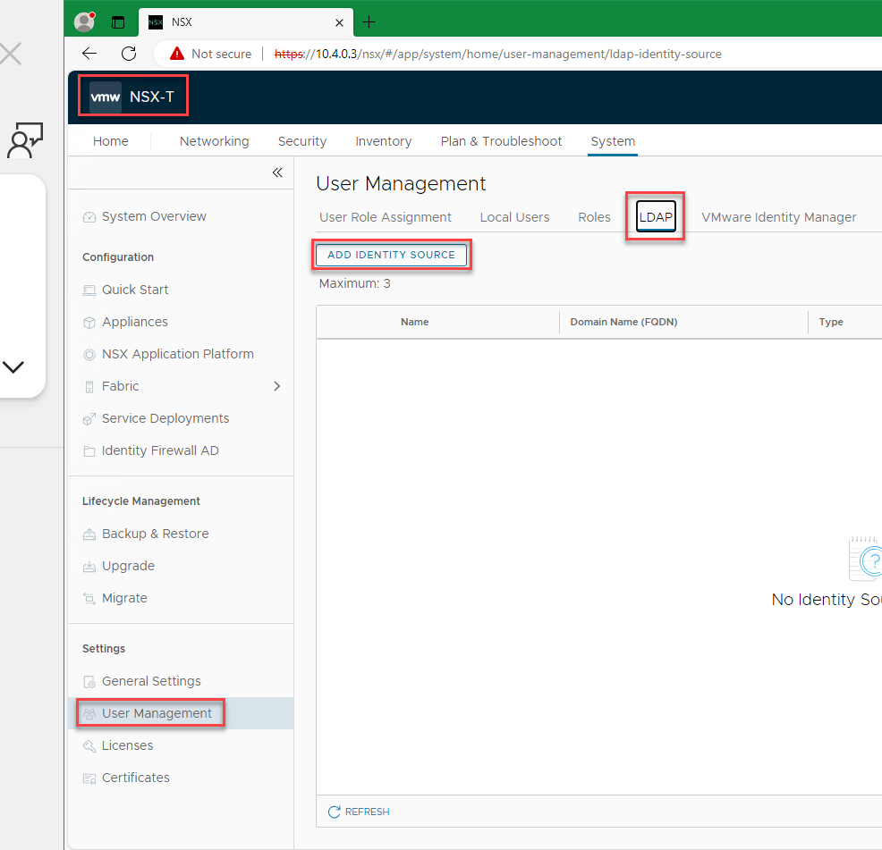
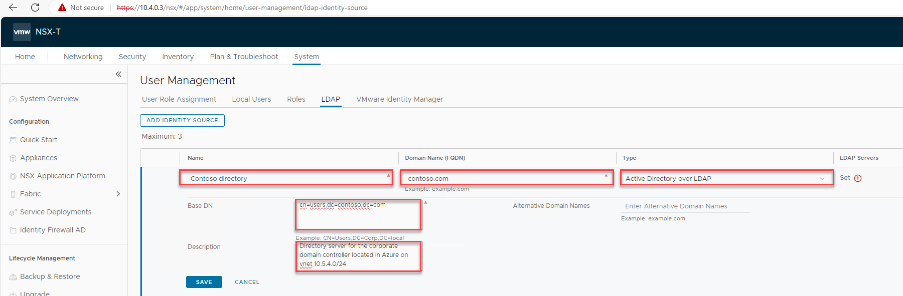
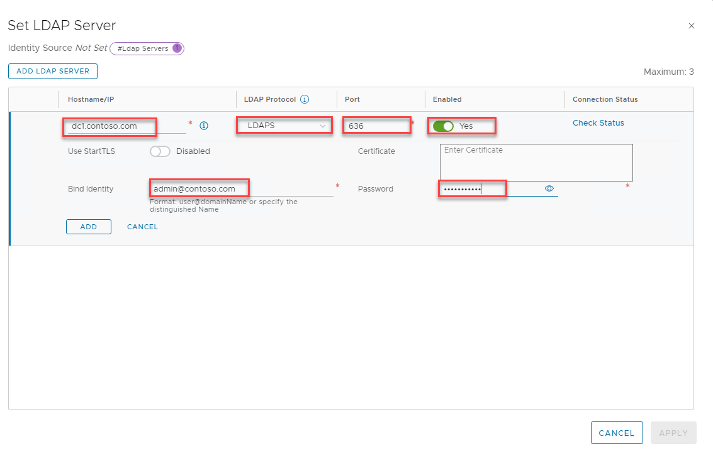
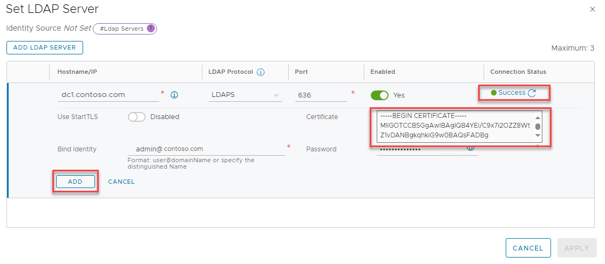
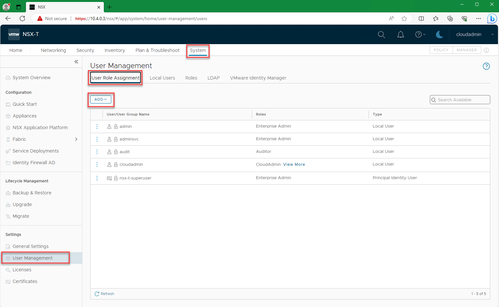
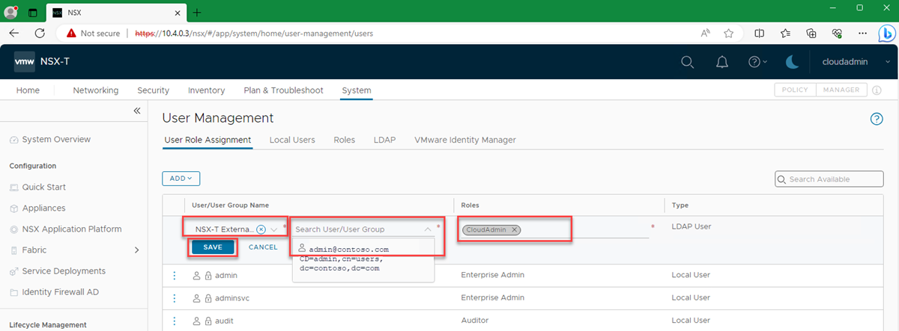
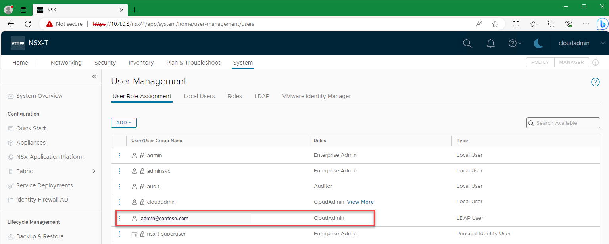

# Configure an external identity source for NSX-T Data Center

In this article, you will learn how to configure an external identity source for the NSX-T Data Center in an Azure VMware Solution. The NSX-T Data Center can be configured to use an external LDAP directory service to authenticate users, enabling a user to login using their Active Directory account credentials, or those from a 3rd party LDAP server. The account can be then be assigned an NSX-T Data Center Role, like you have with on-premises environments, to provide RBAC for each NSX-T user.

## Prerequisites 

-	A working connection from your Active Directory network to your Azure VMware Solution private cloud.  
-	A network path from your Active Directory server to the management network of Azure VMware solution where NSX-T is deployed.  
-	Best practice: Two domain controllers located in Azure in the same region as the Azure VMware Solution SDDC.  
-	Active Directory Domain Controller(s) with a valid certificate. The certificate could be issued by an [Active Directory Certificate Services Certificate Authority (CA)](https://social.technet.microsoft.com/wiki/contents/articles/2980.ldap-over-ssl-ldaps-certificate.aspx) or a [third-party CA](/troubleshoot/windows-server/identity/enable-ldap-over-ssl-3rd-certification-authority).

>[!Note] 
> Self-sign certificates are not recommended for production environments.

    
-	An account with Administrator permissions 
-	The Azure VMware Solution DNS zones and the DNS servers have been correcly deployed. See: [Configure NSX-T Data Center DNS for resolution to your Active Directory Domain and Configure DNS forwarder for Azure VMware Solution](configure-dns-azure-vmware-solution.md) 

>[!NOTE] 
> For more information about LDAPS and certificate issuance, see with your security or identity management team.

 

## Configure NSX-T to use Active Directory as LDAPS identity source 

1. Sign-in to NSX-T Manager and navigate to System, User Management, LDAP and click on “ADD IDENTITY SOURCE”
   

2. Enter the Name, Domain Name (FQDN), the Type and base DN.  Optionally add a description.
The base DN is the container where you user accounts are kept, it is the starting point that an LDAP server uses when searching for users for an authentication request.  For example CN=users,dc=azfta,dc=com.
>[!NOTE] 
> You can use more than one directory as an LDAP provider, i.e. with multiple AD domains when using AVS as a way to consolidate workloads.
 

3. Next,  click Set (!) as shown on the screenshot above, then click on "ADD LDAP SERVER" and fill in the following fields

   
| Field                | Explanation|
|----------------------|------------|
| Hostname/IP          | This is the LDAP server’s FQDN or IP address. For example either azfta-dc01.azfta.com or 10.5.4.4|
| LDAP Protocol        | Select LDAPS|
| Port	Choose 636     | This is the default secure LDAP port.|
| Enabled	             | Leave as ‘Yes’|
| Use StartTLS	       | Only required if non-secured LDAP is being used.|
| Bind Identity	       | Use your account with domain administrator permissions. For example  admin@contoso.com |
| Password	           | Enter the password for the LDAP server, this is the password for the example admin@contoso.com account.|
| Certificate          | Leave empty (see step 6)|

4. The screen will update, click Click ADD, then APPLY
   

5. Back on the User Managment screen, click "SAVE" to complete the changes.
   
6. To add a second domain controller, or another external identity provider, go back to step 1.

>[!NOTE] 
> Best practice is to have two domain controllers to act as LDAP servers.  You can also put the LDAP servers behind a load balancer.

## Assign other NSX-T Data Center roles to Active Directory identities 

After adding an external identity, you can assign NSX-T Data Center Roles to Active Directory security groups based on your organization's security controls. 

1. Sign in to NSX-T Manager and navigate to System > Users Management > User Role Assignment and click Add

2. Select **Add** > **Role Assignment for LDAP**.  

    a.	Select the external identity provider-this will be the Identity provider selected in Step 3 in the previous section.  “NSX-T External Identity Provider”

    b.	Enter the first few characters of the user's name, sign in ID, or a group name to search the LDAP directory, then select a user or group from the list that appears.

    c.	Select a role, in this case we are assigning FTAdmin the role of CloudAdmin

    d.	Select Save.
    

3. Verify the permission assignment is displayed under **User Role Assignment**.
   

4. Users should now be able to sign in to NSX-T Manager using their Active Directory credentials. 

## Next steps
Now that you configured the external source, you can also learn about:

- [Configure external identity source for vCenter Server](configure-identity-source-vcenter.md)
- [Azure VMware Solution identity concepts](concepts-identity.md)
- [VMware product documentation](https://docs.vmware.com/en/VMware-NSX-T-Data-Center/3.1/administration/GUID-DB5A44F1-6E1D-4E5C-8B50-D6161FFA5BD2.html)