# Configure VMware Cloud Director Service in Azure VMware Solution

In this article, learn how to implement VMware Cloud director service in Azure VMware Solution.  

## Prerequisites
-	Deploy a VMware Cloud Director Service Instance in your preferred region using the process described here. How Do I Create a VMware Cloud Director Instance

>[!Note] 
> VMware Cloud Director Instances can establish connections to AVS SDDC in locations where the latency is within 150 ms.

 - Plan and deploy Azure VMware solution private cloud using the following links.
    - [Plan Azure VMware solution private cloud SDDC.](plan-private-cloud-deployment.md)
    - [Deploy and configure Azure VMware Solution - Azure VMware Solution.](deploy-azure-vmware-solution?tabs=azure-portal.md) 
-	Once you're able to access both VMware cloud director instance and Azure VMware solution SDDC, then proceed with the following steps.

## Plan and prepare Azure VMware solution private cloud for VMware Reverse proxy

- Reverse proxy VM is deployed in Azure VMware solution SDDC and it needs outbound connectivity to your VMware Cloud director Service. [Plan how you would provide this internet connectivity](concepts-design-public-internet-access.md) 

- In this example, we're using public IP on NSX-T edge with a SNAT rule to provide outbound access for reverse proxy VM. 
- In the Azure Portal, activate and configure a public IP to the NSX Microsoft Edge for the VMware Cloud Director instance. For more information, see [Enable Public IP to the NSX Edge for Azure VMware Solution](enable-public-ip-nsx-edge.md)
- Log in to Azure private cloud and Navigate to Internet connectivity under workload networking.
- Click **+Add** to configure public IP.
- Provide name, and address space. In this example /29 is being used but a different address space can also be used. 
- Click on the configure.

 :::image type="content" source="media/vmware-cds-avs/pic1.png" alt-text="Diagram showing how to configure public IP using Azure portal." border="false" lightbox="media/vmware-cds-avs/pic1.png":::

 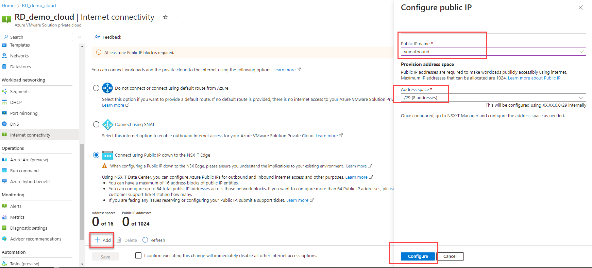

- Click on the checkbox for "I confirm statement" and then click on **Save**.  

- Once successful, you see public IP address CIDR and range information. Note this process takes a few minutes.
 
- Reverse proxy can obtain an IP address using DHCP or manual IP configuration. If using DHCP, use following procedure to create a DHCP enabled NSX-T segment. Optionally create a dedicated Tier-1 router for the above segment and then connect the Tier-1 router to the SDDC Tier-0 router for N-S connectivity. 
- The following steps provide instructions about how to demonstrate this configuration in NSX-T for reverse proxy VM.
- Obtain NSX-T cloud admin credentials from Azure portal under VMware credentials. Then, Login to NSX-T manager.
-  Create a Tier-1 router (optional). You can use any existing tier-1 router also.
    - Provide name of the tier-1 gateway, select linked Tier-0 gateway and edge cluster.
    - Click save.
    - Configure appropriate route advertisements on tier-1 router.
 

 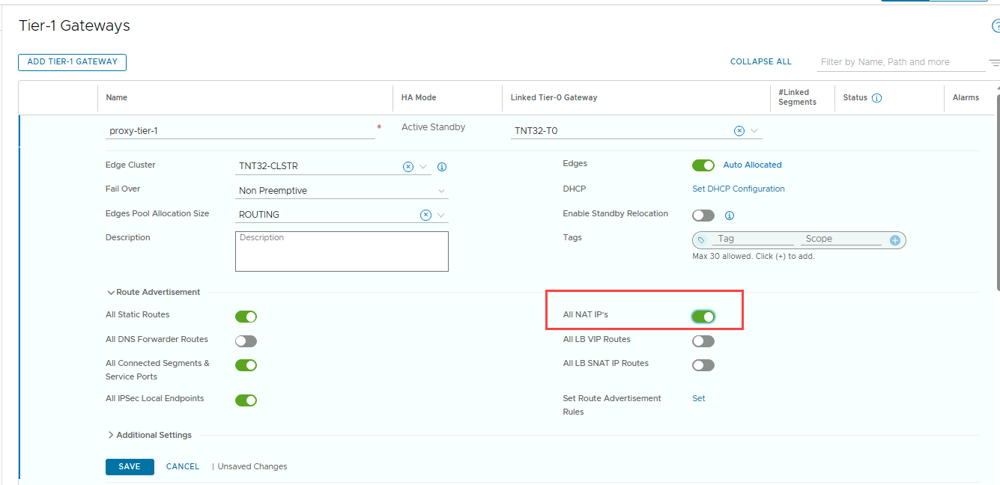

- Next step is to create segment. 
    - Create a segment in NSX-T linked to desired tier-1 and provide CIDR for subnet.
    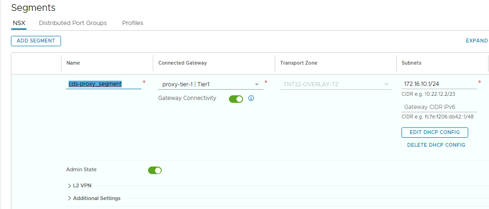

-	Optionally configure DHCP configuration on the segment and provide an address range. You can skip this step if you use static IPs. Reverse proxy VM will be deployed on this segment in next section and will obtain IP address using DHCP.
    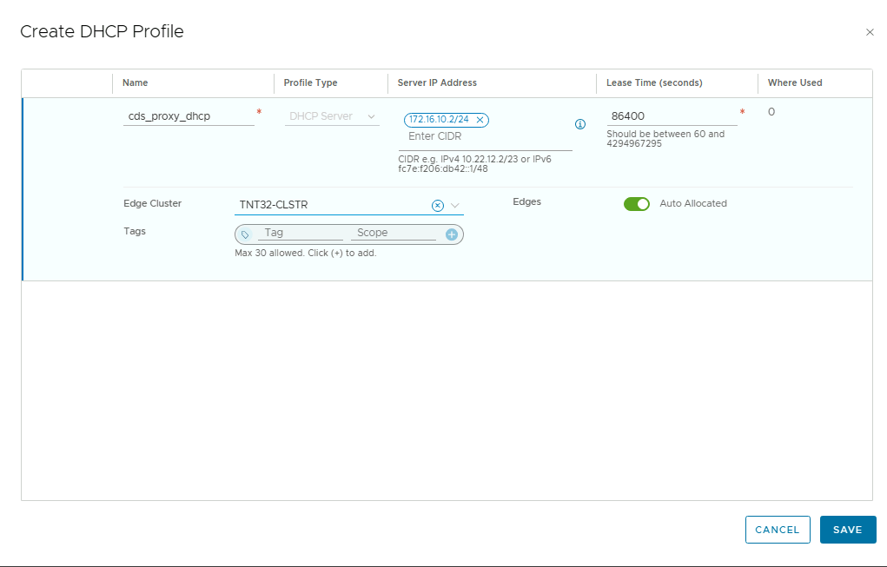
    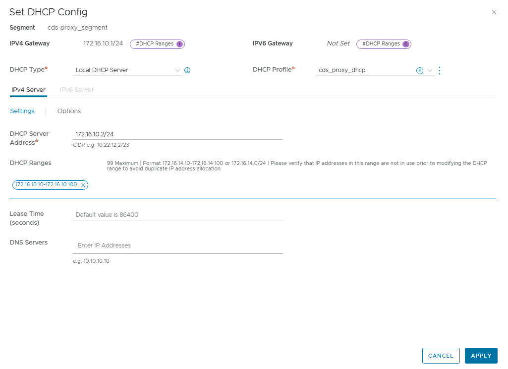

- Add NAT rules for outbound configuration as follows. 
    - Create NOSNAT rule, 
        - source IP is the NSX-T segment you created to deploy reverse proxy VM in above steps. You can use a specific IP as well.
        - Under destination port, use private cloud network CIDR. In this example /16 is being used. 
    - Create SNAT rule
        - source IP is the NSX-T segment you created earlier. You can use a specific IP as well.
        - Under translated IP, provide a public IP address, which you configured using PIP in the earlier section. 
        - Set priority higher as compared to the NOSNAT rule.
    - These two rules are required to provide an outbound access to VMware reverse proxy VM to reach VMware cloud director service and to reach management components of Azure VMware solution SDDC such as vCenter and NSX-T that are deployed in the management plane.

o	Click Save.  

- Ensure Tier-1 gateway connected to source segment is advertising NAT IPs under Route Advertisement.

- Configure gateway firewall rules as appropriate for further security as per your organization guidelines.

## Generate and Download VMware reverse proxy OVA

- What follows is a step-by-step procedure and how to obtain the required information on Azure portal and how to use it to generate reverse proxy VM.

### Prerequisites on VMware cloud service

- Verify that you're assigned the network administrator service role. See Managing Roles and Permissions in Using VMware Cloud Services Console.
- If you're accessing VMware Cloud Director service through VMware Cloud Partner Navigator, verify that you're a Provider Service Manager user and that you have been assigned the provider:**admin** and provider:**network service** roles. See [How do I change the roles of users in my organization](provide url) in the VMware Cloud Partner Navigator documentation.
- Verify that the SDDC uses NSX for networking.

### Procedure
- Log in to VMware Cloud Director service.
- Click Cloud Director Instances.
- In the card of the VMware Cloud Director instance for which you want to configure a reverse proxy service, click Actions > Generate VMware Reverse Proxy OVА. 
- The “Generate VMware Reverse proxy OVA” Wizard opens. Fill in the required information.
- Enter Network Name
    - Network name is the name of the NSX-T segment you created in previous section for reverse proxy VM.
- Enter the required information such as vCenter FQDN, Management IP for vCenter, NSX FQDN or IP and more hosts within the SDDC to proxy. 
   
- vCenter and NSX-T IP address of your Azure VMware solution private cloud can be found under **Azure portal -> manage->VMware credentials** as follows. 

- To find FQDN of vCenter of your Azure VMware solution private cloud, login to the vCenter using VMware credential provided on Azure portal. In vSphere Client, select vCenter, which display FSDN of the vCenter server. In the example below FDN of vCenter is “vc.f31ca07da35f4b42abe08e.uksouth.avs.azure.com”.

- To obtain FQDN of NSX-T, replace vc with nsx. NSX-T FQDN in this example would be,  “nsx.f31ca07da35f4b42abe08e.uksouth.avs.azure.com”
 

- Obtain ESXi management IP addresses and CIDR for allow list when generating reverse proxy VM OVA.
 

- Enter a list of any other IP addresses that VMware Cloud Director must be able to access through the proxy, such as ESXi hosts to use for console proxy connection.
Use new lines to separate list entries.

>[!TIP] 
> To ensure that future additions of ESXi hosts don't require updates to the allowed targets, use a CIDR notation to enter the ESXi hosts in the allow list. This way, you can provide any new host with an IP address that is already allocated as part of the CIDR block.

- Once you have gathered all the required information, add the information in the VMware Reverse proxy OVA generation wizard as shown below.
 

- Click Generate VMware Reverse Proxy OVА.

- On the Activity Log tab, locate the task for generating an OVА and check its status.
 
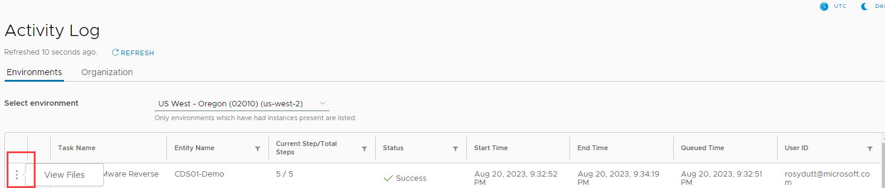

- Once the status of the task is displayed as Success, click the vertical ellipsis icon and select View files.
- Download the reverse proxy OVA.

## Deploy Reverse proxy VM

- Transfer reverse proxy VM OVA you generated in the previous section to a location from where you can access your private cloud.
- Deploy reverse proxy VM using OVA 
- Select appropriate parameters for OVA deployment for folder, computer resources, and storage.
    - For network, select the segment you created in previous section.
    - Under customize template, use DHCP or provide static IP if you aren't planning to use DHCP.
    - Enable SSH to login to reverse proxy VM.
    - Provide root password.
- Once VM is deployed, power it on and then login using the root credentials provided during OVA deployment.
- Login to the reverse proxy VM, Use the command **transporter-status.sh** to verify that the connection between CDs instance and Transporter VM is established. 
    - Status should show “UP”. You should also see “active” and “ reachable” as shown in example below.
 
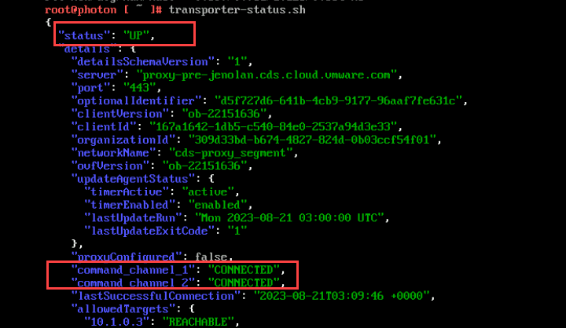

- Next step is to associate Azure VMware Solution SDDC with the VMware Cloud Director Instance. This process configures the provider portal.

## Associate Azure solution private cloud SDDC with VMware Cloud Director Instance  via Reverse proxy

1.	Log in to VMware Cloud Director service.
2.	Click Cloud Director Instances.
3. In the card of the VMware Cloud Director instance for which you want to associate your Azure VMware solution SDDC, select actions and then click **Actions > Associate datacenter via VMware reverse proxy**.
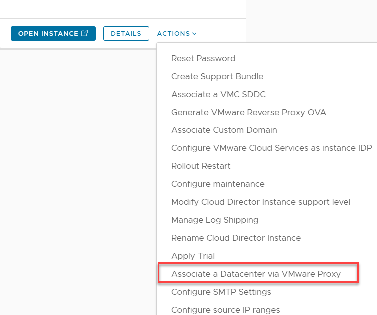

4. Review datacenter information. 
5. Select a proxy network for the reverse proxy appliance to use. Ensure correct NSX-T segment is selected where reverse proxy VM is deployed.
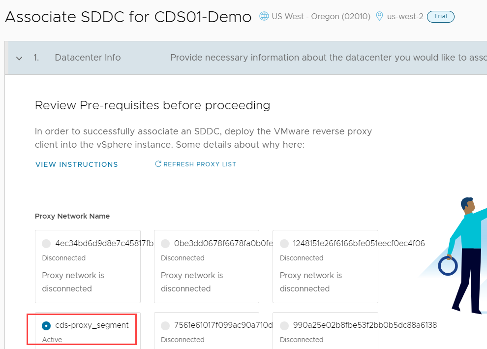

6. In the Data center name text box, enter a name for the SDDC that you want to associate.
This name is only used to identify the data center in the VMware Cloud Director inventory, so it doesn't need to match the SDDC name that you entered when you generated the reverse proxy appliance OVA.
7.	Enter the FQDN for your vCenter Server instance.
8.	Enter the URL for the NSX Manager instance and wait for a connection to establish.
9.	Click Next.
10.	Under Credentials, enter your user name and password for the vCenter Server endpoint.
11.	Enter your user name and password for NSX Manager.
12.	To create infrastructure resources for your VMware Cloud Director instance, such as a network pool, an external network and a provider VDC, select Create Infrastructure.
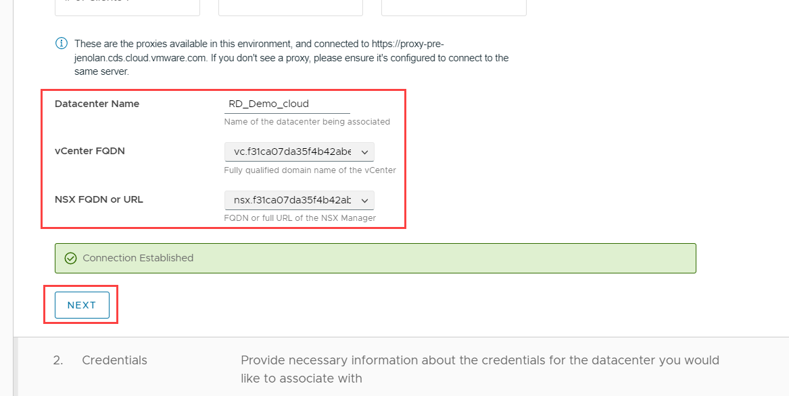

13.	Select Validate Credentials. Ensure that validation is successful.
14.	Confirm that you acknowledge the costs associated with your instance, and click Submit.
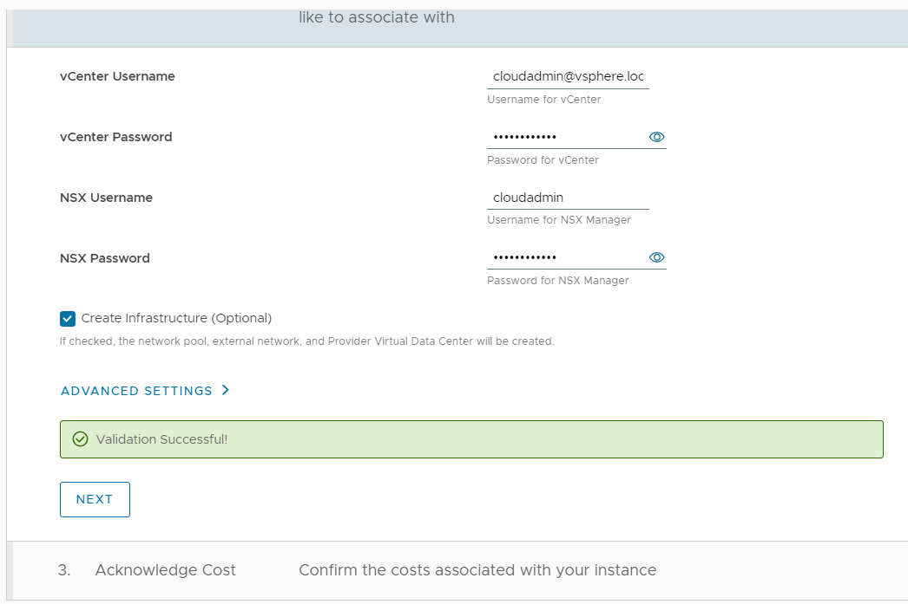

15.	Check activity log to note the progress.

16.	Once this process is completed, you should see that your VMware Azure solution SDDC is securely associated with your VMware Cloud Director instance. 
17.	When you open the VMware Cloud Director instance, the vCenter Server and the NSX Manager instances that you associated are visible in Infrastructure Resources.
 
 
18.	A newly created Provider VDC is visible in Cloud Resources.
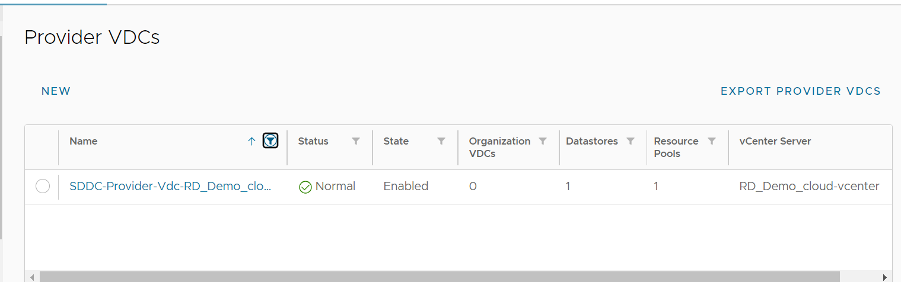

19.	In your Azure VMware solution private cloud, when login in vCenter you'll see that a Resource Pool is created as a result of the above association.

 
20.	You can use your VMware cloud director instance provider portal to configure tenants such as organizations and virtual data center etc.

## What’s next

- Configure tenant networking on VMware Cloud director service on Azure VMware solution using link [Enable VMware Cloud Director service with Azure VMware Solution](enable-vmware-cds-with-azure.md).

- Learn more about VMware cloud director service using [VMware Cloud Director Service Documentation](enable-vmware-cds-with-azure.md)

- To learn about Cloud director Service provider admin portal, Visit [VMware Cloud Director™ Service Provider Admin Portal Guide](./https://docs.vmware.com/en/VMware-Cloud-Director/10.4/VMware-Cloud-Director-Service-Provider-Admin-Portal-Guide/GUID-F8F4B534-49B2-43B2-AEEE-7BAEE8CE1844.html).