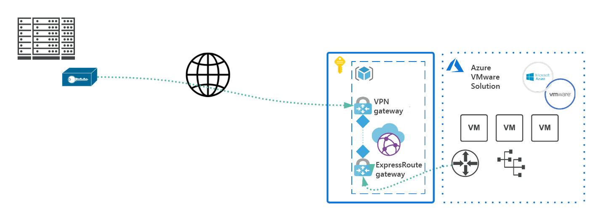

# Create an IPSec tunnel into Azure VMware Solution

In this article, we'll go through the steps to establish a VPN (IPsec IKEv1 and IKEv2) site-to-site tunnel terminating in the Microsoft Azure Virtual WAN hub. 

In this how to, you'll:
- Create an Azure Virtual WAN hub and a VPN gateway with a public IP address attached to it. 
- Create an Azure ExpressRoute gateway and establish an Azure VMware Solution endpoint. 
- Enable a policy-based VPN on-premises setup. 

## Topology

The Azure Virtual hub contains the Azure VMware Solution ExpressRoute gateway and the site-to-site VPN gateway. It connects an on-premise VPN device with an Azure VMware Solution endpoint.

## Prerequisite

You must have a public-facing IP address terminating on an on-premises VPN device.

## Create a Virtual WAN hub

1. In the Azure portal, select **Create a resource**. Type **Virtual WAN** in the search and select it from the results. 

   The Create WAN page opens.  

2. Select **Create** and then enter the required fields on the **Create WAN** page. Select **Review + Create**.
   
   | Field | Value |
   | --- | --- |
   | **Subscription** | Value is pre-populated with the subscription belonging to the resource group. |
   | **Resource group** | The Virtual WAN is a global resource and isn't confined to a specific region.  |
   | **Resource group location** | Set a location for the resource group.  |
   | **Name** |   |
   | **Type** | Select **Standard**. It allows more than just the VPN gateway traffic.  |

   :::image type="content" source="media/create-ipsec-tunnel/create-wan.png" alt-text="Screenshot showing the Create WAN page in the Azure portal.":::

3. Select the Virtual WAN you created in the previous step, select **Create virtual hub**, enter the required fields, and then select **Next: Site to site**. 

   | Field | Value |
   | --- | --- |
   | **Region** | Selecting a region is required from a management perspective.  |
   | **Name** |    |
   | **Hub private address space** | Enter the subnet using a `/24` (minimum).  |

   :::image type="content" source="media/create-ipsec-tunnel/create-virtual-hub.png" alt-text="Screenshot showing the Create virtual hub page.":::

4. On the **Site-to-site** tab, define the site-to-site gateway by setting the aggregate throughput from the **Gateway scale units** drop-down. 

   >[!TIP]
   >One scale unit = 500 Mbps. The scale units are in pairs for redundancy, each supporting 500 Mbps.
  
5. On the **ExpressRoute** tab, create an ExpressRoute gateway. 

   >[!TIP]
   >A scale unit value is 2 Gbps. 

    It takes approximately 30 minutes to create each hub. 

## Create a VPN site 

1. In **Recent resources** in the Azure portal, select the virtual WAN you created in the previous section.

2. In the **Overview** of the virtual hub, select **Connectivity** > **VPN (Site-to-site)**, and then select **Create new VPN site**.

   :::image type="content" source="media/create-ipsec-tunnel/create-vpn-site-basics.png" alt-text="Screenshot of the Overview page for the virtual hub, with VPN (site-to-site) and Create new VPN site selected.":::  
 
3. On the **Basics** tab, enter the required fields and then select **Next : Links**. 

   | Field | Value |
   | --- | --- |
   | **Region** | The same region you specified in the previous section.  |
   | **Name** |  |
   | **Device vendor** |  |
   | **Border Gateway Protocol** | Set to **Enable** to ensure both Azure VMware Solution and the on-premises servers advertise their routes across the tunnel. If disabled, the subnets that need to be advertised must be manually maintained. If subnets are missed, HCX will fail to form the service mesh. For more information, see  [About BGP with Azure VPN Gateway](../vpn-gateway/vpn-gateway-bgp-overview.md). |
   | **Private address space**  | Enter the on-premises CIDR block.  It's used to route all traffic bound for on-premises across the tunnel.  The CIDR block is only required if you don't enable BGP. |
   | **Connect to** |   |

4. On the **Links** tab, fill in the required fields and select **Review + create**. Specifying link and provider names allow you to distinguish between any number of gateways that may eventually be created as part of the hub. BGP and autonomous system number (ASN) must be unique inside your organization.
 
## (Optional) Defining a VPN site for policy-based VPN site-to-site tunnels

This section applies only to policy-based VPNs. Policy-based (or static, route-based) VPN setups are driven by on-premise VPN device capabilities in most cases. They require on-premise and Azure VMware Solution networks to be specified. For Azure VMware Solution with an Azure Virtual WAN hub, you can't select *any* network. Instead, you have to specify all relevant on-premise and Azure VMware Solution Virtual WAN hub ranges. These hub ranges are used to specify the encryption domain of the policy base VPN tunnel on-premise endpoint. The Azure VMware Solution side only requires the policy-based traffic selector indicator to be enabled. 

1. In the Azure portal, go to your Virtual WAN hub site. Under **Connectivity**, select **VPN (Site to site)**.

2. Select your VPN site name, the ellipsis (...) at the far right, and then **edit VPN connection to this hub**.
 
   :::image type="content" source="media/create-ipsec-tunnel/edit-vpn-section-to-this-hub.png" alt-text="Screenshot of the page in Azure for the Virtual WAN hub site showing an ellipsis selected to access Edit VPN connection to this hub." lightbox="media/create-ipsec-tunnel/edit-vpn-section-to-this-hub.png":::

3. Edit the connection between the VPN site and the hub, and then select **Save**.
   - Internet Protocol Security (IPSec), select **Custom**.
   - Use policy-based traffic selector, select **Enable**
   - Specify the details for **IKE Phase 1** and **IKE Phase 2(ipsec)**. 
 
   :::image type="content" source="media/create-ipsec-tunnel/edit-vpn-connection.png" alt-text="Screenshot of Edit VPN connection page."::: 
 
   Your traffic selectors or subnets that are part of the policy-based encryption domain should be:
    
   - The virtual WAN hub /24
   - The Azure VMware Solution private cloud /22
   - The connected Azure virtual network (if present)

## Connect your VPN site to the hub

1. Select your VPN site name and then select **Connect VPN sites**. 
1. In the **Pre-shared key** field, enter the key previously defined for the on-premise endpoint. 

   >[!TIP]
   >If you don't have a previously defined key, you can leave this field blank. A key is generated for you automatically. 
 
   >[!IMPORTANT]
   >Only enable **Propagate Default Route** if you're deploying a firewall in the hub and it is the next hop for connections through that tunnel.

1. Select **Connect**. A connection status screen shows the status of the tunnel creation.

2. Go to the Virtual WAN overview and open the VPN site page to download the VPN configuration file for the on-premises endpoint.  

3. Patch the Azure VMware Solution ExpressRoute in the Virtual WAN hub. This step requires first creating your private cloud.

   [!INCLUDE [request-authorization-key](includes/request-authorization-key.md)]

4. Link Azure VMware Solution and the VPN gateway together in the Virtual WAN hub. 
   1. In the Azure portal, open the Virtual WAN you created earlier. 
   1. Select the created Virtual WAN hub and then select **ExpressRoute** in the left pane. 
   1. Select **+ Redeem authorization key**.

      :::image type="content" source="media/create-ipsec-tunnel/redeem-authorization-key.png" alt-text="Screenshot of the ExpressRoute page for the private cloud, with Redeem authorization key selected.":::

   1. Paste the authorization key into the Authorization key field.
   1. Past the ExpressRoute ID into the **Peer circuit URI** field. 
   1. Select **Automatically associate this ExpressRoute circuit with the hub.** 
   1. Select **Add** to establish the link. 

5. Test your connection by [creating an NSX-T segment](./tutorial-nsx-t-network-segment.md) and provisioning a VM on the network. Ping both the on-premise and Azure VMware Solution endpoints.
