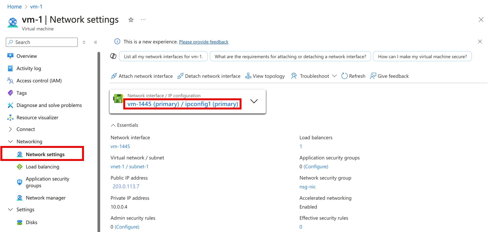

# Deploy and configure Azure VMware Solution

In this article, you'll use the information from the [planning section](production-ready-deployment-steps.md) to deploy and configure Azure VMware Solution. 

>[!IMPORTANT]
>If you haven't defined the information yet, go back to the [planning section](production-ready-deployment-steps.md) before continuing.

## Step 1. Register the **Microsoft.AVS** resource provider

[!INCLUDE [register-resource-provider-steps](includes/register-resource-provider-steps.md)]

## Step 2. Create an Azure VMware Solution private cloud

[!INCLUDE [create-private-cloud-azure-portal-steps](includes/create-private-cloud-azure-portal-steps.md)]

>[!NOTE]
>For an end-to-end overview of this step, view the [Azure VMware Solution: Deployment](https://www.youtube.com/embed/gng7JjxgayI) video.

## Step 3. Connect to Azure Virtual Network with ExpressRoute

In the planning phase, you defined whether you to use an *existing* or *new* ExpressRoute virtual network gateway.  

### Use a new ExpressRoute virtual network gateway

>[!IMPORTANT]
>You must have a virtual network with a GatewaySubnet that **does not** already have a virtual network gateway.

| If | Then  |
| --- | --- |
| You don't already have a virtual network...     |  Create the following:<ul><li><a href="tutorial-configure-networking.md#create-a-virtual-network">Virtual network</a></li><li><a href="../expressroute/expressroute-howto-add-gateway-portal-resource-manager.md#create-the-gateway-subnet">GatewaySubnet</a></li><li><a href="tutorial-configure-networking.md#create-a-virtual-network-gateway">Virtual network gateway</a></li></ul>        |
| You already have a virtual network **without** a GatewaySubnet...   | Create the following: <ul><li><a href="../expressroute/expressroute-howto-add-gateway-portal-resource-manager.md#create-the-gateway-subnet">GatewaySubnet</a></li><li><a href="tutorial-configure-networking.md#create-a-virtual-network-gateway">Virtual network gateway</a></li></ul>          |
| You already have a virtual network **with** a GatewaySubnet... | [Create a virtual network gateway](tutorial-configure-networking.md#create-a-virtual-network-gateway)   |

### Use an existing virtual network gateway

[!INCLUDE [connect-expressroute-to-vnet](includes/connect-expressroute-vnet.md)]

## Step 4. Validate the connection

You should have connectivity between the Azure Virtual Network where the ExpressRoute terminates and the Azure VMware Solution private cloud. 

1. Use a [virtual machine](/azure/virtual-machines/windows/quick-create-portal#create-virtual-machine) within the Azure Virtual Network where the Azure VMware Solution ExpressRoute terminates (see [Step 3. Connect to Azure Virtual Network with ExpressRoute](#step-3-connect-to-azure-virtual-network-with-expressroute)).  

   1. Log into the Azure [portal](https://portal.azure.com).
   2. Navigate to a VM that is in the running state, and under **Settings**, select **Networking** and select the network interface resource.
      
   4. On the left, select **Effective routes**. You'll see a list of address prefixes that are contained within the `/22` CIDR block you entered during the deployment phase.

1. If you want to log into both vCenter and NSX-T Manager, open a web browser and log into the same virtual machine used for network route validation.  

   You can identify the vCenter and NSX-T Manager console's IP addresses and credentials in the Azure portal.  Select your private cloud and then **Manage** > **Identity**.

   :::image type="content" source="media/tutorial-access-private-cloud/ss4-display-identity.png" alt-text="Screenshots of the private cloud vCenter and NSX Manager URLs and credentials." border="true":::

## Next steps

In the next section, you'll connect Azure VMware Solution to your on-premises network through ExpressRoute.
> [!div class="nextstepaction"]
> [Connect to your on-premises environment](tutorial-expressroute-global-reach-private-cloud.md)
