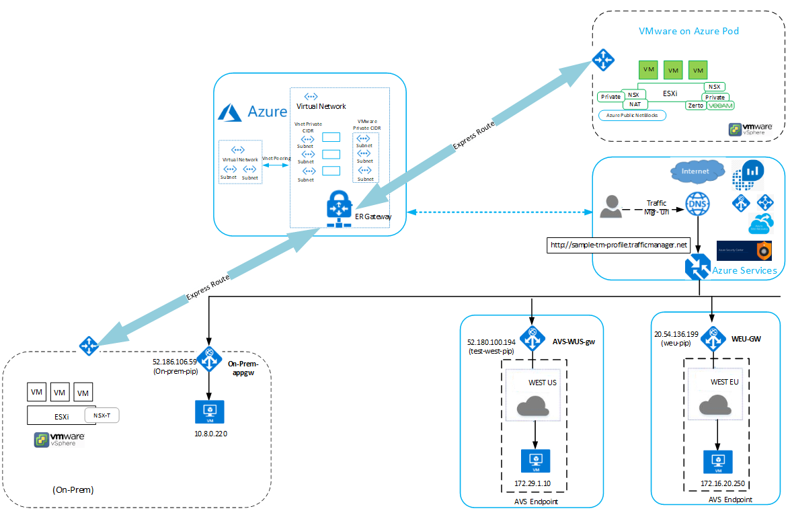

# Deploy Traffic Manager to balance Azure VMware Solution (AVS) workloads

This article walks you through integrating Traffic Manager with Azure VMware Solution (AVS) to balance application workloads across multiple endpoints. We'll look at a scenario in which Traffic Manager will direct traffic between three application gateways spanning several AVS regions: West US, West Europe, and on-premises in East US. 

Azure Traffic Manager is a DNS-based traffic load balancer that enables you to distribute traffic optimally to services across global Azure regions. It will load balance application traffic across both Azure running workloads and external public endpoints. For more information on Traffic Manager, see [What is Traffic Manager?](../traffic-manager/traffic-manager-overview.md)

Review the [Prerequisites](#prerequisites) first; then we'll walk through the procedures to:

> [!div class="checklist"]
> * Verify configuration of your application gateways
> * Verify configuration of the NSX-T segment
> * Create your Traffic Manager profile
> * Add external endpoints into your Traffic Manager profile

## Topology

As shown in the following figure, Azure Traffic Manager provides load balancing for the applications at the DNS level between regional endpoints. The application gateways have backend pool members configured as IIS Servers and are referenced as AVS external endpoints.

Connection over the virtual network between the two AVS private cloud regions, West US and West Europe, and an on-premises server in East US, uses an ExpressRoute gateway.   

 
## Prerequisites

- Three virtual machines configured as Microsoft IIS Servers running in different AVS regions: West US, West Europe, and on premises. 

- An application gateway with external endpoints in West US, West Europe, and on premises.

- Host with internet connectivity for verification. 

## Verify configuration of your application gateways

[Azure Application Gateway](https://azure.microsoft.com/services/application-gateway/) is a layer 7 web traffic load balancer that enables you to manage traffic to your web applications. For more information on Application Gateway, see [What is Azure Application Gateway?](../application-gateway/overview.md) 

In this scenario, three application gateway instances are configured as external AVS endpoints. The application gateways have AVS virtual machines configured as backend pool members to load balance the incoming layer 7 requests. (To learn how to configure Application Gateway with AVS virtual machines as  backend pools, see [Use Azure Application Gateway to protect your web apps on Azure VMware Solution](protect-avs-web-apps-with-app-gateway.md).)  

The following steps verify the correct configuration of your application gateways.

1. Open the Azure portal and select **Application gateways** to view a list of your current application gateways. 

    For this scenario, we have configured three application gateways:
    - AVS-GW-WUS
    - AVS-GW-EUS (on premises)
    - AVS-GW-WEU

    :::image type="content" source="media/traffic-manager/app-gateways-list-1.png" alt-text="List of application gateways." lightbox="media/traffic-manager/app-gateways-list-1.png":::

2. Select one of your previously deployed application gateways. A window opens showing various information on the application gateway. Select **Backend pools** to verify the configuration of one of the backend pools.

   :::image type="content" source="media/traffic-manager/backend-pool-config.png" alt-text="Application gateway details." lightbox="media/traffic-manager/backend-pool-config.png":::
 
3. In this case, we see one virtual machine backend pool member configured as a web server with an IP address of 172.29.1.10.
 
     :::image type="content" source="media/traffic-manager/backend-pool-ip-address.png" alt-text="Edit backend pool.":::

    You can similarly verify the configuration of the other application gateways and backend pool members. 

## Verify configuration of the NSX-T segment

Network segments created in NSX-T Manager are used as networks for virtual machines in vCenter. For more information, see the tutorial, [Create an NSX-T network segment in Azure VMware Solution (AVS)](tutorial-nsx-t-network-segment.md).

In our scenario, an NSX-T segment is configured in the AVS environment where the backend pool member virtual machine is attached.

1. Select **Segments** to view your configured segments. In this case, we see that Contoso-segment1 is connected to Contoso-T01 gateway, a Tier-1 flexible router.

    :::image type="content" source="media/traffic-manager/nsx-t-segment-avs.png" alt-text="Segment profiles in NSX-T Manager.":::    

2. Select **Tier-1 Gateways** to see a list of your Tier-1 gateways with the number of linked segments. Select the segment linked to Contoso-T01. A window opens showing the logical interface configured on the Tier-01 router. This serves as gateway to the backend pool member virtual machine connected to the segment.

   :::image type="content" source="media/traffic-manager/nsx-t-segment-linked-2.png" alt-text="Linked segments.":::    

3. In the VM vSphere client, select the virtual machine to view its details. Note its IP address matches what we saw in step 3 of the preceding section: 172.29.1.10.

    :::image type="content" source="media/traffic-manager/nsx-t-vm-details.png" alt-text="Virtual machine details.":::    

4. Select the virtual machine, then click **ACTIONS > Edit Settings** to verify connection to the NSX-T segment.

## Create your Traffic Manager profile

1. Log in to the [Azure portal](https://rc.portal.azure.com/#home). Under **Azure Services > Networking**, select **Traffic Manager profiles**.

2. Select **+ Add** to create a new Traffic Manager profile.
 
3. Provide profile name, routing method (we will use weighted in this scenario; see [Traffic Manager routing methods](../traffic-manager/traffic-manager-routing-methods.md)), subscription, and resource group, and select **Create**.

## Add external endpoints into the Traffic Manager profile

1. Select the Traffic Manager profile from the search results pane, select **Endpoints** and then **+ Add**.

2. Enter the required details: Type, Name, Fully Qualified domain name 
(FQDN) or IP, and Weight (in this scenario, we're assigning a weight of 1 to each endpoint). Select **Add**.

    :::image type="content" source="media/traffic-manager/traffic-manager-profile.png" alt-text="Traffic Manager profile-add endpoint.":::  
 
    This creates the external endpoint. The monitor status must be **Online**. 

    Repeat the same steps to create two more external endpoints, one in a different region and the other on-premises. Once created, all three will display in the Traffic Manager profile, and the status of all three should be **Online**.

3. Select **Overview**. Copy the URL under **DNS Name**.

    :::image type="content" source="media/traffic-manager/traffic-manager-endpoints.png" alt-text="Traffic Manager Overview with DNS name."::: 

4. Paste the DNS name URL in a  browser. The following screenshot shows traffic directing to the West Europe region.

    :::image type="content" source="media/traffic-manager/traffic-to-west-europe.png" alt-text="Traffic routed to West Europe."::: 

5. Refresh your browser. The following screenshot shows traffic now directing to another set of backend pool members in the West US region.

    :::image type="content" source="media/traffic-manager/traffic-to-west-us.png" alt-text="Traffic routed to West US."::: 

6. Refresh your browser again. The following screenshot shows traffic now directing to the final set of backend pool members on premises.

    :::image type="content" source="media/traffic-manager/traffic-to-on-premises.png" alt-text="Traffic routed to on-premises.":::

## Next steps

Learn more about:

- [Using Azure Application Gateway on Azure VMware Solution (AVS)](protect-avs-web-apps-with-app-gateway.md)
- [Traffic Manager routing methods](../traffic-manager/traffic-manager-routing-methods.md)
- [Combining load-balancing services in Azure](../traffic-manager/traffic-manager-load-balancing-azure.md)
- [Measuring Traffic Manager performance](../traffic-manager/traffic-manager-performance-considerations.md)
