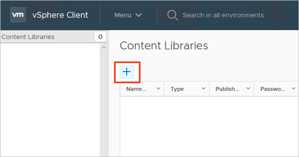

# Create a content library to deploy VMs in Azure VMware Solution

A content library stores and manages content in the form of library items. A single library item consists of one or more files you use to deploy virtual machines (VMs). 

In this article, we'll walk through the procedure for creating a content library.  Then we'll walk through deploying a VM using an ISO image from the content library.

## Prerequisites

An NSX-T segment (logical switch) and a managed DHCP service are required to complete this tutorial.  For more information, see the [How to manage DHCP in Azure VMware Solution](manage-dhcp.md) article.

## Create a content library

1. From the on-premises vSphere Client, select **Menu > Content Libraries**.

   

1. Select the **Add** button to create a new content library.

   

1. Specify a name and confirm the IP address of the vCenter server and select **Next**.

   

1. Select the **Local content library** and select **Next**.

   

1. Select the datastore that will store your content library, and then select **Next**.

   

1. Review and verify the content library settings, and then select **Finish**.

   

## Upload an ISO image to the content library

Now that the content library has been created, you can add an ISO image to deploy a VM to a private cloud cluster. 

1. From the vSphere Client, select **Menu > Content Libraries**.

1. Right-click the content library you want to use for the new ISO and select **Import Item**.

1. Import a library item for the Source by doing one of the following, and then select **Import**:
   1. Select URL and provide a URL to download an ISO.

   1. Select **Local File** to upload from your local system.

   > [!TIP]
   > Optional, you can define a custom item name and notes for the Destination.

1. Open the library and select the **Other Types** tab to verify that your ISO was uploaded successfully.

## Deploy a VM to a private cloud cluster

1. From the vSphere Client, select **Menu > Hosts and Clusters**.

1. In the left panel, expand the tree and select a cluster.

1. Select **Actions > New Virtual Machine**.

1. Go through the wizard and modify the settings you want.

1. Select **New CD/DVD Drive > Client Device > Content Library ISO File**.

1. Select the ISO uploaded in the previous section and then select **OK**.

1. Select the **Connect** check box so the ISO is mounted at power-on time.

1. Select **New Network > Select dropdown > Browse**.

1. Select the **logical switch (segment)** and select **OK**.

1. Modify any other hardware settings and select **Next**.

1. Verify the settings and select **Finish**.

## Next steps

Now that you've covered creating a content library to deploy VMs in Azure VMware Solution, you may want to learn about:

- [How to migrate VM workloads to your private cloud](tutorial-deploy-vmware-hcx.md)
- [Lifecycle management of Azure VMware Solution VMs](lifecycle-management-of-azure-vmware-solution-vms.md)

<!-- LINKS - external-->

<!-- LINKS - internal -->
