# Perform a Disaster Recovery operation of virtual machine or group of virtual machines

This guide contains the process to perform a Disaster Recovery operation of virtual machine or group of virtual machines with VMware Hybrid Cloud Extension, or HCX from now on, solution and using an Azure VMware Solution based SDDC as the recovery/target site.

VMware HCX provides various operations that provide fine control and granularity in replication policies. Available Operations include:

- Reverse – After a disaster has occurred. Reverse helps make Site B the source site and Site A where the protected VM now lives.

- Pause – Pause the current replication policy associated with the virtual machine selected.

- Resume - Pause the current replication policy associated with the virtual machine selected.

- Remove - Remove the current replication policy associated with the virtual machine selected.

- Sync Now – Out of bound sync source virtual machine to the protected VM.

In this guide the following replication scenarios are covered:

- Protect a VM or a group of VMs.

- Perform a Test Recover of a VM or a group of VMs.

- Recover a VM or a group of VMs.

- Reverse Protection of a VM or a group of VMs.

## Protect a VM or a group of VMs

Log into **vSphere Client** on the source site and access **HCX
plugin**.

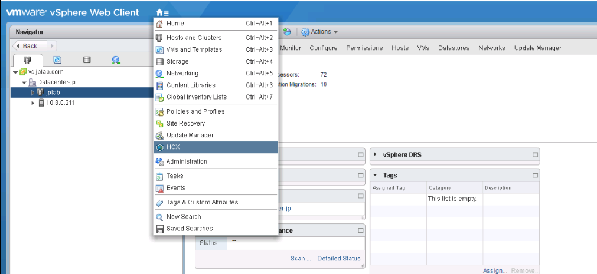

Enter the **Disaster Recovery** area and click on **PROTECT VMS**.


In the pop-up select the Source and the Remote sites, the Remote site in
this case should be the AVS SDDC.

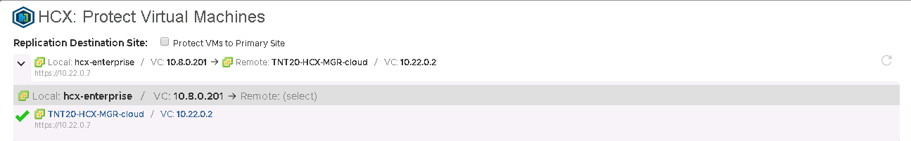

Set if needed the Default Replication Options:

- **Enable Quiescence:** Pauses the VM to ensure a consistent copy is
    synced to the remote site.

- **Enable Compression:** Recommended for low throughput scenarios.

- **Destination Storage:** Select the remote datastore for the
    protected VM(s). In an AVS SDDC this should be the VSAN datastore.

- **Compute Container:** The remote vSphere Cluster or Resource Pool.

- **Destination Folder:** The remote destination folder, this setting
    is optional and if no folder is selected the VM(s) will be paced
    directly under the selected cluster.

- **RPO:** Can go between 5 minutes to 24 hours. This is the
    synchronization interval between the Source virtual machine and the
    Protected virtual machine.

- **Snapshot interval:** Interval between snapshots.

- **Number of Snapshots:** Total number of snapshots within the
    configured snapshot interval.

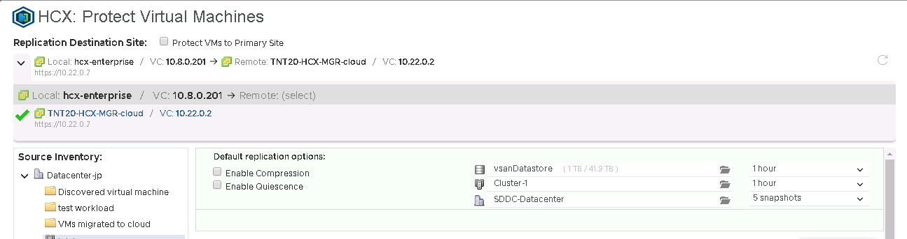

Select one or more virtual machines from the list and configure the
Virtual Machine the replication options as needed.

By default, the virtual machines will inherit the Global Settings Policy
configured in the Default Replication Options. Additionally, for each
selected VM the remote **Network Port Group** for each of the virtual
machine configured NICs has to be configured.

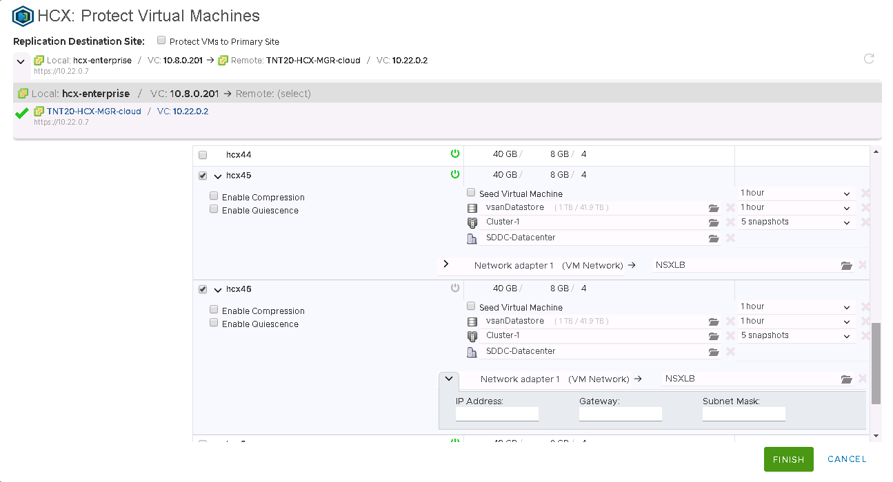

Click on **Finish** to initiate the protection process. The process can
be monitored for each of the selected virtual machines in the same
Disaster Recovery area as shown in the below screenshot.

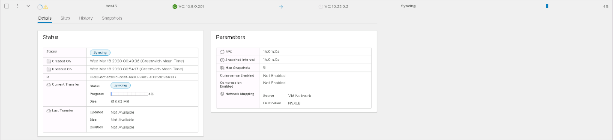

After the VM has been protected the different snapshots can be seen in
the **Snapshots** tab.

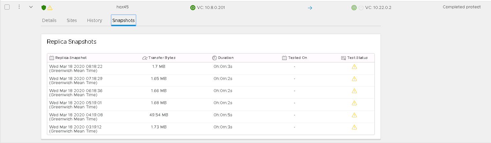

The yellow triangle means the snapshots and the virtual have not been
tested in a Test Recovery operation.

There are key differences between a powered of VM and a powered on one.
The above screenshot shows the syncing process for a powered on virtual
machine, it started the syncing process until it finish the first
snapshot, which in reality is a full copy of the VM, and then perform
the subsequent ones in the configured interval.

For a powered off VM it will sync up a copy and then the VM will appear
as inactive and protection operation will show as completed.

When the virtual machine is powered on it will start the syncing up
process to the remote site.

## Perform a Test Recover of a VM or a group of VMs

Log into **vSphere Client** on the remote site, in this case the AVS
SDDC, and access **HCX plugin**. In the Disaster Recovery area click on
the vertical three dots on any VM to display the operations menu.

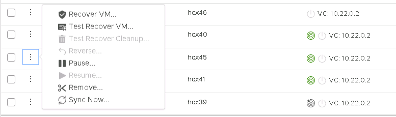

Click on **Test Recover VM**. In the pop-up select the options for the
test.

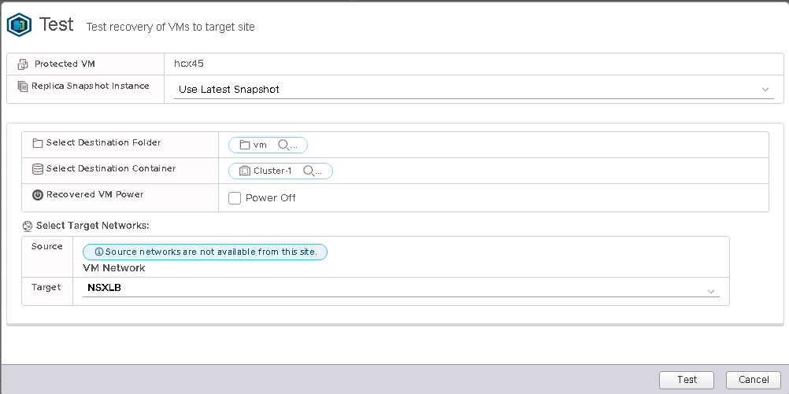

Selecting the snapshot to use will allow to test different states of the
virtual machine across time.


After clicking on **Test** the recovery operation will initiate.


When the Test Recovery operation is finished the new VM can be checked
in the SDDC vCenter.

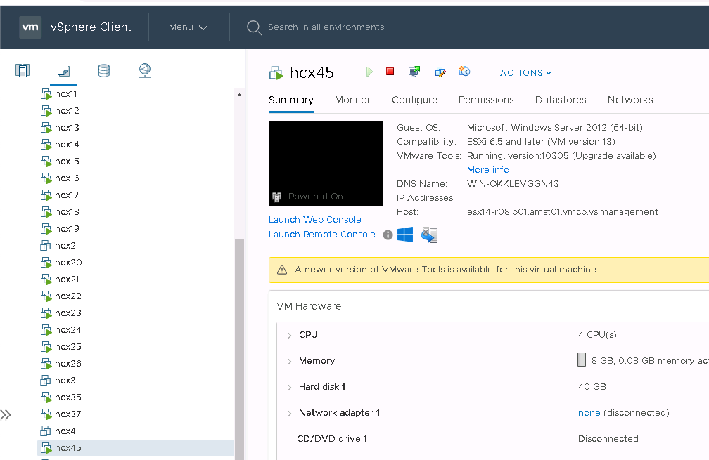

Finally after testing has been done on the VM or any application running
on it perform a cleanup to delete the test instance.

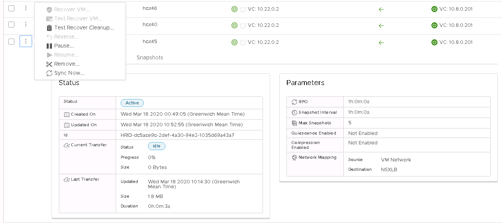

## Recover a VM or a group of VMs

Log into **vSphere Client** on the remote site, in this case the AVS
SDDC, and access **HCX plugin**.

For the recovery scenario a group of VMs instead of an individual one is
used as example to illustrate the process.

Select the virtual machine to be recovered from the list, open the
**ACTIONS** menu and select **Recover VMs**.

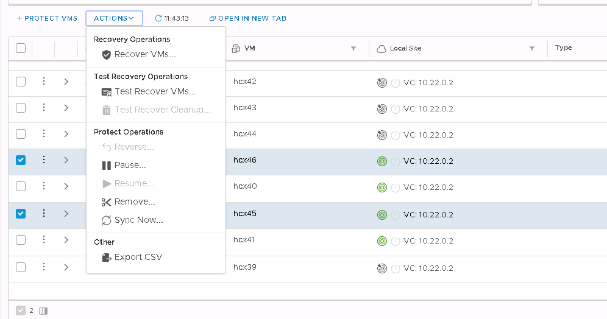

Configure the recovery options for each instance and click on
**Recover** to initiate the recovery operation.

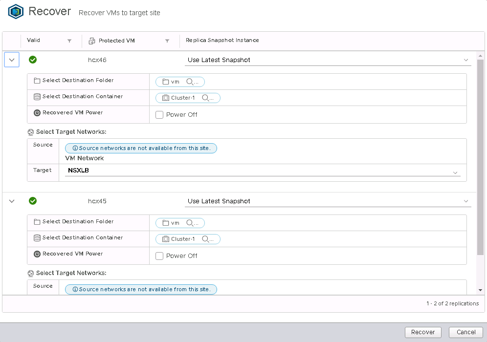

After the recovery operation is completed the new VMs will appear in the
remote vCenter Server inventory.

## Perform a Reverse replication of a VM or a group of VMs

Log into **vSphere Client** on AVS SDDC, and access **HCX plugin**.
Before initiating the reverse replication is mandatory that the original
virtual machines on the source site are powered off or the operation
will fail.

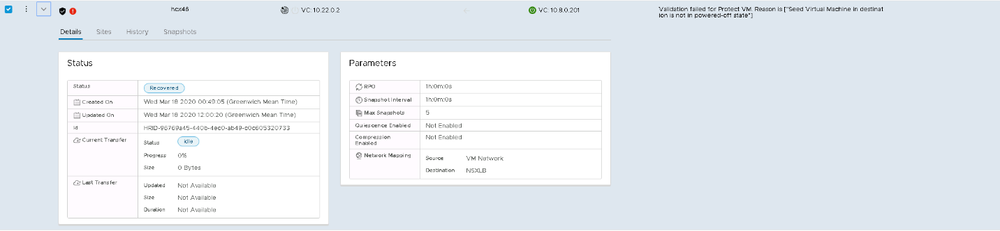

Select the virtual machines to be replicated back to the source site
from the list, open the **ACTIONS** menu and select **Reverse**. In the
pop-up window click on **Reverse** to start the replication.

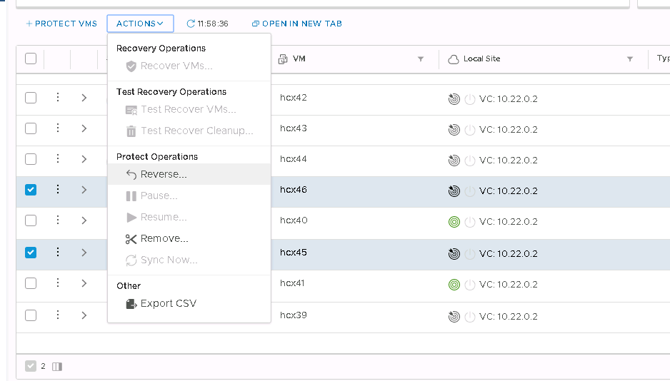

The replication can be monitored on the details section of each virtual
machine.


## DR plan automation

VMware HCX currently does not have a built-in mechanism to create and
automate a Disaster Recovery Plan, and this concept does not exist in
HCX. However it provides a set of REST APIs, including APIs for the
Disaster Recovery operation.

The API specification can be accesses within HCX Manager in the URL .

The following in Disaster Recovery are covered by these APIs.

- Protect

- Recover

- Test Recover

- Planned Recover

- Reverse

- Query

- Test Cleanup

- Pause

- Resume

- Remove Protection

- Reconfigure

An example of a recover operation payload in JSON is shown below.

```json
[

    {

        "replicationId": "string",

        "needPowerOn": true,

        "instanceId": "string",

        "source": {

            "endpointType": "string",

            "endpointId": "string",

            "endpointName": "string",

            "resourceType": "string",

            "resourceId": "string",

            "resourceName": "string"

        },

        "destination": {

            "endpointType": "string",

            "endpointId": "string",

            "endpointName": "string",

            "resourceType": "string",

            "resourceId": "string",

            "resourceName": "string"

        },

        "placement": [

            {

                "containerType": "string",

                "containerId": "string"

            }

        ],

        "resourceId": "string",

        "forcePowerOff": true,

        "isTest": true,

        "forcePowerOffAfterTimeout": true,

        "isPlanned": true

    }

]
```

Using these APIs a customer should be able to build a custom mechanism
to automate the creation and the execution of a Disaster Recovery Plan.

## Appendix

References:

- [Getting Started with VMware
    HCX](https://docs.vmware.com/en/VMware-HCX/services/install-checklist/GUID-DE0AD0AE-A6A6-4769-96ED-4D200F739A68.html)

- [VMware HCX User
    Guide](https://docs.vmware.com/en/VMware-HCX/services/user-guide/GUID-BFD7E194-CFE5-4259-B74B-991B26A51758.html)

## Next steps

Advance to the next article to learn how to create...

> [!div class="nextstepaction"]

> [Next steps button](contribute-get-started-mvc.md)
